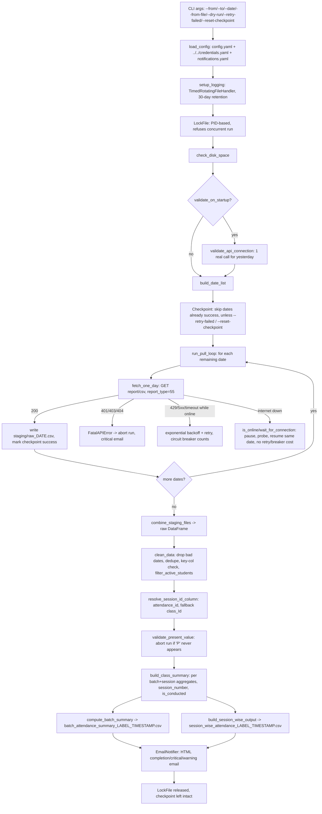

# Attendance Pipeline

## 1. Overview

`attendance.py` (version string `"1.2.0"` inside the file) is a single-file, production-grade
Python pipeline that pulls daily student attendance data from Vyoma's Edmingle LMS/CRM
(`report_type=55`) for a configurable date range, one HTTP call per calendar day, and produces
two analysis-ready CSVs: a one-row-per-batch summary and a one-row-per-(batch, session)
breakdown. It lives at
`/home/projectdev/ela_datasets/attendance/scripts/attendance.py` (1,459 lines) and is designed
to run unattended over long date ranges (the file's own docstring cites a 546-day, ~68-minute
historical run producing ~150 MB of raw staging data).

## 2. Purpose

To give Vyoma a reliable, resumable, crash-safe extraction of per-session and per-batch
attendance metrics (enrollment, attendance %, retention, ratings, session counts) from Edmingle,
without requiring a human to babysit a multi-hour/multi-day historical backfill or a daily
incremental run.

## 3. High-Level Data Flow



## 4. Project / Repository Structure

| Path | Purpose |
|---|---|
| `attendance/scripts/attendance.py` | Entire pipeline: config/logging/lock/checkpoint, HTTP extraction, cleaning, summarization, email notification, CLI entry point (`main()`). |
| `attendance/scripts/config.yaml` | Non-secret runtime config: API URL/timeouts/retry tuning, file paths, pipeline behaviour flags (status filter, session id column, rating handling). |
| `attendance/scripts/notifications.yaml` | Per-pipeline SMTP + recipient + alert-granularity settings (`notify_on_critical`/`notify_on_warning`/`notify_on_completion`). |
| `attendance/scripts/run_pipeline.bat` | Windows batch wrapper intended to auto-restart the pipeline on crash. **Stale** — see Known Limitations. |
| `attendance/README.md` | Existing, detailed project README (business rules, endpoint, reliability features) — used as a cross-check source for this document. |
| `attendance/output/` | All generated artifacts: combined raw CSV (optional), summary CSVs, `staging/`, `logs/`, `pipeline_checkpoint.json`, `pipeline.lock`. |
| `../../credentials.yaml` (repo root) | Shared Edmingle `api_key` / `organization_id` read via `common.load_credentials()`. |
| `../../common.py` (repo root) | Shared credentials/notifications loader used by `load_config()`; **not** used for this pipeline's SMTP sending or rate limiting (see Section 8). |

## 5. Source System

| Source | Type | Endpoint | HTTP Method | Authentication | Parameters | Pagination | Rate Limit |
|---|---|---|---|---|---|---|---|
| Edmingle LMS reporting API | REST, JSON response containing report rows | `https://vyoma-api.edmingle.com/nuSource/api/v1/report/csv` (from `config.yaml` `api.url`) | GET | `apikey` query param from shared `credentials.yaml` (`edmingle.api_key`); `ORGID` query param (uppercase, `edmingle.organization_id`) | `apikey`, `ORGID`, `report_type=55`, `organization_id` (int), `start_time`/`end_time` (Unix epoch seconds, one IST calendar day per call), `response_type=1` — built in `_day_params()` | None — one API call = one calendar day, never a multi-day window | Self-imposed client-side pacing only: `api.rate_limit_sleep_seconds` (2.5s, config comment claims this keeps calls under a 25 req/min ceiling). The pipeline reacts to server-side `429` responses (`Retry-After` header honored if present) but the actual Edmingle-side rate-limit ceiling is not documented in the code — Requires confirmation from the project owner. |

## 6. Extraction Process

1. Parse CLI args (`--config`, `--date`, `--from`/`--to`, `--from-file`, `--dry-run`, `--retry-failed`, `--reset-checkpoint`, `--verbose`).
2. `load_config()` deep-merges `config.yaml` over internal defaults, injects `api.key`/`api.org_id` from `common.load_credentials()`, and injects SMTP/recipient settings from `common.load_notifications()`; exits with a clear message if required keys/credentials/notification file are missing.
3. `setup_logging()` sets up a daily-rotating file handler (`logs/pipeline.log`, 30-day retention) plus console output, both formatted with IST timestamps.
4. `LockFile` writes the current PID to `pipeline.lock`; a second concurrent invocation detects the still-running PID (`OpenProcess` on Windows, `os.kill(pid, 0)` elsewhere) and refuses to start. A stale lock (dead PID) is removed automatically.
5. `check_disk_space()` aborts the run if free space in `output_folder` is below `pipeline.min_free_disk_mb`.
6. If `api.validate_on_startup` (default true), `validate_api_connection()` makes one real call for yesterday's date via `fetch_one_day()` to catch a bad API key/org id/endpoint before the main loop.
7. `build_date_list()` resolves the requested dates from `--date`, `--from`/`--to`, or `pipeline.default_lookback_days` if none given.
8. The `Checkpoint` class (JSON file) is consulted: dates already marked `success` (with an existing staging file) are skipped; `--retry-failed` limits the run to dates marked `failed`; `--reset-checkpoint` wipes it first.
9. `run_pull_loop()` iterates the remaining dates, calling `fetch_one_day()` for each — handling 200/429/401/403/404/400/5xx/Edmingle error codes 6001/6002, network-outage detection (`is_online`, `wait_for_connection`), exponential backoff with jitter, and the consecutive-error circuit breaker (`api.max_consecutive_errors`).
10. Each successfully fetched day is written to `staging/raw_<YYYY-MM-DD>.csv` and the checkpoint is updated immediately (crash-safe: at most the in-flight date is re-fetched on restart).
11. `combine_staging_files()` concatenates all staging CSVs into one raw DataFrame once the loop completes (or `--from-file` is used to skip extraction entirely and summarize an existing raw CSV).
12. `clean_data()` parses `classDate`, drops unparseable dates, removes exact duplicate rows, drops rows missing `batch_Id`/`student_Id`/the resolved session id column, logs (but keeps) conflicting `(student_Id, session_col)` pairs, and calls `filter_active_students()`.
13. `resolve_session_id_column()` confirms `attendance_id` is present (config default `pipeline.session_id_column`); falls back to `class_Id` with a warning if missing.
14. `validate_present_value()` raises `PipelineError` (aborting the whole run) if the configured `present_value` ("P") never appears in `studentAttendanceStatus`.
15. `build_class_summary()` computes per-(batch, session) aggregates; `compute_batch_summary()` and `build_session_wise_output()` derive the two final CSVs from it.
16. `EmailNotifier` sends an HTML email on completion, on a critical failure (401/403/404, circuit-breaker trip, disk-full, startup-validation failure), or on a warning, per `notifications.yaml` toggles — never raises on send failure.
17. `LockFile` is released on clean exit or on SIGINT/SIGTERM (handled explicitly so Ctrl+C/`kill` exits cleanly with the checkpoint already safe).

## 7. Detailed Function Documentation

### `load_config(config_path: str) -> dict`
- **Purpose:** Load and validate all configuration for a run, merging `config.yaml`, the shared `credentials.yaml`, and the pipeline-local `notifications.yaml`.
- **Inputs:**
  | Name | Type | Description |
  |---|---|---|
  | `config_path` | str | Path to `config.yaml`, cwd-relative if not absolute (see Section 21). |
- **Output:**
  | Field | Description |
  |---|---|
  | `dict` | Deep-merged config dict with `api.key`, `api.org_id`, `email.*`, and all `paths.*` resolved to absolute paths anchored at the script's own folder. |
- **Processing:** Deep-merges user YAML over `_DEFAULTS`; loads shared credentials via `common.load_credentials()` two directories up; loads `notifications.yaml` via `common.load_notifications()`; validates required keys (`api.url`, `paths.output_folder`, `paths.log_folder`, non-empty API key/org id) and exits the process with a descriptive message if any are missing; anchors relative `paths.*` values to the script's directory so output always lands in `attendance/output/` regardless of caller cwd.
- **Dependencies:** `common.load_credentials`, `common.load_notifications`, `yaml.safe_load`, `_deep_merge`.

### `fetch_one_day(date_str, session, cfg, log, dry_run=False) -> pd.DataFrame`
- **Purpose:** Fetch one calendar day of `report_type=55` data with full retry/backoff/error-classification logic.
- **Inputs:**
  | Name | Type | Description |
  |---|---|---|
  | `date_str` | str | `YYYY-MM-DD` date to fetch. |
  | `session` | `requests.Session` | Shared HTTP session. |
  | `cfg` | dict | Loaded config (uses `cfg["api"]`). |
  | `log` | `logging.Logger` | Pipeline logger. |
  | `dry_run` | bool | If true, returns a randomly-sized simulated DataFrame with no real HTTP call. |
- **Output:** `pd.DataFrame` — one row per attendance record for that day, or empty for a "quiet day" (0 sessions).
- **Processing:** Builds request params via `_day_params()`; loops up to `api.max_retries` attempts. `200` → JSON-parsed; `429` → honors `Retry-After` header or exponential backoff+jitter; `401`/`403`/`404` → raises `FatalAPIError` immediately (never retried); `400` → logged, returns empty DataFrame (date skipped, not retried); `>=500` → backoff+retry; Edmingle app error `6001` → date skipped; `6002` → treated as auth failure (`FatalAPIError`); missing `"data"` key → retried; empty `"data"` list → valid quiet day. On `Timeout`/`ConnectionError`, checks `is_online(cfg)` — if the internet itself is down, calls `wait_for_connection()` and retries the same date **without** consuming a retry attempt; if the internet is up, applies normal backoff and consumes an attempt. Raises `ValueError` if all retries are exhausted.
- **Dependencies:** `_day_params`, `is_online`, `wait_for_connection`, `FatalAPIError`, `requests`.

### `resolve_session_id_column(df, cfg, log) -> str`
- **Purpose:** Determine which column uniquely identifies a session occurrence.
- **Inputs:** cleaned/raw DataFrame, config (`pipeline.session_id_column`), logger.
- **Output:** column name string — `"attendance_id"` normally, `"class_Id"` as a logged fallback.
- **Processing:** Returns the configured column if present; otherwise logs a warning explaining `class_Id` is a subject/stream identifier, not a session, and that session counts will be undercounted, then returns `"class_Id"`.
- **Dependencies:** none beyond pandas.

### `filter_active_students(df, cfg, log) -> pd.DataFrame`
- **Purpose:** Enforce the active-student allow-list.
- **Inputs:** DataFrame, config (`pipeline.exclude_inactive_students`, `pipeline.active_status_values`), logger.
- **Output:** filtered DataFrame (or the original, unfiltered, if the filter is disabled or the status column is absent).
- **Processing:** If `exclude_inactive_students` is false, returns `df` unchanged (logged). If `studentBatchStatus` is missing entirely, returns `df` unchanged with a warning. Otherwise keeps only rows whose (stripped) `studentBatchStatus` is in `active_status_values` (default `["Active"]`) — an allow-list, not a block-list — and logs the count/breakdown of dropped rows.
- **Dependencies:** none beyond pandas.

### `clean_data(df, session_col, cfg, log) -> pd.DataFrame`
- **Purpose:** Normalize and validate the raw combined data before summarization.
- **Processing:** Parses `classDate` via `pipeline.date_format`, drops unparseable rows; drops exact duplicate rows; drops rows missing `batch_Id`/`student_Id`/`session_col`; logs (does not drop) `(student_Id, session_col)` pairs that occur more than once after dedup; calls `filter_active_students()`; parses `startTime` via `pipeline.time_format` and derives `_class_datetime` (`classDate` + parsed time-of-day) used later for chronological session ordering.
- **Dependencies:** `filter_active_students`.

### `validate_present_value(df, cfg)`
- **Purpose:** Guard against a silently-all-zero run.
- **Processing:** Raises `PipelineError` if `pipeline.present_value` ("P") does not appear anywhere in the cleaned `studentAttendanceStatus` column, listing the values that were actually observed.

### `build_class_summary(df, session_col, cfg) -> pd.DataFrame`
- **Purpose:** Compute one row per `(batch_Id, session_col)` with present/absent/late/marked counts, `session_number`, and `is_conducted`.
- **Processing:** Marks `is_present`/`_absent_student`/`_late_student`/`_marked_student` (the last based on membership in `[present_value, absent_value, late_value, "E", "OL", "NA"]`); groups by `(batch_Id, session_col)` aggregating first-of `classDate`/`batchName`/`course_Id`/`courseName` and `nunique` counts of present/absent/late/marked students; `is_conducted = classDate <= TODAY` (IST date at run time); sorts by `(batch_Id, _class_datetime, session_col)` and assigns `session_number` via `groupby("batch_Id").cumcount() + 1`; computes `session_attendance_percentage = present_count / total_marked * 100`.
- **Dependencies:** none beyond pandas; used by both `compute_batch_summary` and `build_session_wise_output`.

### `compute_batch_summary(df, session_col, cfg) -> pd.DataFrame`
- **Purpose:** Produce the final one-row-per-batch summary matching `OUTPUT_COLUMNS`.
- **Processing:** Calls `build_class_summary()` internally; derives `total_students_enrolled` (nunique `student_Id` per batch), `total_classes_planned`/`total_classes_conducted`/`total_classes_remaining` (`planned - conducted`, clipped at 0 — see Section 21 caveat), `total_present_marks`/`total_absent_marks` (sums of per-session counts over conducted sessions — counts marks, not unique students), `first_class_date`/`last_class_date`, `first_class_attendance`/`last_class_attendance`, `attendance_percentage` (mean per-session present ÷ enrolled), `average_class_attendance`/`highest_class_attendance`/`lowest_class_attendance` (over conducted sessions), `average_rating` (mean of `studentRating`, with exact `0` treated as missing when `treat_zero_rating_as_missing` is true), `retention_percentage` (`last_class_attendance / first_class_attendance * 100`), `attendance_drop` (`first - last`). Casts count columns to nullable `Int64` and returns columns in the fixed `OUTPUT_COLUMNS` order.
- **Dependencies:** `build_class_summary`.

### `build_session_wise_output(df, session_col, cfg) -> pd.DataFrame`
- **Purpose:** Produce the one-row-per-(batch, session) breakdown.
- **Processing:** Calls `build_class_summary()`, renames `session_col` to `session_id`, and selects the fixed `SESSION_OUTPUT_COLUMNS` (with `session_id` inserted after `session_number`).
- **Dependencies:** `build_class_summary`.

## 8. Input Parameters & Configuration

| Source | Key(s) | Purpose |
|---|---|---|
| CLI args | `--config` (default `"config.yaml"`, **cwd-relative, not script-relative**), `--date`, `--from`/`--to`, `--from-file`, `--dry-run`, `--retry-failed`, `--reset-checkpoint`, `--verbose` | Control which dates are processed and run mode. |
| `../../credentials.yaml` (shared) | `edmingle.api_key`, `edmingle.organization_id` | Edmingle auth — fatal exit if missing. |
| `notifications.yaml` (pipeline-local) | `channels.email.enabled`, `smtp.host/port/username/app_password/from_address/timeout_seconds`, `to_addresses`, `notify_on_critical`/`notify_on_warning`/`notify_on_completion`; `channels.slack`/`channels.teams` (placeholders, not implemented) | SMTP + alerting granularity. |
| `config.yaml` | `api.url/timeout_seconds/rate_limit_sleep_seconds/max_retries/retry_backoff_base_seconds/retry_backoff_max_seconds/retry_jitter_seconds/max_consecutive_errors/validate_on_startup`; `paths.output_folder/log_folder/staging_folder/checkpoint_file/lock_file`; `pipeline.default_lookback_days/save_combined_raw_csv/cleanup_staging_after_combine/min_free_disk_mb/present_value/absent_value/late_value/session_id_column/date_format/time_format/treat_zero_rating_as_missing/exclude_inactive_students/active_status_values/excluded_status_values` | All non-secret runtime behaviour. |
| Hardcoded in `attendance.py` | `VERSION = "1.2.0"`, `IST` offset (+5:30), `OUTPUT_COLUMNS`, `SESSION_OUTPUT_COLUMNS`, extra "marked" status codes `"E"`, `"OL"`, `"NA"` | Fixed schema and constants not exposed via config. |

## 9. Data Transformation

| Transformation | Description |
|---|---|
| Date parsing | `classDate` parsed with `pipeline.date_format` (`"%d %b %Y"`); unparseable rows dropped. |
| Deduplication | Exact full-row duplicates dropped silently; conflicting `(student_Id, session_col)` rows (not exact duplicates) are kept, only warned about. |
| Key-column completeness | Rows missing `batch_Id`, `student_Id`, or the resolved session id column are dropped. |
| Active-student filter | Allow-list filter on `studentBatchStatus` (`filter_active_students`), togglable via `pipeline.exclude_inactive_students`. |
| Session id resolution | `attendance_id` preferred; `class_Id` fallback (undercounts sessions). |
| Zero-rating handling | `studentRating == 0` converted to NaN before averaging when `treat_zero_rating_as_missing` is true. |
| Session/class datetime | `classDate` + parsed `startTime` (`pipeline.time_format`) → `_class_datetime`, used to order sessions chronologically per batch. |
| Session numbering | `cumcount() + 1` per `batch_Id`, ordered by `_class_datetime`. |
| Conducted flag | `is_conducted = classDate <= TODAY` (IST date at run time). |
| Present-value validation | Whole-run abort if the configured present-value marker never appears post-cleaning. |
| Aggregation | Per-(batch, session) counts (`build_class_summary`) rolled up into per-batch metrics (`compute_batch_summary`). |

## 10. Output Dataset

| Name | Format | Location | Write Strategy |
|---|---|---|---|
| `batch_attendance_summary_<label>_<timestamp>.csv` | CSV, one row per batch | `attendance/output/` | Written directly via `to_csv` at end of run (not atomic-write via `common.py`; see Section 13). |
| `session_wise_attendance_<label>_<timestamp>.csv` | CSV, one row per (batch, session) | `attendance/output/` | Written only if `pipeline.write_session_wise_csv` (default true; **not present** in this installation's `config.yaml`, so the code default applies). |
| `attendance_raw_<label>_<timestamp>.csv` | CSV, combined raw daily data | `attendance/output/` | Written only if `pipeline.save_combined_raw_csv` (true in this `config.yaml`). |
| `staging/raw_<YYYY-MM-DD>.csv` | CSV, per fetched day | `attendance/output/staging/` | One file per successfully fetched day; enables resume. |
| `pipeline_checkpoint.json` | JSON | `attendance/output/` | Per-date `success`/`failed`/`skipped` status, atomic write (`.tmp` + `Path.replace()`). |

`<label>` is the single requested date, or `<from>_to_<to>` for a range.

**Confirmed current state of `attendance/output/` (checked 2026-09-24):** contains exactly one file,
`batch_attendance_summary_2020-01-01_to_2026-07-30_20260724_165531.csv` (291 lines = header + 290
batch rows, 82,548 bytes, filesystem birth/modify time 2026-09-24 00:19–00:20 UTC). `output/staging/`
and `output/logs/` both exist but are **empty** (0 files each) — no `pipeline.log`, no per-day staging
files, no `pipeline_checkpoint.json`, no `pipeline.lock`, and no `session_wise_attendance_*.csv` are
present despite the config default that would normally produce one. This means either the run that
produced the summary CSV cleaned up its own intermediates (`cleanup_staging_after_combine` is `false`
in `config.yaml`, so that is not the documented explanation) or the file was placed by a process other
than a normal `attendance.py` invocation on this server. **Requires confirmation from the project
owner** as to how/when this file was actually produced.

## 11. Output Schema

### `batch_attendance_summary_*.csv` (verified against the real 82,548-byte output file, 290 data rows)

| Column | Data Type | Description | Source/Derived |
|---|---|---|---|
| `batch_Id` | integer | Edmingle batch identifier | Source (raw field) |
| `batchName` | string | Batch display name | Source |
| `bundle_Id` | integer | Course bundle identifier | Source |
| `bundleName` | string | Bundle display name | Source |
| `course_Id` | integer | Course identifier | Source |
| `courseName` | string | Course display name | Source |
| `teacher_Id` | integer | Teacher/tutor identifier | Source |
| `teacherName` | string | Teacher display name | Source |
| `total_students_enrolled` | integer | Distinct `student_Id` count for the batch | Derived (`compute_batch_summary`) |
| `first_class_date` | date | Earliest session date for the batch | Derived |
| `last_class_date` | date | Latest **conducted** session date | Derived |
| `first_class_attendance` | integer | Present count on the first session | Derived |
| `last_class_attendance` | integer | Present count on the last conducted session | Derived |
| `total_present_marks` | integer | Sum of per-session present counts over conducted sessions | Derived |
| `total_absent_marks` | integer | Sum of per-session absent counts over conducted sessions | Derived |
| `attendance_percentage` | float (2dp) | Mean per-session present ÷ enrolled × 100 | Derived |
| `average_class_attendance` | float (2dp) | Mean present count over conducted sessions | Derived |
| `highest_class_attendance` | integer | Max present count over conducted sessions | Derived |
| `lowest_class_attendance` | integer | Min present count over conducted sessions | Derived |
| `average_rating` | float (2dp) or blank | Mean `studentRating` (0 excluded if configured) | Derived — blank in the sample rows (no non-zero ratings recorded for those batches) |
| `retention_percentage` | float (2dp) | `last_class_attendance / first_class_attendance * 100` | Derived |
| `attendance_drop` | integer | `first_class_attendance - last_class_attendance` | Derived |

Note: `total_classes_planned`/`total_classes_conducted`/`total_classes_remaining` are computed in code
(`compute_batch_summary`) but are **not** part of `OUTPUT_COLUMNS`, so they do not appear in the CSV.

### `session_wise_attendance_*.csv` (schema per code — `SESSION_OUTPUT_COLUMNS`; no live file currently exists to verify against, see Section 10)

| Column | Data Type | Description | Source/Derived |
|---|---|---|---|
| `batch_Id` | integer | Batch identifier | Source |
| `batchName` | string | Batch name | Source |
| `course_Id` | integer | Course identifier | Source |
| `courseName` | string | Course name | Source |
| `session_number` | integer | 1-based sequence per batch, chronological | Derived |
| `session_id` | string/int | Value of the resolved session id column (`attendance_id` or `class_Id`) | Source (renamed) |
| `classDate` | date | Session date | Source (parsed) |
| `is_conducted` | boolean | `classDate <= TODAY` | Derived |
| `present_count` | integer | Distinct present students in the session | Derived |
| `absent_count` | integer | Distinct absent students in the session | Derived |
| `late_count` | integer | Distinct late students in the session | Derived |
| `total_marked` | integer | Distinct students with any recognized status mark | Derived |
| `session_attendance_percentage` | float (2dp) | `present_count / total_marked * 100` | Derived |

## 12. Data Quality & Validation

| Check | Implemented? |
|---|---|
| Unparseable `classDate` rows dropped | Yes (`clean_data`) |
| Exact duplicate rows dropped | Yes (`clean_data`) |
| Missing key columns (`batch_Id`/`student_Id`/session col) dropped with logged count | Yes (`clean_data`) |
| Conflicting (student, session) rows flagged | Yes — logged only, not resolved |
| Active-student allow-list | Yes, togglable (`filter_active_students`) |
| Present-value sanity check (abort if absent) | Yes (`validate_present_value`) |
| Session id column correctness check | Yes, with fallback + warning (`resolve_session_id_column`) |
| Zero-rating sentinel handling | Yes, togglable (`treat_zero_rating_as_missing`) |
| Disk-space precheck | Yes (`check_disk_space`) |
| Startup API validation | Yes, togglable (`validate_on_startup`) |

### Quality limitations not handled
- Conflicting `(student_Id, session_id)` rows are kept, not deduplicated to a single authoritative row — can slightly distort per-session present/absent/late counts.
- No column-level schema validation against the Edmingle response beyond the columns the transformation code directly references — an unexpected new/renamed field elsewhere in the payload would pass through silently or be ignored.
- `total_classes_remaining` is effectively always 0 in practice because `report_type=55` only reports sessions that have already occurred (per code comment in `compute_batch_summary`/`README.md`) — not a real forward-looking schedule count.
- No output-value range/outlier checks (e.g. `attendance_percentage` > 100 from bad source data would not be flagged).

## 13. Error Handling & Logging

- Logging via Python's standard `logging` module: `TimedRotatingFileHandler` (`logs/pipeline.log`, daily rotation, 30-day retention) plus a console `StreamHandler`; format `"%(asctime)s IST | %(levelname)-8s | %(message)s"`, with the formatter's time converter overridden to IST.
- Custom exceptions: `FatalAPIError` (401/403/404, Edmingle code 6002 — never retried, aborts run) and `PipelineError` (used for the present-value abort and API-validation failure).
- Retry/backoff: exponential with jitter (`retry_backoff_base_seconds` × 2^attempt + random jitter, capped at `retry_backoff_max_seconds`) for 429 (unless `Retry-After` given) and 5xx.
- Circuit breaker: `api.max_consecutive_errors` consecutive fully-exhausted-retry days stop the run.
- Network-outage detection: `is_online()` (raw TCP connect to `8.8.8.8:53` + DNS resolution of the Edmingle host) distinguishes a genuine internet outage from an Edmingle-side failure; outage waiting does not consume retries or trip the breaker.
- SIGINT/SIGTERM handled explicitly to release the lock file and exit cleanly.
- Email failures are always best-effort — `EmailNotifier` never raises; a failed send is logged as a warning and does not affect the pipeline's own exit status.
- No live `pipeline.log` currently exists in `attendance/output/logs/` to extract a real example log line from (see Section 10) — a representative line, reconstructed from the format string and code, would look like:
  `2026-09-24 00:19:43 IST | INFO     |   [2026-09-24] 42 rows fetched.`
  This is **not** an actual captured log line — Requires confirmation from the project owner / a real run to obtain one.

## 14. Dependencies

| Dependency | Purpose | Required |
|---|---|---|
| `pandas` | DataFrame operations, all cleaning/aggregation | Yes |
| `requests` | HTTP calls to Edmingle | Yes |
| `pyyaml` (`yaml`) | Parsing `config.yaml` | Yes |
| `common` (repo-root `common.py`) | `load_credentials`, `load_notifications` | Yes |
| Python stdlib: `argparse`, `json`, `logging`/`logging.handlers`, `os`, `platform`, `random`, `signal`, `smtplib`, `socket`, `sys`, `time`, `traceback`, `datetime`, `email.mime.*`, `pathlib` | CLI, logging, lock/PID handling, SMTP, retry timing | Yes (stdlib) |

The file's own docstring states: `pip install pandas requests pyyaml`.

## 15. Setup

1. Ensure `../../credentials.yaml` (repo root) exists with a populated `edmingle.api_key` and `edmingle.organization_id`.
2. Ensure `attendance/scripts/notifications.yaml` exists with valid SMTP settings if email alerts are desired (see Known Limitations — currently placeholder addresses).
3. Install dependencies: `pip install pandas requests pyyaml`.
4. Confirm `attendance/scripts/config.yaml` paths/behaviour flags match the intended run (especially `pipeline.exclude_inactive_students`, currently `false` on this installation — see Section 21).
5. Run from inside `attendance/scripts/` (or pass `--config` with a full path if invoking from elsewhere).

## 16. How to Run

```bash
cd /home/projectdev/ela_datasets/attendance/scripts
python3 attendance.py --from 2026-01-01 --to 2026-01-31
python3 attendance.py --date 2026-06-15
python3 attendance.py                       # uses pipeline.default_lookback_days
python3 attendance.py --from-file raw.csv   # skip the API, summarize an existing raw CSV
python3 attendance.py --dry-run --from 2026-01-01 --to 2026-01-07   # no real API calls
python3 attendance.py --retry-failed        # re-run only dates the checkpoint marked failed
python3 attendance.py --reset-checkpoint    # wipe checkpoint, start fresh
python3 attendance.py --config /full/path/to/attendance/scripts/config.yaml ...
```
Verified directly against `main()`'s `argparse` definitions in `attendance.py`.

## 17. Automation / Scheduling

There is no cron job, systemd timer, or Task Scheduler entry configured on this VPS for this
pipeline — it is triggered manually. `run_pipeline.bat` in `scripts/` is a Windows batch wrapper
intended for Task Scheduler "At startup" auto-recovery, but it is stale (references a
`master_attendance_pipeline.py` filename that does not exist in this repo, a `D:\Shubham\...`
Windows path, and a hardcoded `2018-01-01`–`2026-06-30` range) and does not match the current
`attendance.py`/this server's environment. It would need to be rewritten before being relied on.

## 18. Database / Warehouse Integration

Not applicable — this pipeline writes to CSV only. No database/warehouse client code exists in `attendance.py`.

## 19. Data Lineage

```
Edmingle report_type=55 API
  -> staging/raw_<date>.csv (per day)
    -> combined raw DataFrame (in-memory, optionally saved as attendance_raw_<label>_<timestamp>.csv)
      -> clean_data() [date parse, dedupe, key-col check, active-student filter]
        -> build_class_summary() [per (batch, session) aggregates]
          -> compute_batch_summary() -> batch_attendance_summary_<label>_<timestamp>.csv
          -> build_session_wise_output() -> session_wise_attendance_<label>_<timestamp>.csv
```

## 20. Important Business / Technical Rules

- **`session_id_column` must be `attendance_id`, not `class_Id`.** `class_Id` is a subject/stream identifier, not a session occurrence; using it caused a real historical bug undercounting sessions in 23 of 28 batches (per `README.md`; not independently re-verifiable from the code alone, but the fallback-with-warning logic in `resolve_session_id_column()` confirms this design intent).
- **`studentRating == 0` is treated as "not rated," not a real zero score**, when `treat_zero_rating_as_missing` is true (default and current setting).
- **Present-value abort is strict by design** — the entire run aborts (not just a warning) if `"P"` never appears in cleaned data, to avoid producing silently-all-zero metrics.
- **`is_conducted` is a pure date comparison** (`classDate <= TODAY`), not tied to any "session actually happened" flag from Edmingle itself.
- **`exclude_inactive_students` is currently `false`** in this installation's `config.yaml`, even though the code's own default is `true` — Archived students are **not** currently being filtered out of batch-level attendance percentages on this server.
- **Duplicate (student, session) rows are never auto-resolved** — kept, only logged.
- **HTTP/application status semantics are asymmetric by design**: 401/403/404 and Edmingle code 6002 are treated as configuration problems (fatal, no retry); 400 and Edmingle code 6001 are treated as bad-parameters-for-this-date (skip that date only, no retry); 429/5xx/timeouts are treated as transient (retry with backoff).

## 21. Known Limitations

### Confirmed limitations
- **`run_pipeline.bat` is stale**: references a non-existent `master_attendance_pipeline.py`, a `D:\Shubham\...` path from a different machine, and a hardcoded `2018-01-01` to `2026-06-30` date range. It does not match the current `attendance.py` filename or this server's Linux environment and must be rewritten (or replaced with a Linux-native wrapper, e.g. a shell script + cron/systemd) before being relied on for auto-restart on this server.
- **`--config` default (`"config.yaml"`) is resolved against the caller's current working directory, not the script's own folder** — a different code path from the `paths:` section (which *is* script-relative). Invoking from outside `attendance/scripts/` without passing `--config` explicitly will fail to find the file.
- **`notifications.yaml` on this installation still has placeholder SMTP credentials** (`username: "your_email@gmail.com"`, `app_password: "xxxx xxxx xxxx xxxx"`) and placeholder recipients (`manager@vyoma.org`, `your_email@gmail.com`) per the repo-root `NOTIFICATIONS.md` index. `enabled: true`, so the pipeline believes it is sending real alerts but they will not reach a real inbox until this is filled in.
- **`total_classes_remaining` is not a reliable forward-looking count** — with `report_type=55`, "planned" only reflects sessions already present in the report data (i.e., already conducted or past-dated), so this always evaluates near/at 0 rather than reflecting real future sessions; this field is not even part of `OUTPUT_COLUMNS`, so it never reaches the CSV regardless.
- **`attendance/output/` currently contains only a single summary CSV** with no accompanying staging files, logs, checkpoint, or lock file (see Section 10) — the provenance of that one file cannot be confirmed from the file system alone.
- **`EmailNotifier`'s SMTP-sending code is a separate implementation from `common.send_mail()`** (HTML `MIMEMultipart` vs. plain-text `MIMEText`) — a future refactor that blindly routes this pipeline through `common.send_mail()` would corrupt the alert emails (raw HTML tags in the inbox) unless `common.send_mail()` is extended to support HTML bodies first.

### Requires confirmation
- The actual server-side Edmingle rate-limit ceiling (the 25 req/min figure is a code-comment assumption, not something enforced/observed in this script).
- Whether `pipeline.exclude_inactive_students: false` in this installation's `config.yaml` (overriding the code's own `true` default) is intentional.
- How/when the single existing `batch_attendance_summary_2020-01-01_to_2026-07-30_20260724_165531.csv` file was produced, given the absence of any supporting staging/log/checkpoint artifacts.

## 22. Troubleshooting

| Symptom | Likely cause | What to check |
|---|---|---|
| Run exits immediately with "Config file not found" | Wrong working directory and no `--config` path passed | Run from `attendance/scripts/` or pass an absolute `--config` path |
| Run exits with "Shared credentials file not found" or missing api_key/org_id | `../../credentials.yaml` missing or incomplete | Verify the repo-root `credentials.yaml` has a populated `edmingle:` block |
| Run refuses to start, mentions a lock file | A previous run's PID is still alive, or a stale lock wasn't cleaned up | Check `output/pipeline.lock`; if the PID inside is not running, the pipeline should auto-remove it on next start |
| Whole run aborts with a `PipelineError` about `present_value` | The configured `"P"` marker never appeared in `studentAttendanceStatus` for the fetched range | Check `pipeline.present_value` in `config.yaml` against a raw sample of the Edmingle response |
| Log shows repeated "falling back to 'class_Id'" warnings | `attendance_id` missing from the Edmingle response for that pull | Treat as a stop-and-investigate signal — session counts will be undercounted |
| Circuit breaker trips, run stops with a critical email (if notifications were actually configured) | `api.max_consecutive_errors` consecutive days all exhausted retries | Check Edmingle service status / API key validity |
| No email actually received despite a critical/completion trigger | `notifications.yaml` still has placeholder SMTP credentials on this installation | Fill in real `smtp.username`/`app_password`/`to_addresses` |
| Session-wise CSV never appears | `pipeline.write_session_wise_csv` explicitly set to `false`, or the run used `--from-file` on an already-summarized raw file | Check the flag in `config.yaml` (not currently set in this installation's file, so the code default of `true` applies) |

## 23. Maintenance Guide

- **Endpoint/params change**: update `_day_params()` and `config.yaml`'s `api.url`.
- **New/renamed status codes** (present/absent/late): update `pipeline.present_value`/`absent_value`/`late_value` in `config.yaml`; the hardcoded extra "marked" codes `"E"`, `"OL"`, `"NA"` are in `build_class_summary()` itself and would need a code change if Edmingle adds more.
- **Output schema change**: update the `OUTPUT_COLUMNS` / `SESSION_OUTPUT_COLUMNS` constants near the top of `attendance.py`, and the corresponding `compute_batch_summary`/`build_session_wise_output` logic.
- **Retry/backoff tuning**: `config.yaml` `api.*` keys — no code change needed for tuning within existing status-code categories.
- **Adding a new notification channel (Slack/Teams)**: placeholders already exist in `notifications.yaml` (`channels.slack`/`channels.teams`, `enabled: false`) but `EmailNotifier` has no corresponding send logic yet — would need new code in `attendance.py`.
- **Fixing `run_pipeline.bat`**: rewrite the `SCRIPT_DIR`/`PIPELINE_ARGS` and script filename, or replace it with a Linux-native wrapper appropriate for this VPS.

## 24. Upstream & Downstream Dependencies

- **Upstream:** Edmingle LMS `report_type=55` endpoint (Vyoma's institute data); shared `credentials.yaml` and `common.py` at the repo root.
- **Downstream:** Not identified in the current implementation — no code in this pipeline pushes results anywhere (e.g. Power BI, a warehouse, another pipeline). Consumption of the output CSVs by any downstream process is external to this repo.

## 25. Security Considerations

- `credentials.yaml` and `notifications.yaml` both contain secrets (Edmingle API key; SMTP host/username/app-password) and must stay out of version control — both are gitignored per the repo-root `README.md`, and `notifications.yaml` is stated to be `chmod 600` on this server.
- The pipeline masks the API key in at least one place (`fetch_one_day`'s connection-error log line replaces the key with `***APIKEY***`) but does not appear to mask it elsewhere in log output (e.g., successful request parameters are not logged verbatim in the reviewed code, but this was not exhaustively verified across all 1,459 lines).
- Email alerting, when properly configured, sends operational details (dates, row counts, error messages) to `to_addresses` — no PII from the attendance data itself is included in the summary CSVs (student IDs and names of teachers/batches, not individual student names, appear in the batch summary).

## 26. Change Log

| Date | Author | Change |
|---|---|---|
| 2026-09-24 | (initial documentation) | Initial version of this document, based on direct inspection of `attendance.py`, `config.yaml`, `notifications.yaml`, `run_pipeline.bat`, and the existing `README.md` on the VPS. |

## 27. Ownership

- **Project Owner:** Requires confirmation from the project owner.
- **Technical Owner:** Requires confirmation from the project owner.
