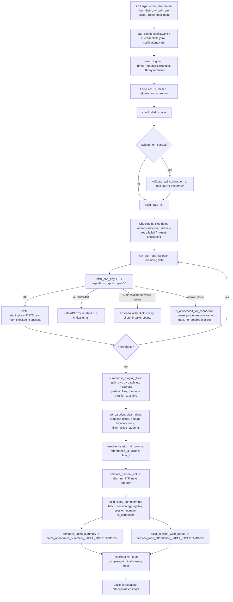

# Attendance Pipeline

## 1. Overview & Purpose

`attendance.py` (v1.2.0, `attendance/scripts/attendance.py`) pulls daily student attendance from Edmingle (`report_type=55`), one HTTP call per day, and produces two CSVs: a per-batch summary and a per-(batch, session) breakdown. Built to run unattended over long date ranges.

**Purpose:** a reliable, resumable, crash-safe attendance extraction, so no one has to babysit a multi-day backfill or a daily run.

## 2. High-Level Data Flow



**Lineage:** Edmingle API → per-day staging CSVs → batch partitions (temporary spill files) → `clean_data()` →
`build_class_summary()` → the two output CSVs. No downstream system in this repo consumes them
automatically.

## 3. Repository Structure

| Path | Purpose |
|---|---|
| `scripts/attendance.py` | Entire pipeline — config, extraction, cleaning, summarization, email, CLI (`main()`). |
| `scripts/config.yaml` | Non-secret runtime config (API tuning, paths, behaviour flags). |
| `../notifications.yaml` | SMTP + recipients + alert-granularity toggles (this pipeline's own folder, a sibling of `scripts/`). |
| `output/` | Summaries, `staging/`, `logs/`, checkpoint, lock file, and a temporary `_spill/` folder while summarising (deleted afterwards). |
| `../../credentials.yaml` | Shared Edmingle `api_key`/`organization_id`. |
| `../../common.py` | Shared credentials/notifications loader — not used for this pipeline's own SMTP/rate-limit code. |

## 4. Source System

| Source | Endpoint | Method | Auth | Parameters | Pagination | Rate Limit |
|---|---|---|---|---|---|---|
| Edmingle reporting API | `<base_url>/report/csv` (`base_url` from `credentials.yaml`; `config.yaml api.url` only overrides it) | GET | `apikey`/`orgid`/`ORGID` **headers** from shared `credentials.yaml` (moved out of the URL 2026-09-25 — the endpoint accepts headers) | `report_type=55`, `organization_id`, `start_time`/`end_time` (one IST day per call), `response_type=1` | None — one call per calendar day | Client-side pacing only (`rate_limit_sleep_seconds`, 2.5s); reacts to server `429`/`Retry-After`. Real Edmingle-side ceiling: requires confirmation. |

**Upstream:** Edmingle LMS, plus the shared `credentials.yaml`/`common.py`.

## 5. Extraction Process

1. Parse CLI args.
2. `load_config()` — merges `config.yaml`, shared credentials, notifications; exits on missing required keys.
3. `setup_logging()` — daily-rotating file + console, IST timestamps.
4. `LockFile` — PID-based; refuses a second concurrent run, auto-clears a stale (dead-PID) lock.
5. `check_disk_space()` — aborts if free space is below `pipeline.min_free_disk_mb`.
6. If `validate_on_startup`, one real call for yesterday checks the API key/org id before the main loop.
7. `build_date_list()` — resolves dates from `--date`, `--from`/`--to`, or `default_lookback_days`.
8. Checkpoint skips already-`success` dates (unless `--retry-failed`/`--reset-checkpoint`).
9. `run_pull_loop()` calls `fetch_one_day()` per date — handles 200/429/401/403/404/400/5xx/Edmingle 6001/6002, network-outage detection, backoff, and a consecutive-error circuit breaker.
10. Each fetched day writes to `staging/raw_<date>.csv`; checkpoint updates immediately (crash-safe).
11. `summarise_staging_files()` reads every staging file **once**, keeps only the columns the summary uses (plus a hash of the whole original row) and writes them into ~150 MB partition files keyed by `batch_Id`; steps 12–15 then run **once per partition** and the small results are joined. Every metric is per batch, so the output is identical to processing everything at once. (`--from-file` skips extraction and loads that one file in memory.)
12. `clean_data()` — parses dates, dedupes, drops rows missing key columns, flags (doesn't drop) conflicting rows, filters inactive students.
13. `resolve_session_id_column()` — `attendance_id`, falling back to `class_Id` with a warning.
14. `validate_present_value()` — aborts the run if `"P"` never appears.
15. `build_class_summary()` computes per-(batch, session) aggregates; `compute_batch_summary()`/`build_session_wise_output()` derive the two output CSVs.
16. `EmailNotifier` sends completion/critical/warning email per `notifications.yaml` (never raises); the lock is released on clean exit or SIGINT/SIGTERM.

## 6. Function Reference

- **`load_config(path)`** — merges `config.yaml` over defaults, injects credentials/notifications, validates required keys, anchors relative paths to the script's folder.
- **`fetch_one_day(...)`** — one day through `common.get_json` (retry/backoff): `200` parsed; `429` waits `Retry-After` + 2 s (30 s if the header is absent); `401/403/404`/Edmingle `6002` → `FatalAPIError` (no retry); `400`/`6001` → date skipped; `5xx` → backoff+retry. On timeout it checks `is_online()`: if the internet is down it waits and retries the same date for free. Raises `ValueError` when retries run out.
- **`resolve_session_id_column(...)`** — `attendance_id`, else `class_Id` with a warning (undercounts sessions: `class_Id` is a subject id, not a session).
- **`filter_active_students(...)`** — allow-list on `studentBatchStatus` (default `["Active"]`), togglable.
- **`clean_data(...)`** — parses `classDate`, drops unparseable/duplicate/key-incomplete rows, logs (keeps) conflicting `(student_Id, session)` pairs, filters students, derives `_class_datetime`.
- **`validate_present_value(...)`** — raises `PipelineError` if the present marker ("P") never appears (guards against a silently all-zero run).
- **`build_class_summary(...)`** — per-(batch, session) present/absent/late/marked counts, chronological `session_number`, `is_conducted` (`classDate <= TODAY`).
- **`compute_batch_summary(...)`** — per-batch rollup in `OUTPUT_COLUMNS` order (enrollment, first/last attendance, attendance %, average/high/low, rating, retention, drop).
- **`build_session_wise_output(...)`** — the same aggregation as one row per (batch, session), in `SESSION_OUTPUT_COLUMNS` order.

## 7. Configuration & Parameters

| Source | Key(s) | Purpose |
|---|---|---|
| CLI | `--config` (cwd-relative, not script-relative), `--date`, `--from`/`--to`, `--from-file`, `--dry-run`, `--retry-failed`, `--reset-checkpoint`, `--verbose` | Which dates, which mode. |
| `../../credentials.yaml` | `edmingle.api_key`, `edmingle.organization_id` | Auth — fatal if missing. |
| `notifications.yaml` | SMTP host/port/user/password, recipients, per-severity toggles; Slack/Teams placeholders (unimplemented) | Alerting. |
| `config.yaml` | `api.*` (url/timeouts/retry tuning), `paths.*`, `pipeline.*` (lookback, present/absent/late values, session id column, date/time formats, active-student filtering) | Runtime behaviour. |
| Hardcoded | `VERSION`, IST offset, `OUTPUT_COLUMNS`, `SESSION_OUTPUT_COLUMNS`, extra "marked" codes `E`/`OL`/`NA` | Fixed schema/constants. |

## 8. Data Transformation, Output & Schema

**Transformations:** date parsing (drop unparseable) · exact-duplicate removal · drop rows missing
key columns · active-student allow-list · session-id resolution (`attendance_id`→`class_Id`
fallback) · zero-rating→NaN (togglable) · chronological session numbering · `is_conducted` date
flag · present-value abort check · per-session→per-batch aggregation.

**Outputs** (in `output/`; `<label>` = date or date range):

| Name | Notes |
|---|---|
| `batch_attendance_summary_<label>_<ts>.csv` | Direct `to_csv`, not atomic. |
| `session_wise_attendance_<label>_<ts>.csv` | Only if `write_session_wise_csv` (default true, unset here). |
| `attendance_raw_<label>_<ts>.csv` | Only if `save_combined_raw_csv` (true here) **and** there is enough free disk; otherwise skipped with a warning, since it just duplicates `staging/`. Written file by file. |
| `staging/raw_<date>.csv` | One per fetched day; enables resume. |
| `pipeline_checkpoint.json` | Per-date status, atomic write. |

**Confirmed state:** `output/` holds one batch summary (`batch_attendance_summary_2020-01-01_to_2026-07-30_…csv`, 290 rows) from an earlier July run, plus the logs. No session-wise file, staging files or checkpoint (the 2,260-day run of 2026-09-24 died out of memory — see below; its staging was deleted and the old checkpoint kept only as `.bak-staging-deleted-2026-09-25`).

**Database integration:** not applicable — CSV output only.

**`batch_attendance_summary_*.csv` schema** (verified against the live file):

| Column | Type | Description |
|---|---|---|
| `batch_Id`, `batchName`, `bundle_Id`, `bundleName`, `course_Id`, `courseName`, `teacher_Id`, `teacherName` | — | Source identity/name fields. |
| `total_students_enrolled` | int | Distinct students per batch. |
| `first_class_date` / `last_class_date` | date | Earliest / latest conducted session. |
| `first_class_attendance` / `last_class_attendance` | int | Present count, first/last conducted session. |
| `total_present_marks` / `total_absent_marks` | int | Summed per-session counts, conducted only. |
| `attendance_percentage` | float | Mean present ÷ enrolled × 100. |
| `average_class_attendance` / `highest_class_attendance` / `lowest_class_attendance` | float/int | Present-count stats, conducted sessions. |
| `average_rating` | float/blank | Mean rating (0 excluded if configured). |
| `retention_percentage` | float | `last / first attendance × 100`. |
| `attendance_drop` | int | `first − last`. |

`total_classes_planned/conducted/remaining` are computed but not in `OUTPUT_COLUMNS` — never reach the CSV.

**`session_wise_attendance_*.csv` schema** (per code; no live file to verify against):
`batch_Id`, `batchName`, `course_Id`, `courseName`, `session_number`, `session_id`, `classDate`,
`is_conducted`, `present_count`, `absent_count`, `late_count`, `total_marked`,
`session_attendance_percentage`.

## 9. Data Quality & Known Limitations

**Implemented checks:** unparseable-date drop, duplicate-row drop, missing-key-column drop,
conflicting-row flagging (not resolved), active-student allow-list, present-value sanity abort,
session-id fallback with warning, zero-rating handling, disk-space precheck, startup API
validation.

**Confirmed limitations:**
- Conflicting `(student, session)` rows are flagged but kept — can skew per-session counts.
- No schema validation beyond the fields the code reads directly.
- `total_classes_remaining` is effectively always 0 — `report_type=55` only reports past sessions.
- No range/outlier checks (e.g. `attendance_percentage` > 100 wouldn't be caught).
- `--config` default resolves against the caller's cwd, not the script folder — fails if run from elsewhere without an explicit path.
- `notifications.yaml` still has placeholder SMTP credentials/recipients with alerts enabled — no real email will arrive until filled in.
- **Memory (fixed 2026-09-25).** The pipeline used to load every staging file into one DataFrame; the 2020-01-01 → 2026-08-31 run (2,260 days, ~5.6 GB, ~10M rows) died at that step on this 3.9 GB server. It now uses ~330 MB regardless of range (measured on 649k rows) but needs about **half the staging size in free disk** for temporary files (checked up front). Only a ~4-month sample has been tested end to end, so a full 2,260-day run is still unproven.
- `cleanup_staging_after_combine` now removes staging files after the summaries are written (it used to remove them first). `clean_data()` log lines repeat once per partition on a large run, and the combined raw CSV is written file by file, so a column's number format can differ slightly (`5` vs `5.0`).
- `EmailNotifier` uses its own HTML-email code, separate from `common.send_mail()` (plain text) — routing this pipeline through the shared function later would break the HTML formatting unless that function is extended first.

**Verification of the memory fix:** on real data (55 days, 282,887 rows, 33 batches) both summaries were **byte-identical** to the old all-in-memory code at 1, 15 and 58 partitions, with the active-student filter on and off; a planted-duplicates test also matched and was shown able to fail. A full `main()` run worked online and with `--from-file`.

**Requires confirmation:** the real Edmingle rate-limit ceiling; whether `exclude_inactive_students: false` here is intentional.

## 10. Error Handling & Logging

`TimedRotatingFileHandler` (30-day retention) + console, IST timestamps. `FatalAPIError` (401/403/404/6002, no retry) and `PipelineError` (present-value/startup failure). Exponential backoff+jitter for 429/5xx; a consecutive-error circuit breaker (`max_consecutive_errors`) stops the run; `is_online()` separates a real internet outage (free retry) from an Edmingle-side failure. SIGINT/SIGTERM release the lock. Email is best-effort and never raises.

## 11. Dependencies

| Dependency | Purpose |
|---|---|
| `pandas` | DataFrame ops. |
| `requests` | HTTP calls. |
| `pyyaml` | Config parsing. |
| `common` (repo root) | Credentials/notifications loading. |
| stdlib (`argparse`, `logging`, `smtplib`, `socket`, `pathlib`, etc.) | CLI, logging, lock/PID, SMTP, timing. |

Docstring states: `pip install pandas requests pyyaml`.

## 12. Setup & How to Run

Step-by-step guide: [RUN_GUIDE.md](RUN_GUIDE.md). Before running: `../../credentials.yaml` filled in, `config.yaml` flags checked (`exclude_inactive_students` is `false` here), `../notifications.yaml` filled in if email is wanted (currently placeholders).

```bash
source /home/projectdev/ela_datasets/.venv/bin/activate
cd /home/projectdev/ela_datasets/attendance/scripts
python3 attendance.py --from 2026-01-01 --to 2026-01-31
python3 attendance.py --date 2026-06-15
python3 attendance.py                       # uses default_lookback_days
python3 attendance.py --from-file raw.csv   # summarize an existing raw CSV, skip extraction
python3 attendance.py --dry-run --from 2026-01-01 --to 2026-01-07
python3 attendance.py --retry-failed
python3 attendance.py --reset-checkpoint
```

**Run it in tmux** (session name = folder name; multi-year ranges take hours):

```
step 1: tmux new -s attendance          start the session (name = folder name)
step 2: activate the venv, open the directory, run the script
        source /home/projectdev/ela_datasets/.venv/bin/activate
        cd /home/projectdev/ela_datasets/attendance/scripts
        python3 attendance.py --from 2026-08-01 --to 2026-08-31
Ctrl+B then D                detach (the script keeps running)
tmux ls                      list active sessions
tmux attach -t attendance      return to the session
```

## 13. Automation / Scheduling

None — triggered manually. No unattended auto-restart wrapper exists (a stale Windows `.bat` was removed on 2026-09-25).

## 14. Important Business / Technical Rules

- `session_id_column` must be `attendance_id`, not `class_Id` — the fallback exists because using `class_Id` has previously undercounted sessions across most batches in a run.
- `studentRating == 0` means "not rated," not a real zero, when the zero-as-missing toggle is on (current default).
- Present-value abort is strict by design — a whole-run failure, not a warning, to avoid silently-all-zero output.
- `is_conducted` is a pure date check (`classDate <= TODAY`), not an Edmingle-provided flag.
- `exclude_inactive_students` is `false` on this installation despite the code's own `true` default — Archived students are currently included in attendance %.
- Duplicate (student, session) rows are never auto-resolved, only logged.
- Status handling is asymmetric by design: 401/403/404/6002 fatal, 400/6001 skip-this-date, 429/5xx/timeout retry.

## 15. Troubleshooting

| Symptom | Likely cause | Check |
|---|---|---|
| "Config file not found" on start | Wrong cwd, no `--config` passed | Run from `scripts/` or pass an absolute path |
| "Shared credentials file not found" | `../../credentials.yaml` missing/incomplete | Verify its `edmingle:` block |
| Refuses to start, mentions lock file | Prior run's PID still alive, or stale lock | Check `output/pipeline.lock` |
| Aborts with `PipelineError` re: `present_value` | Configured "P" marker never appeared | Check `pipeline.present_value` vs a raw API sample |
| Repeated "falling back to class_Id" warnings | `attendance_id` missing from response | Investigate — sessions will be undercounted |
| Circuit breaker trips | Consecutive days exhausted retries | Check Edmingle status / API key |
| No email despite a trigger firing | Placeholder SMTP credentials | Fill in real `smtp.*`/`to_addresses` |
| Session-wise CSV missing | `write_session_wise_csv: false`, or `--from-file` used | Check the config flag |

## 16. Maintenance Guide

- **Endpoint/params change** → `_day_params()`; the URL comes from `credentials.yaml`'s `base_url` (or an `api.url` override in `config.yaml`).
- **New/renamed status codes** → `pipeline.present_value`/`absent_value`/`late_value`; the hardcoded `E`/`OL`/`NA` codes live in `build_class_summary()` itself.
- **Output schema change** → `OUTPUT_COLUMNS`/`SESSION_OUTPUT_COLUMNS` plus the summary-building functions.
- **Retry/backoff tuning** → `config.yaml api.*`, no code change needed.
- **New notification channel** → `notifications.yaml` has Slack/Teams placeholders, but `EmailNotifier` needs new send logic.

## 17. Security Considerations

`credentials.yaml`/`../notifications.yaml` hold secrets and are gitignored (`chmod 600`).
The API key is masked in at least one log line (not exhaustively checked elsewhere).
Alert emails carry operational details only — no individual-student PII in the output CSVs.

## 18. Raw API Payload (Captured Structure)

**Captured live from the API on 2026-09-25** (one read-only call, tiny page size). Structure only: field names and types, no values, so no student/teacher PII is recorded here. `<int>`/`<str>`/`<null>` are the types observed in the sample; a field seen as `<null>` may hold a value for other records.

**Endpoint:** `GET .../report/csv?report_type=55&response_type=1` (one IST day per call). Despite the
`/csv` in the path, it returns **`application/json`**, not CSV. One recent day measured **4,220 records /
~5.3 MB** in a single response — the pipeline parses a whole day into memory at once, which matters on this
server's small RAM. Every record is one student-in-one-session; `studentAttendanceStatus` is the field
`present_value` (`P`/`A`/`L`) is matched against.

```json
{
  "code": "<int> (200)",
  "message": "<str>",
  "data": [
    {
      "student_Id": "<int>",
      "studentName": "<str>",
      "regNo": "<str>",
      "studentEmail": "<str>",
      "studentContact": "<str>",
      "studentBatchStatus": "<str>",
      "batch_Id": "<int>",
      "batchName": "<str>",
      "class_Id": "<int>",
      "className": "<str>",
      "bundle_Id": "<int>",
      "bundleName": "<str>",
      "course_Id": "<int>",
      "courseName": "<str>",
      "attendance_id": "<int>",
      "sessionName": "<str>",
      "teacher_Id": "<int>",
      "teacherName": "<str>",
      "teacherEmail": "<str>",
      "teacherContact": "<str>",
      "teacherClassSigninStatus": "<str>",
      "studentAttendanceStatus": "<str>",
      "classDate": "<str>",
      "startTime": "<str>",
      "endTime": "<str>",
      "classDuration": "<str>",
      "studentRating": "<int>",
      "studentComments": "<str>",
      "batchManagerName": "<str>",
      "batchManagerEmail": "<str>",
      "batchManagerContactNumber": "<str>",
      "classTakenAt": "<str>",
      "classSignoutAt": "<str>",
      "attendanceMarkTime": "<str>"
    }
  ]
}
```

The record includes student and teacher names, emails and phone numbers; the summary CSVs this pipeline
writes do not carry them.

## 19. Future Improvements

1. **Email the output on completion** — send a completion email that includes the run status *and* attaches the generated dataset file(s), not just a status notification.
2. **Scheduled automation** — run automatically on a defined schedule instead of a manual trigger.
3. **Data cleaning layer** — a dedicated cleaning step/script (nulls, duplicates, standardization) inside the pipeline, instead of leaving it to downstream consumers.

---
*Initial documentation: 2026-09-24. Project/technical owner: shubham.*
