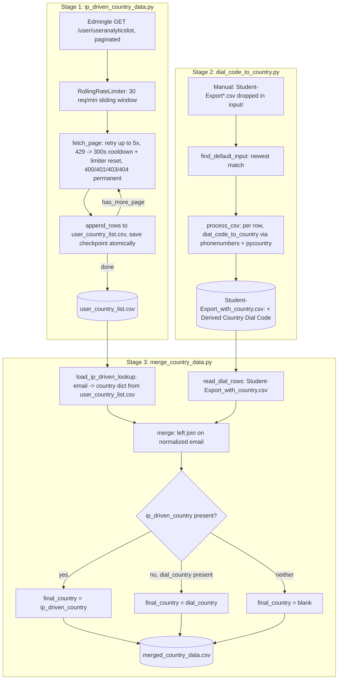

# Country-Wise Data Pipeline

## 1. Overview & Purpose

A 3-stage pipeline at `country_wise_data/` that determines each student's country from two
independent signals and merges them:

- **Stage 1 — `ip_driven_country_data.py`**: pulls per-user analytics from Edmingle's
  `/user/useranalyticslist` endpoint, including Edmingle's own IP-geolocated country.
- **Stage 2 — `dial_code_to_country.py`**: reads a manually-exported `Student-Export*.csv`
  roster (dropped into `input/` by hand) and derives a country from each phone dial code.
- **Stage 3 — `merge_country_data.py`**: joins Stage 1 + Stage 2 on email, producing one row per
  student with three country columns.

Per the pipeline's own prior documentation, this domain "was never part of the original 5
documented pipelines" — flag to the project owner if it's meant to be permanent.

**Purpose:** a per-student country signal for reporting/segmentation, cross-checking a low-cost
dial-code guess against Edmingle's own IP-geolocation value, producing one `final_country`.

## 2. High-Level Data Flow



**Lineage:** Edmingle API (Stage 1) + manual admin-panel export (Stage 2) → joined on email
(Stage 3) → `merged_country_data.csv`. No downstream system in this repo consumes it.

## 3. Repository Structure

| Path | Purpose |
|---|---|
| `scripts/ip_driven_country_data.py` | Stage 1 — paginated Edmingle geo-IP pull, checkpointed/resumable. |
| `scripts/ip_driven_country_data_config.json` | Stage 1 config (`base_url`, dates, pagination, rate limit). |
| `scripts/dial_code_to_country.py` | Stage 2 — dial-code-to-country from a manual export. |
| `scripts/merge_country_data.py` | Stage 3 — joins Stage 1 + Stage 2 on email. |
| `input/Student-Export.csv` | Manual Edmingle admin-panel roster export (gitignored, real PII). |
| `output/user_country_list.csv` | Stage 1 output. |
| `output/user_country_list_checkpoint.json` | Stage 1 resume checkpoint. |
| `output/Student-Export_with_country.csv` | Stage 2 output. |
| `output/merged_country_data.csv` | Stage 3 output (final). |
| `../../credentials.yaml`, `../../common.py` | Shared Edmingle credentials + `RollingRateLimiter`, used by Stage 1 only. |

## 4. Source System

| Source | Endpoint | Method | Auth | Parameters | Pagination | Rate Limit |
|---|---|---|---|---|---|---|
| Edmingle user analytics (Stage 1) | `.../user/useranalyticslist` | GET | `apikey`/`ORGID` headers | `page`, `per_page` (500), `filter_key` (`geoLocationInfo.country`), `start_date`/`end_date` | Loop while `page_context.has_more_page` | 30 req/min sliding window; `429` → 300s cooldown + limiter reset |
| Manual roster export (Stage 2) | N/A — hand-dropped into `input/` | — | — | — | — | — |
| Internal join (Stage 3) | File-to-file merge, no external source | — | — | — | — | — |

**Upstream:** Edmingle's user-analytics API and its admin-panel export (human-in-the-loop for Stage 2).

## 5. Extraction Process

**Stage 1:** `load_config()` reads the JSON config and injects credentials → `run_collection()`
ensures a CSV header exists, loads/truncates to the last good checkpoint offset (undoing any
partial write from a crash) → loops pages, rate-limiting each call, retrying transient failures
(5x, linear-ish backoff) and treating 400/401/403/404 as permanent (page skipped, run exits 1) →
each page's rows are appended and the checkpoint saved atomically → stops when `has_more_page` is
false or a page returns no users.

**Stage 2:** picks the newest `Student-Export*.csv` in `input/` (or `--input`) → preserves an
optional leading junk title line if present → derives country per row from the dial-code column
→ writes `<input>_with_country.csv`.

**Stage 3:** loads Stage 1's output into an email→country lookup (first row wins on duplicates;
a missing file is tolerated as zero rows) → reads Stage 2's output → merges on normalized email,
computing `final_country` (ip-driven wins, dial-code fallback, blank if neither) → writes
`merged_country_data.csv` with a match-count summary.

## 6. Function Reference

### `fetch_page(...)`
One page of `/user/useranalyticslist` with retry logic: up to 5 attempts, linear-ish backoff for
transient failures, 300s cooldown + limiter reset on `429`, immediate `None` on 400/401/403/404.

### `run_collection(cfg, script_dir)`
Orchestrates the full paginated pull; on a genuinely fresh run, the byte offset starts at the
header's own size so the header is never truncated away.

### `save_checkpoint(...)` / `truncate_to_offset(...)`
Atomic checkpoint writes (`.tmp` + `os.replace()`); truncates the CSV back to the last confirmed
byte offset if a crash left partial rows appended past it. File ops retry transient
`PermissionError`/`OSError` (e.g. antivirus/OneDrive locks) up to 6 times.

### `dial_code_to_country(raw_dial_code) -> str`
Normalizes the input (`-`, `N/A`, `null`, etc. → blank), strips a leading `+`, falls back to a
leading digit run for malformed codes, looks up the region via `phonenumbers`
(taking the **first** region for shared codes like `+1`/`+44`/`+7`), converts to a name via
`pycountry`. Cached per code and per region.

### `process_csv(...)`
Reads the manual export, requires the dial-code column to exist (exits with available columns if
not), appends `"Derived Country (Dial Code)"` (replacing any pre-existing column of that name),
prints a `total`/`derived`/`blank` summary.

### `load_ip_driven_lookup(path) -> dict`
Empty dict + warning if the file is missing/headerless; hard exit if `email`/`country` columns
are absent; normalizes/lowercases emails; first row wins on duplicates (logged).

### `merge(dial_path, ip_path, output_path)`
Builds the final schema (original columns + renamed `dial_country` + `ip_driven_country` +
`final_country`), applies the precedence rule, writes the output, and prints match counts.

## 7. Configuration & Parameters

| Source | Key(s) | Purpose |
|---|---|---|
| Stage 1 CLI | `--config` (default `ip_driven_country_data_config.json`) | Points at the JSON config. |
| Stage 1 config | `base_url`, `filter_key`, `sort_order`, `per_page`, `start_date`/`end_date`, `rate_limit_per_minute`, `output_csv`, `checkpoint_file` | All non-secret Stage-1 behaviour. |
| Stage 1 credentials | `../../credentials.yaml` → `apikey`/`orgid` | Exits if missing or still the placeholder string. |
| Stage 2 CLI | `--input`, `--output`, `--dial-code-column` (default `"Contact Number Dial Code"`), `--encoding` | File selection and column mapping. |
| Stage 3 CLI | `--dial-input`, `--ip-input`, `--output` | Input/output file paths. |
| Hardcoded | Stage 1: `PERMANENT_ERROR_CODES`, `TRANSIENT_ERROR_COOLDOWN_SECONDS=300`, `MAX_RETRIES_PER_PAGE=5`; Stage 2: new-column name; Stage 3: join column names | Fixed constants. |

No `notifications.yaml` anywhere in this pipeline — no email/alerting in any of the three scripts.

## 8. Data Transformation, Output & Schema

**Transformations:** epoch→IST string conversion (Stage 1, both kept) · dial-code normalization
and primary-country selection for shared codes (Stage 2) · leading junk-line preservation (Stage
2 & 3) · email normalization for the join key · `final_country` precedence (ip-driven wins) ·
column rename (`Derived Country (Dial Code)` → `dial_country`).

**Outputs** (all in `output/`):

| Name | Write Strategy |
|---|---|
| `user_country_list.csv` | Append-only per page, `flush()`+`fsync()`. |
| `user_country_list_checkpoint.json` | Atomic write after every page. |
| `Student-Export_with_country.csv` | Full read-then-write. |
| `merged_country_data.csv` | Full read-then-write. |

**Confirmed state (2026-09-24):** `input/Student-Export.csv` — 131,212 data rows, modified
2026-09-23. `Student-Export_with_country.csv` and `merged_country_data.csv` both match that row
count exactly (no rows dropped). **`user_country_list.csv` has zero data rows** — header only, no
checkpoint file either — Stage 1 has never run, even partially, on this server. Direct
consequence: `ip_driven_country` is blank for all ~130,188 effective student rows and
`final_country` equals `dial_country` everywhere right now.

**Database integration:** not applicable — CSV/JSON output only.

**Schema — `user_country_list.csv`** (Stage 1; header confirmed, zero rows to sample): `user_id`,
`name`, `email`, `contact_number`, `country` (Edmingle geo-IP), `region`, `time_spent_seconds`,
`total_sessions`, `last_seen_epoch`/`last_seen_ist`, `created_at_epoch`/`created_at_ist`,
`source_page`.

**Schema — `Student-Export_with_country.csv`** (Stage 2): all 54 original roster columns, plus
`Derived Country (Dial Code)` (derived).

**Schema — `merged_country_data.csv`** (Stage 3): all original roster columns, plus
`dial_country` (renamed from Stage 2's derived column), `ip_driven_country` (looked up, currently
blank for all rows), `final_country` (ip-driven → dial → blank precedence).

## 9. Data Quality & Known Limitations

**Implemented checks:** required config keys present, non-placeholder API key, crash-safe resume
with no duplicate/orphan rows, retry-with-rollback per page, required input columns present
(explicit error naming them), duplicate-email detection (warned, first kept), missing Stage-1
file tolerated as zero rows.

**Confirmed limitations:**
- **Stage 1 has never produced data on this server** — header-only output, no checkpoint file. The merge's override logic (ip-driven wins) has never actually been exercised.
- Not part of the originally documented 5-pipeline scope — flag to the project owner if it should be.
- `input/` holds real, unmasked student PII (names, emails, phones, addresses, parent contacts) — gitignored, must stay that way.
- Country name formats aren't normalized between sources — `pycountry`'s official names (dial-code) vs. Edmingle's raw value (ip-driven) could disagree in formatting for the same country.
- Contact-number join was explicitly rejected in favor of email (~29% of rows have a blank/dash contact number vs. ~0.02% blank email) — but any student with a blank/mismatched email can never match a Stage-1 record.
- No cross-check that country values are real recognized names.
- Stage 1's page loop has no max-page safety cap — relies entirely on Edmingle's own `has_more_page` flag.

**Requires confirmation:** whether/when Stage 1 should first be run for real, and on what cadence; whether this pipeline should be added to the project's documented scope.

## 10. Error Handling & Logging

Stage 1 logs via a custom `log()` printing `[timestamp] message` to stdout (no file logging); a
permanently-failed page exits with code 1, checkpoint untouched so a re-run resumes at the same
page. File I/O retries transient `PermissionError`/`OSError` up to 6 times with exponential
backoff. Stages 2 & 3 print plain summary lines and exit via `sys.exit(<message>)` on a missing
required file/column — no retry logic (one-shot, non-network scripts). No email/alerting anywhere
in this pipeline.

## 11. Dependencies

| Dependency | Purpose | Stage |
|---|---|---|
| `requests` | HTTP calls | 1 |
| `common` (repo root) | Credentials, `RollingRateLimiter` | 1 |
| `phonenumbers` | Dial-code → region lookup | 2 |
| `pycountry` | Region → country name | 2 |
| stdlib only (`argparse`, `csv`, `os`, `sys`, `pathlib`) | — | 3 |

## 12. Setup & How to Run

**Step by step:**
1. `source /home/projectdev/ela_datasets/.venv/bin/activate` — one time per shell session. Your
   prompt shows `(.venv)` when it's active; a plain `python3` after this already has `requests`,
   `pyyaml`, `phonenumbers`, `pycountry` installed, so no `pip install` step is needed.
2. Populate `../../credentials.yaml` (Stage 1 only) — shared by every pipeline, likely already done.
3. Drop a fresh `Student-Export*.csv` into `input/` before running Stage 2.
4. Confirm Stage 1's config date window covers the desired range.
5. `cd /home/projectdev/ela_datasets/country_wise_data/scripts` and run all three stages in order
   (each depends on the previous one's output).

```bash
source /home/projectdev/ela_datasets/.venv/bin/activate
cd /home/projectdev/ela_datasets/country_wise_data/scripts

# Stage 1 (must run first for ip_driven_country to populate)
python3 ip_driven_country_data.py --config ip_driven_country_data_config.json

# Stage 2 (any time after a fresh export is dropped in ../input/)
python3 dial_code_to_country.py

# Stage 3 (after both Stage 1 and Stage 2 have output)
python3 merge_country_data.py
```

**Run it in tmux** (session name = the dataset folder name; keeps the run going if your SSH connection drops):

```
step 1: tmux new -s country_wise_data
        (starts the session -- the session name is the dataset folder name)
step 2: activate the environment, open the directory and run the script
        source /home/projectdev/ela_datasets/.venv/bin/activate
        cd /home/projectdev/ela_datasets/country_wise_data/scripts
        python3 ip_driven_country_data.py --config ip_driven_country_data_config.json
        python3 dial_code_to_country.py
        python3 merge_country_data.py
Ctrl+B then D                to detach / come out of the session (the script keeps running)
tmux ls                      to see the list of active sessions
tmux attach -t country_wise_data      to return to / open the session
exit                         (inside the session, when the run has finished) to close it
```

## 13. Automation / Scheduling

None — all three scripts are run manually. Stage 2 additionally needs a human to drop a fresh
export into `input/` before each run.

## 14. Important Business / Technical Rules

- Join key is email only (normalized) — chosen over phone number due to its much lower blank rate (~0.02% vs. ~29%).
- `ip_driven_country` always wins over `dial_country` when both are present — a live geo-IP signal is trusted over a dial-code guess.
- Dial-code-to-country is a "primary country" guess for shared codes (`+1`, `+44`, `+7`) — `phonenumbers`' first-listed region, no further disambiguation.
- Duplicate Stage-1 emails resolve by "first row wins," not recency/completeness.
- A missing Stage-1 file doesn't block Stage 3 — treated as zero rows, so `final_country` silently becomes pure `dial_country`. This is the pipeline's actual state today.

## 15. Troubleshooting

| Symptom | Likely cause | Check |
|---|---|---|
| Stage 1 exits citing a missing/placeholder API key | `credentials.yaml` incomplete | Verify the repo-root file |
| Stage 1 exits mid-run, "STOPPED at page N" | A page permanently failed or exhausted retries | Check the error body; re-run — resumes at page N |
| Stage 2: "Column '...' not found" | Dial-code column name changed in a newer export | Pass `--dial-code-column` |
| Stage 2: "No --input given and no file matching..." | No `Student-Export*.csv` in `input/` | Drop a fresh export, or pass `--input` |
| Stage 3: "... run dial_code_to_country.py first" | Stage 2 hasn't run, or `--dial-input` is wrong | Run Stage 2, or fix the path |
| Stage 3's `ip_driven_country` blank for every row | Stage 1 has never produced real data (current state) | Run Stage 1 for real |
| Stage 3 warns about duplicate emails | Same email appears twice in Stage 1's output | Investigate that user id in Stage 1's source data |

## 16. Maintenance Guide

- **Stage 1 endpoint/response change** → `ip_driven_country_data_config.json` and the row-mapping in `run_collection()`.
- **Stage 2 column rename** → `--dial-code-column`, or the `argparse` default.
- **Stage 3 join key change** → rewrite `normalize_email()`/`load_ip_driven_lookup()`/`merge()` — not a simple config change.
- **Country-name reconciliation** (if wanted) → a new normalization step in `merge()` against a canonical country table.
- **Rate-limit tuning** → `rate_limit_per_minute` in the JSON config; retry/cooldown constants are hardcoded and need a code change.

## 17. Security Considerations

`input/` and both derived outputs hold real, unmasked student PII (names, emails, phones, parent
contacts, addresses) — gitignored, share only through a PII-appropriate channel. Stage 1's
credentials are never printed in logs. No email/alerting exists, so no SMTP secret exposure here.

## 18. Raw API Payload (Captured Structure)

**Captured live from the API on 2026-09-25** (one read-only call, tiny page size). Structure only: field names and types, no values, so no student/teacher PII is recorded here. `<int>`/`<str>`/`<null>` are the types observed in the sample; a field seen as `<null>` may hold a value for other records.

Only **Stage 1** calls a live API (`GET .../user/useranalyticslist`); Stages 2/3 are file-to-file merges with
no API payload. Pagination is via `page_context.has_more_page`.

```json
{
  "code": "\"200\" (string, not int)",
  "message": "<str>",
  "user_list": [
    {
      "_id": "<int>",
      "timeSpent": "<int>",
      "totalSessions": "<int>",
      "lastSeen": "<int>",
      "filterValue": "<str>",
      "regionName": "<str>",
      "name": "<str>",
      "email": "<str>",
      "contact_number": "<str>",
      "created_at": "<int>"
    }
  ],
  "page_context": {
    "page": "<int>",
    "per_page": "<int>",
    "has_more_page": "<bool>",
    "total_rows": "<int>"
  }
}
```

## 19. Future Improvements

1. **Email the output on completion** — send a completion email that includes the run status *and* attaches the generated dataset file(s), not just a status notification.
2. **Scheduled automation** — run automatically on a defined schedule instead of a manual trigger.
3. **Data cleaning layer** — a dedicated cleaning step/script (nulls, duplicates, standardization) inside the pipeline, instead of leaving it to downstream consumers.

---
*Initial documentation: 2026-09-24. Project/technical owner: requires confirmation.*
