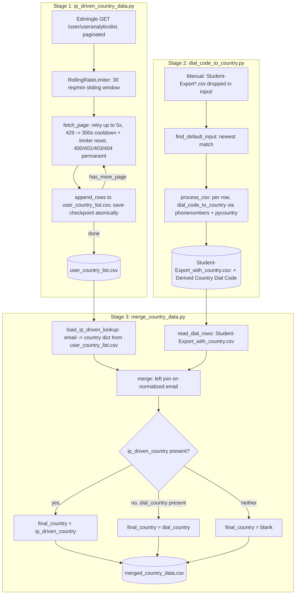

# Country-Wise Data Pipeline

## 1. Overview

`country_wise_data` is a 3-stage pipeline at `/home/projectdev/ela_datasets/country_wise_data/`
that determines each student's country from two independent signals and merges them into one
file. It comprises three independent scripts under `scripts/`:

- **Stage 1 — `ip_driven_country_data.py`**: pulls per-user analytics from Edmingle's
  `/user/useranalyticslist` endpoint, including a country Edmingle itself derives from the
  user's geolocated IP.
- **Stage 2 — `dial_code_to_country.py`**: reads a manually-exported `Student-Export*.csv`
  student roster (dropped into `input/` by hand — not fetched via the API) and derives a
  country guess from each student's phone dial code.
- **Stage 3 — `merge_country_data.py`**: joins Stage 1 and Stage 2's output on email and
  produces one row per Student-Export student with three country columns.

Per the pipeline's own `README.md`, this data domain "was never part of the original 5
documented pipelines for this project" — it is a later addition, and the project owner should
be told about it if it is meant to be a permanent, ongoing dataset.

This document covers both the `dial_code_country` sub-dataset (Stage 2/3's `dial_country`
column and its inputs) and the `ip_driven_country` sub-dataset (Stage 1) in one place, as
requested, since `merge_country_data.py` (Stage 3) ties them together into a single output.

## 2. Purpose

To give Vyoma a per-student country signal for reporting/segmentation, cross-checking a
low-cost dial-code guess (derived from a manual roster export) against Edmingle's own
IP-geolocation-based country value for the same user, and producing one authoritative
`final_country` per student.

## 3. High-Level Data Flow



## 4. Project / Repository Structure

| Path | Purpose |
|---|---|
| `country_wise_data/scripts/ip_driven_country_data.py` | Stage 1: paginated Edmingle geo-IP country pull, checkpointed/resumable. |
| `country_wise_data/scripts/ip_driven_country_data_config.json` | Stage 1 non-secret config: `base_url`, `filter_key`, `sort_order`, `per_page`, `start_date`, `end_date`, `rate_limit_per_minute`, `output_csv`, `checkpoint_file`. |
| `country_wise_data/scripts/dial_code_to_country.py` | Stage 2: dial-code-to-country derivation from a manual export CSV. |
| `country_wise_data/scripts/merge_country_data.py` | Stage 3: joins Stage 1 + Stage 2 output on email. |
| `country_wise_data/input/Student-Export.csv` | Manually-supplied Edmingle admin-panel student roster export (gitignored, real PII). |
| `country_wise_data/output/user_country_list.csv` | Stage 1 output. |
| `country_wise_data/output/user_country_list_checkpoint.json` | Stage 1 resume checkpoint (page + byte offset + cumulative row count). |
| `country_wise_data/output/Student-Export_with_country.csv` | Stage 2 output. |
| `country_wise_data/output/merged_country_data.csv` | Stage 3 output (final). |
| `country_wise_data/README.md` | Existing detailed README, used as a cross-check source for this document. |
| `../../credentials.yaml` (repo root) | Shared Edmingle `api_key`/`organization_id`, read by Stage 1 only (Stages 2 and 3 make no API calls). |
| `../../common.py` (repo root) | Supplies `load_credentials()` and `RollingRateLimiter` to Stage 1. |

## 5. Source System

| Source | Type | Endpoint | HTTP Method | Authentication | Parameters | Pagination | Rate Limit |
|---|---|---|---|---|---|---|---|
| Edmingle user analytics API (Stage 1) | REST/JSON | `{base_url}/user/useranalyticslist` where `base_url` = `https://vyoma-api.edmingle.com/nuSource/api/v1` | GET | Headers `apikey` (`edmingle.api_key`), `ORGID` (`edmingle.organization_id`) | `page`, `per_page` (500), `is_export=0`, `filter_key` (`geoLocationInfo.country`), `sort_order` (-1), `start_date` (`01-01-2020T00:00:00+05:30`), `end_date` (`19-08-2026T23:59:59+05:30`) | Page-based; loop continues while the response's `page_context.has_more_page` is true | 30 requests/minute, sliding 60s window (`common.RollingRateLimiter`); a `429` triggers a 300s cooldown and resets the limiter |
| Manual student roster export (Stage 2) | Manually-exported CSV file, not an API | N/A — dropped into `country_wise_data/input/` by hand from Edmingle's admin panel | N/A | N/A (no credentials involved) | N/A | N/A | N/A |
| Internal join (Stage 3) | File-to-file merge, no external source | N/A | N/A | N/A | N/A | N/A | N/A |

## 6. Extraction Process

### Stage 1 — `ip_driven_country_data.py`
1. `load_config()` reads `ip_driven_country_data_config.json`, validates required keys (`base_url`, `filter_key`, `start_date`, `end_date`), and injects `apikey`/`orgid` from the shared `credentials.yaml` via `common.load_credentials()`.
2. `run_collection()` ensures the output CSV has a header (`ensure_csv_header`), loads the checkpoint (`load_checkpoint`), and — if resuming — truncates the CSV back to the last confirmed-good byte offset (`truncate_to_offset`) to undo any partial write from a prior crash.
3. Loops pages starting from `checkpoint["last_completed_page"] + 1`. For each page: `rate_limiter.acquire()` (blocks to respect 30 req/min), then `fetch_page()` with up to 5 retries — network errors and non-permanent HTTP errors retry with a linear-ish backoff (`min(5*attempt, 30)` seconds); `429` sleeps 300s and resets the limiter; `400`/`401`/`403`/`404` are permanent (page fetch returns `None`, and the whole run exits with code 1 without writing that page).
4. On a successful page, each user record is mapped into the fixed `CSV_FIELDS` row shape (see Section 11), appended to the CSV (`append_rows`, with `flush()` + `os.fsync()`), and the checkpoint is saved atomically (`save_checkpoint`, `.tmp` + `os.replace()`) with the new byte offset and cumulative `rows_written`.
5. Loop ends when `page_context.has_more_page` is false or the page's `user_list` is empty.

### Stage 2 — `dial_code_to_country.py`
1. If `--input` is not given, `find_default_input()` picks the most recently modified file matching `Student-Export*.csv` in `../input/` (excluding any file already containing `_with_country` in its name).
2. `process_csv()` opens the input, detects and preserves an optional leading junk title line (a line with no commas above the real header — the current `Student-Export.csv` does not have one, but the code tolerates it either way).
3. For every row, `dial_code_to_country()` is called on the configured dial-code column (default `"Contact Number Dial Code"`), and the result is written into a new `"Derived Country (Dial Code)"` column appended to the row.
4. Output is written to `../output/<input-stem>_with_country<suffix>` unless `--output` overrides it.

### Stage 3 — `merge_country_data.py`
1. `load_ip_driven_lookup()` reads Stage 1's `user_country_list.csv` into an `email -> country` dict (normalized, lowercase, trimmed); duplicate emails are logged as a warning and only the first row seen is kept; a missing file is tolerated (treated as zero Stage-1 rows, logged as a warning).
2. `read_dial_rows()` reads Stage 2's `Student-Export_with_country.csv`, tolerating the same optional leading title line, and requires the `"Derived Country (Dial Code)"` and `"Email"` columns to be present (exits with an error otherwise).
3. `merge()` builds the final row set: renames `"Derived Country (Dial Code)"` to `dial_country`, looks up `ip_driven_country` by normalized email, and computes `final_country` (ip-driven wins, dial-code is the fallback, blank if neither). Writes `merged_country_data.csv` and prints a summary of match counts.

## 7. Detailed Function Documentation

### `fetch_page(session, base_url, apikey, orgid, filter_key, sort_order, start_date, end_date, per_page, page, rate_limiter)`
- **Purpose:** Fetch one page of the `/user/useranalyticslist` endpoint with retry logic.
- **Inputs:** HTTP session, endpoint components, and the shared `RollingRateLimiter` instance.
- **Output:** parsed JSON dict on success, or `None` if the page permanently failed.
- **Processing:** Calls `rate_limiter.acquire()` before every attempt (up to `MAX_RETRIES_PER_PAGE = 5`). Network exceptions and non-200/429/permanent statuses retry with `min(5*attempt, 30)`s sleep. `429` sleeps a fixed `TRANSIENT_ERROR_COOLDOWN_SECONDS = 300` and calls `rate_limiter.reset()`. `400/401/403/404` (`PERMANENT_ERROR_CODES`) return `None` immediately (no retry).
- **Dependencies:** `requests`, `common.RollingRateLimiter`.

### `run_collection(cfg, script_dir)`
- **Purpose:** Orchestrate the full paginated pull with crash-safe resume.
- **Processing:** See Extraction Process Stage 1 above. Key detail: on a genuinely fresh run (no prior checkpoint file), the CSV byte offset is set to the just-written header's size — never truncated, so the header itself is never wiped.
- **Dependencies:** `ensure_csv_header`, `load_checkpoint`, `truncate_to_offset`, `fetch_page`, `append_rows`, `save_checkpoint`, `common.RollingRateLimiter`.

### `save_checkpoint(path, last_completed_page, csv_byte_offset, rows_written)` / `truncate_to_offset(csv_path, offset)`
- **Purpose:** Guarantee crash-safe, no-duplicate, no-orphan resume.
- **Processing:** `save_checkpoint` writes to a `.tmp` file then does an atomic `os.replace()`; a stale leftover `.tmp` from a prior interrupted attempt is removed first. `truncate_to_offset` compares the CSV's current size to the checkpoint's recorded byte offset and truncates the file back down if a crash left partially-written rows appended after the last confirmed-good checkpoint.
- **Dependencies:** `_retry_file_op` (retries transient `PermissionError`/`OSError`, e.g. antivirus/OneDrive file locks, up to 6 attempts with exponential backoff).

### `dial_code_to_country(raw_dial_code: str) -> str`
- **Purpose:** Convert a raw dial code string (e.g. `"+91"`, `"91"`, `"-"`) into a country name.
- **Inputs:** raw dial code as read from the CSV column.
- **Output:** country name string, or `""` for blank/dash/unrecognized/malformed input.
- **Processing:** Strips and normalizes the input (`"-"`, `"--"`, `"N/A"`, `"NA"`, `"null"`, `"None"` all map to blank); strips a leading `+`; if the remainder isn't purely digits, falls back to a leading run of digits via regex (handles malformed exports like `"+7 7"`); looks up the integer code in `phonenumbers.COUNTRY_CODE_TO_REGION_CODE`; takes the **first** region code in the list (phonenumbers' own "primary country" convention for shared codes like `+1`, `+44`, `+7`) and converts it to a full name via `pycountry`. Results are cached per code (`_DIAL_CODE_CACHE`) and per region (`_REGION_TO_COUNTRY_NAME_CACHE`).
- **Dependencies:** `phonenumbers`, `pycountry`, `region_code_to_country_name`.

### `process_csv(input_path, output_path, dial_code_column, encoding)`
- **Purpose:** Read the manual export, add the derived-country column, and write the result.
- **Processing:** Detects a leading junk title line (a first line with no commas, after stripping quotes) and preserves it verbatim in the output if present; requires `dial_code_column` to exist in the header (exits otherwise, printing available columns); appends `"Derived Country (Dial Code)"` as the new last column (removing any pre-existing column of that exact name first, to avoid duplication on re-run); prints a summary (`total`, `derived`, `blank_or_unrecognized` counts).
- **Dependencies:** `dial_code_to_country`, Python's `csv` module.

### `load_ip_driven_lookup(path) -> dict[str, str]`
- **Purpose:** Build the Stage-1 email→country lookup used by the merge.
- **Processing:** Returns an empty dict (with a warning) if the file doesn't exist or has no header; exits with an error if the file exists but lacks `email`/`country` columns; normalizes and lowercases emails; keeps the **first** row seen per email, counting and warning about duplicates.
- **Dependencies:** Python's `csv` module.

### `merge(dial_path, ip_path, output_path)`
- **Purpose:** Produce the final joined dataset.
- **Processing:** Loads the Stage-1 lookup; reads Stage-2 rows and field order; builds `out_fieldnames` (original Student-Export columns, with the Stage-2 intermediate column renamed to `dial_country`, plus `ip_driven_country` and `final_country` appended); for each row, pops the dial-code-derived value into `dial_country`, looks up `ip_driven_country` by normalized email, and sets `final_country` = `ip_driven_country` if present, else `dial_country` if present, else blank; writes the result with `csv.DictWriter(..., extrasaction="ignore")`; prints total rows, distinct emails matched, and the three outcome counts (`matched_ip_driven`, `fell_back_to_dial`, `no_country_at_all`).
- **Dependencies:** `load_ip_driven_lookup`, `read_dial_rows`, `normalize_email`.

## 8. Input Parameters & Configuration

| Source | Key(s) | Purpose |
|---|---|---|
| Stage 1 CLI | `--config` (default `ip_driven_country_data_config.json`, resolved relative to the script's own folder if not absolute) | Points at the JSON config. |
| Stage 1 config JSON | `base_url`, `filter_key`, `sort_order`, `per_page`, `start_date`, `end_date`, `rate_limit_per_minute`, `output_csv`, `checkpoint_file` | All non-secret Stage-1 behaviour; see live values in Section 5. |
| Stage 1 credentials | `../../credentials.yaml`: `edmingle.api_key` → `apikey`, `edmingle.organization_id` → `orgid` | Loaded via `common.load_credentials()`; exits if missing or still the placeholder `"PASTE_YOUR_APIKEY_HERE"`. |
| Stage 2 CLI | `--input` (default: newest `Student-Export*.csv` in `../input/`), `--output` (default `<input>_with_country<ext>`), `--dial-code-column` (default `"Contact Number Dial Code"`), `--encoding` (default `utf-8-sig`) | Controls Stage 2's file selection and column mapping. |
| Stage 3 CLI | `--dial-input` (default `../output/Student-Export_with_country.csv`), `--ip-input` (default `../output/user_country_list.csv`), `--output` (default `../output/merged_country_data.csv`) | Controls Stage 3's input/output file paths. |
| Hardcoded | Stage 1: `PERMANENT_ERROR_CODES = {400,401,403,404}`, `TRANSIENT_ERROR_COOLDOWN_SECONDS = 300`, `MAX_RETRIES_PER_PAGE = 5`, `REQUEST_TIMEOUT_SECONDS = 90`, `CSV_FIELDS` list, `FILE_IO_MAX_RETRIES = 6`; Stage 2: `NEW_COLUMN_NAME = "Derived Country (Dial Code)"`; Stage 3: `DIAL_COUNTRY_SOURCE_COLUMN`, `EMAIL_COLUMN = "Email"` | Fixed constants, not exposed via any config file. |

There is no `notifications.yaml` anywhere in this pipeline — no email/alerting capability in any of the three scripts.

## 9. Data Transformation

| Transformation | Description |
|---|---|
| Epoch → IST string (Stage 1) | `epoch_to_ist_str()` converts `lastSeen`/`created_at` epoch values to `dd-mm-yyyy HH:MM:SS` IST strings alongside the raw epoch (both kept, epoch never dropped). |
| Dial code normalization (Stage 2) | Strips leading `+`, tolerates `-`/blank/`N/A`/malformed values, falls back to a leading digit run for malformed codes. |
| Primary-country selection for shared dial codes (Stage 2) | For codes like `+1`/`+44`/`+7` shared by multiple countries, `phonenumbers`' first-listed region is used (its own "primary" convention) — not disambiguated by any other signal (e.g. area code). |
| Title-line preservation (Stage 2 & 3) | An optional leading junk line above the real CSV header is detected and re-written verbatim rather than being treated as data or dropped. |
| Email normalization (Stage 3) | Lowercased and trimmed before use as the join key. |
| `final_country` precedence (Stage 3) | `ip_driven_country` wins whenever present; `dial_country` is the fallback; blank if neither source has a value. |
| Column rename (Stage 3) | `"Derived Country (Dial Code)"` → `dial_country` in the final output (not duplicated). |

## 10. Output Dataset

| Name | Format | Location | Write Strategy |
|---|---|---|---|
| `user_country_list.csv` | CSV, one row per Edmingle user (Stage 1) | `country_wise_data/output/` | Append-only, per page, with `flush()`+`fsync()` after each page; header written once up front. |
| `user_country_list_checkpoint.json` | JSON | `country_wise_data/output/` | Atomic write (`.tmp` + `os.replace()`) after every successfully written page. |
| `Student-Export_with_country.csv` | CSV, one row per input student (Stage 2) | `country_wise_data/output/` | Full read-then-write (entire input read into memory, entire output written once). |
| `merged_country_data.csv` | CSV, one row per Student-Export student (Stage 3) | `country_wise_data/output/` | Full read-then-write, same pattern as Stage 2. |

**Confirmed current state (checked 2026-09-24):**
- `input/Student-Export.csv`: 131,213 lines (131,212 data rows + header), last modified 2026-09-23.
- `output/Student-Export_with_country.csv`: 131,213 lines — matches the input row count exactly (Stage 2 does not drop rows).
- `output/merged_country_data.csv`: 131,213 lines — matches, confirming Stage 3's left join keeps every Student-Export row.
- `output/user_country_list.csv`: **1 line only — header row, zero data rows.** Confirmed via direct `wc -l` and `cat` of the file. Stage 1 has never completed (or even partially completed) a real run that wrote any data on this server; there is also no `user_country_list_checkpoint.json` file present in `output/`, consistent with Stage 1 never having been run at all (not even an interrupted attempt).
- Direct consequence: in the current `merged_country_data.csv`, `ip_driven_country` is blank for all 130,188 data rows (note: 131,212 raw data rows in the file include a possible title-row artifact per the README's tolerance logic — the effective student-row count reported by the pipeline's own README is 130,188) and `final_country` equals `dial_country` for every row.

## 11. Output Schema

### `user_country_list.csv` (Stage 1) — header confirmed live, zero data rows to sample

| Column | Data Type | Description | Source/Derived |
|---|---|---|---|
| `user_id` | string | Edmingle user `_id` | Source |
| `name` | string | User name | Source |
| `email` | string | User email | Source |
| `contact_number` | string | User contact number | Source |
| `country` | string | Edmingle's own geo-IP-derived country (`filterValue`) | Source |
| `region` | string | `regionName` from Edmingle | Source |
| `time_spent_seconds` | integer | `timeSpent` | Source |
| `total_sessions` | integer | `totalSessions` | Source |
| `last_seen_epoch` | integer (epoch seconds) | `lastSeen` | Source |
| `last_seen_ist` | string (`dd-mm-yyyy HH:MM:SS`) | Derived from `last_seen_epoch` | Derived |
| `created_at_epoch` | integer (epoch seconds) | `created_at` | Source |
| `created_at_ist` | string (`dd-mm-yyyy HH:MM:SS`) | Derived from `created_at_epoch` | Derived |
| `source_page` | integer | The API page number this row came from | Derived |

### `Student-Export_with_country.csv` (Stage 2) — verified against the live output file header

All 54 original `Student-Export.csv` columns (`#`, `Name`, `Email`, `Registration Number`,
`Contact Number Dial Code`, `Contact Number`, `Alternate Contact Number Dial Code`,
`Alternate Contact Number`, `Date Of Birth`, `Parent Name`, `Parent Contact`, `Parent Email`,
`Address`, `city`, `State`, `Pincode`, `Standard`, `Date Created`, `Username`, `Gender`,
`Status`, `Username2`, and 33 further survey/profile columns through `Country Name`), plus:

| Column | Data Type | Description | Source/Derived |
|---|---|---|---|
| `Derived Country (Dial Code)` | string | Country name derived from `Contact Number Dial Code` | Derived |

### `merged_country_data.csv` (Stage 3) — verified against the live output file header

Every column of `Student-Export_with_country.csv` except `Derived Country (Dial Code)` is
renamed, plus two new columns appended:

| Column | Data Type | Description | Source/Derived |
|---|---|---|---|
| *(all original Student-Export columns)* | mixed | Unchanged from the roster export | Source |
| `dial_country` | string | Renamed from `Derived Country (Dial Code)` | Derived (Stage 2) |
| `ip_driven_country` | string | Looked up from `user_country_list.csv` by normalized email; blank if no match (currently blank for **all** rows — see Section 10) | Derived (Stage 3) |
| `final_country` | string | `ip_driven_country` if present, else `dial_country`, else blank | Derived (Stage 3) |

## 12. Data Quality & Validation

| Check | Implemented? |
|---|---|
| Required config keys present (Stage 1) | Yes — exits with a clear message if `base_url`/`filter_key`/`start_date`/`end_date` missing |
| Valid (non-placeholder) API key present (Stage 1) | Yes — exits if `apikey` is empty or the literal placeholder string |
| Crash-safe resume with no duplicate/orphan rows (Stage 1) | Yes — byte-offset truncation + atomic checkpoint |
| Retry-with-rollback per page (Stage 1) | Yes — a failed page writes nothing and does not advance the checkpoint |
| Required columns present in input (Stage 2 & 3) | Yes — exits with an explicit error naming the missing column and listing available columns |
| Duplicate email detection (Stage 3) | Yes — logged as a warning, first row kept |
| Missing Stage-1 output file (Stage 3) | Tolerated — treated as zero rows, with a warning, not a hard failure |

### Quality limitations not handled
- **Country name formats are not normalized between the two sources** — `dial_country` comes from `pycountry`'s official names; `ip_driven_country` comes verbatim from whatever Edmingle's geo-IP lookup returns as `filterValue`. These could disagree in formatting for the same country (e.g. "United States" vs. "United States of America") even when both are "correct" — not reconciled anywhere in this pipeline.
- **Contact-number-based join was explicitly rejected** in favor of email (per the pipeline's own README/docstrings, ~29% of Student-Export rows have a blank/dash Contact Number vs. ~0.02% blank Email) — but this also means any student with a blank/mismatched email can never be matched to a Stage-1 record even if their contact number would have matched.
- **No validation that `ip_driven_country`/`dial_country` values are real recognized country names** beyond what `pycountry`/Edmingle's own value happens to be — no cross-check against a canonical country list is performed on the merged output.
- **Stage 1's page loop has no maximum-page safety cap** — relies entirely on `page_context.has_more_page` from Edmingle; a misbehaving API response could in theory loop indefinitely (not observed, since Stage 1 has never been run to completion on this server — see Section 21).

## 13. Error Handling & Logging

- **Stage 1** logs via a custom `log()` function (prints a `[YYYY-MM-DD HH:MM:SS] message` line to stdout — no file logging, no `logging` module). A representative real log-format example (constructed directly from the `log()`/`fetch_page()` code, not from a captured run since none exists): `[2026-09-24 00:00:00] Fetching page 1...`. On a permanently-failed page, the run exits with `sys.exit(1)`; the checkpoint stays untouched so a re-run resumes at the same page.
- **Stage 1 file I/O** (`_retry_file_op`) retries transient `PermissionError`/`OSError` (e.g. antivirus/OneDrive locks) up to 6 times with exponential backoff (`0.5s * 2^(attempt-1)`), then re-raises.
- **Stage 2 & 3** print plain informational/summary lines to stdout; both exit via `sys.exit(<message>)` on a missing required file/column, with no retry logic (these are one-shot, non-network scripts).
- No email/alerting capability anywhere in this pipeline — confirmed by the absence of any `notifications.yaml` and the repo-root `NOTIFICATIONS.md` index, which explicitly lists `country_wise_data/` as "no `notifications.yaml`; logs to stdout/stderr only, exits non-zero on failure."

## 14. Dependencies

| Dependency | Purpose | Required | Stage |
|---|---|---|---|
| `requests` | HTTP calls to Edmingle | Yes | 1 |
| `pyyaml` (`yaml`) | Imported for config loading path (via `common`) | Yes | 1 |
| `common` (repo-root `common.py`) | `load_credentials`, `RollingRateLimiter` | Yes | 1 |
| `phonenumbers` | Dial-code → region-code lookup | Yes | 2 |
| `pycountry` | Region-code → country name lookup | Yes | 2 |
| Python stdlib: `argparse`, `csv`, `json`, `os`, `sys`, `time`, `glob`, `re`, `pathlib`, `datetime`, `zoneinfo` | CLI, file I/O, timing | Yes (stdlib) | 1/2/3 |

Stage 3 uses only Python's standard library (`argparse`, `csv`, `os`, `sys`, `pathlib`) — no third-party dependencies.

## 15. Setup

1. Ensure `../../credentials.yaml` (repo root) has a populated `edmingle.api_key` and `edmingle.organization_id` — required for Stage 1 only.
2. Install dependencies: `pip install requests pyyaml phonenumbers pycountry`.
3. Drop a fresh `Student-Export*.csv` export into `country_wise_data/input/` before running Stage 2 (obtained manually from Edmingle's admin panel — not automated).
4. Confirm `ip_driven_country_data_config.json`'s `start_date`/`end_date` window covers the desired range before running Stage 1.

## 16. How to Run

```bash
# Stage 1 (must run first for ip_driven_country to be populated)
cd /home/projectdev/ela_datasets/country_wise_data/scripts
python3 ip_driven_country_data.py --config ip_driven_country_data_config.json
# (or with no arguments -- --config already defaults to this file)

# Stage 2 (run any time after a fresh Student-Export*.csv is dropped in ../input/)
python3 dial_code_to_country.py
# optional overrides:
python3 dial_code_to_country.py --input "../input/Student-Export-18-09-2026_15_50_13.csv" --output export_with_country.csv --dial-code-column "Contact Number Dial Code"

# Stage 3 (must run after both Stage 1 and Stage 2 have produced output)
python3 merge_country_data.py
# optional overrides:
python3 merge_country_data.py --dial-input custom.csv --ip-input other.csv --output result.csv
```
Verified directly against each script's own `argparse` definitions.

## 17. Automation / Scheduling

There is no scheduler, cron job, or trigger configured for any of the three scripts on this
VPS — all three are run manually. Stage 2 additionally depends on a human manually placing a
fresh `Student-Export*.csv` export into `input/` before it is run.

## 18. Database / Warehouse Integration

Not applicable — this pipeline writes to CSV only (plus one JSON checkpoint file for Stage 1). No database/warehouse client code exists in any of the three scripts.

## 19. Data Lineage

```
Edmingle /user/useranalyticslist API
  -> output/user_country_list.csv (Stage 1)                                    \
                                                                                  }-> output/merged_country_data.csv (Stage 3)
Edmingle Admin Panel (manual export)                                            /
  -> input/Student-Export.csv
    -> dial_code_to_country.py (Stage 2)
      -> output/Student-Export_with_country.csv
```

## 20. Important Business / Technical Rules

- **Join key is email only**, normalized (lowercase + trimmed) — chosen over phone number specifically because Contact Number has a much higher blank rate (~29%) than Email (~0.02%) in the current `Student-Export.csv`.
- **`ip_driven_country` always wins over `dial_country`** in `final_country` whenever both are present — a direct, current geo-IP signal is treated as more trustworthy than a dial-code guess.
- **Dial-code-to-country is a "primary country" guess, not a certainty**, for codes shared by multiple countries (e.g. `+1` → US/Canada, `+44` → UK-and-territories, `+7` → Russia/Kazakhstan) — `phonenumbers`' own first-listed region is used, with no further disambiguation.
- **Duplicate emails in Stage 1's output are resolved by "first row wins"**, not by any recency/completeness heuristic — should not happen in practice (one row per Edmingle user), but the script does not fail if it does.
- **A missing Stage 1 output file does not block Stage 3** — it is treated as if Stage 1 produced zero rows, so `final_country` becomes purely `dial_country` for every row, silently. This is the pipeline's actual current state on this server (see Section 10).

## 21. Known Limitations

### Confirmed limitations
- **Stage 1 (`ip_driven_country_data.py`) has never produced any data on this server.** `output/user_country_list.csv` contains only its header row (confirmed via `wc -l` = 1 and a direct `cat` of the file); there is no `user_country_list_checkpoint.json` present either, meaning not even a partial/interrupted run exists. Running Stage 3 today produces `ip_driven_country` blank for every row and `final_country == dial_country` everywhere — the merge does not yet exercise its own override logic in practice.
- **This pipeline was not part of the originally documented 5-pipeline scope** for this project, per its own README — flag to the project owner if it is meant to be a permanent, ongoing dataset.
- **`input/` contains real, unmasked student PII** (names, emails, phone numbers, addresses, parent contacts) and is gitignored — must never be committed or shared through a non-PII-appropriate channel.
- **The example config file referenced in `ip_driven_country_data.py`'s own docstring** (`ip_driven_country_data_config.example.json`) does not currently exist in `scripts/` — the real, in-use config file is already present, so this only affects someone trying to bootstrap a fresh copy of the config from scratch.
- **Country name formats are not normalized** between `dial_country` (pycountry official names) and `ip_driven_country` (Edmingle's raw `filterValue`) — see Section 12.
- **Stage 1's "remaining rows" progress figure depends on Edmingle returning `total_rows`** in `page_context`; if absent, remaining is logged as "unknown" rather than a number.

### Requires confirmation
- Whether/when Stage 1 is intended to actually be run for the first time on this server, and on what cadence thereafter.
- Whether this 3-stage country pipeline should be formally added to the project's documented scope.

## 22. Troubleshooting

| Symptom | Likely cause | What to check |
|---|---|---|
| Stage 1 exits immediately citing a missing/placeholder API key | `credentials.yaml` missing `edmingle.api_key` or still has the placeholder string | Verify the repo-root `credentials.yaml` |
| Stage 1 exits with code 1 mid-run, "STOPPED at page N" | A page permanently failed (400/401/403/404) or exhausted 5 retries | Check the printed error body; re-run the same command once fixed — it resumes at page N, no data lost |
| Stage 2 exits with "Column '...' not found in the CSV header" | The dial-code column name changed in a newer Edmingle export format | Pass `--dial-code-column` with the new name |
| Stage 2 exits with "No --input given and no file matching..." | No `Student-Export*.csv` file exists in `input/` | Drop a fresh export there, or pass `--input` explicitly |
| Stage 3 exits with "... not found -- run dial_code_to_country.py (Stage 2) first" | Stage 2 hasn't been run yet, or `--dial-input` points at the wrong path | Run Stage 2, or correct the path |
| Stage 3's `ip_driven_country` is blank for every row | Stage 1 has never produced real data on this server (current state, see Section 21) | Run Stage 1 for real, then re-run Stage 3 |
| Stage 3 warns about duplicate emails in `user_country_list.csv` | Same email appears more than once in Stage 1's output (should not normally happen) | Investigate Stage 1's source data for that user id |

## 23. Maintenance Guide

- **Stage 1 endpoint/params change**: update `ip_driven_country_data_config.json` and, if the response shape changes, the row-mapping dict inside `run_collection()`.
- **Stage 2 dial-code column rename** (Edmingle export format change): pass `--dial-code-column`, or change the `default=` in `dial_code_to_country.py`'s `argparse` setup.
- **Stage 3 join key change**: would require rewriting `normalize_email()`/`load_ip_driven_lookup()`/`merge()` to key on a different column — not a simple config change.
- **Country-name reconciliation** (if ever desired): would need a new normalization step in `merge()`, mapping both `dial_country` and `ip_driven_country` through a single canonical country-name table.
- **Rate limit tuning (Stage 1)**: `rate_limit_per_minute` in the JSON config; retry/cooldown constants (`MAX_RETRIES_PER_PAGE`, `TRANSIENT_ERROR_COOLDOWN_SECONDS`) are hardcoded in `ip_driven_country_data.py` and would need a code change.

## 24. Upstream & Downstream Dependencies

- **Upstream:** Edmingle `/user/useranalyticslist` API (Stage 1); manually-exported Edmingle admin-panel student roster (Stage 2, human-in-the-loop); shared `credentials.yaml`/`common.py` (Stage 1 only).
- **Downstream:** Not identified in the current implementation — no code in any of the three scripts pushes `merged_country_data.csv` anywhere further (e.g. a warehouse, Power BI). Consumption is external to this repo.

## 25. Security Considerations

- `input/Student-Export.csv` and both `Student-Export_with_country.csv`/`merged_country_data.csv` outputs contain real, unmasked student PII (names, emails, phone numbers, parent contact details, addresses) — the `input/` folder is gitignored per the pipeline's README, and this data should only be shared through a PII-appropriate channel.
- Stage 1's shared credentials (`api_key`, `organization_id`) are loaded from `../../credentials.yaml` and never printed in logs (confirmed: `log()` calls in the reviewed code do not include `apikey`/`orgid` values).
- No email/alerting exists in this pipeline, so no secrets are transmitted via SMTP for this pipeline specifically.

## 26. Change Log

| Date | Author | Change |
|---|---|---|
| 2026-09-24 | (initial documentation) | Initial version of this document, based on direct inspection of `ip_driven_country_data.py`, `dial_code_to_country.py`, `merge_country_data.py`, `ip_driven_country_data_config.json`, and the existing `README.md` on the VPS, plus live output file verification. |

## 27. Ownership

- **Project Owner:** Requires confirmation from the project owner.
- **Technical Owner:** Requires confirmation from the project owner.
