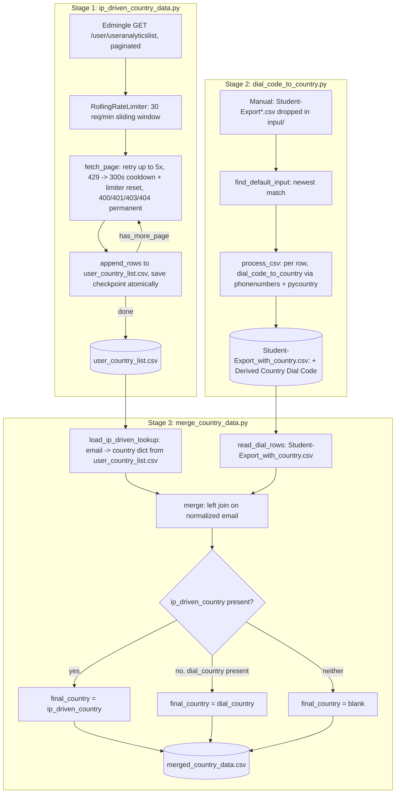

# Country-Wise Data Pipeline

## 1. Overview & Purpose

A 3-stage pipeline at `country_wise_data/` that determines each student's country from two signals and merges them:

- **Stage 1 — `ip_driven_country_data.py`**: pulls per-user analytics (including Edmingle's IP-geolocated country) from `/user/useranalyticslist`.
- **Stage 2 — `dial_code_to_country.py`**: reads a manually exported `Student-Export*.csv` (dropped into `input/`) and derives a country from each phone dial code.
- **Stage 3 — `merge_country_data.py`**: joins Stage 1 + Stage 2 on email into one row per student with three country columns.

**Purpose:** a per-student country signal for reporting, cross-checking a cheap dial-code guess against Edmingle's IP-geolocation, producing one `final_country`. This domain was not part of the original 5 documented pipelines — flag to the project owner if it is meant to be permanent.

## 2. High-Level Data Flow



**Lineage:** Edmingle API (Stage 1) + manual admin-panel export (Stage 2) → joined on email
(Stage 3) → `merged_country_data.csv`. No downstream system in this repo consumes it.

## 3. Repository Structure

| Path | Purpose |
|---|---|
| `scripts/ip_driven_country_data.py` | Stage 1 — paginated Edmingle geo-IP pull, checkpointed/resumable. |
| `scripts/ip_driven_country_data_config.json` | Stage 1 config (dates, pagination, rate limit; the base URL comes from `credentials.yaml`). |
| `scripts/dial_code_to_country.py` | Stage 2 — dial-code-to-country from a manual export. |
| `scripts/merge_country_data.py` | Stage 3 — joins Stage 1 + Stage 2 on email. |
| `input/Student-Export.csv` | Manual Edmingle admin-panel roster export (gitignored, real PII). |
| `output/user_country_list.csv` | Stage 1 output. |
| `output/user_country_list_checkpoint.json` | Stage 1 resume checkpoint. |
| `output/Student-Export_with_country.csv` | Stage 2 output. |
| `output/merged_country_data.csv` | Stage 3 output (final). |
| `../../credentials.yaml`, `../../common.py` | Shared Edmingle credentials + `RollingRateLimiter`, used by Stage 1 only. |

## 4. Source System

| Source | Endpoint | Method | Auth | Parameters | Pagination | Rate Limit |
|---|---|---|---|---|---|---|
| Edmingle user analytics (Stage 1) | `.../user/useranalyticslist` | GET | `apikey`/`ORGID` headers | `page`, `per_page` (500), `filter_key` (`geoLocationInfo.country`), `start_date`/`end_date` | Loop while `page_context.has_more_page` | 30 req/min sliding window; `429` → 300s cooldown + limiter reset |
| Manual roster export (Stage 2) | N/A — hand-dropped into `input/` | — | — | — | — | — |
| Internal join (Stage 3) | File-to-file merge, no external source | — | — | — | — | — |

**Upstream:** Edmingle's user-analytics API and its admin-panel export (human-in-the-loop for Stage 2).

## 5. Extraction Process

**Stage 1:** `load_config()` reads the JSON config and credentials → `run_collection()` ensures a CSV header, truncates to the last good checkpoint offset (undoing any partial write) → loops pages with rate limiting and retries (5×; 400/401/403/404 are permanent: page skipped, run exits 1) → appends each page's rows and saves the checkpoint atomically → stops when `has_more_page` is false or a page has no users. The date window is `start_date` → `end_date`; **`end_date` is optional and defaults to the end of today (IST)**, fixed when a fresh pull starts and saved in the checkpoint, so a resumed run reuses the same window (a different end date would shift the pages).

**Stage 2:** picks the newest `Student-Export*.csv` in `input/` (or `--input`), keeps an optional leading junk title line, derives the country per row from the dial-code column, writes `<input>_with_country.csv`.

**Stage 3:** loads Stage 1's output into an email→country lookup (first row wins; a missing file counts as zero rows), reads Stage 2's output, merges on normalized email (`final_country`: ip-driven, else dial-code, else blank), writes `merged_country_data.csv` with a match-count summary.

## 6. Function Reference

- **`fetch_page(...)`** — one page via `common.get_json`: 5 attempts, backoff on transient errors, 300 s cooldown + limiter reset on `429`, immediate `None` on 400/401/403/404.
- **`run_collection(cfg, script_dir)`** — the full paginated pull; on a fresh run the byte offset starts at the header's size so the header is never truncated.
- **`save_checkpoint(...)` / `truncate_to_offset(...)`** — atomic checkpoint (`.tmp` + `os.replace()`); cuts the CSV back to the last confirmed byte offset. File ops retry `PermissionError`/`OSError` up to 6 times.
- **`dial_code_to_country(raw)`** — normalizes (`-`, `N/A`, `null` → blank), strips `+`, falls back to a leading digit run, looks up the region with `phonenumbers` (first region for shared codes like `+1`/`+44`/`+7`), converts via `pycountry`; cached.
- **`process_csv(...)`** — requires the dial-code column (else exits listing columns), appends `Derived Country (Dial Code)`, prints a total/derived/blank summary.
- **`load_ip_driven_lookup(path)`** — empty dict + warning if the file is missing/headerless; exits if `email`/`country` columns are absent; lowercases emails; first row wins on duplicates (logged).
- **`merge(dial_path, ip_path, output_path)`** — builds the final schema, applies the precedence rule, writes the output, prints match counts.

## 7. Configuration & Parameters

| Source | Key(s) | Purpose |
|---|---|---|
| Stage 1 CLI | `--config` (default `ip_driven_country_data_config.json`) | Points at the JSON config. |
| Stage 1 config | `filter_key`, `sort_order`, `per_page`, `start_date`, `end_date` (optional, default today), `rate_limit_per_minute`, `output_csv`, `checkpoint_file` | All non-secret Stage-1 behaviour. |
| Stage 1 credentials | `../../credentials.yaml` → `apikey`/`orgid` | Exits if missing or still the placeholder string. |
| Stage 2 CLI | `--input`, `--output`, `--dial-code-column` (default `"Contact Number Dial Code"`), `--encoding` | File selection and column mapping. |
| Stage 3 CLI | `--dial-input`, `--ip-input`, `--output` | Input/output file paths. |
| Hardcoded | Stage 1: `PERMANENT_ERROR_CODES`, `TRANSIENT_ERROR_COOLDOWN_SECONDS=300`, `MAX_RETRIES_PER_PAGE=5`; Stage 2: new-column name; Stage 3: join column names | Fixed constants. |

No `notifications.yaml` anywhere in this pipeline — no email/alerting in any of the three scripts.

## 8. Data Transformation, Output & Schema

**Transformations:** epoch→IST string conversion (Stage 1, both kept) · dial-code normalization
and primary-country selection for shared codes (Stage 2) · leading junk-line preservation (Stage
2 & 3) · email normalization for the join key · `final_country` precedence (ip-driven wins) ·
column rename (`Derived Country (Dial Code)` → `dial_country`).

**Outputs** (all in `output/`):

| Name | Write Strategy |
|---|---|
| `user_country_list.csv` | Append-only per page, `flush()`+`fsync()`. |
| `user_country_list_checkpoint.json` | Atomic write after every page. |
| `Student-Export_with_country.csv` | Full read-then-write. |
| `merged_country_data.csv` | Full read-then-write. |

**Confirmed state (2026-09-25):** `input/Student-Export.csv` was replaced today (127,931 data rows). Stage 2/3 outputs on disk were built on 2026-09-24 from the previous export (131,212 rows) and are now stale. Stage 1 has **completed for the old window**: `user_country_list.csv` has 61,722 rows (checkpoint at page 124), which is exactly the API's `total_rows` for `01-01-2020` → `19-08-2026`. The same query up to today returns 65,391 users, so **3,669 newer users are missing** until Stage 1 is pulled again. The current merged file has an ip-driven country for 61,676 of its 130,188 rows; the rest fall back to `dial_country`.

**Database integration:** not applicable — CSV/JSON output only.

**Schema — `user_country_list.csv`** (Stage 1; header confirmed, zero rows to sample): `user_id`,
`name`, `email`, `contact_number`, `country` (Edmingle geo-IP), `region`, `time_spent_seconds`,
`total_sessions`, `last_seen_epoch`/`last_seen_ist`, `created_at_epoch`/`created_at_ist`,
`source_page`.

**Schema — `Student-Export_with_country.csv`** (Stage 2): all 54 original roster columns, plus
`Derived Country (Dial Code)` (derived).

**Schema — `merged_country_data.csv`** (Stage 3): all original roster columns, plus
`dial_country` (renamed from Stage 2's derived column), `ip_driven_country` (looked up, currently
blank for all rows), `final_country` (ip-driven → dial → blank precedence).

## 9. Data Quality & Known Limitations

**Implemented checks:** required config keys present, non-placeholder API key, crash-safe resume
with no duplicate/orphan rows, retry-with-rollback per page, required input columns present
(explicit error naming them), duplicate-email detection (warned, first kept), missing Stage-1
file tolerated as zero rows.

**Confirmed limitations:**
- **Stage 1 is out of date, not unfinished:** its saved window ends 19 Aug 2026, so 3,669 newer users are missing. The old checkpoint has no saved end date, so the next run stops and asks for the two Stage 1 files to be deleted (a fresh pull to today takes a few minutes). A finished pull is never refreshed automatically — delete the checkpoint and CSV to re-pull.
- `input/` holds real, unmasked student PII (names, emails, phones, addresses, parent contacts) — gitignored, must stay that way.
- Country name formats aren't normalized between sources — `pycountry`'s official names (dial-code) vs. Edmingle's raw value (ip-driven) could disagree in formatting for the same country.
- Contact-number join was explicitly rejected in favor of email (~29% of rows have a blank/dash contact number vs. ~0.02% blank email) — but any student with a blank/mismatched email can never match a Stage-1 record.
- No cross-check that country values are real recognized names.
- Stage 1's page loop has no max-page safety cap — relies entirely on Edmingle's own `has_more_page` flag.

**Requires confirmation:** when Stage 1 should be finished and on what cadence; whether this pipeline belongs in the documented scope.

## 10. Error Handling & Logging

Stage 1 prints `[timestamp] message` to stdout (no log file); a permanently failed page exits with code 1 and leaves the checkpoint untouched, so a re-run resumes at that page. File I/O retries transient `PermissionError`/`OSError` up to 6 times. Stages 2 and 3 print summary lines and `sys.exit(<message>)` on a missing file/column (one-shot, no retries). No email/alerting anywhere in this pipeline.

## 11. Dependencies

| Dependency | Purpose | Stage |
|---|---|---|
| `requests` | HTTP calls | 1 |
| `common` (repo root) | Credentials, `RollingRateLimiter` | 1 |
| `phonenumbers` | Dial-code → region lookup | 2 |
| `pycountry` | Region → country name | 2 |
| stdlib only (`argparse`, `csv`, `os`, `sys`, `pathlib`) | — | 3 |

## 12. Setup & How to Run

Step-by-step guide: [RUN_GUIDE.md](RUN_GUIDE.md). Before running: `../../credentials.yaml` filled in (Stage 1 only), a fresh `Student-Export*.csv` in `input/` (Stage 2), `start_date` in the Stage 1 config checked (`end_date` is automatic). Run the stages **in order**.

**Run it in tmux** (session name = folder name; Stage 1 is long):

```
step 1: tmux new -s country_wise_data          start the session (name = folder name)
step 2: activate the venv, open the directory, run the script
        source /home/projectdev/ela_datasets/.venv/bin/activate
        cd /home/projectdev/ela_datasets/country_wise_data/scripts
        python3 ip_driven_country_data.py --config ip_driven_country_data_config.json
        python3 dial_code_to_country.py
        python3 merge_country_data.py
Ctrl+B then D                detach (the script keeps running)
tmux ls                      list active sessions
tmux attach -t country_wise_data      return to the session
```

## 13. Automation / Scheduling

None — all three scripts are run manually. Stage 2 additionally needs a human to drop a fresh
export into `input/` before each run.

## 14. Important Business / Technical Rules

- Join key is email only (normalized) — chosen over phone number due to its much lower blank rate (~0.02% vs. ~29%).
- `ip_driven_country` always wins over `dial_country` when both are present — a live geo-IP signal is trusted over a dial-code guess.
- Dial-code-to-country is a "primary country" guess for shared codes (`+1`, `+44`, `+7`) — `phonenumbers`' first-listed region, no further disambiguation.
- Duplicate Stage-1 emails resolve by "first row wins," not recency/completeness.
- A missing or partial Stage-1 file doesn't block Stage 3 — missing users get `final_country` = `dial_country` silently.

## 15. Troubleshooting

| Symptom | Likely cause | Check |
|---|---|---|
| Stage 1 exits citing a missing/placeholder API key | `credentials.yaml` incomplete | Verify the repo-root file |
| Stage 1 exits mid-run, "STOPPED at page N" | A page permanently failed or exhausted retries | Check the error body; re-run — resumes at page N |
| Stage 2: "Column '...' not found" | Dial-code column name changed in a newer export | Pass `--dial-code-column` |
| Stage 2: "No --input given and no file matching..." | No `Student-Export*.csv` in `input/` | Drop a fresh export, or pass `--input` |
| Stage 3: "... run dial_code_to_country.py first" | Stage 2 hasn't run, or `--dial-input` is wrong | Run Stage 2, or fix the path |
| Stage 3's `ip_driven_country` blank for many rows | The user isn't in Stage 1's list (or Stage 1 is out of date) | Delete `user_country_list.csv` + its checkpoint and re-run Stage 1 to pull up to today |
| Stage 3 warns about duplicate emails | Same email appears twice in Stage 1's output | Investigate that user id in Stage 1's source data |

## 16. Maintenance Guide

- **Stage 1 endpoint/response change** → `ip_driven_country_data_config.json` and the row-mapping in `run_collection()`.
- **Stage 2 column rename** → `--dial-code-column`, or the `argparse` default.
- **Stage 3 join key change** → rewrite `normalize_email()`/`load_ip_driven_lookup()`/`merge()` — not a simple config change.
- **Country-name reconciliation** (if wanted) → a new normalization step in `merge()` against a canonical country table.
- **Rate-limit tuning** → `rate_limit_per_minute` in the JSON config; retry/cooldown constants are hardcoded and need a code change.

## 17. Security Considerations

`input/` and both derived outputs hold real, unmasked student PII (names, emails, phones, parent
contacts, addresses) — gitignored, share only through a PII-appropriate channel. Stage 1's
credentials are never printed in logs. No email/alerting exists, so no SMTP secret exposure here.

## 18. Raw API Payload (Captured Structure)

**Captured live from the API on 2026-09-25** (one read-only call, tiny page size). Structure only: field names and types, no values, so no student/teacher PII is recorded here. `<int>`/`<str>`/`<null>` are the types observed in the sample; a field seen as `<null>` may hold a value for other records.

Only **Stage 1** calls a live API (`GET .../user/useranalyticslist`); Stages 2/3 are file-to-file merges with
no API payload. Pagination is via `page_context.has_more_page`.

```json
{
  "code": "\"200\" (string, not int)",
  "message": "<str>",
  "user_list": [
    {
      "_id": "<int>",
      "timeSpent": "<int>",
      "totalSessions": "<int>",
      "lastSeen": "<int>",
      "filterValue": "<str>",
      "regionName": "<str>",
      "name": "<str>",
      "email": "<str>",
      "contact_number": "<str>",
      "created_at": "<int>"
    }
  ],
  "page_context": {
    "page": "<int>",
    "per_page": "<int>",
    "has_more_page": "<bool>",
    "total_rows": "<int>"
  }
}
```

## 19. Future Improvements

1. **Email the output on completion** — send a completion email that includes the run status *and* attaches the generated dataset file(s), not just a status notification.
2. **Scheduled automation** — run automatically on a defined schedule instead of a manual trigger.
3. **Data cleaning layer** — a dedicated cleaning step/script (nulls, duplicates, standardization) inside the pipeline, instead of leaving it to downstream consumers.

---
*Initial documentation: 2026-09-24. Project/technical owner: requires confirmation.*
