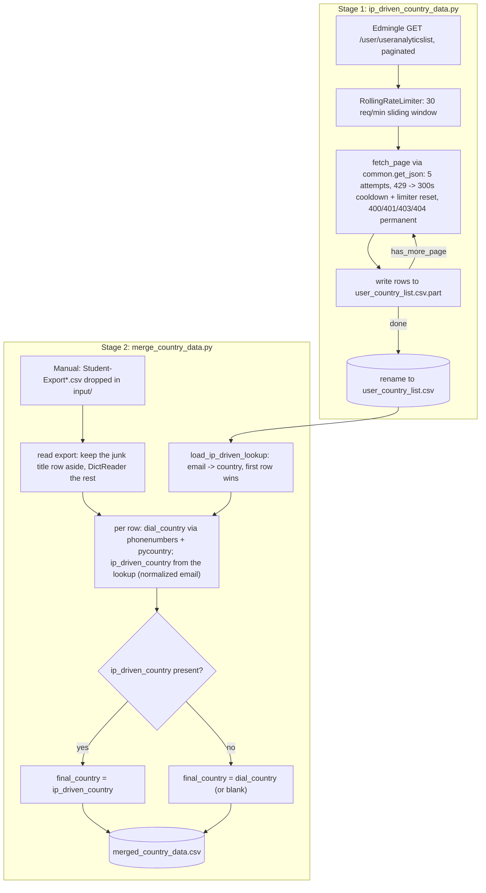

# Country-Wise Data Pipeline

## 1. Overview & Purpose

A 2-stage pipeline at `country_wise_data/` that determines each student's country from two signals and merges them:

- **Stage 1 — `ip_driven_country_data.py`**: pulls per-user analytics (including Edmingle's IP-geolocated country) from `/user/useranalyticslist` into `output/user_country_list.csv`.
- **Stage 2 — `merge_country_data.py`**: reads a manually exported `Student-Export*.csv` (dropped into `input/`), derives a country from each phone dial code, joins Stage 1 on email, and writes one row per student with three country columns to `output/merged_country_data.csv`.

(Until 2026-09-25 the dial-code step was its own script, `dial_code_to_country.py`, with an intermediate `Student-Export_with_country.csv`; it is now part of Stage 2.)

**Purpose:** a per-student country signal for reporting/segmentation, cross-checking a low-cost dial-code guess against Edmingle's own IP-geolocation value, producing one `final_country`. This domain was not part of the original 5 documented pipelines — flag to the project owner if it is meant to be permanent.

## 2. High-Level Data Flow



**Lineage:** Edmingle API (Stage 1) + manual admin-panel export (Stage 2 input) → joined on email in Stage 2 →
`merged_country_data.csv`. No downstream system in this repo consumes it.

## 3. Repository Structure

| Path | Purpose |
|---|---|
| `scripts/ip_driven_country_data.py` | Stage 1 — paginated Edmingle geo-IP pull; written whole or not at all. |
| `scripts/ip_driven_country_data_config.json` | Stage 1 config (`filter_key`, `start_date`, optional `end_date`, pagination, rate limit; the base URL comes from `credentials.yaml`). |
| `scripts/merge_country_data.py` | Stage 2 — dial-code country + join with Stage 1 on email. |
| `input/Student-Export.csv` | Manual Edmingle admin-panel roster export (gitignored, real PII). |
| `output/user_country_list.csv` | Stage 1 output. |
| `output/merged_country_data.csv` | Stage 2 output (final). |
| `../../credentials.yaml`, `../../common.py` | Shared Edmingle credentials + `get_json`, `RollingRateLimiter`; used by Stage 1 only. |

## 4. Source System

| Source | Endpoint | Method | Auth | Parameters | Pagination | Rate Limit |
|---|---|---|---|---|---|---|
| Edmingle user analytics (Stage 1) | `<base_url>/user/useranalyticslist` | GET | `apikey`/`ORGID` headers | `page`, `per_page` (500), `filter_key` (`geoLocationInfo.country`), `sort_order`, `start_date`/`end_date` | Loop while `page_context.has_more_page` | 30 req/min sliding window; `429` → 300 s cooldown + limiter reset |
| Manual roster export (Stage 2 input) | N/A — hand-dropped into `input/` | — | — | — | — | — |

**Upstream:** Edmingle's user-analytics API and its admin-panel export (human-in-the-loop for Stage 2).

## 5. Extraction Process

**Stage 1:** `load_config()` reads the JSON config and `credentials.yaml` → `run_collection()` fixes the date window (`start_date` → `end_date`, the config's or the end of today IST), then loops pages with rate limiting and retries (5×; 400/401/403/404 are permanent), writing rows to `user_country_list.csv.part`. Only when every page succeeded is the file renamed onto `user_country_list.csv`; if a page keeps failing the script exits 1, deletes the `.part` file and leaves the previous CSV untouched. The whole pull is ~130 pages (about 5 minutes), so there is no resume — just run it again.

**Stage 2:** picks the newest `Student-Export*.csv` in `input/` (or `--input`); keeps the junk title row aside (a first row with a single non-blank cell — `Student's Export`, possibly padded with commas); loads Stage 1's output into an email→country lookup (first row wins; a missing file counts as zero rows); then for each student derives `dial_country` from the dial-code column, looks up `ip_driven_country` by normalized email, and sets `final_country` (ip-driven, else dial, else blank). The result is written to `merged_country_data.csv.part` and renamed, with a match-count summary.

## 6. Function Reference

- **`fetch_page(session, cfg, end_date, page, rate_limiter)`** (Stage 1) — one page via `common.get_json`: 5 attempts, backoff on transient errors, 300 s cooldown + limiter reset on `429`; `None` if it keeps failing.
- **`run_collection(cfg)`** (Stage 1) — the paginated pull into a `.part` file, renamed on success.
- **`dial_code_to_country(raw)`** (Stage 2, cached) — normalizes (`-`, `N/A`, `null` → blank), strips `+`, falls back to a leading digit run for malformed codes, looks up the region with `phonenumbers` (first region for shared codes like `+1`/`+44`/`+7`), converts via `pycountry`.
- **`load_ip_driven_lookup(path)`** — empty dict + warning if the file is missing/headerless; exits if `email`/`country` columns are absent; lowercases emails; first row wins on duplicates (logged).
- **`merge(input_path, ip_path, output_path, dial_code_column, encoding)`** — the whole of Stage 2: read the export, derive and join, write the result, print counts.

## 7. Configuration & Parameters

| Source | Key(s) | Purpose |
|---|---|---|
| Stage 1 CLI | `--config` (default `ip_driven_country_data_config.json`) | Points at the JSON config. |
| Stage 1 config | `filter_key`, `start_date` (required); `end_date` (optional, default end of today IST), `sort_order`, `per_page`, `rate_limit_per_minute`, `output_csv` | All non-secret Stage-1 behaviour. |
| Stage 1 credentials | `../../credentials.yaml` → `api_key`, `organization_id`, `base_url` | Exits if missing. |
| Stage 2 CLI | `--input` (default newest `Student-Export*.csv`), `--ip-input`, `--output`, `--dial-code-column` (default `"Contact Number Dial Code"`), `--encoding` | File selection and column mapping. |
| Hardcoded | Stage 1: `TRANSIENT_ERROR_COOLDOWN_SECONDS=300`, `MAX_RETRIES_PER_PAGE=5`, `REQUEST_TIMEOUT_SECONDS=90`; Stage 2: the `Email` column name and the three output column names | Fixed constants. |

No `notifications.yaml` anywhere in this pipeline — no email/alerting in either script.

## 8. Data Transformation, Output & Schema

**Transformations:** epoch→IST string conversion (Stage 1, both kept) · dial-code normalization and primary-country selection for shared codes · junk title-row preservation · email normalization for the join key · `final_country` precedence (ip-driven wins).

**Outputs** (all in `output/`; both are written to a `.part` file and renamed, so a failed run never leaves a half-written file):

| Name | Notes |
|---|---|
| `user_country_list.csv` | Stage 1. Order of rows is not stable between pulls (the API's ordering of tied rows varies from call to call); the set of users is. |
| `merged_country_data.csv` | Stage 2 (final). |

**Confirmed state (2026-09-25):** `input/Student-Export.csv` was replaced today (127,930 data rows; its first row is `Student's Export` padded with commas, which Stage 2 now recognises). `user_country_list.csv` has 61,722 rows for the window `01-01-2020` → `19-08-2026`, exactly the API's `total_rows` for it; the same query up to today returns 65,391 users, so **3,669 newer users are missing** until Stage 1 is run again. `merged_country_data.csv`, `Student-Export_with_country.csv` and `user_country_list_checkpoint.json` on disk were produced by the old three-step pipeline; the last two are no longer used and can be deleted. Run on the real files (title row stripped so the old code could read them), the old two-step chain and the new Stage 2 give a byte-identical merged file (128,937 lines).

**Database integration:** not applicable — CSV/JSON output only.

**Schema — `user_country_list.csv`** (Stage 1): `user_id`, `name`, `email`, `contact_number`, `country` (Edmingle geo-IP), `region`, `time_spent_seconds`, `total_sessions`, `last_seen_epoch`/`last_seen_ist`, `created_at_epoch`/`created_at_ist`, `source_page`.

**Schema — `merged_country_data.csv`** (Stage 2): all original roster columns (plus the title row above the header, unchanged), then `dial_country`, `ip_driven_country` (blank where the email has no Stage-1 match), `final_country` (ip-driven → dial → blank).

## 9. Data Quality & Known Limitations

**Implemented checks:** required config keys present, API key present, a page that keeps failing stops the run without replacing the previous file, required input columns present (explicit error naming them), duplicate-email detection (warned, first kept), missing Stage-1 file tolerated as zero rows.

**Confirmed limitations:**
- **Stage 1 is out of date, not unfinished:** its file covers users up to 19 Aug 2026, so 3,669 newer users are missing. Run Stage 1 again (about 5 minutes); every run re-pulls and replaces the file.
- Stage 1 row order is not stable between pulls, and pages are fetched one call at a time, so a tie could in principle be repeated or skipped across a page boundary; no duplicates or gaps were seen in the live pulls checked (Stage 2 keeps the first row per email anyway).
- `input/` holds real, unmasked student PII (names, emails, phones, addresses, parent contacts) — gitignored, must stay that way.
- Country name formats aren't normalized between sources — `pycountry`'s official names (dial-code) vs. Edmingle's raw value (ip-driven) could disagree in formatting for the same country.
- Contact-number join was explicitly rejected in favor of email (~29% of rows have a blank/dash contact number vs. ~0.02% blank email) — but any student with a blank/mismatched email can never match a Stage-1 record.
- No cross-check that country values are real recognized names.
- Stage 1's page loop has no max-page safety cap — relies entirely on Edmingle's own `has_more_page` flag.

**Requires confirmation:** on what cadence Stage 1 should run; whether this pipeline belongs in the documented scope.

## 10. Error Handling & Logging

Stage 1 prints `[timestamp] message` to stdout (no log file); a page that keeps failing exits with code 1, deletes the `.part` file and leaves the previous CSV untouched. Stage 2 prints summary lines and `sys.exit(<message>)` on a missing file/column (one-shot, no retries). No email/alerting anywhere in this pipeline.

## 11. Dependencies

| Dependency | Purpose | Stage |
|---|---|---|
| `requests` | HTTP calls | 1 |
| `common` (repo root) | Credentials, `RollingRateLimiter` | 1 |
| `phonenumbers` | Dial-code → region lookup | 2 |
| `pycountry` | Region → country name | 2 |
| stdlib only (`argparse`, `csv`, `os`, `sys`, `pathlib`) | — | 1, 2 |

## 12. Setup & How to Run

Step-by-step guide: [RUN_GUIDE.md](RUN_GUIDE.md). Before running: `../../credentials.yaml` filled in (Stage 1 only), a fresh `Student-Export*.csv` in `input/` (Stage 2), `start_date` in the Stage 1 config checked (`end_date` is automatic). Run the stages **in order**.

**Run it in tmux** (session name = folder name; Stage 1 takes ~5 minutes, or longer after a 429):

```
step 1: tmux new -s country_wise_data          start the session (name = folder name)
step 2: activate the venv, open the directory, run the script
        source /home/projectdev/ela_datasets/.venv/bin/activate
        cd /home/projectdev/ela_datasets/country_wise_data/scripts
        python3 ip_driven_country_data.py --config ip_driven_country_data_config.json
        python3 merge_country_data.py
Ctrl+B then D                detach (the script keeps running)
tmux ls                      list active sessions
tmux attach -t country_wise_data      return to the session
```

## 13. Automation / Scheduling

None — both scripts are run manually. Stage 2 additionally needs a human to drop a fresh export into `input/` before each run.

## 14. Important Business / Technical Rules

- Join key is email only (normalized) — chosen over phone number due to its much lower blank rate (~0.02% vs. ~29%).
- `ip_driven_country` always wins over `dial_country` when both are present — a live geo-IP signal is trusted over a dial-code guess.
- Dial-code-to-country is a "primary country" guess for shared codes (`+1`, `+44`, `+7`) — `phonenumbers`' first-listed region, no further disambiguation.
- Duplicate Stage-1 emails resolve by "first row wins," not recency/completeness (the first row in the file's order, which is not stable between pulls).
- A missing or partial Stage-1 file doesn't block Stage 2 — missing users get `final_country` = `dial_country` silently.

## 15. Troubleshooting

| Symptom | Likely cause | Check |
|---|---|---|
| Stage 1 exits: "No Edmingle api_key" / `credentials.yaml is missing …` | `credentials.yaml` incomplete | Verify the repo-root file |
| Stage 1 exits, "STOPPED at page N" | A page permanently failed or exhausted retries | Check the error above it; run it again (nothing was replaced) |
| Stage 2: "Column '...' not found" | Dial-code column name changed in a newer export, or the title/header rows are not what it expects | Pass `--dial-code-column`; check the first two lines of the export |
| Stage 2: "No --input given and no file matching..." | No `Student-Export*.csv` in `input/` | Drop a fresh export, or pass `--input` |
| `ip_driven_country` blank for many rows | The user isn't in Stage 1's list (or Stage 1 is out of date) | Run Stage 1 again |
| Stage 2 warns about duplicate emails | Same email appears twice in Stage 1's output | Investigate that user id in Stage 1's source data |

## 16. Maintenance Guide

- **Stage 1 endpoint/response change** → `ip_driven_country_data_config.json` and the row-mapping in `run_collection()`.
- **Stage 2 column rename** → `--dial-code-column`, or the `argparse` default.
- **Stage 2 join key change** → rewrite `normalize_email()`/`load_ip_driven_lookup()`/`merge()` — not a simple config change.
- **Country-name reconciliation** (if wanted) → a new normalization step in `merge()` against a canonical country table.
- **Rate-limit tuning** → `rate_limit_per_minute` in the JSON config; retry/cooldown constants are hardcoded and need a code change.

## 17. Security Considerations

`input/` and the merged output hold real, unmasked student PII (names, emails, phones, parent
contacts, addresses) — gitignored, share only through a PII-appropriate channel. Stage 1's
credentials are never printed in logs. No email/alerting exists, so no SMTP secret exposure here.

## 18. Raw API Payload (Captured Structure)

**Captured live from the API on 2026-09-25** (one read-only call, tiny page size). Structure only: field names and types, no values, so no student/teacher PII is recorded here. `<int>`/`<str>`/`<null>` are the types observed in the sample; a field seen as `<null>` may hold a value for other records.

Only **Stage 1** calls a live API (`GET .../user/useranalyticslist`); Stage 2 is a file-to-file merge with
no API payload. Pagination is via `page_context.has_more_page`.

```json
{
  "code": "<int> (200)",
  "message": "<str>",
  "user_list": [
    {
      "_id": "<int>",
      "timeSpent": "<int>",
      "totalSessions": "<int>",
      "lastSeen": "<int>",
      "filterValue": "<str>",
      "regionName": "<str>",
      "name": "<str>",
      "email": "<str>",
      "contact_number": "<str>",
      "created_at": "<int>"
    }
  ],
  "page_context": {
    "page": "<int>",
    "per_page": "<int>",
    "has_more_page": "<bool>",
    "total_rows": "<int>"
  }
}
```

## 19. Future Improvements

1. **Email the output on completion** — send a completion email that includes the run status *and* attaches the generated dataset file(s), not just a status notification.
2. **Scheduled automation** — run automatically on a defined schedule instead of a manual trigger.
3. **Data cleaning layer** — a dedicated cleaning step/script (nulls, duplicates, standardization) inside the pipeline, instead of leaving it to downstream consumers.

---
*Initial documentation: 2026-09-24. Project/technical owner: requires confirmation.*
