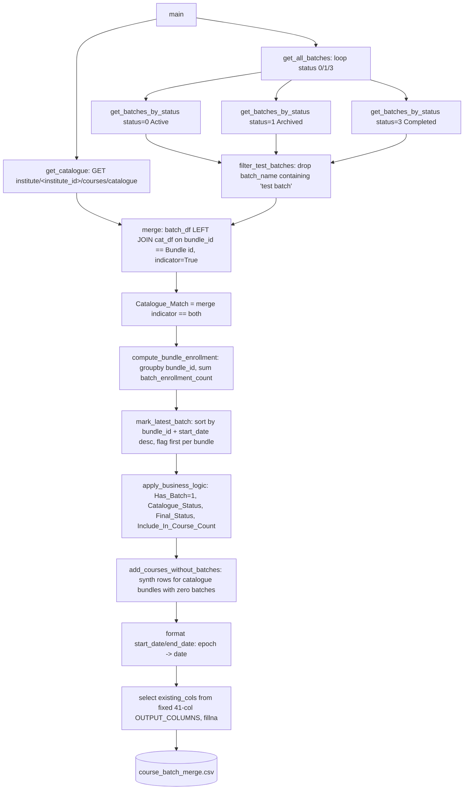

# Course Batch Merge Pipeline

## 1. Overview & Purpose

`Course_Batch_Merge.py` (`course_batch_merge/scripts/`) builds one master course/batch report by merging the Edmingle course catalogue with masterbatch data across **all three** batch statuses — Active, Archived, Completed. A single-file, single-run script (no CLI args, no config file): fetch, merge, apply business rules, write one CSV.

**Purpose:** a Power-BI-ready, 41-column report including every batch regardless of status (unlike the `session_wise_attendance` catalogue builder, which uses different inclusion rules by design — the two are not expected to reconcile row-for-row).

## 2. High-Level Data Flow



**Lineage:** catalogue API + masterbatch API (3 calls, one per status) → left join on
`bundle_id` → business-rule functions → `course_batch_merge.csv`. Believed to feed a downstream
Power BI report (see Section 8) — not automated or confirmed from this repo.

## 3. Repository Structure

| Path | Purpose |
|---|---|
| `scripts/Course_Batch_Merge.py` | Entire pipeline — fetch, merge, business rules, save, all in one file. |
| `output/course_batch_merge.csv` | The only file this pipeline produces. |
| `../../credentials.yaml` | Shared `API_KEY`/`ORGANIZATION_ID`/`INSTITUTE_ID`/`base_url` via `common.edmingle_settings()`. |
| `../../common.py` | Supplies `load_credentials()` only — no rate limiter or atomic-write helpers used here. |

## 4. Source System

| Source | Endpoint | Method | Auth | Parameters | Pagination | Rate Limit |
|---|---|---|---|---|---|---|
| Course catalogue | `<base_url>/institute/<institute_id>/courses/catalogue` (both from `credentials.yaml`) | GET | `apikey`/`ORGID` headers | None beyond headers | Single call returns the full catalogue | Not identified — no retry/backoff of any kind |
| Masterbatch | `.../short/masterbatch?status={0/1/3}&page=1&per_page=1000` | GET | Same headers | `status`, `page=1` (hardcoded, never incremented), `per_page=1000` | **`page=1` never advances** — a status with over 1,000 batches would silently lose the rest | Not identified |

## 5. Extraction Process

1. `get_catalogue()` — one GET; empty DataFrame on non-200 (no raise).
2. `get_all_batches()` — loops statuses `{0: Active, 1: Archived, 3: Completed}`, flattening `courses[].batch[]` into rows (`bundle_id`, `batch_id`, `batch_name`, dates, `tutor_id` via an unconfirmed fallback chain, `batch_enrollment_count`).
3. `filter_test_batches()` drops names containing `"test batch"`.
4. Batches are left-merged onto the catalogue on `bundle_id`; `Catalogue_Match` comes from the merge indicator.
5. `bundle_enrollment_count` sums `batch_enrollment_count` per bundle across all statuses; `mark_latest_batch()` flags the newest `start_date` per bundle.
6. `apply_business_logic()` sets `Has_Batch=1`, `Catalogue_Status`, and `Final_Status` (catalogue status for the latest batch only, `"Completed"` for the bundle's other batches).
7. `add_courses_without_batches()` appends one synthetic row per catalogue course with no real batches.
8. Dates convert epoch→date, the fixed 41-column schema is selected (missing columns logged), blanks filled, CSV written.

## 6. Function Reference

- **`get_catalogue()`** — single GET; empty DataFrame + printed error on any non-200.
- **`get_batches_by_status(code, label)`** — one GET (`page=1&per_page=1000`), flattens `courses[].batch[]`; `tutor_id` falls back `tutor_id`→`faculty_id`→`tutorId` (flagged in-code as unconfirmed).
- **`filter_test_batches(df)`** — drops lower-cased `batch_name` containing `"test batch"`; the only test-data filter.
- **`mark_latest_batch(df)`** — parses `start_date` (blank → 0), sorts by `(bundle_id, date desc)`, flags the first per bundle; exact ties break by fetch order (Active → Archived → Completed).
- **`apply_business_logic(df)`** — `Has_Batch=1`; `Final_Status` = catalogue status for the latest batch, else hardcoded `"Completed"`. `Include_In_Course_Count` is computed but not in `OUTPUT_COLUMNS`.
- **`add_courses_without_batches(merged, catalogue)`** — synthetic rows: `Has_Batch=0`, `Is_Latest_Batch=1`, `Include_In_Course_Count=0`, `Catalogue_Match=True` (hardcoded).
- **`main()`** — the whole run inside one broad `try/except` that **prints** the error and returns, so the process exits 0 even after a failure.

## 7. Configuration & Parameters

| Source | Key(s) | Purpose |
|---|---|---|
| `../../credentials.yaml` | `edmingle.api_key`, `edmingle.organization_id`, `edmingle.institute_id`, `edmingle.base_url` | Auth and URLs for both endpoints. |
| Hardcoded | `OUTPUT_COLUMNS` (41 columns), status map `{0,1,3}`, `page=1&per_page=1000` | All runtime behaviour — no config file, no CLI args. |

## 8. Data Transformation, Output & Schema

**Transformations:** test-batch filtering (substring match) · catalogue-match flag from merge
indicator · bundle enrollment rollup (sum across all 3 statuses) · latest-batch flagging (newest
`start_date`, stable-sort tie-break) · status derivation (catalogue status for latest batch,
fixed `"Completed"` otherwise) · synthetic zero-batch rows for batch-less courses · epoch→date
conversion · fixed 41-column schema enforcement.

**Output:** `course_batch_merge.csv` (UTF-8-with-BOM), one row per batch plus synthetic rows,
written via a direct (non-atomic) `to_csv()` — a crash mid-write could leave a partial file.

**Confirmed state (2026-09-24):** 3,193 data rows, 482,628 bytes, last modified 2026-09-16.

**Database integration:** not applicable — CSV output only.

**Schema** (41 columns, verified against the live file header):

| Column | Description | Source/Derived |
|---|---|---|
| `bundle_id`, `bundle_name`, `batch_id`, `batch_name` | Batch identity | Source |
| `batch_status` | Which status pull this row came from | Derived (fetch-time label) |
| `start_date` / `end_date` | Batch dates | Source (epoch→date) |
| `tutor_name`, `tutor_id` | Tutor identity — `tutor_id` mapping unconfirmed | Source |
| `batch_enrollment_count` | `admitted_students` for this batch | Source |
| `Course Name`, `Tutors`, `Tutord Ids`, `Course Ids`, `Subject`, `Level`, `Language`, `Examination`, `Type`, `Course Division`, `Certificate`, `Course Sponsor`, `Course Title Sanskrit`, `Status`, `Number of Lectures`, `Duration`, `Personas`, `Computer Based Assessment`, `Product ID`, `SSS Category`, `Viniyoga`, `Adhyayanam Category`, `Term of Course`, `Position in Funnel`, `Division` | Catalogue fields, passed through verbatim (`Tutord Ids` is Edmingle's own spelling, not a typo introduced here) | Source (catalogue) |
| `Catalogue_Match` | Whether this batch matched a catalogue row | Derived |
| `bundle_enrollment_count` | Sum of enrollment across all batches of the bundle | Derived |
| `Is_Latest_Batch` | 1 for the newest batch per bundle | Derived |
| `Has_Batch` | 0 only for synthetic no-batch rows | Derived |
| `Catalogue_Status` | Copy of the catalogue's `Status` | Derived |
| `Final_Status` | Catalogue status if latest batch, else `"Completed"` | Derived |

## 9. Data Quality & Known Limitations

**Implemented checks:** non-200 catalogue response → empty DataFrame + log (other failures fall
through to the broad `except`); test-batch substring filter; missing output columns logged, not
silently dropped; strict 41-column schema enforcement.

**Confirmed limitations:**
- **No pagination on the masterbatch call** — hardcoded `page=1&per_page=1000`; a status over 1,000 batches would silently lose the excess. Checked 2026-09-25: no truncation today (835 Active / 40 Archived / 12 Completed batches, all under the cap), but Active is at ~83% of it.
- No retry/backoff on either endpoint — one transient blip fails the whole run.
- Only `"test batch"` is filtered — no demo/dummy/sample/cbt_test/payment_test keyword filtering.
- `tutor_id`'s real source field is explicitly unconfirmed in the code's own comment.
- **A mid-run failure is swallowed** — `main()`'s broad `except` prints and returns, exiting 0. A cron/scheduler watching only the exit code would never see this as a failure.

**Requires confirmation:** whether any status currently has, or will have, more than 1,000 batches; the correct Edmingle field name for tutor id.

## 10. Error Handling & Logging

`log_progress()` prints `HH:MM:SS - message` to stdout (no log file). `get_catalogue()` checks the HTTP status; `get_batches_by_status()` does not (calls `.json()` unconditionally). `main()` is one broad `try/except Exception`: any failure is printed and the process exits 0 without writing a CSV. Example line: `11:49:39 - SUCCESS! Saved 3193 rows to file.`

## 11. Dependencies

| Dependency | Purpose |
|---|---|
| `requests` | HTTP calls |
| `pandas` | DataFrame construction, merge, groupby, dates |
| `common` (repo root) | `load_credentials()` |
| stdlib (`os`, `sys`, `datetime`, `pathlib`) | Paths, timestamps |

## 12. Setup & How to Run

Step-by-step guide: [RUN_GUIDE.md](RUN_GUIDE.md). Before running: `../../credentials.yaml` filled in (`api_key`, `organization_id`, `institute_id`, `base_url` are all required). No config file, `input/` folder or notification setup needed. **The filename is capitalised** — `Course_Batch_Merge.py`; Linux is case-sensitive. No CLI arguments.

```bash
source /home/projectdev/ela_datasets/.venv/bin/activate
cd /home/projectdev/ela_datasets/course_batch_merge/scripts
python3 Course_Batch_Merge.py
```

**Run it in tmux** (session name = folder name; optional, it finishes in seconds):

```
step 1: tmux new -s course_batch_merge          start the session (name = folder name)
step 2: activate the venv, open the directory, run the script
        source /home/projectdev/ela_datasets/.venv/bin/activate
        cd /home/projectdev/ela_datasets/course_batch_merge/scripts
        python3 Course_Batch_Merge.py
Ctrl+B then D                detach (the script keeps running)
tmux ls                      list active sessions
tmux attach -t course_batch_merge      return to the session
```

## 13. Automation / Scheduling

None — triggered manually, no cron/systemd/Task Scheduler entry, and no restart wrapper.

## 14. Important Business / Technical Rules

- Archived batches are deliberately included, unlike `session_wise_attendance`'s catalogue builder — the two are not expected to reconcile row-for-row, by design.
- `Final_Status` is asymmetric by design: the latest batch of a bundle gets the course's catalogue status; every other batch of that bundle is hardcoded `"Completed"` regardless of its real status.
- `bundle_enrollment_count` sums across all three statuses, not just active enrollment.
- Latest-batch tie-breaking on an exact `start_date` match depends on fetch order, not a deterministic rule.

## 15. Troubleshooting

| Symptom | Likely cause | Check |
|---|---|---|
| "Error fetching catalogue!", no CSV produced | Catalogue endpoint returned non-200 | Printed status code / credentials |
| "ERROR occurred during execution!", exits 0, no CSV | Unhandled exception in `main()` (e.g. bad masterbatch JSON) | The printed `Error message:` line — the broad `except` swallows the traceback |
| Output row count looks capped near 1,000 for one status | Hardcoded single-page fetch | Confirm actual batch counts against Edmingle directly |
| A known batch is missing from output | `"test batch"` in its name, or status not 0/1/3 | Check `filter_test_batches()` and the status map |
| `tutor_id` blank for many rows | Fallback field chain doesn't match the real response field | Inspect a raw masterbatch response |

## 16. Maintenance Guide

- **Endpoint/params change** → `CATALOGUE_URL`/`BATCHES_URL`/`HEADERS`.
- **Add pagination** → `get_batches_by_status()` needs a loop incrementing `page` (confirm Edmingle's "more pages" signal first).
- **Output schema change** → `OUTPUT_COLUMNS` — missing columns are already handled gracefully.
- **New test-data filter** → extend `filter_test_batches()` or add a new filter function.
- **Fix the silent-failure exit code** → have `main()`'s `except` call `sys.exit(1)` after printing.

## 17. Security Considerations

`credentials.yaml` holds the shared API key and is gitignored. No PII beyond tutor names — no
individual student records. `log_progress()` never prints credential values.

## 18. Raw API Payload (Captured Structure)

**Captured live from the API on 2026-09-25** (one read-only call, tiny page size). Structure only: field names and types, no values, so no student/teacher PII is recorded here. `<int>`/`<str>`/`<null>` are the types observed in the sample; a field seen as `<null>` may hold a value for other records.

**Catalogue** (`GET .../institute/<institute_id>/courses/catalogue`) — identical shape to the one documented in
`COURSE_CATALOGUE_DATA.md` (list under `response`, Title-Case field names such as `Bundle id`, `Course Name`,
`Status`, `Tutord Ids`). Not repeated in full here.

**Batches** (`GET .../short/masterbatch?status={0|1|3}&page=1&per_page=1000`) — nested: each course holds its
batches. This pipeline's `batch_id` is the batch object's `class_id`; `batch_enrollment_count` is
`admitted_students`.

```json
{
  "code": "\"200\" (string, not int)",
  "message": "<str>",
  "courses": [
    {
      "bundle_id": "<int>",
      "bundle_name": "<str>",
      "is_woolf_accredited": "<int>",
      "batch": [
        {
          "class_id": "<int>",
          "class_name": "<str>",
          "start_date": "<int>",
          "end_date": "<int>",
          "individual_batch_attendance": "<int>",
          "tutor_id": "<int>",
          "tutor_name": "<str>",
          "online_only": "<int>",
          "classes": [
            [
              "<str>"
            ]
          ],
          "mb_archived": "<int>",
          "attendance_progress_arr": [
            "<int>"
          ],
          "progress": [
            "<str>"
          ],
          "organization_id": "<int>",
          "registered_students": "<int>",
          "admitted_students": "<int>",
          "total_classes": "<int>",
          "completed_classes": "<int>",
          "cancelled_classes": "<int>",
          "attendance_progress": "<int>"
        }
      ],
      "online_only": "<int>"
    }
  ],
  "page_context": {
    "page": "<int>",
    "per_page": "<int>",
    "has_more_page": "<bool>",
    "total_rows": "<int>"
  }
}
```

**Pagination check (2026-09-25):** `page_context.total_rows` was 835 (Active), 40 (Archived), 12 (Completed), all under `per_page=1000` with `has_more_page=false`; nothing is truncated today, but Active is at ~83% of the cap.

## 19. Future Improvements

1. **Email the output on completion** — send a completion email that includes the run status *and* attaches the generated dataset file(s), not just a status notification.
2. **Scheduled automation** — run automatically on a defined schedule instead of a manual trigger.
3. **Data cleaning layer** — a dedicated cleaning step/script (nulls, duplicates, standardization) inside the pipeline, instead of leaving it to downstream consumers.

---
*Initial documentation: 2026-09-24. Downstream: per prior documentation, this schema matches a
"verified `vyoma_master.csv` reference," implying a Power BI consumer — not confirmed from this
repo. Project/technical owner: requires confirmation.*
