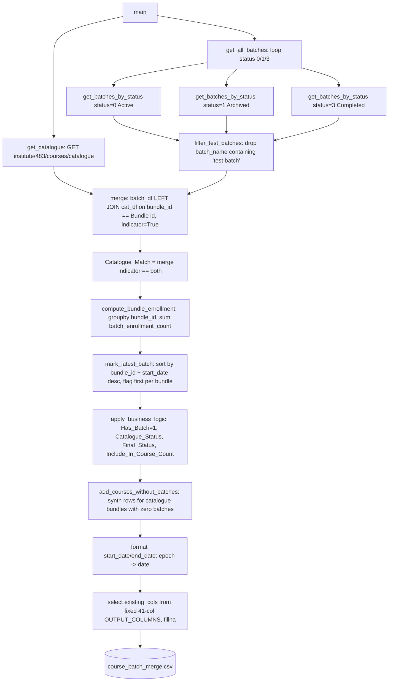

# Course Batch Merge Pipeline

## 1. Overview

`Course_Batch_Merge.py` (at `/home/projectdev/ela_datasets/course_batch_merge/scripts/`, 357
lines) builds one master course/batch report by merging the Edmingle course catalogue with
masterbatch data pulled across **all three** batch statuses — Active, Archived, and Completed.
It is a single-file, single-run script (no CLI arguments, no config file) that fetches, merges,
applies a handful of business rules, and writes one CSV.

## 2. Purpose

To produce a Power-BI-ready, 41-column course/batch report that includes every batch regardless
of its status (unlike the similar catalogue-builder used by the separate
`session_wise_attendance` pipeline, which intentionally uses different inclusion rules and is
not expected to reconcile row-for-row with this one).

## 3. High-Level Data Flow



## 4. Project / Repository Structure

| Path | Purpose |
|---|---|
| `course_batch_merge/scripts/Course_Batch_Merge.py` | Entire pipeline: fetch, merge, business rules, save — all in one file. |
| `course_batch_merge/scripts/__pycache__/` | Compiled bytecode — **not** redirected to the shared `.pycache/` in practice for this cache artifact (a leftover `.pyc` exists here directly, alongside the `sys.pycache_prefix` redirection code in the script). |
| `course_batch_merge/README.md` | Existing detailed README, used as a cross-check source for this document. |
| `course_batch_merge/output/course_batch_merge.csv` | Generated output — the only file this pipeline produces. |
| `../../credentials.yaml` (repo root) | Shared Edmingle `API_KEY`/`ORGANIZATION_ID`/`INSTITUTE_ID`, read via `common.load_credentials()`. |
| `../../common.py` (repo root) | Supplies `load_credentials()`; no rate limiter or atomic-write helpers are used by this script. |

## 5. Source System

| Source | Type | Endpoint | HTTP Method | Authentication | Parameters | Pagination | Rate Limit |
|---|---|---|---|---|---|---|---|
| Edmingle course catalogue | REST/JSON | `https://vyoma-api.edmingle.com/nuSource/api/v1/institute/483/courses/catalogue` (`CATALOGUE_URL`, institute id `483` hardcoded in the URL) | GET | Headers `apikey` (`API_KEY` from credentials), `ORGID` (`ORGANIZATION_ID` from credentials), `Accept: application/json` | None sent beyond headers | None — a single call returns the full catalogue | Not identified in the current implementation — no retry/backoff, no rate-limit handling of any kind |
| Edmingle masterbatch | REST/JSON | `https://vyoma-api.edmingle.com/nuSource/api/v1/short/masterbatch?status={status}&page=1&per_page=1000&organization_id={ORGANIZATION_ID}` (`BATCHES_URL`) | GET | Same `HEADERS` as above | `status` (0/1/3), `page=1` (hardcoded, never incremented), `per_page=1000`, `organization_id` | **`page=1` is hardcoded — the code never loops to a page 2.** If any status has more than 1,000 batches, the excess would be silently missed. Not called out in the pipeline's existing README. | Not identified in the current implementation |

## 6. Extraction Process

1. `main()` calls `get_catalogue()` — a single GET to the catalogue endpoint; on non-200 it prints the error and returns an empty DataFrame (does not raise).
2. `main()` calls `get_all_batches()`, which loops over `status_codes = {0: "Active", 1: "Archived", 3: "Completed"}` and calls `get_batches_by_status(code, label)` once per status, concatenating all rows into one DataFrame.
3. `get_batches_by_status()` builds the URL with `status`, `page=1`, `per_page=1000`, `organization_id`, and iterates each `course` in the response's `"courses"` list, then each `batch` (from `course.get("batch", [{}])`) inside it, building one flat row per batch with `bundle_id`, `bundle_name`, `batch_id` (`class_id`), `batch_name` (`class_name`), `batch_status` (the status label), `start_date`, `end_date`, `tutor_name`, `tutor_id` (fallback chain `tutor_id` → `faculty_id` → `tutorId`, flagged in-code as unconfirmed against a raw response), `batch_enrollment_count` (`admitted_students`).
4. `filter_test_batches()` drops any row whose lower-cased `batch_name` contains `"test batch"`.
5. `main()` left-merges the filtered batch DataFrame onto the catalogue on `bundle_id == "Bundle id"` with `indicator=True`, and sets `Catalogue_Match = (indicator == "both")`.
6. `main()` computes `bundle_enrollment_count` via a `groupby("bundle_id")["batch_enrollment_count"].sum()`, broadcast back onto every batch row of that bundle.
7. `mark_latest_batch()` sorts by `(bundle_id, _sort_date desc)` (start_date parsed as numeric epoch, blank/unparseable treated as `0`) and flags the first row per bundle as `Is_Latest_Batch = 1` — ties broken by original fetch order (Active before Archived before Completed) since the sort is stable.
8. `apply_business_logic()` sets `Has_Batch = 1` on every row, copies `Status` into `Catalogue_Status`, sets `Final_Status = "Completed"` by default, then overwrites it with the (trimmed) catalogue `Status` for rows where `Is_Latest_Batch == 1`; sets `Include_In_Course_Count = 1` for those latest-batch rows if that status is in `["Completed", "Ongoing", "Upcoming"]`.
9. `add_courses_without_batches()` finds every catalogue `Bundle id` with zero batch rows and appends one synthetic row per such course: `Has_Batch = 0`, `Is_Latest_Batch = 1`, `Include_In_Course_Count = 0`, `Final_Status` = the catalogue's own `Status`, `Catalogue_Match = True` (hardcoded), all batch-only fields left blank.
10. `start_date`/`end_date` are converted from Unix epoch seconds to plain dates.
11. The fixed 41-column `OUTPUT_COLUMNS` list is selected (any missing column is logged as a `WARNING` naming it, rather than silently dropped), blanks filled with `""` (`fillna("")`), and the result written to `course_batch_merge.csv`.

## 7. Detailed Function Documentation

### `get_catalogue() -> pd.DataFrame`
- **Purpose:** Fetch the full Edmingle course catalogue.
- **Inputs:** none (uses module-level `CATALOGUE_URL`, `HEADERS`).
- **Output:** DataFrame of the catalogue's `"response"` list, or an empty DataFrame on any non-200 status.
- **Processing:** Single `requests.get()`; prints status code and error on failure; `pd.DataFrame(data.get("response", []))` on success.
- **Dependencies:** `requests`, `pandas`.

### `get_batches_by_status(status_code, status_label) -> list[dict]`
- **Purpose:** Fetch all batches for one status code.
- **Inputs:** `status_code` (0/1/3), `status_label` ("Active"/"Archived"/"Completed").
- **Output:** list of flat batch-row dicts.
- **Processing:** Single GET with `page=1&per_page=1000`; loops `courses` then nested `batch` lists via manual `while` loops (not idiomatic pandas/list-comprehension — written in an explicit index-based style throughout this file); builds each row with a fallback chain for `tutor_id` (`tutor_id` → `faculty_id` → `tutorId`) explicitly flagged in a code comment as unconfirmed against Edmingle's real field name.
- **Dependencies:** `requests`.

### `filter_test_batches(df) -> pd.DataFrame`
- **Purpose:** Remove obviously-test batch rows.
- **Processing:** Iterates rows with a manual index-based `while` loop (not vectorized), dropping any row whose lower-cased `batch_name` contains the substring `"test batch"`; logs the remaining row count. This is the **only** test-data filter in this script — no keyword filter for demo/dummy/sample/cbt_test/payment_test courses or bundles.
- **Dependencies:** none beyond pandas.

### `mark_latest_batch(df) -> pd.DataFrame`
- **Purpose:** Flag the most recent batch per course bundle.
- **Processing:** Parses `start_date` as numeric (`pd.to_numeric(..., errors="coerce").fillna(0)`); sorts by `["bundle_id", "_sort_date"]` ascending/descending respectively; flags the first row encountered per bundle (after the sort) as `Is_Latest_Batch = 1`. Because pandas' sort is stable, an exact `start_date` tie between two batches of the same bundle is broken by original fetch order (Active status fetched first, then Archived, then Completed, and within a status whatever order Edmingle's API itself returned).
- **Dependencies:** none beyond pandas.

### `apply_business_logic(df) -> pd.DataFrame`
- **Purpose:** Derive `Has_Batch`, `Catalogue_Status`, `Final_Status`, and (internal-only) `Include_In_Course_Count`/`Status_Adjustment_Reason`.
- **Processing:** `Has_Batch = 1` for every row (this function only ever runs on real batch rows); `Catalogue_Status = Status` (copied from the merged catalogue column); `Final_Status` defaults to `"Completed"` for all rows, then is overwritten with the catalogue's own (trimmed) `Status` value **only** for rows flagged `Is_Latest_Batch == 1`. So the latest batch of a bundle reports the *course's* catalogue status, not its own batch-level Active/Archived/Completed label; every non-latest batch of a bundle simply keeps the `"Completed"` default regardless of its real status. `Include_In_Course_Count = 1` only when that catalogue status is one of `Completed`/`Ongoing`/`Upcoming` — computed but **not included** in `OUTPUT_COLUMNS`, so it never reaches the CSV. `Status_Adjustment_Reason` is initialized to `""` and never populated further — also excluded from `OUTPUT_COLUMNS`.
- **Dependencies:** none beyond pandas.

### `add_courses_without_batches(merged_df, catalogue_df) -> pd.DataFrame`
- **Purpose:** Ensure every catalogue course appears at least once in the output, even with zero batches.
- **Processing:** Finds catalogue `Bundle id` values absent from `merged_df["bundle_id"].unique()` via a manual index-based drop loop; for each such course, sets `bundle_id = Bundle id`, `Has_Batch = 0`, `Is_Latest_Batch = 1`, `Include_In_Course_Count = 0`, `Final_Status = Status` (the catalogue's own), `Catalogue_Match = True` (hardcoded, not derived from an actual merge indicator for these synthetic rows); concatenates onto `merged_df`.
- **Dependencies:** none beyond pandas.

### `main()`
- **Purpose:** Orchestrate the full pipeline end to end (see Extraction Process).
- **Processing:** Wraps the entire body in one broad `try/except Exception` that **prints** the error and returns — it does **not** re-raise or call `sys.exit(1)`, so the process exits with code 0 even after a failure partway through (see Known Limitations).
- **Dependencies:** all functions above, plus `common.load_credentials`.

## 8. Input Parameters & Configuration

| Source | Key(s) | Purpose |
|---|---|---|
| `../../credentials.yaml` (shared) | `edmingle.api_key` → `API_KEY`, `edmingle.organization_id` → `ORGANIZATION_ID`, `edmingle.institute_id` → `INSTITUTE_ID` (loaded but unused — see Section 20) | Auth for both endpoints. |
| Hardcoded in `Course_Batch_Merge.py` | `CATALOGUE_URL` (institute id `483` baked into the URL string), `BATCHES_URL`, `OUTPUT_COLUMNS` (fixed 41-column list), `OUTPUT_PATH` (`../output/course_batch_merge.csv`, anchored to `SCRIPT_DIR`), status-code map `{0: "Active", 1: "Archived", 3: "Completed"}`, `page=1&per_page=1000` in the batches URL | All runtime behaviour — there is no `config.yaml`/JSON config, and no CLI arguments at all. |

No environment variables, no CLI args, no notifications config exist for this pipeline.

## 9. Data Transformation

| Transformation | Description |
|---|---|
| Test-batch filtering | Drops rows where `batch_name` (lower-cased) contains `"test batch"`. |
| Catalogue match flag | `True` when a batch's `bundle_id` found a catalogue row via the left merge, `False` otherwise. |
| Bundle enrollment rollup | `bundle_enrollment_count` = sum of `batch_enrollment_count` across all remaining batch rows (all 3 statuses) sharing a `bundle_id`, broadcast onto every row of that bundle. |
| Latest-batch flagging | Newest `start_date` per bundle → `Is_Latest_Batch = 1`; stable-sort tie-break by original fetch order. |
| Status derivation | `Final_Status` = catalogue status for the latest batch of a bundle; `"Completed"` (fixed default) for every other batch. |
| Synthetic zero-batch rows | Catalogue courses with no batches at all get one synthetic row so every course appears in the output. |
| Date parsing | `start_date`/`end_date` epoch seconds → plain date via `pd.to_datetime(..., unit='s').dt.date`. |
| Schema enforcement | Output restricted to the fixed 41-column `OUTPUT_COLUMNS` list, with any missing column logged as a warning (not silently dropped) and remaining blanks filled with `""`. |

## 10. Output Dataset

| Name | Format | Location | Write Strategy |
|---|---|---|---|
| `course_batch_merge.csv` | CSV, UTF-8 with BOM (`encoding="utf-8-sig"`), one row per batch (plus synthetic no-batch course rows) | `course_batch_merge/output/` | Direct `to_csv()` at the end of `main()` — not an atomic write; a crash mid-write could leave a partial/corrupt file. |

**Confirmed current state (checked 2026-09-24):** the file is 482,628 bytes, 3,194 lines (3,193
data rows + header), last modified 2026-09-16 11:49 UTC.

## 11. Output Schema

Verified directly against the live output file's header row (41 columns, matching `OUTPUT_COLUMNS`
in the code exactly):

| Column | Data Type | Description | Source/Derived |
|---|---|---|---|
| `bundle_id` | integer | Course bundle identifier | Source (batch data) |
| `bundle_name` | string | Bundle display name | Source (batch data) |
| `batch_id` | integer | Batch identifier (`class_id`) | Source |
| `batch_name` | string | Batch display name (`class_name`) | Source |
| `batch_status` | string | `"Active"`/`"Archived"`/`"Completed"` — which status pull this batch came from | Derived (fetch-time label) |
| `start_date` | date | Batch start date | Source (epoch → date) |
| `end_date` | date | Batch end date | Source (epoch → date) |
| `tutor_name` | string | Tutor name | Source |
| `tutor_id` | string/int/blank | Tutor identifier — fallback chain, unconfirmed field name | Source (uncertain mapping — see Section 20) |
| `batch_enrollment_count` | integer | `admitted_students` for this specific batch | Source |
| `Course Name` | string | Catalogue course name | Source (catalogue) |
| `Tutors` | string | Catalogue tutors field | Source (catalogue) |
| `Tutord Ids` | string | Catalogue tutor ids field (note: "Tutord" — verbatim Edmingle/catalogue field name, not a typo introduced here) | Source (catalogue) |
| `Course Ids` | string | Catalogue course ids | Source (catalogue) |
| `Subject` | string | Catalogue subject | Source (catalogue) |
| `Level` | string | Catalogue level | Source (catalogue) |
| `Language` | string | Catalogue language | Source (catalogue) |
| `Examination` | string | Catalogue examination field | Source (catalogue) |
| `Type` | string | Catalogue course type | Source (catalogue) |
| `Course Division` | string | Catalogue division | Source (catalogue) |
| `Certificate` | string | Catalogue certificate field | Source (catalogue) |
| `Course Sponsor` | string | Catalogue sponsor | Source (catalogue) |
| `Course Title Sanskrit` | string | Catalogue Sanskrit title | Source (catalogue) |
| `Status` | string | Catalogue's own course status | Source (catalogue) |
| `Number of Lectures` | integer/string | Catalogue lecture count | Source (catalogue) |
| `Duration` | string | Catalogue duration | Source (catalogue) |
| `Personas` | string | Catalogue personas field | Source (catalogue) |
| `Computer Based Assessment` | string | Catalogue CBA field | Source (catalogue) |
| `Product ID` | string | Catalogue product id | Source (catalogue) |
| `SSS Category` | string | Catalogue SSS category | Source (catalogue) |
| `Viniyoga` | string | Catalogue field | Source (catalogue) |
| `Adhyayanam Category` | string | Catalogue field | Source (catalogue) |
| `Term of Course` | string | Catalogue field | Source (catalogue) |
| `Position in Funnel` | string | Catalogue field | Source (catalogue) |
| `Division` | string | Catalogue division field | Source (catalogue) |
| `Catalogue_Match` | boolean | Whether this batch's `bundle_id` matched a catalogue row | Derived |
| `bundle_enrollment_count` | integer | Sum of `batch_enrollment_count` across all batches of the bundle | Derived |
| `Is_Latest_Batch` | integer (0/1) | 1 for the newest-`start_date` batch per bundle | Derived |
| `Has_Batch` | integer (0/1) | 0 only for synthetic no-batch course rows | Derived |
| `Catalogue_Status` | string | Copy of the catalogue's `Status` for this row | Derived |
| `Final_Status` | string | Catalogue status if `Is_Latest_Batch==1`, else `"Completed"` | Derived |

## 12. Data Quality & Validation

| Check | Implemented? |
|---|---|
| Catalogue fetch failure handling | Partial — non-200 status returns an empty DataFrame (logged), but any other failure (bad JSON, missing keys) raises inside `get_catalogue`/`get_batches_by_status`/`main()`, caught only by the broad `try/except` around all of `main()`. |
| Test-batch keyword filter | Yes — `"test batch"` substring only. |
| Missing expected output columns | Logged as a `WARNING` naming them, not silently dropped. |
| Schema enforcement | Yes — output strictly limited to the fixed 41-column list. |

### Quality limitations not handled
- **No pagination on the masterbatch call** — `page=1&per_page=1000` is hardcoded with no loop; a status with more than 1,000 batches would silently lose the excess. Not currently observable to be a problem (3,193 total data rows across all three statuses combined, per the live file), but not proven safe either — Requires confirmation from the project owner whether any single status currently exceeds or is expected to exceed 1,000 batches.
- **No retry/backoff on either endpoint** — a single transient network blip fails the entire run.
- **No demo/dummy/sample/cbt_test/payment_test keyword filtering** beyond the one `"test batch"` substring check — any other test-data naming convention would pass straight through into the output.
- **`tutor_id`'s exact source field is explicitly unconfirmed** in the code itself (a fallback chain with an inline comment noting the real Edmingle key is unverified).
- **A failure partway through `main()` is swallowed** (see Section 13) — a scheduler/cron wrapper watching only the exit code would not detect this as a failure, since the process still exits 0.

## 13. Error Handling & Logging

- Logging is via `log_progress()` — a simple `print(f"{HH:MM:SS} - {message}")` to stdout; no file logging, no `logging` module, no log rotation.
- `get_catalogue()` checks HTTP status explicitly (`!= 200` → print error + status code, return empty DataFrame) but does not guard against a malformed/unexpected JSON body beyond that.
- `get_batches_by_status()` has **no** status-code check at all — it calls `response.json()` unconditionally, so a non-200/non-JSON response here raises an unhandled exception.
- The entire `main()` body is wrapped in one broad `try/except Exception as e: print(...)`, so **any** failure anywhere in the pipeline (catalogue fetch, batch fetch, merge, business logic, file write) is caught, printed to stdout, and the process **exits normally (code 0)** without writing a CSV. This means an automated wrapper checking only the exit code cannot distinguish a successful run from a swallowed failure.
- Representative real log line (from the current file's own `print` calls, format confirmed by reading the code — actual wall-clock values will differ per run): `11:49:39 - SUCCESS! Saved 3193 rows to file.`

## 14. Dependencies

| Dependency | Purpose | Required |
|---|---|---|
| `requests` | HTTP calls to Edmingle | Yes |
| `pandas` | DataFrame construction, merge, groupby, date parsing | Yes |
| `common` (repo-root `common.py`) | `load_credentials()` | Yes |
| Python stdlib: `os`, `sys`, `datetime`, `pathlib` | Path handling, timestamps | Yes (stdlib) |

## 15. Setup

1. Ensure `../../credentials.yaml` (repo root) has a populated `edmingle.api_key` and `edmingle.organization_id` (`institute_id` is loaded but unused — see Section 20).
2. Install dependencies: `pip install requests pandas`.
3. No config file, no `input/` folder, and no notification setup are needed for this pipeline.

## 16. How to Run

```bash
cd /home/projectdev/ela_datasets/course_batch_merge/scripts
python3 Course_Batch_Merge.py
```
No CLI arguments exist — confirmed by the absence of any `argparse`/`sys.argv` handling in the file.

## 17. Automation / Scheduling

There is no cron job, systemd timer, or Task Scheduler entry configured for this pipeline on
this VPS. It is triggered manually. There is also no wrapper script (unlike `attendance/`'s
`run_pipeline.bat`) for auto-restart.

## 18. Database / Warehouse Integration

Not applicable — this pipeline writes to CSV only. No database/warehouse client code exists in
`Course_Batch_Merge.py`.

## 19. Data Lineage

```
Edmingle courses/catalogue API  ----\
                                      }-> LEFT JOIN on bundle_id/Bundle id -> business-rule functions -> course_batch_merge.csv
Edmingle short/masterbatch API      /
  (called 3x: status=0,1,3)
```

## 20. Important Business / Technical Rules

- **This pipeline deliberately includes Archived batches**, unlike the catalogue builder used by the separate `session_wise_attendance` pipeline — the two are not expected to reconcile row-for-row, by design (per the existing README, corroborated by this script's explicit `{0: "Active", 1: "Archived", 3: "Completed"}` status loop).
- **`INSTITUTE_ID` is loaded from `credentials.yaml` but never actually used** — the institute id (`483`) is hardcoded directly into `CATALOGUE_URL` instead. If `credentials.yaml`'s `institute_id` value ever needs to change (e.g. a new institute), this hardcoded `483` would need a manual code edit and would not automatically follow the credentials file.
- **`Final_Status` semantics are asymmetric**: the *latest* batch of a bundle reports the *course's* catalogue-level status (Completed/Ongoing/Upcoming/etc.); every *other* (non-latest) batch of that same bundle is simply hardcoded to `"Completed"` regardless of its real batch-level status. This is a deliberate simplification in the code, not a bug, but it means `Final_Status` should not be read as "this specific batch's real status" for non-latest batches.
- **`bundle_enrollment_count` sums across all three statuses** (Active + Archived + Completed) for a bundle — it is not restricted to only currently-active enrollment.
- **Latest-batch tie-breaking is order-dependent**: if two batches of the same bundle share the exact same `start_date` value, the "latest" one is whichever was fetched first (Active fetched before Archived before Completed, and within a status whatever order Edmingle's own API returned) — not a deterministic business rule beyond that.

## 21. Known Limitations

### Confirmed limitations
- **No pagination on the masterbatch call** (`page=1&per_page=1000` hardcoded, never incremented) — a status with more than 1,000 batches would silently lose data past the first 1,000. This is a limitation not previously called out in the pipeline's existing `README.md`, identified directly from the code during this review.
- **No retry/backoff anywhere** in either `get_catalogue()` or `get_batches_by_status()`.
- **A failure anywhere in `main()` exits with code 0**, not a non-zero exit code, because the broad `try/except` in `main()` only prints the error rather than re-raising or calling `sys.exit(1)` — an automated caller relying solely on exit code cannot detect this failure mode.
- **`INSTITUTE_ID` is loaded but unused**; the institute id is hardcoded to `483` in `CATALOGUE_URL`.
- **`tutor_id`'s exact Edmingle field name is explicitly unconfirmed** in the code's own inline comment.
- **This script and `session_wise_attendance`'s catalogue builder intentionally diverge** (different inclusion rules) — not a duplication to be merged, per the existing README, and reaffirmed here after direct code review.

### Requires confirmation
- Whether any single batch status (Active/Archived/Completed) currently has, or is expected to ever have, more than 1,000 batches (which would silently exceed the hardcoded `per_page=1000`, single-page fetch).
- The correct Edmingle field name for tutor id, to replace the current unconfirmed fallback chain.

## 22. Troubleshooting

| Symptom | Likely cause | What to check |
|---|---|---|
| Script prints "Error fetching catalogue!" and no CSV is produced | Catalogue endpoint returned non-200 | Check the printed status code / `credentials.yaml`'s API key and org id |
| Script prints "ERROR occurred during execution!" and exits with code 0, no CSV written | An unhandled exception somewhere in `main()` (e.g. masterbatch call returned bad JSON) | Read the printed `Error message:` line — the broad `except` swallows the traceback, so add temporary debug prints if the message alone isn't enough |
| Output row count looks suspiciously capped near 1,000 for one status | The hardcoded `per_page=1000`, single-page masterbatch fetch (see Known Limitations) | Confirm actual batch counts per status directly against Edmingle if this is suspected |
| A batch is missing from the output even though it exists in Edmingle | It may have `"test batch"` (case-insensitive) in its name, or its status wasn't one of 0/1/3 | Check `filter_test_batches()`'s substring match and the `status_codes` map |
| `tutor_id` is blank for many rows | The fallback field-name chain (`tutor_id`/`faculty_id`/`tutorId`) doesn't match the real Edmingle response field | Inspect a raw masterbatch API response to find the correct field name |

## 23. Maintenance Guide

- **Endpoint/params change**: update `CATALOGUE_URL`/`BATCHES_URL` and the `HEADERS` dict near the top of the file.
- **Adding pagination to the masterbatch call**: `get_batches_by_status()` would need a loop incrementing `page` until the response indicates no more results (Edmingle's exact "more pages" signal for this endpoint would need to be confirmed first).
- **Output schema change**: update the `OUTPUT_COLUMNS` list — any column not present in the fetched/derived data is already handled gracefully (logged as missing rather than crashing).
- **New test-data filter rule**: extend `filter_test_batches()`'s substring check or add a new filtering function called from `main()`.
- **Fixing the silent-failure exit code**: `main()`'s `except Exception as e:` block would need to call `sys.exit(1)` (or similar) after printing, if a non-zero exit code on failure is desired for scheduler/cron integration.

## 24. Upstream & Downstream Dependencies

- **Upstream:** Edmingle course catalogue and masterbatch APIs; shared `credentials.yaml`/`common.py` at the repo root.
- **Downstream:** Per the existing README, `course_batch_merge.csv`'s 41-column schema is described as matching "the verified `vyoma_master.csv` reference schema," implying a downstream Power BI report consumes this file — no code in this repo confirms or automates that hand-off; Requires confirmation from the project owner for the exact downstream consumer(s).

## 25. Security Considerations

- `credentials.yaml` contains the shared Edmingle API key and must stay out of version control (gitignored per the repo-root README).
- No PII beyond tutor names appears in this output — batch/course-level data only, no individual student records.
- `log_progress()` does not print the API key or any credential value.

## 26. Change Log

| Date | Author | Change |
|---|---|---|
| 2026-09-24 | (initial documentation) | Initial version of this document, based on direct inspection of the full `Course_Batch_Merge.py` source and the existing `README.md` on the VPS, plus live output file verification. |

## 27. Ownership

- **Project Owner:** Requires confirmation from the project owner.
- **Technical Owner:** Requires confirmation from the project owner.
