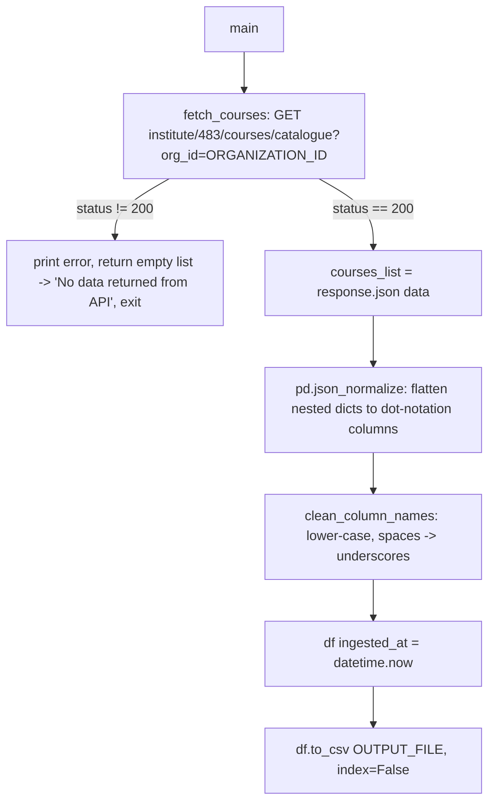

# Course Catalogue Data Pipeline

## 1. Overview & Purpose

`course_catalogue_data.py` (116 lines, `course_catalogue_data/scripts/`) is the simplest
catalogue-domain script in `ela_datasets`: one API call, a generic `pandas.json_normalize`
flatten, column-name cleanup, an `ingested_at` timestamp, straight to CSV. No filtering, no
business rules — every course/bundle Edmingle returns ends up in the output.

**Purpose:** a raw, unfiltered, always-current catalogue snapshot with no assumptions about which
courses matter — deliberately the "rawest" catalogue pipeline, unlike `course_batch_merge`
(business-rule-heavy) or `session_wise_attendance`'s catalogue builder.

## 2. High-Level Data Flow



**Lineage:** catalogue API → `json_normalize` flatten → column cleanup → `+ingested_at` →
`course_catalogue_data.csv`. Downstream consumer not identified from this repo.

## 3. Repository Structure

| Path | Purpose |
|---|---|
| `scripts/course_catalogue_data.py` | Entire pipeline — fetch, flatten, clean, timestamp, save. |
| `output/course_catalogue_data.csv` | The only file this pipeline produces. |
| `../../credentials.yaml` | Shared `API_KEY`/`ORGANIZATION_ID`/`INSTITUTE_ID` (`INSTITUTE_ID` loaded but unused). |
| `../../common.py` | Supplies `load_credentials()` only. |
| `../../.venv/` (venv, primary), `../../docker/Dockerfile`/`../../docker/requirements.txt` (Docker, alternative) | The repo's runtime environment — **required** to run this script (see Section 12). |

## 4. Source System

| Source | Endpoint | Method | Auth | Parameters | Pagination | Rate Limit |
|---|---|---|---|---|---|---|
| Course catalogue | `.../institute/483/courses/catalogue` (institute id hardcoded) | GET | `apikey` header; `ORGID` header **hardcoded to `"683"`, not the credentials-driven value** | `org_id` query param — the *only* place the real `ORGANIZATION_ID` is actually used | Single call returns the full catalogue | Not identified — no retry/backoff of any kind |

## 5. Extraction Process

`fetch_courses()` — one GET with `apikey` + hardcoded `ORGID: "683"` headers and
`params={"org_id": ORGANIZATION_ID}`. Non-200 → prints the body, returns `[]`, and `main()` exits
with "No data returned from API," writing nothing. On success, `response.json()["response"]`
becomes the raw record list. `pd.json_normalize()` flattens nested dicts into dot-notation
columns (list-valued fields are left as raw Python list objects, not expanded).
`clean_column_names()` lower-cases names and replaces spaces with underscores — the only
transformation applied. An `ingested_at` timestamp column is appended, and the result is written
via `df.to_csv()` (default UTF-8, no BOM).

## 6. Function Reference

### `fetch_courses() -> list`
One GET; prints status and (on failure) the error body, returning `[]`. **No `try/except`** —
a connection error, timeout, or non-JSON body raises unhandled and stops the script.

### `clean_column_names(dataframe) -> pd.DataFrame`
Lower-cases and underscore-izes every column name via a manual index-based loop; no other
renaming, reordering, or dropping.

### `main()`
Fetches → builds the DataFrame with **no column filtering** (explicit code comment confirms this
is intentional — every raw column is kept) → cleans names → appends `ingested_at` → saves →
prints a summary (record/column counts, column list, file path). Guarded by
`if __name__ == "__main__":` so importing the module never triggers a live call.

## 7. Configuration & Parameters

| Source | Key(s) | Purpose |
|---|---|---|
| `../../credentials.yaml` | `edmingle.api_key`, `edmingle.organization_id`, `edmingle.institute_id` (loaded, never referenced again) | Auth for the catalogue call. |
| Hardcoded | `BASE_URL` (institute id `483` baked in), `HEADERS["ORGID"] = "683"` (ignores the credentials-driven org id), `OUTPUT_FILE` | All runtime behaviour — no config file, no CLI args. |

## 8. Data Transformation, Output & Schema

**Transformations:** JSON flattening via `json_normalize` (the entire flattening step, no custom
recursion) · list-valued fields left as raw Python list string reprs · column-name cleanup
(lower_snake_case) · `ingested_at` timestamp appended · **no field-level filtering** — every
column Edmingle returns ends up in the output.

**Output:** `course_catalogue_data.csv`, direct (non-atomic) `to_csv()`.

**Confirmed state (updated 2026-09-24, after fixing the runtime environment — see Section 12):**
**566 data rows, 61 columns**, modified 2026-09-24 15:13 UTC. This was produced by actually
executing the current code inside a correctly-configured environment (see below) — the first
confirmed clean run of this script on this server. It **includes** `ingested_at` as the final
column, resolving the discrepancy previously noted in this document.

Note: `wc -l` reports 34,806 lines for this file — that is **not** the row count. Several
catalogue fields (`overview`, `about_the_course`, `product_description`, etc.) contain embedded
newlines inside quoted CSV values, so raw line counts wildly overcount. The verified figures above
came from the script's own printed summary and an independent check with Python's `csv` module.

**Superseded prior state:** an earlier file on this server had 1,846 rows and only 22 columns,
with no `ingested_at` column at all. That earlier file predates this audit and was almost
certainly produced by an older revision of this script, or a different capture of the API
response — the current code, run correctly, returns a materially wider response (61 columns,
including large free-text fields like `overview` and `about_the_course` that the older file did
not have). The exact origin of that earlier file remains unconfirmed; it should no longer be
treated as representative of current output.

**Database integration:** not applicable — CSV output only.

**Schema** (61 columns, verified against the live file header): `bundle_id`, `course_name`,
`product_description`, `overview`, `cost`, `is_online_package`, `online_registration_allowed`,
`free_preview_allowed`, `pretty_name`, `num_students`, `tutors`, `tutord_ids` (Edmingle's own
"Tutord Ids" spelling, lower-cased), `course_url`, `course_list`, `course_ids`, `subject`,
`level`, `language`, `examination`, `texts`, `type`, `course_division`, `certificate`,
`course_sponsor`, `course_title_sanskrit`, `duration_-_old`, `live_session_schedule_text`,
`about_the_course`, `know_more_about_the_course`, `about_this_learning_program`,
`learning_program_value_proposi`, `how_learning_program_works`, `know_more_about_the_programs`,
`coming_soon`, `target_audience`, `status`, `number_of_lectures`, `duration`, `personas`,
`ongoing_webinar_note`, `eligibility`, `whats_new`, `whats_new_poster`, `meta_title`,
`meta_description`, `meta_keywords`, `dsg_link`, `hide_in_ongoing_webinar`,
`computer_based_assessment`, `course_ordering`, `post_enrollment_(redirect_url)`, `product_id`,
`sss_category`, `credits`, `viniyoga`, `adhyayanam_category`, `term_of_course`,
`position_in_funnel`, `division`, `position_in_sub-funnel_(school` — all Source (verbatim from
Edmingle, only the column name is cleaned) — plus `ingested_at` (Derived, run timestamp).

## 9. Data Quality & Known Limitations

**Implemented checks:** HTTP status check (non-200 → error + empty list, no retry). No JSON
validation, no field filtering, no schema validation — whatever Edmingle returns becomes the
output schema, unchecked.

**Confirmed limitations:**
- No retry/backoff and no `try/except` at all around the network call or JSON parsing — any failure beyond a non-200 status stops the script with an unhandled exception.
- Output shape is entirely dictated by Edmingle's response that day — an upstream field change silently changes the output columns, undetected.
- The `ORGID` header (hardcoded `"683"`) and the `org_id` query parameter (from credentials) could disagree if the real org id ever changes — unverified which one Edmingle actually honors.
- No test/demo course filtering of any kind.
- List-valued fields aren't flattened — unusable directly from the CSV without further parsing.
- **`wc -l` is not a valid row-count method for this file** — several fields contain embedded newlines; use the script's own printed count or a CSV-aware tool.
- The VPS's system Python lacks `pandas`; the script needs the project's `.venv` (or the Docker image) to run (see Section 12) — this was the root cause of the earlier file's uncertain provenance.

**Requires confirmation:** the exact origin of the earlier 1,846-row/22-column file; whether `ORGID` should use the real organization id instead of `"683"`; whether `INSTITUTE_ID` should replace the hardcoded `483`.

## 10. Error Handling & Logging

No `logging` module — all output via `print()` (status code, response keys, error text, summary).
Only a non-200 HTTP status is guarded; any other failure (connection error, timeout, malformed
JSON) raises unhandled with no top-level `try/except` anywhere in the file. Real output from the
2026-09-24 verified run:

```
Status: 200
Success! Data saved successfully.
Total records: 566
Total columns: 61
File saved at: /app/course_catalogue_data/scripts/../output/course_catalogue_data.csv
```

## 11. Dependencies

| Dependency | Purpose |
|---|---|
| `requests` | HTTP call |
| `pandas` | `json_normalize`, DataFrame ops, CSV write |
| `common` (repo root) | `load_credentials()` |
| stdlib (`os`, `sys`, `datetime`, `pathlib`) | Paths, timestamp |

`pandas` is **not** installed on the VPS's system Python — see Section 12.

## 12. Setup & How to Run

**The VPS's system Python does not have `pandas` installed, and neither `python3-venv` nor sudo
is available to fix that directly.** A working virtual environment already exists at
`/home/projectdev/ela_datasets/.venv` (see the repo-root `RUN_GUIDE.md` for how it was built and
how to recreate it if it's ever lost) — activate it once per shell session, then run the script
exactly as before:

```bash
source /home/projectdev/ela_datasets/.venv/bin/activate
cd course_catalogue_data/scripts
python3 course_catalogue_data.py
```
No CLI arguments exist. Populate `../../credentials.yaml` beforehand (`institute_id` loaded but
unused); no config file, `input/` folder, or notification setup needed.

**Alternative: Docker**, if you'd rather run fully isolated from the VPS's own Python:
```bash
docker run --rm -it -v /home/projectdev/ela_datasets:/app ela_datasets bash
# inside the container:
cd course_catalogue_data/scripts
python3 course_catalogue_data.py
```
Output persists on the VPS after you exit the container, since the repo is volume-mounted rather
than copied in at build time.

## 13. Automation / Scheduling

None — triggered manually, no cron/systemd/Task Scheduler entry.

## 14. Important Business / Technical Rules

- No business rules exist here — deliberately the raw, unfiltered flatten, unlike `course_batch_merge.py`'s filtering/status logic.
- `ORGID` header is hardcoded to `"683"`, not `credentials.yaml`'s `ORGANIZATION_ID` (used only in the query param) — a latent inconsistency, not a deliberate rule.
- `INSTITUTE_ID` is loaded but never used — `483` is hardcoded into `BASE_URL` instead, the same pattern seen in `course_batch_merge.py`.
- Whatever Edmingle returns becomes the columns, verbatim — no "expected vs. unexpected field" concept.

## 15. Troubleshooting

| Symptom | Likely cause | Check |
|---|---|---|
| `ModuleNotFoundError: No module named 'pandas'` | Running on the VPS's system Python directly, without activating `.venv` first (or outside the Docker image) | `source ../../.venv/bin/activate` first, or use the `docker run` command — see Section 12 |
| "No data returned from API", exits | Non-200 status, or empty `response` list | Printed status/error body; API key |
| Unhandled exception / traceback | Connection error, timeout, or non-JSON body — none caught | Network connectivity; the traceback's failure point |
| Output columns differ from a prior run | Edmingle changed a catalogue field, or an earlier run used a different script revision (see Section 8) | Compare "Columns saved:" against a prior header |
| Row count looks huge / inconsistent with the printed summary | `wc -l` overcounts this file due to embedded newlines in text fields | Trust the script's own printed count, or use Python's `csv` module |

## 16. Maintenance Guide

- **Endpoint/params change** → `BASE_URL` and the `HEADERS`/`params` construction.
- **Fix the `ORGID` inconsistency** → change the hardcoded `"683"` to `str(ORGANIZATION_ID)`, once confirmed safe.
- **Wire in `INSTITUTE_ID`** → replace the hardcoded `483` in `BASE_URL`.
- **Add error handling** → wrap `fetch_courses()`'s request/JSON parsing in `try/except`, consider retry/backoff similar to `attendance.py`.
- **Adding a new dependency** → `.venv/bin/pip install <package>` (venv) and add it to `docker/requirements.txt` (rebuild the image with `docker build -t ela_datasets -f docker/Dockerfile .` if Docker is used too), so both runtimes stay in sync.

## 17. Security Considerations

`credentials.yaml` holds the shared API key and is gitignored. No PII — catalogue-level data
only, no student records. No `print()` call includes credential values.

## 18. Future Improvements

1. **Email the output on completion** — send a completion email that includes the run status *and* attaches the generated dataset file(s), not just a status notification.
2. **Scheduled automation** — run automatically on a defined schedule instead of a manual trigger.
3. **Data cleaning layer** — a dedicated cleaning step/script (nulls, duplicates, standardization) inside the pipeline, instead of leaving it to downstream consumers.

---
*Initial documentation: 2026-09-24. Updated 2026-09-24 after fixing the missing runtime
environment (VPS system Python lacked `pandas`) — first via Docker, then via a `.venv` created
with `virtualenv.pyz` for native (non-Docker) runs — and confirming a clean run via both: 566
rows, 61 columns, `ingested_at` present. Downstream consumer and project/technical owner:
requires confirmation.*
