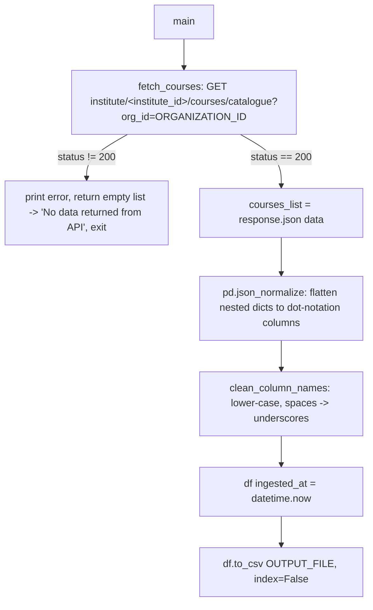

# Course Catalogue Data Pipeline

## 1. Overview & Purpose

`course_catalogue_data.py` (`course_catalogue_data/scripts/`) is the simplest catalogue script in `ela_datasets`: one API call, a generic `pandas.json_normalize` flatten, column-name cleanup, an `ingested_at` timestamp, straight to CSV. No filtering, no business rules — every course/bundle Edmingle returns ends up in the output.

**Purpose:** a raw, unfiltered, always-current catalogue snapshot — the "rawest" catalogue pipeline, unlike `course_batch_merge` (business-rule-heavy) or `session_wise_attendance`'s catalogue builder.

## 2. High-Level Data Flow



**Lineage:** catalogue API → `json_normalize` flatten → column cleanup → `+ingested_at` →
`course_catalogue_data.csv`. Downstream consumer not identified from this repo.

## 3. Repository Structure

| Path | Purpose |
|---|---|
| `scripts/course_catalogue_data.py` | Entire pipeline — fetch, flatten, clean, timestamp, save. |
| `output/course_catalogue_data.csv` | The only file this pipeline produces. |
| `../../credentials.yaml` | Shared `API_KEY`/`ORGANIZATION_ID`/`INSTITUTE_ID`/`base_url`, read through `common.edmingle_settings()` (exits if one is missing). |
| `../../common.py` | Supplies `load_credentials()` only. |
| `../../.venv/` (venv, primary), `../../docker/Dockerfile`/`../../docker/requirements.txt` (Docker, alternative) | The repo's runtime environment — **required** to run this script (see Section 12). |

## 4. Source System

| Source | Endpoint | Method | Auth | Parameters | Pagination | Rate Limit |
|---|---|---|---|---|---|---|
| Course catalogue | `<base_url>/institute/<institute_id>/courses/catalogue` (both from `credentials.yaml`) | GET | `apikey` and `ORGID` headers, both from `credentials.yaml` | `org_id` query param (same organization id) | Single call returns the full catalogue | Not identified — no retry/backoff of any kind |

## 5. Extraction Process

1. `fetch_courses()` — one GET with `apikey` + `ORGID` headers and `params={"org_id": ORGANIZATION_ID}` (all three from `credentials.yaml`). Non-200 → prints the body, returns `[]`, and `main()` exits with "No data returned from API", writing nothing.
2. `response.json()["response"]` is the record list; `pd.json_normalize()` flattens nested dicts to dot-notation columns (list-valued fields stay as raw Python lists).
3. `clean_column_names()` lower-cases names and replaces spaces with underscores — the only transformation.
4. An `ingested_at` column is appended and the result written with `df.to_csv()` (UTF-8, no BOM).

## 6. Function Reference

- **`fetch_courses()`** — one GET; prints the status (and the error body on failure), returns `[]` on non-200. **No `try/except`**: a connection error, timeout or non-JSON body stops the script.
- **`clean_column_names(df)`** — lower-cases and underscore-izes every column name; no other renaming, reordering or dropping.
- **`main()`** — fetch, build the DataFrame with **no column filtering** (intentional per a code comment), clean names, add `ingested_at`, save, print a summary (record/column counts, columns, path). Guarded by `if __name__ == "__main__":`.

## 7. Configuration & Parameters

| Source | Key(s) | Purpose |
|---|---|---|
| `../../credentials.yaml` | `edmingle.api_key`, `edmingle.organization_id`, `edmingle.institute_id`, `edmingle.base_url` | Auth and URL for the catalogue call. |
| Hardcoded | `OUTPUT_FILE` only — no organization id, institute id or base URL is written into the script (fixed 2026-09-25) | All runtime behaviour — no config file, no CLI args. |

## 8. Data Transformation, Output & Schema

**Transformations:** JSON flattening via `json_normalize` (the entire flattening step, no custom
recursion) · list-valued fields left as raw Python list string reprs · column-name cleanup
(lower_snake_case) · `ingested_at` timestamp appended · **no field-level filtering** — every
column Edmingle returns ends up in the output.

**Output:** `course_catalogue_data.csv`, direct (non-atomic) `to_csv()`.

**Confirmed state (2026-09-24):** **566 data rows, 61 columns**, including `ingested_at` as the last column — the first confirmed clean run on this server. `wc -l` reports 34,806 lines: that is **not** the row count, because several fields (`overview`, `about_the_course`, `product_description`, …) contain newlines inside quoted values. Use the script's printed count or Python's `csv` module. An older file (1,846 rows, 22 columns, no `ingested_at`) came from an unknown earlier revision and is not representative.

**Database integration:** not applicable — CSV output only.

**Schema** (61 columns, verified against the live file header): `bundle_id`, `course_name`,
`product_description`, `overview`, `cost`, `is_online_package`, `online_registration_allowed`,
`free_preview_allowed`, `pretty_name`, `num_students`, `tutors`, `tutord_ids` (Edmingle's own
"Tutord Ids" spelling, lower-cased), `course_url`, `course_list`, `course_ids`, `subject`,
`level`, `language`, `examination`, `texts`, `type`, `course_division`, `certificate`,
`course_sponsor`, `course_title_sanskrit`, `duration_-_old`, `live_session_schedule_text`,
`about_the_course`, `know_more_about_the_course`, `about_this_learning_program`,
`learning_program_value_proposi`, `how_learning_program_works`, `know_more_about_the_programs`,
`coming_soon`, `target_audience`, `status`, `number_of_lectures`, `duration`, `personas`,
`ongoing_webinar_note`, `eligibility`, `whats_new`, `whats_new_poster`, `meta_title`,
`meta_description`, `meta_keywords`, `dsg_link`, `hide_in_ongoing_webinar`,
`computer_based_assessment`, `course_ordering`, `post_enrollment_(redirect_url)`, `product_id`,
`sss_category`, `credits`, `viniyoga`, `adhyayanam_category`, `term_of_course`,
`position_in_funnel`, `division`, `position_in_sub-funnel_(school` — all Source (verbatim from
Edmingle, only the column name is cleaned) — plus `ingested_at` (Derived, run timestamp).

## 9. Data Quality & Known Limitations

**Implemented checks:** HTTP status check (non-200 → error + empty list, no retry). No JSON
validation, no field filtering, no schema validation — whatever Edmingle returns becomes the
output schema, unchecked.

**Confirmed limitations:**
- No retry/backoff and no `try/except` at all around the network call or JSON parsing — any failure beyond a non-200 status stops the script with an unhandled exception.
- Output shape is entirely dictated by Edmingle's response that day — an upstream field change silently changes the output columns, undetected.
- No test/demo course filtering of any kind.
- List-valued fields aren't flattened — unusable directly from the CSV without further parsing.
- **`wc -l` is not a valid row count** (embedded newlines) — use the script's printed count or a CSV-aware tool.
- The VPS's system Python lacks `pandas`; the script needs the project's `.venv` (or the Docker image) — Section 12.

**Requires confirmation:** none currently.

## 10. Error Handling & Logging

No `logging` module — everything is `print()`. Only a non-200 status is guarded; any other failure raises unhandled. Output of the 2026-09-24 verified run:

```
Status: 200
Success! Data saved successfully.
Total records: 566
Total columns: 61
File saved at: /app/course_catalogue_data/scripts/../output/course_catalogue_data.csv
```

## 11. Dependencies

| Dependency | Purpose |
|---|---|
| `requests` | HTTP call |
| `pandas` | `json_normalize`, DataFrame ops, CSV write |
| `common` (repo root) | `load_credentials()` |
| stdlib (`os`, `sys`, `datetime`, `pathlib`) | Paths, timestamp |

`pandas` is **not** installed on the VPS's system Python — see Section 12.

## 12. Setup & How to Run

Step-by-step guide: [RUN_GUIDE.md](RUN_GUIDE.md). The VPS's system Python has no `pandas` (and no `python3-venv`/sudo), so use the existing virtualenv (how it was built is in the repo-root `RUN_GUIDE.md`). Populate `../../credentials.yaml` first; no config file, `input/` or notifications needed, and no CLI arguments.

```bash
source /home/projectdev/ela_datasets/.venv/bin/activate
cd /home/projectdev/ela_datasets/course_catalogue_data/scripts
python3 course_catalogue_data.py
```

Docker alternative: `docker run --rm -it -v /home/projectdev/ela_datasets:/app ela_datasets bash`, then `cd course_catalogue_data/scripts && python3 course_catalogue_data.py` (output persists on the VPS; the repo is volume-mounted).

It finishes in seconds, so there is no tmux section.

## 13. Automation / Scheduling

None — triggered manually, no cron/systemd/Task Scheduler entry.

## 14. Important Business / Technical Rules

- No business rules exist here — deliberately the raw, unfiltered flatten, unlike `course_batch_merge.py`'s filtering/status logic.
- Whatever Edmingle returns becomes the columns, verbatim — no "expected vs. unexpected field" concept.

## 15. Troubleshooting

| Symptom | Likely cause | Check |
|---|---|---|
| `ModuleNotFoundError: No module named 'pandas'` | Running on the VPS's system Python directly, without activating `.venv` first (or outside the Docker image) | `source ../../.venv/bin/activate` first, or use the `docker run` command — see Section 12 |
| "No data returned from API", exits | Non-200 status, or empty `response` list | Printed status/error body; API key |
| Unhandled exception / traceback | Connection error, timeout, or non-JSON body — none caught | Network connectivity; the traceback's failure point |
| Output columns differ from a prior run | Edmingle changed a catalogue field, or an earlier run used a different script revision (see Section 8) | Compare "Columns saved:" against a prior header |
| Row count looks huge / inconsistent with the printed summary | `wc -l` overcounts this file due to embedded newlines in text fields | Trust the script's own printed count, or use Python's `csv` module |

## 16. Maintenance Guide

- **Endpoint/params change** → `BASE_URL` and the `HEADERS`/`params` construction (org id, institute id and base URL come from `credentials.yaml`).
- **Add error handling** → wrap `fetch_courses()`'s request/JSON parsing in `try/except`, consider retry/backoff similar to `attendance.py`.
- **Adding a new dependency** → `.venv/bin/pip install <package>` and add it to `docker/requirements.txt` so both runtimes stay in sync.

## 17. Security Considerations

`credentials.yaml` holds the shared API key and is gitignored. No PII — catalogue-level data
only, no student records. No `print()` call includes credential values.

## 18. Raw API Payload (Captured Structure)

**Captured live from the API on 2026-09-25** (one read-only call, tiny page size). Structure only: field names and types, no values, so no student/teacher PII is recorded here. `<int>`/`<str>`/`<null>` are the types observed in the sample; a field seen as `<null>` may hold a value for other records.

**Endpoint:** `GET .../institute/<institute_id>/courses/catalogue?org_id=<org>`, headers `apikey` + `ORGID`. The list is
under **`response`** (566 records in this sample, matching the CSV's 566 rows). Raw field names are **Title Case
with spaces** (`Bundle id`, `Course Name`); `course_catalogue_data.py` lower-cases and underscores them
(`bundle_id`, `course_name`), which is why the CSV columns look different. Nearly every field is a string, even
numeric-looking ones like `Number of Lectures`. `Position in Sub-funnel (School` is truncated in Edmingle's own
response, not by this pipeline.

```json
{
  "code": "\"200\" (string, not int)",
  "message": "<str>",
  "response": [
    {
      "Bundle id": "<int>",
      "Course Name": "<str>",
      "Product Description": "<str>",
      "Overview": "<str>",
      "Cost": "<int>",
      "Is Online Package": "<int>",
      "Online Registration Allowed": "<int>",
      "Free Preview Allowed": "<int>",
      "Pretty Name": "<str>",
      "Num Students": "<int>",
      "Tutors": "<str>",
      "Tutord Ids": "<str>",
      "Course URL": "<str>",
      "Course List": "<str>",
      "Course Ids": "<str>",
      "Subject": "<str>",
      "Level": "<str>",
      "Language": "<str>",
      "Examination": "<str>",
      "Texts": "<str>",
      "Type": "<str>",
      "Course Division": "<str>",
      "Certificate": "<str>",
      "Course Sponsor": "<str>",
      "Course Title Sanskrit": "<str>",
      "Duration - old": "<str>",
      "Live session Schedule text": "<str>",
      "About The course": "<str>",
      "Know more about the course": "<str>",
      "About this Learning Program": "<str>",
      "Learning Program Value Proposi": "<str>",
      "How Learning Program Works": "<str>",
      "Know More About The Programs": "<str>",
      "Coming soon": "<str>",
      "Target Audience": "<str>",
      "Status": "<str>",
      "Number of Lectures": "<str>",
      "Duration": "<str>",
      "Personas": "<str>",
      "Ongoing Webinar Note": "<str>",
      "Eligibility": "<str>",
      "Whats new": "<str>",
      "Whats new poster": "<str>",
      "Meta Title": "<str>",
      "Meta Description": "<str>",
      "Meta Keywords": "<str>",
      "dsg link": "<str>",
      "Hide in Ongoing Webinar": "<str>",
      "Computer Based Assessment": "<str>",
      "Course Ordering": "<str>",
      "Post Enrollment (Redirect URL)": "<str>",
      "Product ID": "<str>",
      "SSS Category": "<str>",
      "Credits": "<str>",
      "Viniyoga": "<str>",
      "Adhyayanam Category": "<str>",
      "Term of Course": "<str>",
      "Position in Funnel": "<str>",
      "Division": "<str>",
      "Position in Sub-funnel (School": "<str>"
    }
  ]
}
```

## 19. Future Improvements

1. **Email the output on completion** — send a completion email that includes the run status *and* attaches the generated dataset file(s), not just a status notification.
2. **Scheduled automation** — run automatically on a defined schedule instead of a manual trigger.
3. **Data cleaning layer** — a dedicated cleaning step/script (nulls, duplicates, standardization) inside the pipeline, instead of leaving it to downstream consumers.

---
*Initial documentation: 2026-09-24; updated 2026-09-24 after fixing the runtime environment (`.venv`) and confirming a clean run (566 rows, 61 columns). Downstream consumer and project/technical owner: requires confirmation.*
