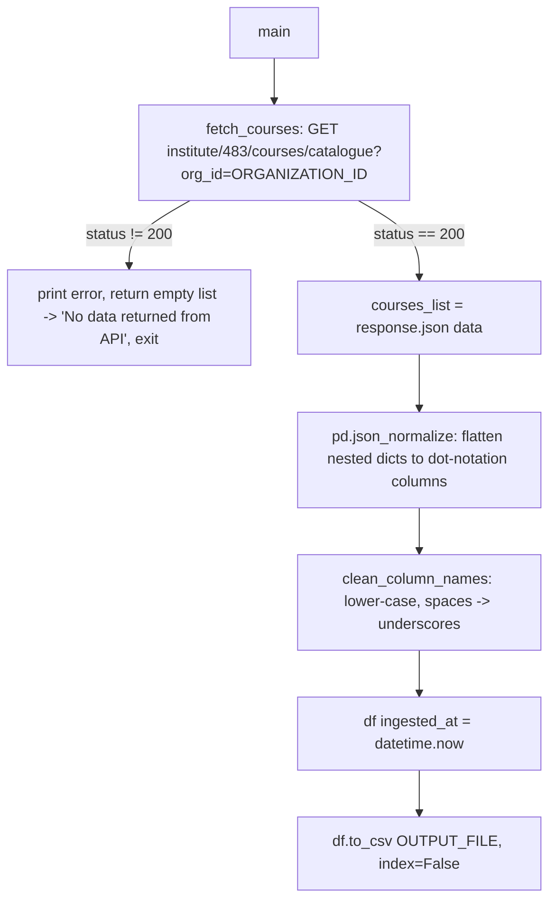

# Course Catalogue Data Pipeline

## 1. Overview

`course_catalogue_data.py` (at
`/home/projectdev/ela_datasets/course_catalogue_data/scripts/`, 116 lines) is the simplest of
the catalogue-domain scripts in `ela_datasets`. It makes a single API call to fetch the
Edmingle course catalogue, flattens whatever JSON comes back with a generic
`pandas.json_normalize`, cleans up the column names, appends an `ingested_at` timestamp, and
writes the result straight to CSV. It applies no filtering and no business rules — every
course/bundle Edmingle returns ends up in the output.

## 2. Purpose

To provide a raw, unfiltered, always-current snapshot of the Edmingle course catalogue as a
CSV, with no assumptions baked in about which courses matter or how the catalogue's fields
should be interpreted — deliberately the "rawest" of the catalogue-domain pipelines in this
repo, in contrast to `course_batch_merge` (business-rule-heavy) or `session_wise_attendance`'s
catalogue builder.

## 3. High-Level Data Flow



## 4. Project / Repository Structure

| Path | Purpose |
|---|---|
| `course_catalogue_data/scripts/course_catalogue_data.py` | Entire pipeline: fetch, flatten, clean column names, timestamp, save. |
| `course_catalogue_data/scripts/__pycache__/` | Compiled bytecode leftover (`course_catalogue_data.cpython-312.pyc`) directly in this folder, despite the script itself redirecting `sys.pycache_prefix` to the shared `ela_datasets/.pycache/` at import time. |
| `course_catalogue_data/README.md` | Existing detailed README, used as a cross-check source for this document. |
| `course_catalogue_data/output/course_catalogue_data.csv` | Generated output — the only file this pipeline is coded to produce. |
| `../../credentials.yaml` (repo root) | Shared Edmingle `API_KEY`/`ORGANIZATION_ID`/`INSTITUTE_ID`, read via `common.load_credentials()` (`INSTITUTE_ID` loaded but unused). |
| `../../common.py` (repo root) | Supplies `load_credentials()`; no other shared helper is used. |

## 5. Source System

| Source | Type | Endpoint | HTTP Method | Authentication | Parameters | Pagination | Rate Limit |
|---|---|---|---|---|---|---|---|
| Edmingle course catalogue | REST/JSON | `https://vyoma-api.edmingle.com/nuSource/api/v1/institute/483/courses/catalogue` (`BASE_URL`, institute id `483` hardcoded in the URL) | GET | Headers `apikey` (`API_KEY` from credentials), `ORGID` — **hardcoded literal `"683"` in the code, not the credentials-driven `ORGANIZATION_ID` value** | Query param `org_id` (= `ORGANIZATION_ID` from credentials — the *only* place the credentials-driven org id is actually used) | None — a single call returns the full catalogue | Not identified in the current implementation — no retry/backoff, no rate-limit handling of any kind |

## 6. Extraction Process

1. `main()` calls `fetch_courses()` — a single `requests.get()` to `BASE_URL` with `HEADERS` (`apikey`, and a hardcoded `ORGID: "683"`) and `params={"org_id": ORGANIZATION_ID}`; prints the HTTP status code.
2. On any non-200 status, `fetch_courses()` prints the response body and returns an empty list — `main()` then prints `"No data returned from API"` and exits without writing a file.
3. On success, `response.json()` is parsed and `data.get("response", [])` is taken as the raw list of course records (prints the response's top-level keys for debugging).
4. `pd.json_normalize(courses_list)` flattens the list of dicts into a DataFrame — nested dicts become dot-notation columns automatically; nested lists are **not** expanded and remain raw Python list objects in their cell (rendered as their string form in the CSV).
5. `clean_column_names()` lower-cases every column name and replaces spaces with underscores — the only transformation applied to the data itself.
6. An `ingested_at` column (current timestamp, `datetime.now()`) is appended to every row.
7. `df.to_csv(OUTPUT_FILE, index=False)` writes the result — no encoding override (defaults to `utf-8`, unlike `course_batch_merge`'s `utf-8-sig`).

## 7. Detailed Function Documentation

### `fetch_courses() -> list`
- **Purpose:** Fetch the raw Edmingle course catalogue.
- **Inputs:** none (uses module-level `BASE_URL`, `HEADERS`, `ORGANIZATION_ID` via the `params` dict built inline).
- **Output:** list of raw course record dicts (Edmingle's `"response"` key), or `[]` on any non-200 status.
- **Processing:** `requests.get(BASE_URL, headers=HEADERS, params={"org_id": ORGANIZATION_ID})`; prints `"Status:"` and the status code; on `!= 200`, prints `"Error from API:"` and the response text, returns `[]`; on success, parses JSON, prints the response's dict keys for debugging, and returns `data.get("response", [])`.
- **Dependencies:** `requests`.
- **Note:** No `try/except` around the request or `.json()` call — a connection error, timeout, or non-JSON body raises an unhandled exception and stops the script (see Section 13).

### `clean_column_names(dataframe) -> pd.DataFrame`
- **Purpose:** Normalize column names to a consistent lower_snake_case-ish form.
- **Inputs:** a DataFrame (post `json_normalize`).
- **Output:** the same DataFrame with `.columns` replaced.
- **Processing:** Iterates columns with a manual index-based `while` loop (not vectorized), applying `.strip().lower().replace(" ", "_")` to each column name; reassigns `dataframe.columns`.
- **Dependencies:** none beyond pandas.

### `main()`
- **Purpose:** Orchestrate fetch → normalize → clean → timestamp → save.
- **Processing:** Calls `fetch_courses()`; if the list is non-empty, builds the DataFrame via `pd.json_normalize(courses_list)` with **no column filtering — every raw column the API returns is kept** (explicit code comment confirms this is intentional); calls `clean_column_names()`; appends `df["ingested_at"] = datetime.now()`; saves via `df.to_csv(OUTPUT_FILE, index=False)`; prints a summary (record count, column count, column list, file path). If `courses_list` is empty, prints `"No data returned from API"` and does nothing further.
- **Dependencies:** `fetch_courses`, `clean_column_names`, `pandas`.
- **Guard clause:** the script only calls `main()` under `if __name__ == "__main__":`, explicitly so that importing the module (e.g. for a syntax/import verification check) never triggers a live Edmingle call or a real output write — confirmed directly in the code's own trailing comment.

## 8. Input Parameters & Configuration

| Source | Key(s) | Purpose |
|---|---|---|
| `../../credentials.yaml` (shared) | `edmingle.api_key` → `API_KEY`, `edmingle.organization_id` → `ORGANIZATION_ID`, `edmingle.institute_id` → `INSTITUTE_ID` (loaded but never referenced again) | Auth for the catalogue call. |
| Hardcoded in `course_catalogue_data.py` | `BASE_URL` (institute id `483` baked into the URL string), `HEADERS["ORGID"] = "683"` (**hardcoded literal, ignoring the credentials-driven `ORGANIZATION_ID`**), `OUTPUT_FILE` (`../output/course_catalogue_data.csv`, anchored to `SCRIPT_DIR`) | All runtime behaviour — there is no config file and no CLI arguments at all. |

No environment variables, no CLI args, no notifications config exist for this pipeline.

## 9. Data Transformation

| Transformation | Description |
|---|---|
| JSON flattening | `pd.json_normalize()` expands nested dict fields into dot-notation columns automatically; this is the *entire* flattening step — no custom recursive logic exists in this file. |
| List-valued fields | Left as raw Python list objects in their cell; rendered as their Python `str()` form in the CSV (e.g. `['a', 'b']`), not expanded into rows or columns. |
| Column name cleanup | Lower-cased, spaces replaced with underscores (`clean_column_names`) — the only transformation applied to column names; no other renaming, reordering, or dropping. |
| Timestamping | `ingested_at` = wall-clock time the script ran, appended as a new column on every row. |
| Field-level filtering | **None** — every column Edmingle's catalogue response contains ends up in the output, verbatim in value. |

## 10. Output Dataset

| Name | Format | Location | Write Strategy |
|---|---|---|---|
| `course_catalogue_data.csv` | CSV, UTF-8 (no BOM), one row per course/bundle | `course_catalogue_data/output/` | Direct `to_csv()` call — not an atomic write; a crash mid-write could leave a partial/corrupt file. |

**Confirmed current state (checked 2026-09-24):** the file is 168,438 bytes, 1,847 lines (1,846
data rows + header), filesystem modify time 2026-09-24 00:21 UTC — i.e., a genuinely current
file exists in `output/`, not a stale artifact. This differs from an initial assumption that
this folder held only a stale `.xlsx`; a direct `ls -la` of `output/` at the time of this audit
shows **only** `course_catalogue_data.csv` — no `.xlsx` file is present. See Known Limitations
for an important discrepancy found in this CSV's own schema.

## 11. Output Schema

Verified directly against the live output file's header row (22 columns, parsed with Python's
`csv` module to rule out any comma-in-value ambiguity):

| Column | Data Type | Description | Source/Derived |
|---|---|---|---|
| `bundle_id` | integer | Course bundle identifier | Source |
| `course_name` | string | Course name | Source |
| `num_students` | integer | Enrolled student count (catalogue-reported) | Source |
| `tutors` | string | Tutor name(s) | Source |
| `tutord_ids` | string | Tutor id(s) (verbatim Edmingle field name "Tutord Ids" lower-cased) | Source |
| `course_ids` | string | Course id(s) within the bundle | Source |
| `subject` | string | Subject | Source |
| `level` | string | Course level | Source |
| `language` | string | Course language | Source |
| `texts` | string | Associated text(s) | Source |
| `type` | string | Course type | Source |
| `course_division` | string | Division | Source |
| `certificate` | string | Certificate field | Source |
| `course_sponsor` | string | Sponsor | Source |
| `status` | string | Catalogue status (e.g. Completed/Ongoing/Upcoming) | Source |
| `number_of_lectures` | integer/string | Lecture count | Source |
| `duration` | string | Duration | Source |
| `personas` | string | Personas field | Source |
| `sss_category` | string | SSS category | Source |
| `adhyayanam_category` | string | Adhyayanam category | Source |
| `term_of_course` | string | Term of course | Source |
| `position_in_funnel` | string | Position in funnel | Source |

**Important discrepancy found:** the current script (`main()`) unconditionally executes
`df["ingested_at"] = datetime.now()` before saving, which should add a 23rd column
(`ingested_at`) to every output. The live `course_catalogue_data.csv` on this server has
exactly **22 columns and no `ingested_at` column at all** (confirmed with Python's `csv` module,
both header and first data row have 22 fields). This means the current 168,438-byte,
1,846-data-row file was **not** produced by the script exactly as it reads today — either it
was generated by a slightly earlier revision of the script (before the `ingested_at` line was
added) or the code has been edited since that file was generated. `git log` on this file shows
only two commits (`22694b3` initial add, `34aeaa1` a later dead-code/`common.py` consolidation
commit) and `git status` shows no uncommitted changes — so the discrepancy cannot be explained
by an uncommitted local edit either. **Requires confirmation from the project owner** as to
how this specific file was produced.

## 12. Data Quality & Validation

| Check | Implemented? |
|---|---|
| HTTP status check on the catalogue call | Yes — non-200 prints the error body and returns `[]`, no retry |
| JSON body validation | No — `response.json()` is called unconditionally with no `try/except` |
| Field-level filtering / test-data exclusion | None |
| Schema validation against expected columns | None — whatever Edmingle returns becomes the output schema, unchecked |

### Quality limitations not handled
- **No retry/backoff logic, and no `try/except` at all** around the network call or JSON parsing — any failure beyond a non-200 status (a connection error, timeout, or malformed JSON body) raises an unhandled exception and stops the script.
- **Output shape is entirely dictated by whatever Edmingle's catalogue endpoint happens to return that day** — an upstream field rename/addition/removal on Edmingle's side silently changes the output columns, with nothing in this script to detect or flag it.
- **The `ORGID` header mismatch** (hardcoded `"683"` vs. the credentials-driven `ORGANIZATION_ID` used only in the query parameter) is a latent inconsistency — if the real organization id in `credentials.yaml` ever differs from `683`, the header and query parameter would disagree, and it is not verified in this review which one Edmingle actually honors.
- **No test/demo/dummy course filtering of any kind** — unlike `course_batch_merge`'s `"test batch"` substring filter, this script has zero filtering logic.
- **List-valued fields are not flattened**, so any such column is not directly usable/analyzable from the CSV without further parsing of its string-rendered Python list form.

## 13. Error Handling & Logging

- No `logging` module usage — all output is via `print()` statements to stdout (status code, response keys, error text, final summary).
- `fetch_courses()` only guards against a non-200 HTTP status; any other failure (connection error, timeout, malformed JSON) raises an unhandled exception that propagates out of `main()` and stops the script with a traceback — there is no top-level `try/except` in this file at all (unlike `course_batch_merge.py`, which wraps its `main()` body).
- Representative real output (from the script's own `print()` calls, format confirmed by reading the code — not a captured historical log since no log file exists for this script):
  ```
  Status: 200
  Response keys: dict_keys([...])

  ====================================
  Success! Data saved successfully.
  Total records: 1846
  Total columns: 22
  Columns saved: ['bundle_id', 'course_name', ...]
  File saved at: /home/projectdev/ela_datasets/course_catalogue_data/output/course_catalogue_data.csv
  ====================================
  ```

## 14. Dependencies

| Dependency | Purpose | Required |
|---|---|---|
| `requests` | HTTP call to Edmingle | Yes |
| `pandas` | `json_normalize`, DataFrame ops, CSV writing | Yes |
| `common` (repo-root `common.py`) | `load_credentials()` | Yes |
| Python stdlib: `os`, `sys`, `datetime`, `pathlib` | Path handling, timestamp | Yes (stdlib) |

## 15. Setup

1. Ensure `../../credentials.yaml` (repo root) has a populated `edmingle.api_key` and `edmingle.organization_id` (`institute_id` is loaded but unused).
2. Install dependencies: `pip install requests pandas`.
3. No config file, no `input/` folder, and no notification setup are needed for this pipeline.

## 16. How to Run

```bash
cd /home/projectdev/ela_datasets/course_catalogue_data/scripts
python3 course_catalogue_data.py
```
No CLI arguments exist — confirmed by the absence of any `argparse`/`sys.argv` handling in the file.

## 17. Automation / Scheduling

There is no cron job, systemd timer, or Task Scheduler entry configured for this pipeline on
this VPS. It is triggered manually.

## 18. Database / Warehouse Integration

Not applicable — this pipeline writes to CSV only. No database/warehouse client code exists in
`course_catalogue_data.py`.

## 19. Data Lineage

```
Edmingle courses/catalogue API (single call, org_id query param)
  -> pd.json_normalize (flatten)
    -> clean_column_names (lower_snake_case)
      -> + ingested_at column
        -> course_catalogue_data.csv
```

## 20. Important Business / Technical Rules

- **No business rules exist in this script** — it is explicitly the "raw, unfiltered flatten" of the catalogue domain in `ela_datasets`, in contrast to `course_batch_merge.py`'s test-batch filtering, latest-batch marking, and status-derivation logic.
- **The `ORGID` header is hardcoded to `"683"`**, not sourced from `credentials.yaml`'s `ORGANIZATION_ID` — the credentials-driven value is used only in the `org_id` query parameter. This is a latent inconsistency, not a deliberate business rule; documented here as observed in the code, not changed.
- **`INSTITUTE_ID` is loaded from `credentials.yaml` but never used anywhere in the script** — the institute id (`483`) is hardcoded directly into `BASE_URL` instead, identical in spirit to the same issue found in `course_batch_merge.py`.
- **Whatever Edmingle returns becomes the columns, verbatim** — there is no concept of "expected" vs. "unexpected" fields in this script.

## 21. Known Limitations

### Confirmed limitations
- **No retry/backoff, and no `try/except` around the network call or JSON parsing** — any failure beyond a non-200 HTTP status stops the script with an unhandled exception.
- **The `ORGID` header (`"683"`, hardcoded) and the `org_id` query parameter (from `credentials.yaml`) could disagree** if the real organization id ever changes — not verified in this review which one Edmingle actually uses for this specific endpoint/header combination.
- **The live `course_catalogue_data.csv` on this server does not contain the `ingested_at` column** that the current script version unconditionally adds (see Section 11) — this is a confirmed, verified discrepancy between the current code and the current output file. The exact cause (an earlier script revision, or a manual edit to the output file) could not be determined from the git history or file system alone.
- **Output schema is entirely at the mercy of Edmingle's response shape** — no schema validation exists to catch an upstream field rename/removal.
- **No test/demo course filtering** of any kind.

### Requires confirmation
- Why the live output CSV lacks the `ingested_at` column that the current script always adds — whether an older script revision produced this specific file, or whether the file was edited after generation.
- Whether the `ORGID` header should actually be `"683"` or should instead use the credentials-driven `ORGANIZATION_ID` value.
- Whether `INSTITUTE_ID` should be wired into `BASE_URL` instead of the hardcoded `483`.

## 22. Troubleshooting

| Symptom | Likely cause | What to check |
|---|---|---|
| Script prints "No data returned from API" and exits | Catalogue endpoint returned non-200, or an empty `"response"` list | Check the printed status code and error body; verify `credentials.yaml`'s API key |
| Script crashes with an unhandled exception / traceback | A connection error, timeout, or non-JSON response body — none of these are caught | Check network connectivity to `vyoma-api.edmingle.com`; inspect the traceback for the exact failure point |
| Output CSV's columns look different from a previous run | Edmingle changed a field in the catalogue response — this script has no schema validation to catch it | Compare the printed "Columns saved:" list against a prior run's header row |
| `ingested_at` column missing from a file you expected it in | Either this is an older file (see Section 21's confirmed discrepancy), or the script version that produced it predates that line being added | Re-run the current script and re-check the output header |
| Output has fewer/more rows than expected | Edmingle's catalogue response itself changed — this script applies zero filtering, so any change in row count reflects Edmingle's own data, not a bug in this script | Cross-check against `course_batch_merge.csv` or a direct Edmingle catalogue call, if a discrepancy is suspected |

## 23. Maintenance Guide

- **Endpoint/params change**: update `BASE_URL` and the `HEADERS`/`params` construction near the top of `main()`/module scope.
- **Fixing the `ORGID` header inconsistency**: change `HEADERS["ORGID"]` from the hardcoded `"683"` to `str(ORGANIZATION_ID)`, once confirmed with the project owner that this won't break the call.
- **Wiring in `INSTITUTE_ID`**: replace the hardcoded `483` in `BASE_URL` with `INSTITUTE_ID` (already loaded from credentials), once confirmed this doesn't change behavior unexpectedly.
- **Adding schema/error handling**: wrap the `requests.get()`/`response.json()` calls in `fetch_courses()` with a `try/except`, and consider adding retry/backoff similar to the pattern used in `attendance.py`/`ip_driven_country_data.py` if reliability becomes a concern.
- **Restoring the `ingested_at` column** in future output (if the discrepancy in Section 21 needs a fix rather than just documentation): confirm the current code already adds it (it does) and simply re-run the script to produce a fresh, consistent file.

## 24. Upstream & Downstream Dependencies

- **Upstream:** Edmingle course catalogue API; shared `credentials.yaml`/`common.py` at the repo root.
- **Downstream:** Not identified in the current implementation — no code in this script pushes `course_catalogue_data.csv` anywhere further. Consumption is external to this repo. Requires confirmation from the project owner for the exact downstream consumer(s), if any (e.g. whether this feeds the same Power BI report referenced by `course_batch_merge`, or is used independently).

## 25. Security Considerations

- `credentials.yaml` contains the shared Edmingle API key and must stay out of version control (gitignored per the repo-root README).
- No PII appears in this output — course/bundle-level catalogue data only, no student records.
- `print()` calls in this script do not include the API key or any credential value.

## 26. Change Log

| Date | Author | Change |
|---|---|---|
| 2026-09-24 | (initial documentation) | Initial version of this document, based on direct inspection of the full `course_catalogue_data.py` source, `git log` history, and the existing `README.md` on the VPS, plus live output file verification (including the `ingested_at` column discrepancy). |

## 27. Ownership

- **Project Owner:** Requires confirmation from the project owner.
- **Technical Owner:** Requires confirmation from the project owner.

## 28. Future Improvements

1. **Email notification on completion** — send an email when the script run finishes (success or failure), so a human does not need to check logs/output manually to know the pipeline ran.
2. **Scheduled automation** — run the script automatically on a defined schedule (e.g. daily/weekly on a particular date) instead of requiring a manual trigger.
3. **Data cleaning layer** — add a dedicated data-cleaning step/script (null handling, duplicate removal, type/standardization checks) as part of the pipeline, rather than relying on downstream consumers to clean the raw output.
