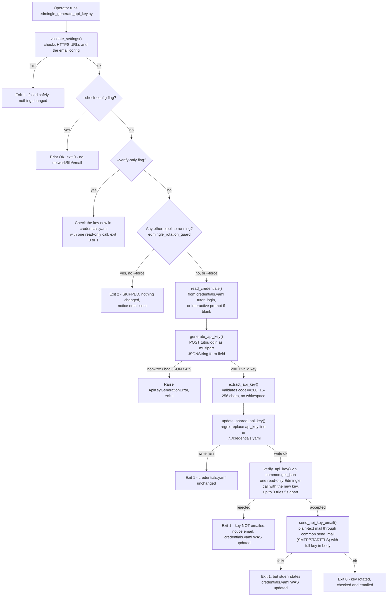

# Edmingle API Key Generator

## 1. Overview & Purpose

**A utility, not a data-producing pipeline.** It logs into Edmingle with a tutor username/password, obtains a fresh API key, writes it into the shared `credentials.yaml`, and emails a notification. Every other `ela_datasets` pipeline only **reads** `edmingle.api_key`; this is the only script that **writes** it. Because of that it **refuses to run while any other pipeline is running** and **checks the new key works before emailing it**. It runs by itself on the 25th of every month at 09:00 IST (Section 13) and can also be run by hand.

**Purpose:** rotate the shared Edmingle API key without printing, logging or persisting the raw key anywhere except the `credentials.yaml` write and the notification email body.

## 2. High-Level Data Flow



**Lineage:** tutor login → key extracted/validated → `credentials.yaml` rewritten → every other
`ela_datasets` pipeline reads the new key on its next run → notification emailed.

## 3. Repository Structure

| Path | Purpose |
|---|---|
| `scripts/edmingle_generate_api_key.py` | Entry point — loads its settings (`credentials.yaml` tutor login/base URL, `../notifications.yaml`), validates them, logs in, extracts/validates the key, writes it, checks it, and sends the emails through `common.send_mail`. |
| `scripts/edmingle_credentials_writer.py` | The only code allowed to write `credentials.yaml` — targeted regex replace of the `api_key` line only. |
| `scripts/edmingle_rotation_guard.py` | Refuses to rotate while another `ela_datasets` pipeline is running (reads `/proc`, Linux only). |
| `../notifications.yaml` | This pipeline's own SMTP/recipient config (restricted permissions, not committed). |
| `scripts/run_generate_and_email_api_key.bat` | Windows launcher for the full real run. |
| `scripts/test_edmingle_api_key_generator.py`, `test_credentials_writer.py`, `test_rotation_guard.py` | Offline unit tests (34 total). |
| `output/README.md` | Placeholder — this pipeline produces no data output. |
| `output/rotation.log` | Written only by the monthly cron run (timestamp + the script's messages, never the key). |
| `../../credentials.yaml` | Holds `tutor_login.{login_url,username,password}` (read) and `api_key` (rewritten). |
| `../../common.py` | Supplies `load_credentials()`/`load_notifications()`. |

## 4. Source System

| Source | Endpoint | Method | Auth | Parameters | Pagination | Rate Limit |
|---|---|---|---|---|---|---|
| Edmingle tutor login | `<login_url>` from `credentials.yaml` (`.../tutor/login`) | POST | None — this call *is* the login; username/password in the body | Multipart form field `JSONString` = `{"username","password"}` serialized to a string, not a standard JSON body | N/A — single request | Not identified — no rate limiter; one request per run, `429` is immediately terminal, never retried |

## 5. Extraction Process

1. `validate_settings()` fails fast (no network) if the login URL or base URL isn't HTTPS, the organization id is missing, or the SMTP host, sender, app password or recipients are missing. `--check-config` stops here.
2. `read_credentials()` reads the tutor username/password (prompts via `getpass` if blank).
3. `generate_api_key()` makes exactly one multipart POST; a `429` or any non-2xx status is terminal, no retry.
4. `extract_api_key()` requires `code==200` and a 16–256 character, whitespace-free key.
5. `update_shared_api_key()` rewrites the `api_key` line via regex — **before** the email, since the rotation is the operationally important step — then `verify_api_key()` checks the new key (through `common.get_json`, retrying 400s too, since a brand-new key may take a moment to activate) and `send_api_key_email()` sends the plaintext notification through the shared mailer (a failed delivery is an error here, unlike other pipelines' best-effort mail). If the write succeeds but a later step fails, stderr says the credential was already rotated.

## 6. Function Reference

- **`validate_settings()`** — HTTPS URL, positive timeout, email sender/recipients set; raises `ValueError` before any network/file/email activity.
- **`read_credentials()`** — configured username/password, else interactive prompt; raises if either is empty.
- **`extract_api_key(payload)`** — requires `code==200` and a non-empty `user.apikey` of 16–256 chars with no whitespace; error messages are cut to 200 chars.
- **`generate_api_key(username, password, session=None)`** — the single login POST; network errors, invalid JSON, `429` and non-2xx raise `ApiKeyGenerationError`, no retry.
- **`update_shared_api_key(path, key)`** — refuses an empty key; regex-replaces exactly one `api_key: "..."` line (refuses on zero or several matches); writes via `.tmp` + `fsync` + `os.replace()`.
- **`send_api_key_email(...)`** — plaintext message (username, timestamp, full key) via `common.send_mail` (SMTP with STARTTLS; login is the configured sender address); raises `EmailDeliveryError` if it was not delivered. `send_notice_email()` sends the key-free status notices the same way and never raises.

## 7. Configuration & Parameters

- **CLI:** `--check-config` (validate only — no network/file/email); `--verify-only` (one read-only call to check the key now in `credentials.yaml` still works, changes nothing); `--force` (rotate even if other pipelines are running — they will fail with invalid credentials until restarted).
- **Exit codes:** `0` done; `1` failed; `2` skipped because a pipeline is running (nothing changed).
- **`../../credentials.yaml`:** `tutor_login.{login_url,username,password}` (read), `api_key` (rewritten).
- **`notifications.yaml`:** SMTP host/port/from/app-password/timeout, `to_addresses`; Slack/Teams blocks present but disabled and unused.
- **`../../credentials.yaml` also needs** `base_url` (https) and `organization_id`, used only to check the new key.
- **Hardcoded:** `REQUEST_TIMEOUT_SECONDS=30`; accepted key length 16–256 chars; key check = 3 attempts, 5s apart.
- Neither YAML file is committed to version control. No secret values appear in this document.

## 8. Data Transformation, Output & Schema

**Transformations:** login payload shaped as a JSON string inside a multipart field · key trimmed and length/whitespace-validated before trust · `credentials.yaml` patched by regex (no YAML re-dump, so other formatting is untouched) · email body from username, timestamp and key.

**Output / schema / database:** none — no dataset. The only persistent effects are rewriting one line of `credentials.yaml` and sending emails; `output/` holds a placeholder README (and `rotation.log` from cron).

## 9. Data Quality & Known Limitations

**Implemented checks:** login URL must be HTTPS, timeout must be positive, email config complete,
response `code==200` with a present key, key length/whitespace validation, exactly-one-match
requirement before writing `credentials.yaml`, non-empty key before writing.

**Confirmed limitations:**
- No check that the new key actually differs from the previous one — a no-op rotation isn't detected.
- No retry on the single login call — a failure is terminal, emails a notice, and waits for the next scheduled run or a manual re-run.
- Rotating always invalidates the previous key immediately (verified 2026-09-25), so anything holding the old key fails. The running-pipeline guard only sees processes **on the machine it runs on**, only on Linux, and cannot catch a pipeline that starts in the instant after the check; it also does not know about a copy of the key stored elsewhere.
- **Known, not fixed:** each rotation recreates `credentials.yaml`, which resets its permissions from `600` to `664` (found 2026-09-25; other users cannot reach it today only because the home directory is `750`). Run `chmod 600 ../../credentials.yaml` after a rotation until the writer is fixed.
- If the new key fails its check, the old key is already revoked and is not kept anywhere, so there is no automatic rollback — the notice email says so and the key is not emailed.
- The key is emailed in plaintext to every address in `to_addresses`.
- The credentials writer's regex depends on the file's current formatting — a structural change makes it refuse to write (fails safely, but needs re-validating).

**Cadence (decided 2026-09-25 by the project owner):** monthly, 25th at 09:00 IST, by cron.

## 10. Error Handling & Logging

`print()`/`sys.stderr`, not `logging`. `main()` catches `ApiKeyGenerationError`/`EmailDeliveryError`/`CredentialsUpdateError`/`ValueError` and reports either "failed safely" (nothing changed) or, if the write already succeeded, that the key **was** rotated though a later step failed (e.g. `credentials.yaml WAS updated with the new key, but a later step failed: <error>`). No retry on the login call by design. The key value cannot appear in any log/print/exception message (checked across the three key-handling modules).

## 11. Dependencies

| Dependency | Purpose |
|---|---|
| `requests>=2.31,<3` | HTTP POST to the login endpoint |
| `PyYAML>=6.0,<7` | Reading both YAML config files |
| `common` (repo root) | `load_credentials`/`load_notifications`, `get_json` (key check), `send_mail` |
| stdlib (`re`, `getpass`, `argparse`, `json`) | Credential patching, CLI |

## 12. Setup & How to Run

Step-by-step guide: [RUN_GUIDE.md](RUN_GUIDE.md). Before running: fill in `../../credentials.yaml`'s `tutor_login` block (a blank username/password forces a prompt) and `../notifications.yaml` (valid SMTP settings, at least one recipient). It also has its own `requirements.txt`, so it can run standalone (e.g. on Windows via `run_generate_and_email_api_key.bat`) as well as with the shared venv.

```bash
source /home/projectdev/ela_datasets/.venv/bin/activate
cd /home/projectdev/ela_datasets/edmingle_api_key_generator/scripts
python3 edmingle_generate_api_key.py                # rotate the live key and email it
python3 edmingle_generate_api_key.py --check-config # settings only (no network/file/email)
python3 edmingle_generate_api_key.py --verify-only  # does the current key still work? changes nothing
python3 edmingle_generate_api_key.py --force        # rotate even if a pipeline is running (it will fail)
python3 -m unittest discover                        # tests (fully offline)
```

Short manual utility, so there is no tmux section.

## 13. Automation / Scheduling

**Yes — monthly, on the 25th at 09:00 IST**, by cron on the VPS (added 2026-09-25 at the project owner's request). The server clock is UTC, so the entry is:

```
30 3 25 * *   cd .../edmingle_api_key_generator/scripts && (date -Is; .venv/bin/python3 edmingle_generate_api_key.py) >> ../output/rotation.log 2>&1
```

- **Next runs:** 2026-10-25, 2026-11-25, 2026-12-25 (03:30 UTC each).
- **If a pipeline is running,** nothing is rotated: exit code 2, the reason goes to `output/rotation.log`, and a "SKIPPED" notice is emailed. There is no retry until next month — rotate by hand once it finishes if needed sooner.
- **Emails:** the new key (after it was saved *and* checked), or a "SKIPPED" / "FAILED" / "FAILED - new key not accepted" notice. Notices never contain the key and need `app_password` set in `../notifications.yaml` (a scheduled run has nobody to prompt).
- **Not yet exercised end to end:** the guard, key check, notices and cron entry passed 34 unit tests plus `--verify-only` and the guard against the real process table, but no full scheduled rotation has run since they were added.

## 14. Important Business / Technical Rules

- Write-before-notify is deliberate — the rotation itself must not be gated on email delivery succeeding.
- The running-pipeline guard runs **before** any prompt or network call, because the login request is what revokes the old key.
- The key is checked **after** it is saved and **before** it is emailed: a key Edmingle rejects is never sent out, and the notice email never contains a key.
- This is the only script permitted to write `credentials.yaml`, enforced structurally (refuse-to-write on any mismatch), not just by convention.
- The raw key is never logged, printed, or persisted anywhere except the credentials line and the email body.
- Key format validation (16–256 chars, no whitespace) exists specifically to catch a malformed response before it reaches the file every pipeline trusts.

## 15. Troubleshooting

| Scenario | Likely cause | Check |
|---|---|---|
| "Failed safely: ..." with no `credentials.yaml` mention | Failure before the write step (bad login, malformed key, timeout config) | The printed error; `--check-config` to isolate config vs. network issues |
| "credentials.yaml WAS updated ... but a later step failed" | Rotation succeeded, email failed | The new key is already live — check `notifications.yaml`'s SMTP settings, don't re-rotate |
| `ApiKeyGenerationError: ... rate-limited` | HTTP 429 from Edmingle | Wait before retrying — no automatic backoff |
| `CredentialsUpdateError: could not find a single 'api_key' line` | `credentials.yaml`'s structure changed | Re-check the regex in `edmingle_credentials_writer.py`; re-run its tests |
| Exit code 2, "Not rotating: these pipelines are running" | A pipeline (named in the message) is running | Wait for it to finish and run again; `--force` only if you accept it will fail |
| "credentials.yaml WAS updated ... but Edmingle did not accept it" | Login worked but the new key is rejected | Old key is already revoked — check the tutor login and `credentials.yaml` on the server; `--verify-only` re-tests |
| No email on the 25th | Cron didn't run, or the app password is blank/wrong | `output/rotation.log`; `crontab -l`; notices need `app_password` set in `../notifications.yaml` |
| Unexpected interactive prompt | The tutor username/password is blank in `credentials.yaml` | Populate it, or answer the prompt (the email app password is never prompted for: it must be set in `notifications.yaml`) |

## 16. Maintenance Guide

- **Key length/format change** → the bounds check in `extract_api_key()`.
- **Credentials write mechanism change** → `_API_KEY_LINE` regex and `update_shared_api_key()` in `edmingle_credentials_writer.py`; re-run its tests afterward.
- **Email content/recipients** → `build_api_key_email()`, or `notifications.yaml`'s `to_addresses`.
- **SMTP provider change** → `notifications.yaml`'s `channels.email.smtp` block, no code change.
- **Change the schedule** → the `30 3 25 * *` line in `crontab -l` on the VPS (server clock is UTC; 03:30 UTC = 09:00 IST).
- **New notification channel** → Slack/Teams blocks already exist as disabled placeholders, unread by any current code.

## 17. Upstream & Downstream Dependencies

**Upstream:** Edmingle's tutor login endpoint and the tutor's credentials. **Downstream:** every other `ela_datasets` pipeline that reads `credentials.yaml` depends on this script to keep `api_key` valid.

## 18. Security Considerations

The tutor credentials and the generated key exist only in memory and the two sanctioned destinations. Both YAML files are gitignored. The notification email is plaintext over SMTP with STARTTLS (encrypted in transit, but the key is not encrypted in the body). The writer's refuse-to-write on a structural mismatch protects the shared credentials file from silent corruption.

## 19. Raw API Payload (Captured Structure)

**Not captured live, deliberately** — the login endpoint issues a new API key and this pipeline then rewrites
`credentials.yaml`, so calling it just to inspect a payload would rotate the live shared key and break every
other pipeline. Shapes below come from the code (`generate_api_key()` / `extract_api_key()`).

**Request:** `POST <login_url>` as multipart form field `JSONString` (a JSON *string*, not a JSON body):
```json
{"username": "<str>", "password": "<str -- never log>"}
```
**Response** (fields the code reads; anything else unconfirmed):
```json
{
  "code": 200,
  "message": "<str>",
  "user": {
    "apikey": "<str, 16-256 chars, no whitespace -- never record a real one>"
  }
}
```

## 20. Future Improvements

1. **Email the output on completion** — send a completion email that includes the run status *and* attaches the generated dataset file(s), not just a status notification.
2. **Scheduled automation** — run automatically on a defined schedule instead of a manual trigger.
3. **Data cleaning layer** — a dedicated cleaning step/script (nulls, duplicates, standardization) inside the pipeline, instead of leaving it to downstream consumers.

---
*Initial documentation: 2026-09-24. Project/technical owner: requires confirmation.*
