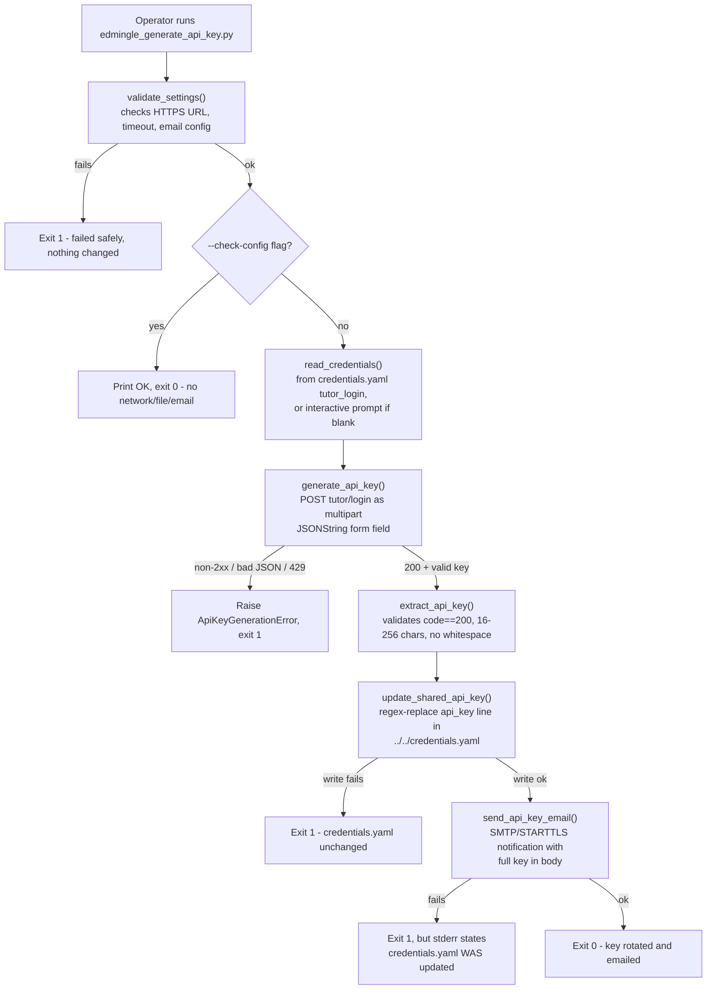

# Edmingle API Key Generator

## 1. Overview

`edmingle_api_key_generator` is **a utility, not a data-producing pipeline**. It does not extract, transform, or output any dataset. Its sole job is to log in to Edmingle with a real tutor username/password, obtain a fresh API key, write that key into the shared `credentials.yaml` at the root of `ela_datasets/`, and email a notification of the new key to a configured recipient list. Every one of the other seven pipelines under `ela_datasets/` (including the other three documented alongside this one) only **reads** `edmingle.api_key` from `credentials.yaml`; this is the only script in the repository that **writes** to it.

Because it rewrites a credential every other pipeline depends on, it is designed to be run deliberately by a person, never automatically or on a schedule.

## 2. Purpose

To rotate the single Edmingle API key shared by all `ela_datasets/` pipelines, without ever printing, logging, or persisting the raw key value anywhere except the two places it is operationally required: the `credentials.yaml` write and the outgoing notification email body.

## 3. High-Level Data Flow



## 4. Project / Repository Structure

| File / Folder | Purpose |
|---|---|
| `scripts/edmingle_generate_api_key.py` | Entry point. Validates settings, reads tutor credentials, calls the Edmingle login endpoint, extracts/validates the key, orchestrates the `credentials.yaml` write then the email. |
| `scripts/edmingle_api_key_settings.py` | Loads non-secret and secret settings from `../../credentials.yaml` (via shared `common.load_credentials()`) and this folder's own `notifications.yaml` (via `common.load_notifications()`). |
| `scripts/edmingle_credentials_writer.py` | The only code in the repo allowed to write to `credentials.yaml`. Does a targeted regex replace of the `api_key: "..."` line so comments/formatting elsewhere in the file are untouched. |
| `scripts/edmingle_api_key_email.py` | Builds the notification email (subject/body with the new key) and sends it over SMTP with STARTTLS. |
| `scripts/notifications.yaml` | This folder's own SMTP/recipient configuration (permissions restricted, not committed to version control). |
| `scripts/requirements.txt` | `requests>=2.31,<3`, `PyYAML>=6.0,<7`. |
| `scripts/run_generate_and_email_api_key.bat` | Windows double-click launcher; runs the script with no arguments (the full, real flow). |
| `scripts/test_edmingle_api_key_generator.py` | 5 offline unit tests: multipart request shape, key extraction, bad-login rejection, email content. |
| `scripts/test_credentials_writer.py` | 6 offline unit tests: `update_shared_api_key()` in isolation (line replacement, formatting preservation, error cases). |
| `output/README.md` | Placeholder explaining that this pipeline produces no file output (only writes to the shared `credentials.yaml` and sends email). |
| `README.md` | Full workflow/config/testing documentation for this utility. |
| `PACKAGE_CONTENTS.md` | Short file-by-file manifest of the package. |
| `../../credentials.yaml` (shared, outside this folder) | Holds `edmingle.tutor_login.{login_url,username,password}` (read) and `edmingle.api_key` (the field this script rewrites). |
| `../../common.py` (shared, outside this folder) | Supplies `load_credentials()` / `load_notifications()` used by `edmingle_api_key_settings.py`. |

## 5. Source System

| Source | Type | Endpoint | HTTP Method | Authentication | Parameters | Pagination | Rate Limit |
|---|---|---|---|---|---|---|---|
| Edmingle tutor login | REST API | `<edmingle.tutor_login.login_url>` from `credentials.yaml` (currently ending in `.../tutor/login`) | POST | None (this call itself performs the login) — username/password supplied in the request body | Multipart form-data, single field `JSONString` whose value is `{"username": ..., "password": ...}` serialized to a JSON string (not a standard `application/json` body) | Not applicable (single request) | Not identified in the current implementation — no rate limiter is used; exactly one request is made per run and HTTP 429 is treated as an immediate terminal error, never retried. |

## 6. Extraction Process

1. `main()` calls `validate_settings()`, which fails fast (no network call) if `EDMINGLE_LOGIN_URL` is not HTTPS, `REQUEST_TIMEOUT_SECONDS` is not positive, or email sender/recipients are unconfigured.
2. If `--check-config` was passed, the script prints a confirmation and exits 0 here — no network request, file write, or email.
3. `read_credentials()` reads `EDMINGLE_USERNAME`/`EDMINGLE_PASSWORD` from `credentials.yaml`'s `edmingle.tutor_login` block; if either is blank, it falls back to an interactive prompt (`getpass` hides the password).
4. The Gmail app password for the notification email is read from `notifications.yaml`; if blank, another hidden interactive prompt is used.
5. `generate_api_key(username, password)` makes **exactly one** POST request to the login URL as multipart form-data with a single `JSONString` field (mirrors Postman's form-data equivalent, not a JSON body).
6. The response is parsed as JSON; HTTP 429 is raised immediately as a terminal error (no retry); any other non-2xx status is also terminal.
7. `extract_api_key()` validates the payload: `code == 200` and `user.apikey` must be a non-empty string 16–256 characters long with no whitespace, else `ApiKeyGenerationError` is raised.
8. `update_shared_api_key()` rewrites the `api_key: "..."` line in `../../credentials.yaml` via a targeted regex replace (preserving comments/formatting) — done **before** the email, since the credential rotation is the operationally important step.
9. `send_api_key_email()` sends a plaintext notification (full key in the body) via SMTP/STARTTLS to the configured recipients.
10. `main()` reports success only if both the write and the email succeeded; if the write succeeded but the email failed, stderr explicitly states the credential was already rotated.

## 7. Detailed Function Documentation

### `validate_settings()`
- **Purpose:** Fail fast before any network/file/email activity if configuration is structurally invalid.
- **Inputs:** none (reads module-level `settings.*` constants).
- **Output:** none; raises `ValueError` on failure.
- **Processing:** Checks `EDMINGLE_LOGIN_URL` starts with `https://`, `REQUEST_TIMEOUT_SECONDS > 0`, and both `EMAIL_FROM`/`EMAIL_TO` are non-empty.
- **Dependencies:** `edmingle_api_key_settings`.

### `read_credentials() -> tuple[str, str]`
- **Purpose:** Obtain the Edmingle tutor username/password to log in with.
- **Inputs:** none (reads `settings.EDMINGLE_USERNAME` / `EDMINGLE_PASSWORD`).
- **Output:** `(username, password)` tuple.
- **Processing:** Uses configured values if present; otherwise prompts interactively (`getpass.getpass` for the password). Raises `ValueError` if either ends up empty.
- **Dependencies:** `getpass`.

### `extract_api_key(payload: Any) -> str`
- **Purpose:** Validate and pull the new key out of Edmingle's login response.
- **Inputs:** `payload` — parsed JSON response body.
- **Output:** validated API key string.
- **Processing:** Requires `payload["code"] == 200` and `payload["user"]["apikey"]` to be a non-empty string; truncates any error message to 200 chars for safety; enforces 16–256 character length with no whitespace.
- **Dependencies:** none beyond stdlib.

### `generate_api_key(username, password, session=None) -> str`
- **Purpose:** Perform the single Edmingle login call and return the extracted key.
- **Inputs:** `username`, `password`, optional `requests.Session`.
- **Output:** API key string (via `extract_api_key`).
- **Processing:** POSTs multipart form-data (`files={"JSONString": (None, json_string)}`) with `Accept: application/json` and a custom `User-Agent`; treats network errors, invalid JSON, HTTP 429, and any non-2xx status as immediate `ApiKeyGenerationError`s (no retry logic).
- **Dependencies:** `requests`.

### `update_shared_api_key(credentials_path, new_api_key)` (in `edmingle_credentials_writer.py`)
- **Purpose:** Atomically rewrite only the `api_key` line of the shared `credentials.yaml`.
- **Inputs:** path to `credentials.yaml`, the new key string.
- **Output:** none; raises `CredentialsUpdateError` on any failure.
- **Processing:** Refuses to write an empty/whitespace key; uses a regex (`^(\s*api_key:\s*)"[^"]*"(.*)$`, multiline) to replace exactly one matching line; if zero or more than one line matches, refuses to write (protects against a restructured file); writes to a `.tmp` file, `fsync`s, then `os.replace()`s into place.
- **Dependencies:** `re`, `os`.

### `send_api_key_email(api_key, username, email_password)` (in `edmingle_api_key_email.py`)
- **Purpose:** Deliver the new key to the configured recipients by email.
- **Inputs:** the new key, the Edmingle username used, the Gmail app password.
- **Output:** none; raises `EmailDeliveryError` on failure.
- **Processing:** Validates recipients/SMTP host/port/timeout are all present; builds a plaintext message (`build_api_key_email`) containing the username, generation timestamp, and the full key; connects via `smtplib.SMTP` with `starttls()` (a `ssl.create_default_context()`), logs in, and sends.
- **Dependencies:** `smtplib`, `ssl`.

## 8. Input Parameters & Configuration

- **CLI arguments:** `--check-config` (validates configuration only; makes no network call, file write, or email).
- **`../../credentials.yaml`** (`edmingle:` block, shared repo-wide):
  - `tutor_login.login_url`, `tutor_login.username`, `tutor_login.password` — read.
  - `api_key` — the field this script rewrites.
- **`notifications.yaml`** (local to this folder):
  - `channels.email.smtp.{host,port,from_address,app_password,timeout_seconds}`
  - `channels.email.to_addresses`
  - `channels.slack` / `channels.teams` — present but `enabled: false` placeholders, unused.
- **Hardcoded values:** `REQUEST_TIMEOUT_SECONDS = 30` (in `edmingle_api_key_settings.py`); accepted key length range 16–256 characters (in `extract_api_key`).
- **Neither `credentials.yaml` nor `notifications.yaml` is committed to version control.**
- No secret values are reproduced anywhere in this document.

## 9. Data Transformation

| Transformation | Description |
|---|---|
| Login payload shaping | `{"username": ..., "password": ...}` is JSON-serialized to a string, then sent as the value of a single multipart field `JSONString` — not a standard JSON POST body. |
| Key validation | Extracted `user.apikey` string is trimmed and checked for length (16–256) and absence of whitespace before being trusted. |
| Credential file patch | The new key is spliced into `credentials.yaml`'s existing `api_key: "..."` line via regex substitution — no YAML parse/re-dump, so comments and formatting elsewhere in the file are unaffected. |
| Email body construction | Username, a localized timestamp (`%Y-%m-%d %H:%M:%S %Z`), and the full key are assembled into a fixed-format plaintext message. |

## 10. Output Dataset

**Not applicable.** This utility produces no CSV/XLSX/JSON dataset. Its only persistent side effects are (a) rewriting one line of the shared `credentials.yaml`, and (b) sending one notification email. The `output/` folder exists only as a placeholder with its own short `README.md` explaining that it holds no generated files.

## 11. Output Schema

**N/A** — this pipeline produces no dataset, so there is no output schema to document.

## 12. Data Quality & Validation

| Check | Implemented? |
|---|---|
| Login URL must be HTTPS | Yes — `validate_settings()` |
| Request timeout must be positive | Yes — `validate_settings()` |
| Email sender/recipients configured | Yes — `validate_settings()` and `validate_email_settings()` |
| Response `code == 200` and `user.apikey` present | Yes — `extract_api_key()` |
| Key length 16–256 chars, no whitespace | Yes — `extract_api_key()` |
| Exactly one `api_key:` line exists before writing | Yes — `update_shared_api_key()` refuses to write on 0 or >1 matches |
| New key is non-empty / non-whitespace before writing | Yes — `update_shared_api_key()` |

### Quality limitations not handled
- No validation that the *previous* key was actually different from the new one (a no-op rotation is not detected or flagged).
- No automatic verification, after writing, that the new key actually works against a live endpoint (that check exists only in other pipelines' own startup checks, e.g. `ela_mis_datasets`).
- No retry on transient network failure during the single login call — any failure is immediately terminal for that run.

## 13. Error Handling & Logging

This utility uses `print()`/`sys.stderr`, not the `logging` module — there is no `.log` file for this pipeline.

- `ApiKeyGenerationError`, `EmailDeliveryError`, `CredentialsUpdateError`, and `ValueError` are all caught in `main()`; each is reported as either "Failed safely" (nothing changed) or, if `credentials.yaml` was already updated before the failure, an explicit stderr message stating the key **was** rotated.
- The Edmingle login call has **no retry logic**: a network error, a non-2xx status, an HTTP 429, or invalid JSON is all raised immediately as `ApiKeyGenerationError` — by design, since this is a short, human-initiated action rather than a long unattended run.
- Error messages are structurally prevented from containing the key value — verified against the source: `extract_api_key`, `update_shared_api_key`, and `send_api_key_email` never pass the `api_key` variable to `print()`, `logging`, or an exception message.
- Example of the failure-mode messaging (from `main()`'s exception handling, verbatim pattern in the source):
  ```
  credentials.yaml WAS updated with the new key, but a later step failed: <error>
  ```

## 14. Dependencies

| Dependency | Purpose | Required |
|---|---|---|
| `requests>=2.31,<3` | HTTP POST to the Edmingle login endpoint | Yes |
| `PyYAML>=6.0,<7` | Reading `credentials.yaml` / `notifications.yaml` (via shared `common.py`) | Yes |
| Python standard library (`smtplib`, `ssl`, `re`, `getpass`, `argparse`, `json`) | Email delivery, credential-file patching, CLI parsing | Yes (built-in) |

## 15. Setup

1. Ensure `../../credentials.yaml` exists at the `ela_datasets/` repo root with a populated `edmingle.tutor_login` block (username/password may be left blank to force an interactive prompt).
2. Ensure this folder's `notifications.yaml` has valid SMTP settings and at least one recipient in `channels.email.to_addresses`.
3. Install dependencies: `pip install -r requirements.txt` (from inside `scripts/`).
4. Neither credentials file should ever be committed to version control (both are gitignored at the repo root, per `README.md`).

## 16. How to Run

- **Full, real run** (rotates the live key and emails it):
  ```
  python3 edmingle_generate_api_key.py
  ```
- **Configuration check only** (no network call, no file write, no email):
  ```
  python3 edmingle_generate_api_key.py --check-config
  ```
- **Windows double-click launcher** (same as the full run, no arguments):
  ```
  run_generate_and_email_api_key.bat
  ```
- **Tests** (fully offline, no real network/file/email calls):
  ```
  python3 -m unittest discover
  ```
  from inside `scripts/`.

## 17. Automation / Scheduling

**None, and deliberately so.** The project's own `README.md` states explicitly: "Never run this automatically or on a schedule." Unlike every other pipeline in `ela_datasets/`, this script authenticates with a real tutor username/password and rewrites a credential every other pipeline depends on — it is meant to be run only when a human deliberately intends a key rotation.

## 18. Database / Warehouse Integration

Not applicable — this pipeline writes only to the shared `credentials.yaml` file and sends an email; it performs no CSV/XLSX/JSON dataset output and has no database/warehouse integration.

## 19. Data Lineage

```
Edmingle tutor login (POST /tutor/login)
        |
        v
extract_api_key() validates response
        |
        v
update_shared_api_key() rewrites ../../credentials.yaml (edmingle.api_key)
        |
        +--> every other ela_datasets/ pipeline reads this file on its next run
        |
        v
send_api_key_email() -> SMTP -> configured recipients' inboxes
```

## 20. Important Business / Technical Rules

- **Write-before-notify ordering is deliberate:** `credentials.yaml` is updated *before* the email is sent, because the credential rotation is the operationally important step and must not be gated on email delivery succeeding.
- **This is the only script permitted to write `credentials.yaml`.** The regex-based writer exists specifically so this rule can be enforced structurally (refuse-to-write on any structural mismatch) rather than just by convention.
- **The raw key value is never logged, printed, or persisted anywhere** except the single `credentials.yaml` line and the outgoing email body — enforced by inspection of every call site across the three key-handling modules.
- **Key format validation (16–256 chars, no whitespace)** exists specifically to catch a malformed/truncated response before it ever gets written to the shared file that every other pipeline trusts.

## 21. Known Limitations

### Confirmed limitations
- Running this script is **inherently disruptive**: it immediately invalidates the previous API key for every other pipeline currently using it. There is no coordination mechanism to check whether another pipeline is mid-run before rotating.
- No retry on the single login call — any transient network hiccup fails the entire run immediately (by design, per the project's own documentation, since this is a short human-initiated action, not a long unattended one).
- The generated key is emailed in **plaintext** in the message body to every address in `to_addresses` — the project's own README calls out keeping that recipient list tight as a mitigation, not a fix.
- The `edmingle_credentials_writer.py` regex depends on `credentials.yaml`'s current formatting (an `api_key: "..."` line). If that file's structure is ever changed, the writer will refuse to write rather than risk corruption — this fails safely but does require re-validating the regex per the project's own README guidance.

### Requires confirmation
- Whether any operational runbook or calendar reminder exists for *when* this rotation should be run (e.g., a ~30-day cadence referenced in another pipeline's README) is not evidenced in this folder's own files — requires confirmation from the project owner.

## 22. Troubleshooting

| Scenario | Likely cause | What to check |
|---|---|---|
| "Failed safely: ..." with no `credentials.yaml` mention | Failure occurred before the write step (bad tutor login, malformed key, timeout config) | Check the printed error message and `validate_settings()`'s checks; re-run `--check-config` to isolate configuration issues from network issues. |
| "credentials.yaml WAS updated ... but a later step failed" | The key rotation succeeded but the notification email failed | The new key is already live — check `notifications.yaml`'s SMTP settings (host/port/app password) rather than re-running the rotation. |
| `ApiKeyGenerationError: Edmingle rate-limited the login request` | HTTP 429 from Edmingle | Wait before retrying; there is no automatic backoff for this endpoint. |
| `CredentialsUpdateError: could not find a single 'api_key: "..."' line` | `credentials.yaml`'s structure changed (quoting/formatting) | Re-check the regex in `edmingle_credentials_writer.py` against the file's current format; re-run `test_credentials_writer.py`. |
| Interactive password prompt appears unexpectedly | `EDMINGLE_USERNAME`/`EDMINGLE_PASSWORD` (or the Gmail app password) is blank in the relevant YAML | Populate `credentials.yaml`/`notifications.yaml`, or supply the value at the prompt. |

## 23. Maintenance Guide

- **Changing the accepted key length/format:** edit the bounds check in `extract_api_key()` in `edmingle_generate_api_key.py`.
- **Changing the credentials.yaml write mechanism:** edit `_API_KEY_LINE` regex and `update_shared_api_key()` in `edmingle_credentials_writer.py`; re-run `test_credentials_writer.py` afterward (per the project's own README guidance).
- **Changing email content/recipients:** edit `build_api_key_email()` in `edmingle_api_key_email.py` for content, or `notifications.yaml`'s `to_addresses` for recipients.
- **Changing SMTP provider/settings:** edit `notifications.yaml`'s `channels.email.smtp` block; no code change needed.
- **Adding a new notification channel:** `channels.slack` / `channels.teams` blocks already exist as disabled placeholders in `notifications.yaml` but are not read by any code in this folder today.

## 24. Upstream & Downstream Dependencies

- **Upstream:** Edmingle's tutor login endpoint (external system); the tutor's own username/password credentials.
- **Downstream:** Every other pipeline under `ela_datasets/` that calls `common.load_credentials()` (all seven others) depends on `credentials.yaml`'s `edmingle.api_key` being valid — this script is their sole means of updating it.

## 25. Security Considerations

- Real tutor login credentials and the generated API key are handled only in memory and in the two sanctioned destinations (`credentials.yaml`, the notification email) — never logged or printed.
- `credentials.yaml` and `notifications.yaml` are both excluded from version control (confirmed via the parent `README.md`; not independently verified against `.gitignore` contents in this audit beyond that statement).
- The notification email is sent in plaintext over SMTP with STARTTLS (encrypted in transit to the mail server), but the key is not encrypted in the message body itself.
- `edmingle_credentials_writer.py`'s refuse-to-write behavior on a structural mismatch is itself a security control: it prevents a malformed regex match from silently corrupting the shared credentials file that every pipeline depends on.

## 26. Change Log

| Date | Version | Change | Author |
|---|---|---|---|
| 2026-09-24 | 1.0 (initial documentation) | Initial technical documentation created from a full audit of the current codebase on the VPS. | — |

## 27. Ownership

- **Project Owner:** Requires confirmation from the project owner.
- **Technical Owner:** Requires confirmation from the project owner.
