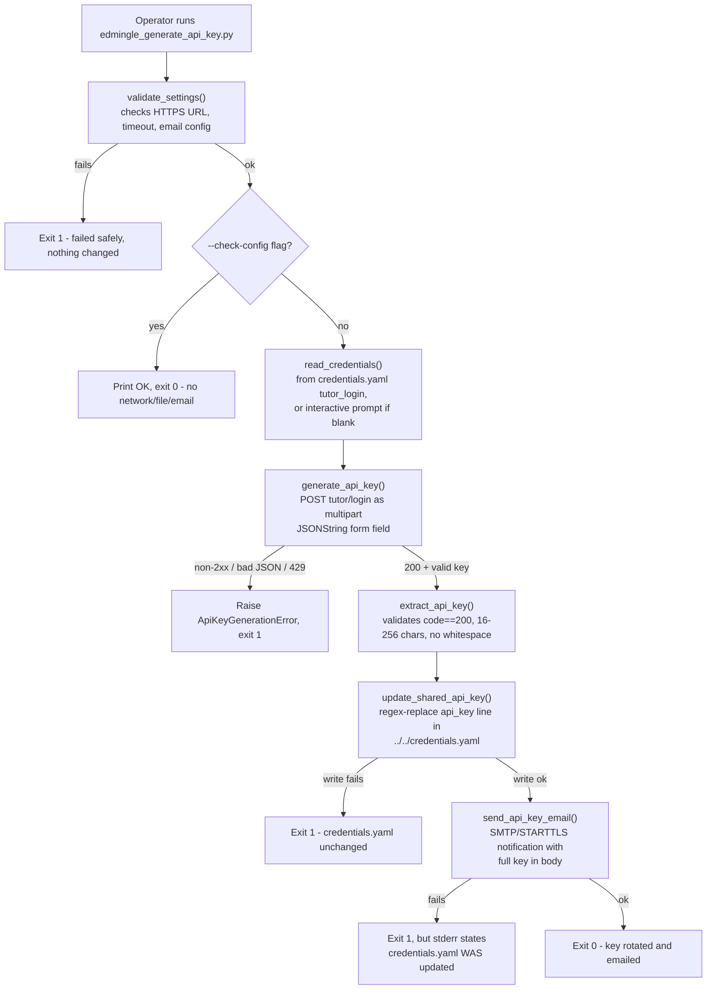

# Edmingle API Key Generator

## 1. Overview & Purpose

**A utility, not a data-producing pipeline.** It logs into Edmingle with a real tutor
username/password, obtains a fresh API key, writes it into the shared `credentials.yaml`, and
emails a notification. Every other `ela_datasets` pipeline only **reads** `edmingle.api_key`;
this is the only script that **writes** it. Because it rewrites a credential every other pipeline
depends on, it's designed to be run deliberately by a person, never automatically.

**Purpose:** rotate the shared Edmingle API key without ever printing, logging, or persisting the
raw key anywhere except the `credentials.yaml` write and the notification email body.

## 2. High-Level Data Flow



**Lineage:** tutor login → key extracted/validated → `credentials.yaml` rewritten → every other
`ela_datasets` pipeline reads the new key on its next run → notification emailed.

## 3. Repository Structure

| Path | Purpose |
|---|---|
| `scripts/edmingle_generate_api_key.py` | Entry point — validates settings, logs in, extracts/validates the key, orchestrates the write then the email. |
| `scripts/edmingle_api_key_settings.py` | Loads settings from `credentials.yaml` and `../notifications.yaml`. |
| `scripts/edmingle_credentials_writer.py` | The only code allowed to write `credentials.yaml` — targeted regex replace of the `api_key` line only. |
| `scripts/edmingle_api_key_email.py` | Builds and sends the notification email (SMTP/STARTTLS). |
| `../notifications.yaml` | This pipeline's own SMTP/recipient config (restricted permissions, not committed). |
| `scripts/run_generate_and_email_api_key.bat` | Windows launcher for the full real run. |
| `scripts/test_edmingle_api_key_generator.py`, `test_credentials_writer.py` | Offline unit tests (11 total). |
| `output/README.md` | Placeholder — this pipeline produces no file output. |
| `../../credentials.yaml` | Holds `tutor_login.{login_url,username,password}` (read) and `api_key` (rewritten). |
| `../../common.py` | Supplies `load_credentials()`/`load_notifications()`. |

## 4. Source System

| Source | Endpoint | Method | Auth | Parameters | Pagination | Rate Limit |
|---|---|---|---|---|---|---|
| Edmingle tutor login | `<login_url>` from `credentials.yaml` (`.../tutor/login`) | POST | None — this call *is* the login; username/password in the body | Multipart form field `JSONString` = `{"username","password"}` serialized to a string, not a standard JSON body | N/A — single request | Not identified — no rate limiter; one request per run, `429` is immediately terminal, never retried |

## 5. Extraction Process

`validate_settings()` fails fast (no network call) if the login URL isn't HTTPS, the timeout
isn't positive, or email sender/recipients are unconfigured. `--check-config` exits here with no
network/file/email activity. `read_credentials()` reads the tutor username/password (interactive
prompt via `getpass` if blank); the Gmail app password is read similarly. `generate_api_key()`
makes exactly one multipart POST; a `429` or any non-2xx status is immediately terminal, no
retry. `extract_api_key()` requires `code==200` and a 16–256 character, whitespace-free key.
`update_shared_api_key()` rewrites the `api_key` line via regex — done **before** the email,
since the rotation itself is the operationally important step. `send_api_key_email()` then sends
a plaintext notification. If the write succeeds but the email fails, stderr explicitly says the
credential was already rotated.

## 6. Function Reference

### `validate_settings()`
Checks the login URL is HTTPS, timeout is positive, and email sender/recipients are set — raises
`ValueError` otherwise, before any network/file/email activity.

### `read_credentials() -> tuple[str, str]`
Uses configured tutor username/password if present, else prompts interactively
(`getpass` for the password). Raises if either ends up empty.

### `extract_api_key(payload) -> str`
Requires `payload["code"]==200` and a non-empty `user.apikey`, 16–256 characters, no whitespace.
Error messages are truncated to 200 chars for safety.

### `generate_api_key(username, password, session=None) -> str`
The single login POST (multipart `JSONString` field). Network errors, invalid JSON, `429`, and
any non-2xx status all raise `ApiKeyGenerationError` immediately — no retry logic.

### `update_shared_api_key(credentials_path, new_api_key)`
Refuses to write an empty key; regex-replaces exactly one `api_key: "..."` line (refuses if zero
or more than one match, protecting against a restructured file); writes via `.tmp` +
`fsync` + `os.replace()`.

### `send_api_key_email(api_key, username, email_password)`
Validates SMTP config is complete, builds a plaintext message (username, timestamp, full key),
sends via `smtplib.SMTP` with STARTTLS.

## 7. Configuration & Parameters

- **CLI:** `--check-config` (validate only — no network/file/email).
- **`../../credentials.yaml`:** `tutor_login.{login_url,username,password}` (read), `api_key` (rewritten).
- **`notifications.yaml`:** SMTP host/port/from/app-password/timeout, `to_addresses`; Slack/Teams blocks present but disabled and unused.
- **Hardcoded:** `REQUEST_TIMEOUT_SECONDS=30`; accepted key length 16–256 chars.
- Neither YAML file is committed to version control. No secret values appear in this document.

## 8. Data Transformation, Output & Schema

**Transformations:** login payload shaped as a JSON string inside a multipart field (not a
standard JSON body) · extracted key trimmed and length/whitespace-validated before trust ·
credential file patched via regex substitution (no YAML re-dump, so formatting elsewhere is
untouched) · email body assembled from username, timestamp, and the full key.

**Output:** **Not applicable** — no CSV/XLSX/JSON dataset. The only persistent effects are (a)
rewriting one line of `credentials.yaml`, (b) sending one notification email. `output/` holds
only a placeholder README.

**Schema:** N/A — no dataset produced.

**Database integration:** not applicable.

## 9. Data Quality & Known Limitations

**Implemented checks:** login URL must be HTTPS, timeout must be positive, email config complete,
response `code==200` with a present key, key length/whitespace validation, exactly-one-match
requirement before writing `credentials.yaml`, non-empty key before writing.

**Confirmed limitations:**
- No check that the new key actually differs from the previous one — a no-op rotation isn't detected.
- No post-write verification that the new key works against a live endpoint.
- No retry on transient network failure during the single login call — immediately terminal, by design (a short human-initiated action, not a long unattended run).
- Running this script is inherently disruptive — it invalidates the previous key for every pipeline using it, with no check for a pipeline mid-run.
- The key is emailed in plaintext to every address in `to_addresses`.
- The credentials writer's regex depends on the file's current formatting — a structural change makes it refuse to write (fails safely, but needs re-validating).

**Requires confirmation:** whether any operational cadence/runbook exists for when this rotation should be run.

## 10. Error Handling & Logging

Uses `print()`/`sys.stderr`, not `logging` — no log file. `main()` catches
`ApiKeyGenerationError`/`EmailDeliveryError`/`CredentialsUpdateError`/`ValueError`, reporting
either "failed safely" (nothing changed) or, if the write already succeeded, an explicit message
that the key **was** rotated even though a later step failed. No retry on the login call by
design. The key value is structurally prevented from appearing in any log/print/exception message
(verified across all three key-handling modules). Example failure message:
`credentials.yaml WAS updated with the new key, but a later step failed: <error>`

## 11. Dependencies

| Dependency | Purpose |
|---|---|
| `requests>=2.31,<3` | HTTP POST to the login endpoint |
| `PyYAML>=6.0,<7` | Reading both YAML config files |
| stdlib (`smtplib`, `ssl`, `re`, `getpass`, `argparse`, `json`) | Email, credential patching, CLI |

## 12. Setup & How to Run

Unlike the other 7 pipelines, this tool is meant to run standalone (it's a manual, occasional key
rotation, not a scheduled data pull), so it has its own `requirements.txt` rather than relying on
the shared repo-root `.venv/` — either works, since both provide the same `requests`/`PyYAML`.

**Step by step (on the VPS, using the shared venv):**
1. `source /home/projectdev/ela_datasets/.venv/bin/activate` — one time per shell session.
2. Populate `../../credentials.yaml`'s `tutor_login` block (blank username/password forces an
   interactive prompt).
3. Populate `../notifications.yaml` with valid SMTP settings and at least one recipient.
4. `cd /home/projectdev/ela_datasets/edmingle_api_key_generator/scripts` and run a command below.

**Or, running it standalone (e.g. on a Windows machine, via its own `requirements.txt`):**
1. `pip install -r requirements.txt` (from `scripts/`).
2. Steps 2–3 above (populate both credential files — neither should ever be committed).
3. Double-click `run_generate_and_email_api_key.bat`, or run the commands below directly.

```bash
# Full real run (rotates the live key and emails it)
python3 edmingle_generate_api_key.py

# Configuration check only (no network/file/email)
python3 edmingle_generate_api_key.py --check-config

# Windows launcher (same as the full run)
run_generate_and_email_api_key.bat

# Tests (fully offline)
python3 -m unittest discover
```

## 13. Automation / Scheduling

**None, and deliberately so.** Documented explicitly: "Never run this automatically or on a
schedule." Unlike every other `ela_datasets` pipeline, this one authenticates with real human
credentials and rewrites something every other pipeline depends on — run only when a person
deliberately intends a key rotation.

## 14. Important Business / Technical Rules

- Write-before-notify is deliberate — the rotation itself must not be gated on email delivery succeeding.
- This is the only script permitted to write `credentials.yaml`, enforced structurally (refuse-to-write on any mismatch), not just by convention.
- The raw key is never logged, printed, or persisted anywhere except the credentials line and the email body.
- Key format validation (16–256 chars, no whitespace) exists specifically to catch a malformed response before it reaches the file every pipeline trusts.

## 15. Troubleshooting

| Scenario | Likely cause | Check |
|---|---|---|
| "Failed safely: ..." with no `credentials.yaml` mention | Failure before the write step (bad login, malformed key, timeout config) | The printed error; `--check-config` to isolate config vs. network issues |
| "credentials.yaml WAS updated ... but a later step failed" | Rotation succeeded, email failed | The new key is already live — check `notifications.yaml`'s SMTP settings, don't re-rotate |
| `ApiKeyGenerationError: ... rate-limited` | HTTP 429 from Edmingle | Wait before retrying — no automatic backoff |
| `CredentialsUpdateError: could not find a single 'api_key' line` | `credentials.yaml`'s structure changed | Re-check the regex in `edmingle_credentials_writer.py`; re-run its tests |
| Unexpected interactive password prompt | A username/password/app-password is blank in the YAML | Populate the relevant file, or answer the prompt |

## 16. Maintenance Guide

- **Key length/format change** → the bounds check in `extract_api_key()`.
- **Credentials write mechanism change** → `_API_KEY_LINE` regex and `update_shared_api_key()` in `edmingle_credentials_writer.py`; re-run its tests afterward.
- **Email content/recipients** → `build_api_key_email()`, or `notifications.yaml`'s `to_addresses`.
- **SMTP provider change** → `notifications.yaml`'s `channels.email.smtp` block, no code change.
- **New notification channel** → Slack/Teams blocks already exist as disabled placeholders, unread by any current code.

## 17. Upstream & Downstream Dependencies

**Upstream:** Edmingle's tutor login endpoint; the tutor's own credentials. **Downstream:** every
other `ela_datasets` pipeline that reads `credentials.yaml` (all seven others) depends on this
script as their sole means of keeping `api_key` valid.

## 18. Security Considerations

Tutor login credentials and the generated key exist only in memory and the two sanctioned
destinations — never logged/printed. Both YAML files are gitignored. The notification email is
plaintext over SMTP with STARTTLS (encrypted in transit, but the key itself isn't encrypted in
the body). The writer's refuse-to-write behavior on a structural mismatch is itself a security
control against silently corrupting the shared credentials file.

## 19. Raw API Payload (Captured Structure)

**Not captured live, deliberately** — the login endpoint issues a new API key and this pipeline then rewrites
`credentials.yaml`, so calling it just to inspect a payload would rotate the live shared key and break every
other pipeline. Shapes below come from the code (`generate_api_key()` / `extract_api_key()`).

**Request:** `POST <login_url>` as multipart form field `JSONString` (a JSON *string*, not a JSON body):
```json
{"username": "<str>", "password": "<str -- never log>"}
```
**Response** (fields the code reads; anything else unconfirmed):
```json
{
  "code": 200,
  "message": "<str>",
  "user": {
    "apikey": "<str, 16-256 chars, no whitespace -- never record a real one>"
  }
}
```

## 20. Future Improvements

1. **Email the output on completion** — send a completion email that includes the run status *and* attaches the generated dataset file(s), not just a status notification.
2. **Scheduled automation** — run automatically on a defined schedule instead of a manual trigger.
3. **Data cleaning layer** — a dedicated cleaning step/script (nulls, duplicates, standardization) inside the pipeline, instead of leaving it to downstream consumers.

---
*Initial documentation: 2026-09-24. Project/technical owner: requires confirmation.*
