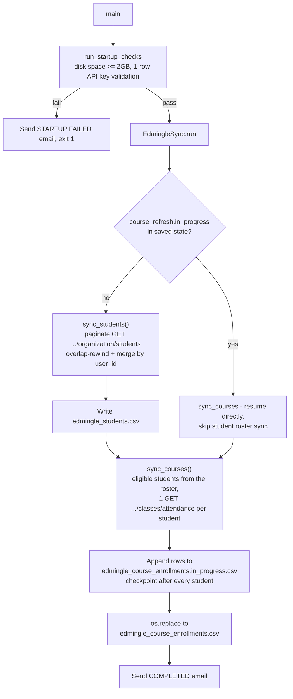

# ELA MIS Datasets — Student & Course Enrollment Sync

## 1. Overview & Purpose

A single script, `edmingle_student_course_sync.py`, pulls the full Vyoma student roster and each student's course enrollment/attendance history from Edmingle into two CSVs. Core logic was written by Shankararama Sharma; startup checks, email alerts, crash-safe recovery and the `run()` orchestration were added later.

**Purpose:** keep current a deduplicated student master (`edmingle_students.csv`) and a full rebuild of course/attendance history (`edmingle_course_enrollments.csv`), surviving multi-day unattended runs (crashes, restarts, SSH disconnects) without losing progress or duplicating data.

## 2. High-Level Data Flow



**Lineage:** students API → `edmingle_students.csv` → eligible-user filter → attendance API →
`edmingle_course_enrollments.csv`. Both are terminal outputs — no downstream script within this
repo consumes them programmatically.

## 3. Repository Structure

| Path | Purpose |
|---|---|
| `scripts/edmingle_student_course_sync.py` | Entry point — startup checks, both syncs, checkpointing, logging, email. |
| `scripts/edmingle_sync_config.json` | `overlap_pages`, `students_per_page`, `max_calls_per_minute`, retry/timeout settings, output filenames. |
| `../notifications.yaml` | SMTP/recipient settings + `status_update_interval_hours` (this pipeline's own folder). |
| `output/edmingle_students.csv` | Deduplicated roster (127,211 lines incl. header, last run 2026-08-24). |
| `output/edmingle_course_enrollments.csv` | One row per class session per eligible student (529,225 lines incl. header, last run 2026-08-28). |
| `output/edmingle_sync_state.json` | Checkpoint: last completed student page, course-refresh progress. |
| `output/edmingle_sync.log` | Full run log (5.1 MB as of the last completed run). |
| `output/edmingle_course_enrollments.in_progress.csv` | Transient append target; renamed to the final CSV only once every student is processed. |
| `../../credentials.yaml`, `../../common.py` | Shared credentials + `RollingRateLimiter`, atomic-write helpers, `send_mail`. |

## 4. Source System

| Source | Endpoint | Method | Auth | Parameters | Pagination | Rate Limit |
|---|---|---|---|---|---|---|
| Student roster | `.../organization/students` | GET | `apikey`/`ORGID` headers | `organization_id`, `is_archived=0`, `per_page` (500), `page` | Page-based; empty list = done | `RollingRateLimiter` at `max_calls_per_minute` (30); server 429 → `rate_limit_block_seconds` (1800s) cooldown |
| Course/attendance | `.../admin/classes/attendance` | GET | Same headers | `user_id`, `response_type=1` — one call per eligible student | N/A — single call returns all of one student's classes | Same limiter/cooldown |

## 5. Extraction Process

1. Load config, merge in credentials, run startup checks (≥2 GB free disk; a 1-row API sanity call that also reads the real student count — 400/401/403 abort, anything else warns and continues).
2. Load the checkpoint. If a prior course refresh is in progress, the roster sync is **skipped** and the course pull resumes directly.
3. Otherwise `sync_students()`: pages start `overlap_pages` (3) behind the last completed page (re-catching mid-run registrations); rows merge into the existing CSV by `user_id` (last write wins) and are written atomically after the last page.
4. `sync_courses()` takes the eligible students from the roster (non-empty `user_id`, not `"NA"`) and makes one attendance call per student. The roster is not rewritten while a refresh is in progress, so a resumed run recomputes the identical list (it stops with an error if the count no longer matches the saved `total_students`). Rows append to an in-progress file with a checkpoint after every student; when every student is done, the file is atomically renamed onto the final CSV.
5. Status emails fire at start, every status interval, on completion, and on any permanent error or crash.

## 6. Function Reference

- **`run_startup_checks(config)`** — ≥2 GB free disk plus a 1-row API call (400/401/403 fatal, else warns) and reads the real student count for the time estimate.
- **`calculate_start_page(last, overlap)`** — `max(1, last - overlap)`.
- **`merge_students(existing, fetched)`** — keyed by `user_id`, fetched wins; empty `user_id` dropped.
- **`extract_student(student)`** — flattens one record into `STUDENT_FIELDS`; `PhoneNumber`/`Age`/`LastName` come from `customfield_data` **matched by name, not position** (fixed 2026-09-23, Section 14).
- **`EdmingleSync.request_json(...)`** — a thin wrapper over `common.get_json` (the repo's one HTTP retry loop): rate-limited, endlessly retried; network/JSON/shape errors back off exponentially; `429` sleeps `rate_limit_block_seconds` (or `Retry-After`) and resets the limiter; `400/401/403/404` raise `PermanentAPIError` at once (401 emails first).
- **`EdmingleSync.sync_students(state)` / `sync_courses(state)`** — the two phases above. `sync_courses` resumes through `_resume_course_refresh()`: it checks the roster count, truncates the progress file to the last confirmed byte, and recovers a run that finished but crashed before its state was saved.

## 7. Configuration & Parameters

- **CLI:** `--config /path/to/other_config.json` (default: `edmingle_sync_config.json`). Credentials always come from the repo-root `credentials.yaml`, wherever the config file lives (before 2026-09-25 a config outside `scripts/` crashed with `FileNotFoundError`).
- **Config file:** `overlap_pages` (3), `students_per_page` (500), `max_calls_per_minute` (30), `request_timeout_seconds` (30), `initial_retry_delay_seconds` (5), `maximum_retry_delay_seconds` (300), `rate_limit_block_seconds` (1800), and an output-filename map (all resolved against `OUTPUT_DIR` regardless of invocation cwd).
- **`../../credentials.yaml`:** `api_key`, `organization_id` — required, missing/malformed is fatal.
- **`notifications.yaml`:** email config + `status_update_interval_hours` (default 6h) — a missing file is a **hard failure** for this script specifically (unlike `common.load_notifications()`'s own "missing = disabled" default elsewhere).
- **Hardcoded:** none — the permanent statuses (400/401/403/404) are `common.get_json`'s defaults.

## 8. Data Transformation, Output & Schema

**Transformations:** custom-field name-matching (fixed 2026-09-23, see Section 14) · student
dedup by `user_id` (last-write-wins) · Unix timestamp fields passed through unconverted · course
row flattening (session dict + `{user_id, name, email}`).

**Output:** `edmingle_students.csv` — full rewrite each run, atomic write.
`edmingle_course_enrollments.csv` — built via an append-only in-progress file, atomically renamed
onto the final name only once every student is processed (a crash never leaves a
partially-overwritten final CSV). Both anchored to the script's own directory.

**Database integration:** not applicable — CSV/JSON only.

**Schema — `edmingle_students.csv`:** `contact_number`(+`_2`/country/dial variants), `date`,
`email`, `formatted_date`, `is_archived`, `name`, `parent_contact_number`(+variants),
`parent_email`, `parent_name`, `registration_number`, `role`, `status`, `time`, `user_id`,
`user_username` (all native API fields), plus derived `PhoneNumber`/`Age`/`LastName` (matched by
`customfield_data` name). **Discrepancy:** the current code no longer produces `UserName`
(removed 2026-09-23 as redundant with `user_username`), but the live file (dated 2026-08-24,
before that change) still has it — the next full sync will drop it.

**Schema — `edmingle_course_enrollments.csv`:** `user_id`/`name`/`email` (from the student
roster), `class_id`, `class_name`, `tutor_name`, `total_classes`, `present`, `absent`, `late`,
`excused`, `start_date`/`end_date` (unix ts), `master_batch_id`/`master_batch_name`,
`classusers_start_date`/`classusers_end_date`, `batch_status`, `cu_status`, `cu_state`,
`institution_bundle_id`, `archived_at`, `bundle_id` — all native API fields.

## 9. Data Quality & Known Limitations

**Implemented checks:** ≥2GB free disk before starting, API key sanity call, student dedup by
`user_id`, empty-`user_id` rows dropped, course-pull eligibility filter, response-shape
validation before trusting a page, byte-offset truncation on resume.

**Confirmed limitations:**
- Every student row written **before 2026-09-23** carries wrong/blank `Age`/`PhoneNumber`/`LastName` from the old position-based bug — self-corrects only when that student's page is next re-fetched, which the overlap window doesn't guarantee for older pages.
- The live roster file still has a legacy `UserName` column the current code no longer produces — will silently disappear on the next full write.
- Course/enrollment is a full rebuild every run (not incremental) — inherent to the one-call-per-student design; no batch/bulk attendance endpoint exists to use instead.
- A renamed `customfield_data` field would silently go blank, not error.
- A non-200/400/401/403 startup response (e.g. a 5xx) is treated as a warning, not a failure.

**Requires confirmation:** whether any external process consumes these two CSVs on a fixed cadence, and what freshness SLA (if any) applies.

## 10. Error Handling & Logging

`logging` → `edmingle_sync.log` + console (`%(asctime)s %(levelname)s %(message)s`). The last full run ended:
```
2026-08-28 01:05:59,450 INFO Published complete course enrollment master
2026-08-28 01:06:00,806 INFO Edmingle sync run completed
```
Retry/permanent-error behaviour is as in Section 6. Any unhandled exception is logged with a traceback, writes `output/SCRIPT_FAILED.txt` and sends a failure email with resume instructions. `KeyboardInterrupt` exits cleanly with code 130; the checkpoint lets the next run resume.

## 11. Dependencies

| Dependency | Purpose |
|---|---|
| `requests` | HTTP calls to both endpoints |
| `PyYAML` (via `common.py`) | Reading both YAML config files |
| `common` (repo root) | `RollingRateLimiter`, atomic writes, `send_mail`, credentials/notifications loading |
| stdlib (`csv`, `json`, `logging`, `shutil`, `uuid`, `datetime`, `pathlib`, `argparse`) | Core logic, CLI |

## 12. Setup & How to Run

Step-by-step guide: [RUN_GUIDE.md](RUN_GUIDE.md). Before running: `../../credentials.yaml` filled in; `../notifications.yaml` populated (a hard requirement here); `edmingle_sync_config.json` has all required keys; ≥2 GB free disk. A full run takes **68–80 hours** (~72 h for ~131,000 students), so run it in tmux — an SSH disconnect without it kills a multi-day run. Detach with `Ctrl+B` then `D`; avoid Ctrl+C (during the roster phase it discards the refresh, since nothing is saved until the roster's last page).

**Run it in tmux** (session name = folder name):

```
step 1: tmux new -s ela_mis_datasets          start the session (name = folder name)
step 2: activate the venv, open the directory, run the script
        source /home/projectdev/ela_datasets/.venv/bin/activate
        cd /home/projectdev/ela_datasets/ela_mis_datasets/scripts
        python3 edmingle_student_course_sync.py
Ctrl+B then D                detach (the script keeps running)
tmux ls                      list active sessions
tmux attach -t ela_mis_datasets      return to the session
```

Resumable: after a crash or lost session, start a new session and run the same command; it resumes from its checkpoint. The failure email points to `tmux attach -t ela_mis_datasets`. Optional: `--config /path/to/other_config.json`.

## 13. Automation / Scheduling

None — no cron/systemd/scheduler evidenced anywhere; triggered manually inside `tmux`.

## 14. Important Business / Technical Rules

- **The 68–80 hour estimate is verified.** One API call per eligible student, rate-limited to 30/min: ~131,000 students ≈ 72 hours, matching the last completed run's log (`elapsed 3d 4h 43m 13s` ≈ 76.7 h).
- Overlap-page rewind (3 pages) is safe only because the merge is last-write-wins by `user_id`.
- The course pull is a full rebuild every run, not incremental, even though the roster sync itself is.
- The roster is not rewritten during a course pull (the student sync is skipped while one is in progress), so the eligible-student list is the same for the whole multi-day run; a resume checks its length against the saved total.
- Byte-offset checkpointing discards any partial/torn row a crash might leave, on resume.
- Custom-field matching by name (not list position) was a 2026-09-23 fix — the old position-based mapping produced wrong values for over 99% of the then-127,210-row student file.

## 15. Troubleshooting

| Scenario | Likely cause | Check |
|---|---|---|
| "STARTUP FAILED — Not enough disk space" | <2GB free at script location | Free up space — output CSVs need headroom |
| "STARTUP FAILED — API key expired" | `credentials.yaml`'s key is invalid | Rotate via `edmingle_api_key_generator`, re-run |
| Run stops mid-course-pull with a 401 | Key expired mid-run | Same fix — checkpoint means it auto-resumes once fixed |
| `SCRIPT_FAILED.txt` in `output/` | Unhandled exception | Check `edmingle_sync.log`'s traceback; just re-run, it auto-resumes |
| Course pull "stuck" on one student | Active 429 cooldown (1800s default) | Check the log for "Rate limit reached" — expected, not a hang |
| No status update emails | `notifications.yaml` incomplete or disabled | Check the log for "Email notifications disabled or not configured" |

## 16. Maintenance Guide

- **Pagination/rate limits** → `edmingle_sync_config.json`, no code change.
- **Retry/backoff behavior** → same config file's delay/cooldown keys.
- **Add/remove student custom fields** → `name_mapping` in `extract_student()` plus `STUDENT_FIELDS`.
- **Email frequency** → `notifications.yaml`'s `status_update_interval_hours`.
- **Output filenames** → the `files` map in the config (still resolves against `OUTPUT_DIR`).

## 17. Upstream & Downstream Dependencies

**Upstream:** Edmingle's students and attendance endpoints; the shared `credentials.yaml` (rotated by `edmingle_api_key_generator`). **Downstream:** none in this repo — both CSVs are consumed outside this codebase.

## 18. Security Considerations

The API key is only sent in headers, never logged or printed. SMTP credentials live in `../notifications.yaml` (not committed). Output CSVs contain student/parent PII (names, emails, phones), so restrict access to `output/`; the script has no access control. `SCRIPT_FAILED.txt` and the log may include exception text but never the API key.

## 19. Raw API Payload (Captured Structure)

**Captured live from the API on 2026-09-25** (one read-only call, tiny page size). Structure only: field names and types, no values, so no student/teacher PII is recorded here. `<int>`/`<str>`/`<null>` are the types observed in the sample; a field seen as `<null>` may hold a value for other records.

**Student roster** (`GET .../organization/students`, headers `apikey` + `ORGID`):

```json
{
  "query_time": "<float>",
  "students": [
    {
      "user_id": "<int>",
      "name": "<str>",
      "email": "<null> or <str>",
      "role": "<int>",
      "status": "<int>",
      "registration_number": "<str>",
      "user_username": "<str>",
      "contact_number": "<str>",
      "contact_number_2": "<str>",
      "organization_ids": [
        "<str>"
      ],
      "parent_name": "<null>",
      "parent_contact_number": "<null>",
      "parent_email": "<null>",
      "is_archived": "<int>",
      "contact_number_country_id": "<int>",
      "contact_number_2_country_id": "<null>",
      "parent_contact_number_country_id": "<null>",
      "date": "<str>",
      "time": "<str>",
      "formatted_date": "<str>",
      "contact_number_dial_code": "<str>",
      "contact_number_2_dial_code": "<str>",
      "parent_contact_number_dial_code": "<str>"
    }
  ],
  "code": "<int> (200)",
  "message": "<str>",
  "page_context": {
    "page": "<int>",
    "per_page": "<int>",
    "has_more_page": "<bool>",
    "total_rows": "<int>",
    "sort_by": "<str>",
    "sort_order": "<str>"
  }
}
```

**Not seen in the 2-record sample:** `customfield_data`, which `extract_student()` reads to derive
`PhoneNumber`/`Age`/`LastName`. Either it is absent for some records or only returned in certain cases — worth
confirming against a student who has filled those fields in; if it is genuinely absent, those 3 columns come
out blank. Also note `email` was `null` for at least one student, and `parent_*` fields were `null`.

**Per-student classes** (`GET .../admin/classes/attendance?user_id=<id>&response_type=1`) — one call per
student. A student with no enrolled classes returns `"classes": []`.

```json
{
  "code": "<int> (200)",
  "message": "<str>",
  "classes": [
    {
      "class_id": "<int>",
      "class_name": "<str>",
      "tutor_name": "<str>",
      "total_classes": "<int>",
      "present": "<int>",
      "absent": "<int>",
      "late": "<int>",
      "excused": "<int>",
      "start_date": "<int>",
      "end_date": "<int>",
      "master_batch_id": "<int>",
      "master_batch_name": "<str>",
      "classusers_start_date": "<int>",
      "classusers_end_date": "<int>",
      "batch_status": "<int>",
      "cu_status": "<int>",
      "cu_state": "<int>",
      "institution_bundle_id": "<int>",
      "archived_at": "<int>",
      "bundle_id": "<int>"
    }
  ]
}
```

## 20. Future Improvements

1. **Email the output on completion** — send a completion email that includes the run status *and* attaches the generated dataset file(s), not just a status notification.
2. **Scheduled automation** — run automatically on a defined schedule instead of a manual trigger.
3. **Data cleaning layer** — a dedicated cleaning step/script (nulls, duplicates, standardization) inside the pipeline, instead of leaving it to downstream consumers.

---
*Initial documentation: 2026-09-24. Project/technical owner: shubham.*
