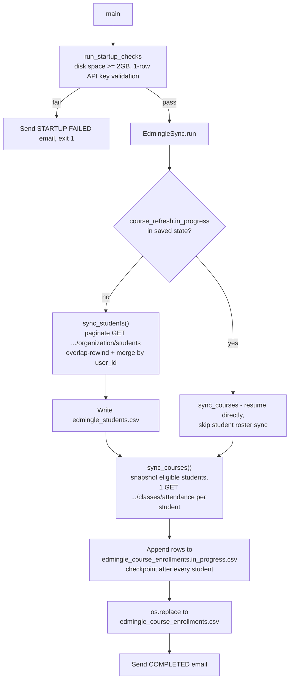

# ELA MIS Datasets — Student & Course Enrollment Sync

## 1. Overview & Purpose

A single script, `edmingle_student_course_sync.py`, pulls the full Vyoma student roster and each
student's course enrollment/attendance history from Edmingle into two CSVs. Core logic was
originally written by Shankararama Sharma; startup checks, email alerts, crash-safe recovery, and
the `run()` orchestration were added later.

**Purpose:** keep current a deduplicated student master (`edmingle_students.csv`) and a full
rebuild of course/attendance history (`edmingle_course_enrollments.csv`), surviving multi-day
unattended runs (crashes, restarts, SSH disconnects) without losing progress or duplicating data.

## 2. High-Level Data Flow



**Lineage:** students API → `edmingle_students.csv` → eligible-user filter → attendance API →
`edmingle_course_enrollments.csv`. Both are terminal outputs — no downstream script within this
repo consumes them programmatically.

## 3. Repository Structure

| Path | Purpose |
|---|---|
| `scripts/edmingle_student_course_sync.py` | Entry point — startup checks, both syncs, checkpointing, logging, email, legacy migration. |
| `scripts/edmingle_sync_config.json` | `overlap_pages`, `students_per_page`, `max_calls_per_minute`, retry/timeout settings, output filenames. |
| `../notifications.yaml` | SMTP/recipient settings + `status_update_interval_hours` (this pipeline's own folder). |
| `output/edmingle_students.csv` | Deduplicated roster (127,211 lines incl. header, last run 2026-08-24). |
| `output/edmingle_course_enrollments.csv` | One row per class session per eligible student (529,225 lines incl. header, last run 2026-08-28). |
| `output/edmingle_sync_state.json` | Checkpoint: last completed student page, course-refresh progress. |
| `output/edmingle_sync.log` | Full run log (5.1 MB as of the last completed run). |
| `output/edmingle_course_enrollments.in_progress.csv` | Transient append target; renamed to the final CSV only once every student is processed. |
| `output/edmingle_course_students_snapshot.csv` | Frozen eligible-student list taken at the start of a course refresh, so a concurrent roster update can't desync an in-flight pull. |
| `../../credentials.yaml`, `../../common.py` | Shared credentials + `RollingRateLimiter`, atomic-write helpers, `send_mail`. |

## 4. Source System

| Source | Endpoint | Method | Auth | Parameters | Pagination | Rate Limit |
|---|---|---|---|---|---|---|
| Student roster | `.../organization/students` | GET | `apikey`/`ORGID` headers | `organization_id`, `is_archived=0`, `per_page` (500), `page` | Page-based; empty list = done | `RollingRateLimiter` at `max_calls_per_minute` (30); server 429 → `rate_limit_block_seconds` (1800s) cooldown |
| Course/attendance | `.../admin/classes/attendance` | GET | Same headers | `user_id`, `response_type=1` — one call per eligible student | N/A — single call returns all of one student's classes | Same limiter/cooldown |

## 5. Extraction Process

Loads config, merges in credentials, runs startup checks (≥2GB free disk; a 1-row API-key sanity
call — 400/401/403 aborts, anything else warns and continues). Loads checkpoint; if a prior run
left a course refresh in progress, the roster sync is **skipped entirely** and the course pull
resumes directly. Otherwise `sync_students()` runs first: pages start `overlap_pages` (3) behind
the last completed page (re-catching mid-run registrations), fetched rows merge into the existing
CSV by `user_id` (last-write-wins), written atomically. `sync_courses()` then snapshots the
current eligible students (non-empty `user_id`, not `"NA"`) and makes one attendance call per
student in that **frozen** snapshot — never the live, possibly-changing roster. Each student's
rows append to an in-progress file with a checkpoint saved after every student; once the full
snapshot is processed, the file is atomically renamed onto the final CSV. Status/completion/
failure emails fire at start, every status-update interval, on completion, and on any permanent
error or crash.

## 6. Function Reference

### `run_startup_checks(config)`
Checks ≥2GB free disk and makes a 1-row API sanity call (400/401/403 fatal, anything else warns
and continues) before a potentially 80-hour run begins. **Note:** its own header comment claims 3
checks including Python version; the implementation only has 2 — a documentation/code mismatch,
not a runtime issue.

### `calculate_start_page(last_completed_page, overlap_pages) -> int`
`max(1, last_completed_page - overlap_pages)`.

### `merge_students(existing_rows, fetched_rows) -> list[dict]`
Keys by `user_id`, fetched rows overwrite existing (last-write-wins); rows with an empty
`user_id` are dropped.

### `extract_student(student) -> dict`
Flattens one API record into `STUDENT_FIELDS`. Builds a `field_name → value` lookup from the
variable-length `customfield_data` list, **matched by name, not position** (fixed 2026-09-23 —
see Section 14), for `PhoneNumber`/`Age`/`LastName`.

### `EdmingleSync.request_json(url, params, expected_list_key, context) -> dict`
Rate-limited, infinitely-retried call. Network/JSON/shape errors retry forever with exponential
backoff; `429` sleeps `rate_limit_block_seconds` (or the server's `Retry-After` if longer) and
resets the limiter; `400/401/403/404` raise `PermanentAPIError` immediately (401 also emails an
alert first).

### `EdmingleSync.sync_students(state)` / `sync_courses(state)`
The two orchestration methods described in Extraction Process. `sync_courses` additionally
includes `_prepare_progress_for_resume()` (truncates the in-progress file to the last confirmed
byte offset) and `_recover_completed_course_publication()` (handles a crash after finishing but
before the state file updated).

## 7. Configuration & Parameters

- **CLI:** `--config /path/to/other_config.json` (default: `edmingle_sync_config.json`).
- **Config file:** `overlap_pages` (3), `students_per_page` (500), `max_calls_per_minute` (30), `request_timeout_seconds` (30), `initial_retry_delay_seconds` (5), `maximum_retry_delay_seconds` (300), `rate_limit_block_seconds` (1800), and an output-filename map (all resolved against `OUTPUT_DIR` regardless of invocation cwd).
- **`../../credentials.yaml`:** `api_key`, `organization_id` — required, missing/malformed is fatal.
- **`notifications.yaml`:** email config + `status_update_interval_hours` (default 6h) — a missing file is a **hard failure** for this script specifically (unlike `common.load_notifications()`'s own "missing = disabled" default elsewhere).
- **Hardcoded:** `PERMANENT_HTTP_STATUSES={400,401,403,404}`, `TRANSIENT_HTTP_STATUSES={408,429}`.

## 8. Data Transformation, Output & Schema

**Transformations:** custom-field name-matching (fixed 2026-09-23, see Section 14) · student
dedup by `user_id` (last-write-wins) · Unix timestamp fields passed through unconverted · course
row flattening (session dict + `{user_id, name, email}`) · one-time legacy-file migration.

**Output:** `edmingle_students.csv` — full rewrite each run, atomic write.
`edmingle_course_enrollments.csv` — built via an append-only in-progress file, atomically renamed
onto the final name only once the full snapshot is processed (a crash never leaves a
partially-overwritten final CSV). Both anchored to the script's own directory.

**Database integration:** not applicable — CSV/JSON only.

**Schema — `edmingle_students.csv`:** `contact_number`(+`_2`/country/dial variants), `date`,
`email`, `formatted_date`, `is_archived`, `name`, `parent_contact_number`(+variants),
`parent_email`, `parent_name`, `registration_number`, `role`, `status`, `time`, `user_id`,
`user_username` (all native API fields), plus derived `PhoneNumber`/`Age`/`LastName` (matched by
`customfield_data` name). **Discrepancy:** the current code no longer produces `UserName`
(removed 2026-09-23 as redundant with `user_username`), but the live file (dated 2026-08-24,
before that change) still has it — the next full sync will drop it.

**Schema — `edmingle_course_enrollments.csv`:** `user_id`/`name`/`email` (from the student
snapshot), `class_id`, `class_name`, `tutor_name`, `total_classes`, `present`, `absent`, `late`,
`excused`, `start_date`/`end_date` (unix ts), `master_batch_id`/`master_batch_name`,
`classusers_start_date`/`classusers_end_date`, `batch_status`, `cu_status`, `cu_state`,
`institution_bundle_id`, `archived_at`, `bundle_id` — all native API fields.

## 9. Data Quality & Known Limitations

**Implemented checks:** ≥2GB free disk before starting, API key sanity call, student dedup by
`user_id`, empty-`user_id` rows dropped, course-pull eligibility filter, response-shape
validation before trusting a page, byte-offset truncation on resume.

**Confirmed limitations:**
- `run_startup_checks()` claims 3 checks in its own comment (incl. Python version), implements only 2.
- Every student row written **before 2026-09-23** carries wrong/blank `Age`/`PhoneNumber`/`LastName` from the old position-based bug — self-corrects only when that student's page is next re-fetched, which the overlap window doesn't guarantee for older pages.
- The live roster file still has a legacy `UserName` column the current code no longer produces — will silently disappear on the next full write.
- Course/enrollment is a full rebuild every run (not incremental) — inherent to the one-call-per-student design; no batch/bulk attendance endpoint exists to use instead.
- A renamed `customfield_data` field would silently go blank, not error.
- A non-200/400/401/403 startup response (e.g. a 5xx) is treated as a warning, not a failure.

**Requires confirmation:** whether any external process consumes these two CSVs on a fixed cadence, and what freshness SLA (if any) applies.

## 10. Error Handling & Logging

Standard `logging` module → `edmingle_sync.log` + console, format
`%(asctime)s %(levelname)s %(message)s`. Real example (confirming the last full run completed
2026-08-28):
```
2026-08-28 01:05:59,450 INFO Published complete course enrollment master
2026-08-28 01:06:00,806 INFO Edmingle sync run completed
```
Network/JSON/shape errors retry forever with exponential backoff; `429` waits
`rate_limit_block_seconds` and resets the limiter; `400/401/403/404` raise `PermanentAPIError`
immediately (401 also emails first). Any unhandled exception is logged with a full traceback, a
`SCRIPT_FAILED.txt` marker is written to `output/`, and a failure email with resume instructions
is sent. `KeyboardInterrupt` exits cleanly with code 130 — the checkpoint means the next run
resumes automatically.

## 11. Dependencies

| Dependency | Purpose |
|---|---|
| `requests` | HTTP calls to both endpoints |
| `PyYAML` (via `common.py`) | Reading both YAML config files |
| `common` (repo root) | `RollingRateLimiter`, atomic writes, `send_mail`, credentials/notifications loading |
| stdlib (`csv`, `json`, `logging`, `shutil`, `uuid`, `datetime`, `pathlib`, `argparse`) | Core logic, CLI |

## 12. Setup & How to Run

**Step by step:**
1. `tmux new -s vyoma` — **start this first.** A full run takes **68–80 hours**; the failure-email
   text itself references reattaching via `tmux attach -t vyoma`. This is the pipeline in this
   repo most in need of a detached session — an SSH disconnect without one kills a multi-day run.
2. Inside the tmux session: `source /home/projectdev/ela_datasets/.venv/bin/activate` — your
   prompt shows `(.venv)` when active; a plain `python3` after this already has `requests`,
   `pyyaml` installed, so no `pip install` step is needed.
3. Populate `../../credentials.yaml` — shared by every pipeline, likely already done.
4. Populate `../notifications.yaml` (a hard requirement here, unlike other pipelines).
5. Confirm `edmingle_sync_config.json` has all required keys.
6. Ensure ≥2GB free disk before starting.
7. `cd /home/projectdev/ela_datasets/ela_mis_datasets/scripts` and run the command below.
8. Detach with `Ctrl+B` then `D` (safe to close your terminal after this); reattach later with
   `tmux attach -t vyoma` to check progress.

```bash
tmux new -s vyoma
source /home/projectdev/ela_datasets/.venv/bin/activate
cd /home/projectdev/ela_datasets/ela_mis_datasets/scripts
python3 edmingle_student_course_sync.py
# optionally: --config /path/to/other_config.json
```

## 13. Automation / Scheduling

None — no cron/systemd/scheduler evidenced anywhere; triggered manually inside `tmux`.

## 14. Important Business / Technical Rules

- **The 68–80 hour estimate is verified, not assumed.** One API call per eligible student (~122,000+), rate-limited to 30/min → ≈67.8 hours by calculation, matching both the script's own estimate and real log evidence (`elapsed 3d 4h 43m 13s` ≈ 76.7 hours on the last completed run).
- Overlap-page rewind (3 pages) is safe only because the merge is last-write-wins by `user_id`.
- The course pull is a full rebuild every run, not incremental, even though the roster sync itself is.
- The eligible-student snapshot is frozen for the entire multi-day course pull, so a concurrent roster update can't desync it.
- Byte-offset checkpointing discards any partial/torn row a crash might leave, on resume.
- Custom-field matching by name (not list position) was a 2026-09-23 fix — the old position-based mapping produced wrong values for over 99% of the then-127,210-row student file.

## 15. Troubleshooting

| Scenario | Likely cause | Check |
|---|---|---|
| "STARTUP FAILED — Not enough disk space" | <2GB free at script location | Free up space — output CSVs need headroom |
| "STARTUP FAILED — API key expired" | `credentials.yaml`'s key is invalid | Rotate via `edmingle_api_key_generator`, re-run |
| Run stops mid-course-pull with a 401 | Key expired mid-run | Same fix — checkpoint means it auto-resumes once fixed |
| `SCRIPT_FAILED.txt` in `output/` | Unhandled exception | Check `edmingle_sync.log`'s traceback; just re-run, it auto-resumes |
| Course pull "stuck" on one student | Active 429 cooldown (1800s default) | Check the log for "Rate limit reached" — expected, not a hang |
| No status update emails | `notifications.yaml` incomplete or disabled | Check the log for "Email notifications disabled or not configured" |

## 16. Maintenance Guide

- **Pagination/rate limits** → `edmingle_sync_config.json`, no code change.
- **Retry/backoff behavior** → same config file's delay/cooldown keys.
- **Add/remove student custom fields** → `name_mapping` in `extract_student()` plus `STUDENT_FIELDS`.
- **Email frequency** → `notifications.yaml`'s `status_update_interval_hours`.
- **Output filenames** → the `files` map in the config (still resolves against `OUTPUT_DIR`).

## 17. Upstream & Downstream Dependencies

**Upstream:** Edmingle's students and attendance endpoints; shared `credentials.yaml` (rotated by
`edmingle_api_key_generator`). **Downstream:** none found within this repo — both CSVs are
terminal outputs, consumed outside this codebase.

## 18. Security Considerations

The API key is only sent in headers, never logged/printed. SMTP credentials live in
`../notifications.yaml` (this pipeline's own folder), not committed.
Output CSVs contain student/parent PII (names, emails,
phone numbers) — access to `output/` should be restricted; no access control exists in the script
itself. `SCRIPT_FAILED.txt` and the log may include exception text but never the API key.

## 19. Raw API Payload (Captured Structure)

**Captured live from the API on 2026-09-25** (one read-only call, tiny page size). Structure only: field names and types, no values, so no student/teacher PII is recorded here. `<int>`/`<str>`/`<null>` are the types observed in the sample; a field seen as `<null>` may hold a value for other records.

**Student roster** (`GET .../organization/students`, headers `apikey` + `ORGID`):

```json
{
  "query_time": "<float>",
  "students": [
    {
      "user_id": "<int>",
      "name": "<str>",
      "email": "<null> or <str>",
      "role": "<int>",
      "status": "<int>",
      "registration_number": "<str>",
      "user_username": "<str>",
      "contact_number": "<str>",
      "contact_number_2": "<str>",
      "organization_ids": [
        "<str>"
      ],
      "parent_name": "<null>",
      "parent_contact_number": "<null>",
      "parent_email": "<null>",
      "is_archived": "<int>",
      "contact_number_country_id": "<int>",
      "contact_number_2_country_id": "<null>",
      "parent_contact_number_country_id": "<null>",
      "date": "<str>",
      "time": "<str>",
      "formatted_date": "<str>",
      "contact_number_dial_code": "<str>",
      "contact_number_2_dial_code": "<str>",
      "parent_contact_number_dial_code": "<str>"
    }
  ],
  "code": "\"200\" (string, not int)",
  "message": "<str>",
  "page_context": {
    "page": "<int>",
    "per_page": "<int>",
    "has_more_page": "<bool>",
    "total_rows": "<int>",
    "sort_by": "<str>",
    "sort_order": "<str>"
  }
}
```

**Not seen in the 2-record sample:** `customfield_data`, which `extract_student()` reads to derive
`PhoneNumber`/`Age`/`LastName`. Either it is absent for some records or only returned in certain cases — worth
confirming against a student who has filled those fields in; if it is genuinely absent, those 3 columns come
out blank. Also note `email` was `null` for at least one student, and `parent_*` fields were `null`.

**Per-student classes** (`GET .../admin/classes/attendance?user_id=<id>&response_type=1`) — one call per
student. A student with no enrolled classes returns `"classes": []`.

```json
{
  "code": "\"200\" (string, not int)",
  "message": "<str>",
  "classes": [
    {
      "class_id": "<int>",
      "class_name": "<str>",
      "tutor_name": "<str>",
      "total_classes": "<int>",
      "present": "<int>",
      "absent": "<int>",
      "late": "<int>",
      "excused": "<int>",
      "start_date": "<int>",
      "end_date": "<int>",
      "master_batch_id": "<int>",
      "master_batch_name": "<str>",
      "classusers_start_date": "<int>",
      "classusers_end_date": "<int>",
      "batch_status": "<int>",
      "cu_status": "<int>",
      "cu_state": "<int>",
      "institution_bundle_id": "<int>",
      "archived_at": "<int>",
      "bundle_id": "<int>"
    }
  ]
}
```

## 20. Future Improvements

1. **Email the output on completion** — send a completion email that includes the run status *and* attaches the generated dataset file(s), not just a status notification.
2. **Scheduled automation** — run automatically on a defined schedule instead of a manual trigger.
3. **Data cleaning layer** — a dedicated cleaning step/script (nulls, duplicates, standardization) inside the pipeline, instead of leaving it to downstream consumers.

---
*Initial documentation: 2026-09-24. Project/technical owner: requires confirmation.*
