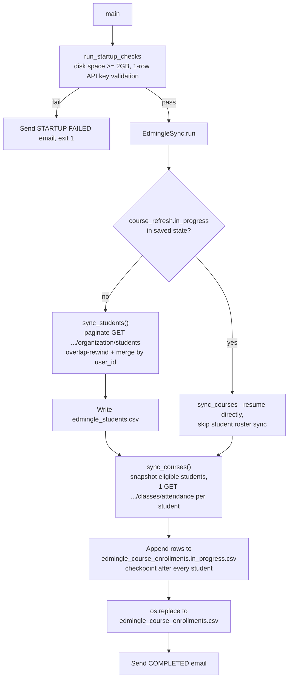

# ELA MIS Datasets — Student & Course Enrollment Sync

## 1. Overview

`ela_mis_datasets` runs a single script, `edmingle_student_course_sync.py`, that pulls the full Vyoma Samskrta Pathasala student roster and each student's course enrollment/attendance history out of Edmingle and writes them to two CSV files that feed the ELA MIS datasets. Core logic was originally written by Shankararama Sharma; startup checks, email alerts, crash-safe recovery, and the `run()` orchestration were added later ("Shubham" per in-code attribution comments).

## 2. Purpose

To produce and keep current two datasets: a deduplicated master list of every student (`edmingle_students.csv`) and a full rebuild of every student's course/attendance enrollment history (`edmingle_course_enrollments.csv`), while surviving multi-day unattended runs (crashes, restarts, SSH disconnects) without losing progress or duplicating data.

## 3. High-Level Data Flow



## 4. Project / Repository Structure

| File / Folder | Purpose |
|---|---|
| `scripts/edmingle_student_course_sync.py` | Single entry point: startup checks, student roster sync, course/enrollment sync, checkpointing, logging, email alerts, legacy-file migration. |
| `scripts/edmingle_sync_config.json` | Tunables: `overlap_pages`, `students_per_page`, `max_calls_per_minute`, retry/timeout settings, and the `files` map of output/state/log filenames. |
| `scripts/notifications.yaml` | This pipeline's own SMTP/recipient settings and `status_update_interval_hours`. |
| `output/edmingle_students.csv` | Final deduplicated student roster (127,211 lines incl. header as of the last run — 2026-08-24). |
| `output/edmingle_course_enrollments.csv` | One row per class session per eligible student (529,225 lines incl. header as of the last run — 2026-08-28). |
| `output/edmingle_sync_state.json` | Checkpoint/resume state: last completed student page, course-refresh progress. |
| `output/edmingle_sync.log` | Full run log (5.1 MB as of the last completed run). |
| `output/edmingle_course_enrollments.in_progress.csv` | Transient file the course pull appends to; only renamed to the final CSV once every student is processed. |
| `output/edmingle_course_students_snapshot.csv` | Frozen snapshot of eligible students taken at the start of a course refresh, so a concurrent roster update can't desync an in-flight course pull. |
| `../../credentials.yaml` (shared) | `edmingle.api_key`, `edmingle.organization_id` — read via `common.load_credentials()`. |
| `../../common.py` (shared) | Supplies `RollingRateLimiter`, `atomic_write_csv`/`atomic_write_json`, `read_csv_rows`, `utc_now`, `format_duration`, `send_mail`. |
| `README.md` | Full workflow/config/business-rules documentation for this pipeline. |

## 5. Source System

| Source | Type | Endpoint | HTTP Method | Authentication | Parameters | Pagination | Rate Limit |
|---|---|---|---|---|---|---|---|
| Edmingle student roster | REST API | `https://vyoma-api.edmingle.com/nuSource/api/v1/organization/students` | GET | Headers `apikey`, `ORGID` | `organization_id`, `is_archived=0`, `per_page` (default 500), `page` | Page-number based; empty `students` list signals completion | Client-side `RollingRateLimiter` at `max_calls_per_minute` (config default 30/min); server 429 triggers a `rate_limit_block_seconds` (default 1800s) cooldown |
| Edmingle course/attendance | REST API | `https://vyoma-api.edmingle.com/nuSource/api/v1/admin/classes/attendance` | GET | Headers `apikey`, `ORGID` | `user_id`, `response_type=1` — one call per eligible student | Not applicable (single call returns all of one student's classes) | Same `RollingRateLimiter`/429-cooldown as above |

## 6. Extraction Process

1. `main()` loads `edmingle_sync_config.json`, merges in `api_key`/`organization_id` from the shared `credentials.yaml`, and runs `run_startup_checks()`.
2. Startup checks: verify at least 2 GB free disk space at `SCRIPT_DIR`; make a lightweight 1-row API call to `STUDENTS_URL` to validate the key (HTTP 400/401/403 aborts immediately; any other non-200 is logged as a warning but does **not** block the run).
3. `EdmingleSync.run()` calls `migrate_legacy_files()` (one-time, no-op once new-format files exist) and loads the saved checkpoint (`edmingle_sync_state.json`).
4. If a previous run left `course_refresh.in_progress = true`, the roster sync is **skipped entirely** and `sync_courses()` resumes directly from checkpoint.
5. Otherwise, `sync_students()` runs first: pages start at `max(1, last_completed_page - overlap_pages)` (default overlap 3 pages) to re-catch students who registered mid-run, fetches until an empty page is returned, flattens each student via `extract_student()`, merges with the existing CSV by `user_id` (last-write-wins), and writes the result atomically.
6. `sync_courses()` then runs: on a fresh start, it snapshots the current eligible student list (`user_id` non-empty and not the literal `"NA"`) to `edmingle_course_students_snapshot.csv`, then makes one `COURSES_URL` call per student in that frozen snapshot — never the live, possibly-changing roster.
7. Every student's fetched rows are appended to `edmingle_course_enrollments.in_progress.csv`, flushed and `fsync`'d, and the checkpoint (`next_student_index`, byte `output_offset`) is saved after each student.
8. Once every student in the snapshot is processed, the in-progress file is atomically `os.replace()`d onto `edmingle_course_enrollments.csv` and the snapshot is deleted.
9. Completion/failure/status-update emails are sent at start, every `STATUS_UPDATE_INTERVAL` seconds of active processing time, on completion, and on any 401/permanent error or unhandled crash.

## 7. Detailed Function Documentation

### `run_startup_checks(config)`
- **Purpose:** Abort before a potentially 80-hour run if the environment is unfit.
- **Inputs:** merged config dict (`api_key`, `organization_id`).
- **Output:** none; calls `sys.exit(1)` on failure.
- **Processing:** Checks free disk space (`shutil.disk_usage(SCRIPT_DIR)`) is at least 2 GB; makes a 1-row `GET` to `STUDENTS_URL` to sanity-check the API key (400/401/403 = fatal; anything else = warn-and-continue).
- **Dependencies:** `shutil`, `requests`.
- **Note:** The function's own header comment states it "Checks 3 things: Python version, disk space, API key validity," but the implementation contains only **two** checks (disk space and API key) — there is no Python-version check anywhere in the function body. This is a documentation/code mismatch, not a runtime issue.

### `calculate_start_page(last_completed_page, overlap_pages) -> int`
- **Purpose:** Determine where the next roster sync should start.
- **Inputs:** last completed page number, configured overlap page count.
- **Output:** `max(1, last_completed_page - overlap_pages)`.
- **Processing:** Simple arithmetic; ensures at least page 1.

### `merge_students(existing_rows, fetched_rows) -> list[dict]`
- **Purpose:** Combine the current roster file with newly fetched rows.
- **Inputs:** iterables of row dicts.
- **Output:** list of merged row dicts, one per unique `user_id`.
- **Processing:** Builds a dict keyed by `user_id`; existing rows are loaded first, then fetched rows are applied on top (last-write-wins); rows with an empty `user_id` are silently dropped.

### `extract_student(student: dict) -> dict`
- **Purpose:** Flatten one Edmingle student API record into a row matching `STUDENT_FIELDS`.
- **Inputs:** raw student dict from the API.
- **Output:** flat dict with all `STUDENT_FIELDS` keys.
- **Processing:** Copies native fields directly; builds a `field_name -> field_value` lookup from the variable-length `customfield_data` list (matched **by name**, not list position — see Section 20) and maps `phone_number_text -> PhoneNumber`, `age_dropdown -> Age`, `user_last_name -> LastName`.

### `EdmingleSync.request_json(url, params, expected_list_key, context) -> dict`
- **Purpose:** Make one rate-limited, retried API call.
- **Inputs:** target URL, query params, the JSON key expected to hold a list, a label for log messages.
- **Output:** parsed JSON dict (only returned once a well-formed 200 response is received).
- **Processing:** Acquires a rate-limiter slot; on network error, malformed JSON, wrong response shape, or a non-200/non-permanent status, retries forever with exponential backoff (capped at `maximum_retry_delay_seconds`); on HTTP 429, sleeps `max(rate_limit_block_seconds, Retry-After)` and resets the rate limiter; on HTTP 400/401/403/404, raises `PermanentAPIError` immediately (and, for 401 specifically, sends an email alert first).
- **Dependencies:** `requests`, `common.RollingRateLimiter`.

### `EdmingleSync.sync_students(state)`
- **Purpose:** Refresh the student roster incrementally.
- **Inputs:** current checkpoint state dict.
- **Output:** none (writes `edmingle_students.csv`, updates and saves state).
- **Processing:** See Extraction Process step 5.

### `EdmingleSync.sync_courses(state)`
- **Purpose:** Rebuild the full course/enrollment dataset.
- **Inputs:** current checkpoint state dict.
- **Output:** none (writes `edmingle_course_enrollments.csv` via the in-progress file, updates and saves state).
- **Processing:** See Extraction Process steps 6–8; includes `_prepare_progress_for_resume()` (truncates the in-progress file back to the last confirmed byte offset before resuming) and `_recover_completed_course_publication()` (handles the edge case where the run finished but crashed before the state file was updated).

## 8. Input Parameters & Configuration

- **CLI arguments:** `--config /path/to/other_config.json` (defaults to `edmingle_sync_config.json` next to the script).
- **`edmingle_sync_config.json`:** `overlap_pages` (3), `students_per_page` (500), `max_calls_per_minute` (30), `request_timeout_seconds` (30), `initial_retry_delay_seconds` (5), `maximum_retry_delay_seconds` (300), `rate_limit_block_seconds` (1800), and a `files` map of output/state/log filenames (all resolved against `OUTPUT_DIR`, i.e. `scripts/../output`, regardless of invocation cwd).
- **`../../credentials.yaml`:** `edmingle.api_key`, `edmingle.organization_id` (required; missing/malformed file raises immediately).
- **`notifications.yaml`:** `channels.email.{enabled,smtp.*,to_addresses,status_update_interval_hours}` (default interval 6 hours); a missing file is a hard failure for this script specifically (unlike `common.load_notifications()`'s own default of treating a missing file as "disabled").
- **Hardcoded constants:** `STUDENTS_URL`, `COURSES_URL`; `PERMANENT_HTTP_STATUSES = {400,401,403,404}`; `TRANSIENT_HTTP_STATUSES = {408,429}`.
- No secret values are reproduced anywhere in this document.

## 9. Data Transformation

| Transformation | Description |
|---|---|
| Custom field name-matching | `customfield_data` (a per-student, variably-ordered list) is converted to a `field_name -> field_value` lookup and matched by name for `PhoneNumber`/`Age`/`LastName` — fixed 2026-09-23 after a position-based bug produced wrong values for >99% of students (see Section 20). |
| Student de-duplication | `merge_students()` keys by `user_id`; a freshly fetched row always overwrites the previously stored row for the same student. |
| Unix timestamp fields | `start_date`, `end_date`, `classusers_start_date`, `classusers_end_date` are passed through from the API as raw unix timestamps — no conversion is applied in this script. |
| Course row flattening | Each class session dict returned by the attendance endpoint is merged with `{user_id, name, email}` into one flat CSV row via `writer.writerow({...row.update(course)})`. |
| Legacy migration | `students_data_2.csv` / `studentCoursesEnrolled.csv` / `PageNo.txt` are one-time migrated into the new-format files/state on first run if the new files don't yet exist. |

## 10. Output Dataset

- **`edmingle_students.csv`** — one row per unique student, keyed by `user_id`. Written atomically (`common.atomic_write_csv`: temp file + `fsync` + `os.replace`) on every roster sync — the whole file is rewritten each run, not appended to.
- **`edmingle_course_enrollments.csv`** — one row per class session per eligible student. Built via an append-only in-progress file (`edmingle_course_enrollments.in_progress.csv`) that is atomically renamed onto the final filename only once the full snapshot has been processed — a crash never leaves a partially-overwritten final CSV.
- Both files live in `output/`, anchored to the script's own directory (`SCRIPT_DIR`/`OUTPUT_DIR`) regardless of the process's working directory.

## 11. Output Schema

### `edmingle_students.csv`

| Column | Data Type | Description | Source/Derived |
|---|---|---|---|
| contact_number | string | Primary phone number | Native API field |
| contact_number_2 | string | Secondary phone number | Native API field |
| contact_number_2_country_id | string | Country code for secondary number | Native API field |
| contact_number_2_dial_code | string | Dial code for secondary number | Native API field |
| contact_number_country_id | string | Country code for primary number | Native API field |
| contact_number_dial_code | string | Dial code for primary number | Native API field |
| date | string | Registration date, DD/MM/YYYY | Native API field |
| email | string | Student email address | Native API field |
| formatted_date | string | Human-readable registration date | Native API field |
| is_archived | int (0/1) | 0 = active, 1 = archived | Native API field |
| name | string | Full name | Native API field |
| parent_contact_number | string | Parent/guardian phone | Native API field |
| parent_contact_number_country_id | string | Country code for parent number | Native API field |
| parent_contact_number_dial_code | string | Dial code for parent number | Native API field |
| parent_email | string | Parent/guardian email | Native API field |
| parent_name | string | Parent/guardian full name | Native API field |
| registration_number | string | Vyoma internal ID | Native API field |
| role | int | 1 = student | Native API field |
| status | string/int | Account status code | Native API field |
| time | string | Registration time | Native API field |
| user_id | string | Edmingle unique user identifier | Native API field |
| user_username | string | Login username | Native API field |
| PhoneNumber | string | International phone number | Derived — `customfield_data` matched by `field_name == "phone_number_text"` |
| Age | string | Age bracket (dropdown) | Derived — matched by `field_name == "age_dropdown"` |
| LastName | string | User's last name | Derived — matched by `field_name == "user_last_name"` |

**Discrepancy note:** the current script's `STUDENT_FIELDS` list (as read in this audit) does **not** include a `UserName` column — an in-code comment states it was "removed 2026-09-23" as redundant with `user_username`. However, the live `edmingle_students.csv` on disk (last written 2026-08-24, before that change) still has a trailing `UserName` column in its header, since it predates the code fix and has not been regenerated since. The next full roster sync that rewrites this file will drop that column.

### `edmingle_course_enrollments.csv`

| Column | Data Type | Description | Source/Derived |
|---|---|---|---|
| user_id | string | Edmingle unique user identifier | Passed through from the student snapshot |
| name | string | Student full name | Passed through from the student snapshot |
| email | string | Student email | Passed through from the student snapshot |
| class_id | string | Individual class session ID | Native API field |
| class_name | string | Class session name | Native API field |
| tutor_name | string | Instructor name | Native API field |
| total_classes | int | Total sessions scheduled in this batch | Native API field |
| present | int | Sessions attended | Native API field |
| absent | int | Sessions missed | Native API field |
| late | int | Sessions attended late | Native API field |
| excused | int | Sessions marked excused | Native API field |
| start_date | int (unix ts) | Batch start date | Native API field |
| end_date | int (unix ts) | Batch end date | Native API field |
| master_batch_id | string | Parent course/batch ID | Native API field |
| master_batch_name | string | Parent course/batch name | Native API field |
| classusers_start_date | int (unix ts) | Student enrollment date | Native API field |
| classusers_end_date | int (unix ts) | Student enrollment end date | Native API field |
| batch_status | int | 0=active, 1=archived, 3=completed | Native API field |
| cu_status | int | 1=enrolled, 2=cancelled | Native API field |
| cu_state | string/int | Enrollment state code | Native API field |
| institution_bundle_id | string | Vyoma internal bundle reference | Native API field |
| archived_at | int | Archive timestamp; 0 = not archived | Native API field |
| bundle_id | string | Course bundle identifier | Native API field |

## 12. Data Quality & Validation

| Check | Implemented? |
|---|---|
| Free disk space >= 2 GB before starting | Yes — `run_startup_checks()` |
| API key validity (1-row test call) | Yes — `run_startup_checks()`, non-blocking on ambiguous responses |
| Student de-duplication by `user_id` | Yes — `merge_students()` |
| Rows with empty `user_id` dropped from roster merge | Yes — `merge_students()` |
| Course-pull eligibility filter (`user_id` non-empty and != `"NA"`) | Yes — `_valid_course_users()` |
| Response shape validation before trusting a page (`expected_list_key` must be a list) | Yes — `request_json()` |
| Byte-offset truncation on resume to discard a torn write | Yes — `_prepare_progress_for_resume()` |

### Quality limitations not handled
- No de-duplication or validation of course/enrollment rows themselves (a session appearing twice in the API response would be written twice).
- No schema/type validation on individual field values returned by the API — values are written to CSV as-is.
- Historical rows written before 2026-09-23 retain the old, wrong position-based `Age`/`PhoneNumber`/`LastName` values until the next full sync that happens to re-touch that student's page (the roster sync's overlap window only re-walks the *most recent* pages each run).
- If Edmingle ever renames a `customfield_data` `field_name`, the corresponding column silently goes blank rather than raising an error (missing dict key just leaves the default).

## 13. Error Handling & Logging

- Uses Python's `logging` module (`logging.getLogger("edmingle_sync")`), writing to both `edmingle_sync.log` (file handler) and the console, format `%(asctime)s %(levelname)s %(message)s`.
- Real log line example (from the actual run log, confirming the last full run completed 2026-08-28):
  ```
  2026-08-28 01:05:59,450 INFO Published complete course enrollment master
  2026-08-28 01:06:00,806 INFO Edmingle sync run completed
  ```
- Network errors, malformed JSON, and unexpected response shapes are retried forever with exponential backoff (`initial_retry_delay_seconds` doubling up to `maximum_retry_delay_seconds`).
- HTTP 429 triggers a `rate_limit_block_seconds` (1800s) wait (or the server's `Retry-After` if longer) and resets the rate limiter's call history.
- HTTP 400/401/403/404 raise `PermanentAPIError` immediately, ending the run; a 401 specifically also sends an email alert before raising.
- Any unhandled exception in `main()` is caught, logged with a full traceback (`logger.exception`), a `SCRIPT_FAILED.txt` marker file is written to `output/` for visibility, and a failure email with resume instructions is sent.
- `KeyboardInterrupt` (Ctrl+C) is caught separately, logs a clean interrupt message, and returns exit code 130 — the checkpoint already saved makes the next run resume automatically.

## 14. Dependencies

| Dependency | Purpose | Required |
|---|---|---|
| `requests` | HTTP calls to both Edmingle endpoints | Yes |
| `PyYAML` (via `common.py`) | Reading `credentials.yaml` / `notifications.yaml` | Yes |
| Python standard library (`csv`, `json`, `logging`, `os`, `re`, `shutil`, `sys`, `time`, `uuid`, `datetime`, `pathlib`, `argparse`) | Core script logic, atomic writes, CLI parsing | Yes (built-in) |
| `../../common.py` (shared module) | `RollingRateLimiter`, atomic write helpers, `utc_now`, `format_duration`, `send_mail`, `load_credentials`, `load_notifications` | Yes |

## 15. Setup

1. Ensure `../../credentials.yaml` has a populated `edmingle.api_key` and `edmingle.organization_id`.
2. Ensure this folder's `notifications.yaml` exists (a hard requirement for this specific script) with valid SMTP settings.
3. Ensure `edmingle_sync_config.json` is present and contains all required keys (`overlap_pages`, `students_per_page`, `max_calls_per_minute`, `request_timeout_seconds`, `initial_retry_delay_seconds`, `maximum_retry_delay_seconds`, `rate_limit_block_seconds`).
4. Install `requests` and `PyYAML`.
5. Ensure at least 2 GB of free disk space at the script's location before starting a run.

## 16. How to Run

```bash
cd /home/projectdev/ela_datasets/ela_mis_datasets/scripts
python3 edmingle_student_course_sync.py
```

Optionally: `--config /path/to/other_config.json`. Because a full run takes 68–80 hours (see Section 20), the project's own documentation recommends running inside `tmux` so an SSH disconnect doesn't kill the process; the failure-email text in the script itself references reattaching via `tmux attach -t vyoma`.

## 17. Automation / Scheduling

**None.** There is no cron job, systemd timer, or external scheduler evidenced anywhere in this pipeline's files — it is triggered manually by an operator (per the project's own README and the `tmux`-based run instructions embedded in the failure-email text).

## 18. Database / Warehouse Integration

Not applicable — this pipeline writes to CSV and JSON (state/checkpoint) files only.

## 19. Data Lineage

```
Edmingle organization/students API  -->  sync_students()  -->  edmingle_students.csv
                                                                        |
                                                                        v
                                              _valid_course_users() filters eligible user_ids
                                                                        |
                                                                        v
Edmingle admin/classes/attendance API  -->  sync_courses()  -->  edmingle_course_enrollments.csv
```
Both output files are the terminal artifacts of this pipeline; no downstream script within `ela_datasets/` was found (via this audit) to consume them programmatically — they feed the "ELA MIS datasets" by file delivery/import outside this repository's own code.

## 20. Important Business / Technical Rules

- **68–80 hour full-run estimate is verified, not assumed.** The course/enrollment pull makes exactly one API call per eligible student (~122,000+ students), rate-limited by `RollingRateLimiter` to `max_calls_per_minute` (config default 30). At 30 calls/min, 122,000 students implies ≈4,067 minutes ≈ 67.8 hours — matching both the script's own `print_startup_summary()`/`main()` estimate calculations (`122000 / rate` minutes) and the actual log evidence: the last completed course-refresh run's final checkpoint line reads `elapsed 3d 4h 43m 13s` (≈76.7 hours), which falls inside the documented 68–80 hour range. This is a direct consequence of the one-call-per-student design and the rate limit — not a bug and not an estimate taken on faith.
- **Overlap-page rewind:** every roster sync starts `overlap_pages` (default 3) pages behind the last completed page, to catch students who registered mid-run; this is safe only because the merge step is last-write-wins by `user_id`.
- **Course pull is a full rebuild every run, not incremental** — the entire eligible-student snapshot is re-walked each time, even though the roster sync itself is incremental.
- **Frozen snapshot during the course pull:** `edmingle_course_students_snapshot.csv` is taken once at the start of a course refresh and used for the entire (multi-day) run, so a concurrent roster update can never desync an in-flight course pull.
- **Byte-offset crash safety:** the checkpoint records the exact CSV byte size after every student's write; on resume, the in-progress file is truncated back to that exact offset before continuing, discarding any partial/torn row a crash might have left.
- **Custom-field matching by name, not list position (fixed 2026-09-23):** `customfield_data` is a variable-length, variably-ordered list per student; the old position-based mapping produced wrong `Age`/`PhoneNumber`/`LastName`/`UserName` values for over 99% of the 127,210-row student file before the fix (per the project's own README, confirmed against production data).

## 21. Known Limitations

### Confirmed limitations
- `run_startup_checks()`'s own header comment claims 3 startup checks ("Python version, disk space, API key validity") but the implementation performs only 2 — there is no Python-version check anywhere in the function.
- Every `edmingle_students.csv` row written **before 2026-09-23** carries wrong/blank `Age`/`PhoneNumber`/`LastName` values from the old position-based custom-field bug; these self-correct only when that specific student's page is next re-fetched (the overlap window only re-walks recent pages each run, so older untouched pages will not self-correct until a future full historical run touches them).
- The live `edmingle_students.csv` on disk (dated 2026-08-24) still has a legacy `UserName` column that the current code no longer produces (see Section 11) — the schema will silently change on the next full roster write.
- The course/enrollment dataset is a full rebuild every run (not incremental), so its ~68–80 hour runtime is inherent to the current one-call-per-student design; there is no batch/bulk attendance endpoint in use.
- If Edmingle ever renames a `customfield_data` field name, the corresponding column would silently go blank (not error) rather than alerting anyone.
- The API-key startup validation treats any non-200/400/401/403 response (e.g., a 5xx) as a warning, not a failure, and proceeds anyway.

### Requires confirmation
- Whether any consuming process outside this repository reads `edmingle_students.csv`/`edmingle_course_enrollments.csv` on a fixed cadence, and what SLA (if any) governs how current these files need to be, is not evidenced in this pipeline's own files — requires confirmation from the project owner.

## 22. Troubleshooting

| Scenario | Likely cause | What to check |
|---|---|---|
| Run exits immediately with "STARTUP FAILED — Not enough disk space" | Less than 2 GB free at `SCRIPT_DIR` | Free up disk space; the multi-GB output CSVs need headroom. |
| Run exits immediately with "STARTUP FAILED — API key expired" | `credentials.yaml`'s `edmingle.api_key` is invalid/expired | Rotate the key via `edmingle_api_key_generator`, then re-run. |
| Run stops mid-course-pull with a 401 | API key expired during the run | Same as above — the checkpoint means the next run resumes automatically once the key is fixed. |
| `SCRIPT_FAILED.txt` present in `output/` | An unhandled exception crashed the run | Check `edmingle_sync.log` for the traceback; simply re-run the script, it auto-resumes from checkpoint. |
| Course pull seems "stuck" on the same student for a long time | Likely an active HTTP 429 cooldown (`rate_limit_block_seconds` = 1800s by default) | Check the log for "Rate limit reached" / "429" lines; this is expected behavior, not a hang. |
| Status update emails never arrive | `notifications.yaml` SMTP config incomplete or `enabled: false` | Email sending logs a warning and continues silently in this case — check the log for "Email notifications disabled or not configured." |

## 23. Maintenance Guide

- **Changing pagination/rate limits:** edit `students_per_page`, `overlap_pages`, `max_calls_per_minute` in `edmingle_sync_config.json` — no code change needed.
- **Changing retry/backoff behavior:** edit `initial_retry_delay_seconds`, `maximum_retry_delay_seconds`, `rate_limit_block_seconds` in the same config file.
- **Adding/removing student custom fields:** edit the `name_mapping` dict inside `extract_student()` in `edmingle_student_course_sync.py`, and add/remove the corresponding column in `STUDENT_FIELDS`.
- **Changing status-update email frequency:** edit `channels.email.status_update_interval_hours` in `notifications.yaml`.
- **Changing output filenames:** edit the `files` map in `edmingle_sync_config.json` (all paths still resolve against `OUTPUT_DIR`).

## 24. Upstream & Downstream Dependencies

- **Upstream:** Edmingle's `organization/students` and `admin/classes/attendance` REST endpoints; the shared `credentials.yaml` (whose `api_key` is rotated by `edmingle_api_key_generator`).
- **Downstream:** No downstream script within `ela_datasets/` was found (via this audit) to programmatically consume `edmingle_students.csv` or `edmingle_course_enrollments.csv` — they are terminal outputs of this pipeline, consumed outside this repository.

## 25. Security Considerations

- The API key is read from the shared `credentials.yaml` and sent only in request headers (`apikey`, `ORGID`); it is never logged or printed by this script.
- SMTP credentials for email alerts live in this folder's own `notifications.yaml`, which is not committed to version control per the project's shared `README.md`.
- Output CSVs contain student and parent personally identifiable information (names, emails, phone numbers); access to `output/` should be restricted accordingly — no access-control mechanism is implemented in the script itself.
- `SCRIPT_FAILED.txt` and the log file may include exception text but do not include the API key, per inspection of the exception-handling code paths.

## 26. Change Log

| Date | Version | Change | Author |
|---|---|---|---|
| 2026-09-24 | 1.0 (initial documentation) | Initial technical documentation created from a full audit of the current codebase and output files on the VPS. | — |

## 27. Ownership

- **Project Owner:** Requires confirmation from the project owner.
- **Technical Owner:** Requires confirmation from the project owner.
