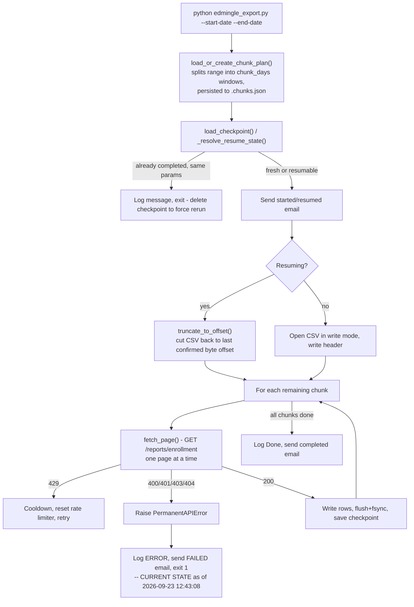

# Enrollments Reports — Historical Enrollment Export

## 1. Overview

`enrollments_reports` pulls row-level student enrollment records from Edmingle's `/reports/enrollment` endpoint over an arbitrary historical date range and writes them to a single CSV file. Because Edmingle rejects large single-shot date ranges, the requested range is split into fixed-size day "chunks" fetched one page at a time, with every page checkpointed so an interrupted run resumes exactly where it left off.

**As of this audit (2026-09-24), this pipeline is in a blocked/failed state** — see Section 21 for the current, unresolved condition found in its own log file.

## 2. Purpose

To produce a single historical enrollment-level CSV report (`enrollment_id`, enrollment date, learner/enrollment metadata) covering an operator-specified date range, resumable across crashes/restarts without re-fetching or duplicating rows.

## 3. High-Level Data Flow



## 4. Project / Repository Structure

| File / Folder | Purpose |
|---|---|
| `scripts/edmingle_export.py` | Entry point/orchestrator: config, checkpoint load/save, logging setup, `EdmingleExportRun` class driving the chunked pull. |
| `scripts/edmingle_api.py` | `fetch_page()` — single (chunk, page) GET call with permanent/transient error classification and 429 backoff. |
| `scripts/edmingle_chunker.py` | `build_chunks()`/`load_or_create_chunk_plan()` — splits a date range into `chunk_days`-sized windows, persisted once to `.chunks.json`. |
| `scripts/edmingle_constants.py` | `BASE_URL`, `DATE_FMT`, output column order (`FIELDS`), permanent/transient HTTP status sets. |
| `scripts/edmingle_io_utils.py` | `truncate_to_offset()` (genuine to this pipeline) plus re-exports of `common.py`'s atomic-write/timestamp helpers for backward compatibility. |
| `scripts/notifications.yaml` | SMTP/recipient settings (`chmod 600`). |
| `output/edmingle_enrollment_report.csv` | Fixed-name output file every run appends to/overwrites (current on-disk copy: 8,573 lines incl. header, last written 2026-09-08). |
| `output/edmingle_enrollment_report.csv.checkpoint.json` | Resume pointer: chunk/page progress, rows written, byte offset, completed flag. |
| `output/edmingle_enrollment_report.csv.chunks.json` | Persisted chunk plan (list of date windows) for the exact start/end/chunk_days combination that produced it. |
| `output/edmingle_enrollment_report.log` | Full run log, mirrored to stdout. |
| `output/edmingle_enrollment_01012010_25082026.csv` | A 115 MB / 450,797-line CSV present in `output/` with no matching `.checkpoint.json`, `.chunks.json`, or `.log` companion file — see Section 21. |
| `README.md` | Full workflow/config/business-rules documentation for this pipeline. |
| `../../credentials.yaml` (shared) | `edmingle.api_key`, `edmingle.organization_id`. |
| `../../common.py` (shared) | `RollingRateLimiter`, `atomic_write_json`, `load_credentials`, `load_notifications`, `send_mail`. |

**Documentation/reality mismatch:** the project's own `README.md` lists `edmingle_rate_limiter.py` as a file inside `scripts/`; it does not exist in the current `scripts/` directory listing (rate limiting is provided entirely by the shared `common.RollingRateLimiter`). This appears to be a stale line left over from the 2026-09-23 consolidation onto `common.py`.

## 5. Source System

| Source | Type | Endpoint | HTTP Method | Authentication | Parameters | Pagination | Rate Limit |
|---|---|---|---|---|---|---|---|
| Edmingle enrollment report | REST API | `https://vyoma-api.edmingle.com/nuSource/api/v1/reports/enrollment` | GET | Headers `apikey`, `orgid` | `start_date`, `end_date` (one chunk window, DD-MM-YYYY), `time_step=1`, `report_details_type=3`, `page`, `per_page` (200), `sort_order=D`, `sort_by=date_of_enrolment`, `currency_id=1` | Page number per chunk; `page_context.has_more_page` signals continuation | Client-side `RollingRateLimiter` at `max_calls_per_minute` (default 30); HTTP 429 triggers `rate_limit_block_seconds` (default 300) or the response's own `Retry-After`, whichever is longer |

## 6. Extraction Process

1. `EdmingleExportRun.__init__` loads `../../credentials.yaml` (exits immediately if the file or `api_key`/`organization_id` is missing) and merges in the fixed `DEFAULTS` dict (`chunk_days=30`, `per_page=200`, `max_calls_per_minute=30`, etc.).
2. `run()` calls `load_or_create_chunk_plan()`, which splits `[start_date, end_date]` into `chunk_days`-sized windows and persists the plan to `.chunks.json` (reused on later runs with identical parameters; regenerated if parameters differ).
3. The existing `.checkpoint.json` is loaded and compared against the current invocation's `start_date`/`end_date`/`chunk_days`/`per_page`:
   - identical params + not completed → resume from the exact chunk/page.
   - identical params + completed → refuse to run again (must delete the checkpoint to force a rerun).
   - different params → start fresh, overwriting the existing output CSV.
4. A "started"/"resumed" notification email is sent.
5. If resuming, `truncate_to_offset()` cuts the CSV back to the exact byte offset recorded in the checkpoint, discarding any partial write a crash might have left.
6. For each remaining chunk, `fetch_page()` is called page-by-page; each page's rows are written immediately, the file is flushed and `fsync`'d, and the checkpoint (`chunk_index`, `last_page_completed`, `total_written`, `output_offset`, `completed`) is saved after every page.
7. `None` values returned by the API are written as empty strings, never the literal text `"None"`.
8. On completion of every chunk, a "completed" email is sent with the total row count.
9. A `PermanentAPIError` (HTTP 400/401/403/404) or any other unhandled exception stops the run immediately and sends a failure email with the log path and manual resume instructions — there is no automatic retry-forever loop or external watchdog process for this class of error.

## 7. Detailed Function Documentation

### `fetch_page(session, api_key, org_id, chunk_start, chunk_end, page, per_page, ...)` (in `edmingle_api.py`)
- **Purpose:** Fetch a single page of enrollment rows for one chunk window.
- **Inputs:** session, credentials, chunk date bounds, page number, page size, timeout/retry/rate-limit settings, a shared `RollingRateLimiter`, a logger.
- **Output:** parsed JSON dict with `result.studentlist` validated to be a list.
- **Processing:** Acquires a rate-limiter slot; on network error/invalid JSON/unexpected shape, retries forever with exponential backoff (capped at `maximum_retry_delay`); on HTTP 429, sleeps `max(rate_limit_block_seconds, Retry-After)` and resets the rate limiter; on HTTP 400/401/403/404, raises `PermanentAPIError` immediately (no retry).
- **Dependencies:** `requests`, `common.RollingRateLimiter`.

### `build_chunks(start_date, end_date, chunk_days) -> list[tuple[str, str]]` (in `edmingle_chunker.py`)
- **Purpose:** Split an inclusive date range into fixed-size windows.
- **Inputs:** DD-MM-YYYY start/end strings, max days per window.
- **Output:** list of `(chunk_start, chunk_end)` string tuples.
- **Processing:** Iterates forward from `start_date` in `chunk_days`-day steps; exits via `sys.exit` if `start_date > end_date`.

### `load_or_create_chunk_plan(plan_path, start_date, end_date, chunk_days, logger)` (in `edmingle_chunker.py`)
- **Purpose:** Ensure the chunk plan is computed once and stays stable across resumes.
- **Inputs:** path to `.chunks.json`, the requested range/chunk size, a logger.
- **Output:** list of chunk tuples (loaded from disk if the parameters match, else regenerated).
- **Processing:** Compares the saved plan's own `start_date`/`end_date`/`chunk_days` against the current request; regenerates and persists (via `atomic_write_json`) on any mismatch or unreadable file.

### `truncate_to_offset(path, offset)` (in `edmingle_io_utils.py`)
- **Purpose:** Discard any partial/torn bytes left by a crash mid-write.
- **Inputs:** file path, a byte offset known to correspond to a fully-flushed, checkpointed state.
- **Output:** none (truncates in place).
- **Processing:** Opens the file in `r+b` mode, `truncate()`s to the exact offset, flushes, and `fsync`'s.

### `EdmingleExportRun._resolve_resume_state(checkpoint, num_chunks)`
- **Purpose:** Decide whether this invocation is a fresh start, a resume, or a no-op (already completed).
- **Inputs:** the loaded checkpoint dict (or `None`), the number of chunks in the current plan.
- **Output:** a 5-tuple `(is_resume, start_chunk_idx, start_page, total_written, output_offset)`, or `None` if the exact same run already completed.
- **Processing:** Compares `start_date`/`end_date`/`chunk_days`/`per_page` between the checkpoint and the current run to classify the three cases above.

## 8. Input Parameters & Configuration

- **CLI arguments:** `--start-date` / `--end-date` (both required, `DD-MM-YYYY`), `--output` (optional; defaults to the fixed `edmingle_enrollment_report.csv`), `--api-key` / `--org-id` (override credentials file per-run).
- **`../../credentials.yaml`:** `edmingle.api_key`, `edmingle.organization_id` (required; the script exits with a clear error if either is missing).
- **`notifications.yaml`:** `channels.email.{enabled,smtp.*,to_addresses}`; `channels.slack`/`channels.teams` present but unused.
- **`DEFAULTS` dict (inlined in `edmingle_export.py`, no config file):** `chunk_days=30`, `per_page=200`, `max_calls_per_minute=30`, `request_timeout_seconds=30`, `initial_retry_delay_seconds=2`, `maximum_retry_delay_seconds=60`, `rate_limit_block_seconds=300`. The project's own README notes the former `edmingle_config.json` was removed 2026-09-23 because its content was always an empty `{}` — every run already used these same defaults.
- No secret values are reproduced anywhere in this document.

## 9. Data Transformation

| Transformation | Description |
|---|---|
| Null handling | Any field Edmingle returns as `None` is written to the CSV as an empty string, never the literal text `"None"` (`row.get(k)` guarded with a ternary in `EdmingleExportRun.run()`). |
| Fixed column order | Output columns are exactly `edmingle_constants.FIELDS`; unknown API fields are dropped (`extrasaction="ignore"`), missing fields are written blank — neither case crashes the run. |
| Chunked fetch, single flat file | Rows from every chunk/page are appended into one continuous CSV in fetch order — no cross-chunk sorting or deduplication is applied by this script. |

## 10. Output Dataset

**`edmingle_enrollment_report.csv`** — a fixed filename every run appends to (on resume) or overwrites (on a fresh/differently-scoped run); this changed from an earlier per-date-range naming convention specifically to bound disk usage, per the project's own README. Companion files (`*.checkpoint.json`, `*.chunks.json`, `*.log`) are all derived from the CSV's own path via `Path.with_suffix(...)`, so they always sit alongside it.

## 11. Output Schema

Verified against the live file's own header row (`output/edmingle_enrollment_report.csv`):

| Column | Data Type | Description | Source/Derived |
|---|---|---|---|
| enrollment_id | string | Unique enrollment record identifier | Native API field |
| enrollment_day | string | Date of enrollment | Native API field |
| user_id | string | Edmingle unique user identifier | Native API field |
| name | string | Student full name | Native API field |
| email | string | Student email address | Native API field |
| contact_number | string | Student phone number | Native API field |
| contact_number_country_id | string | Country code for phone number | Native API field |
| state | string | Student's state/region | Native API field |
| registration_number | string | Vyoma internal registration ID | Native API field |
| learner_type | string | Learner category | Native API field |
| enrollment_mode | string | How the enrollment was made | Native API field |
| enrollment_status | string | Current status of the enrollment | Native API field |
| bundle_id | string | Course bundle identifier | Native API field |
| bundle_name | string | Course bundle name | Native API field |
| batch_ids | string | Associated batch ID(s) | Native API field |
| batches | string | Associated batch name(s) | Native API field |
| product_type | string | Product type code | Native API field |
| product_type_label | string | Product type display label | Native API field |
| platform_type | string | Platform the enrollment was made on | Native API field |
| enrollment_expiration_date | string | Expiration date of the enrollment | Native API field |
| shipping_details_json | string | Raw shipping details, JSON-encoded | Native API field |
| preferred_categories | string | Student's preferred course categories | Native API field |

## 12. Data Quality & Validation

| Check | Implemented? |
|---|---|
| Response shape validated (`code==200`, `result.studentlist` is a list) before trusting a page | Yes — `fetch_page()` |
| `start_date` must not be after `end_date` | Yes — `build_chunks()` (exits via `sys.exit`) |
| Chunk plan parameter match before reusing a persisted plan | Yes — `load_or_create_chunk_plan()` |
| Checkpoint parameter match before resuming vs. starting fresh | Yes — `_resolve_resume_state()` |
| Byte-offset truncation before resuming a write | Yes — `truncate_to_offset()` |
| `None` fields written as empty string, not `"None"` | Yes — `EdmingleExportRun.run()` |

### Quality limitations not handled
- No de-duplication of enrollment rows across chunk boundaries or across repeated runs with overlapping date ranges — re-running with an overlapping range and a fresh/differently-scoped output would duplicate rows.
- No validation of individual field values (e.g., `enrollment_id` uniqueness, date format sanity) beyond what Edmingle itself returns.
- No automated check reconciling `total_written` in the checkpoint against the actual row count in the CSV file after a run.

## 13. Error Handling & Logging

- Uses `logging.basicConfig` with `format="%(asctime)s [%(levelname)s] %(message)s"`, writing to both the `.log` file and stdout.
- Real log line example (from the actual current log file, `output/edmingle_enrollment_report.log`):
  ```
  2026-09-23 12:43:08 [ERROR] Edmingle export stopped: permanent API error
  ```
- `PermanentAPIError` (HTTP 400/401/403/404) is caught in `main()`, logged, emailed ("Edmingle export FAILED (permanent error)"), and the process exits with code 1 — **no retry is attempted**, matching the documented policy that permanent errors require a human fix, not a retry.
- All other exceptions are caught by a generic handler, logged with `logger.exception` (full traceback), emailed as a crash notification with resume instructions, and exit code 1.
- `KeyboardInterrupt` is caught separately, logs a warning that the next run will resume from checkpoint, and exits 130.
- **A code defect was found in `EdmingleExportRun.run()` (current file, last modified 2026-09-23 13:35 — after the log's last recorded run):** the module-level `send_mail(subject, body, logger)` function (defined with exactly 3 parameters) is called at two points inside `run()` — the "started/resumed" notification and the "completed" notification — as `send_mail(self.config, subject=..., body=..., logger=...)`, passing `self.config` as an extra leading positional argument alongside a `subject=` keyword. This will raise `TypeError: send_mail() got multiple values for argument 'subject'` the next time the script reaches either of those two call sites. The two `send_mail(...)` calls inside `main()`'s own exception handlers (failure/crash notifications) do **not** have this defect — they call `send_mail(subject=..., body=..., logger=...)` correctly, without the extra `self.config` argument. Because the current log's last entries predate this file's last edit, there is no log evidence yet of this specific `TypeError` having occurred — the Sep 8 successful run's "Email sent" log lines were produced by an earlier, pre-edit version of the script.

## 14. Dependencies

| Dependency | Purpose | Required |
|---|---|---|
| `requests` | HTTP calls to the enrollment report endpoint | Yes |
| `PyYAML` (via `common.py`) | Reading `credentials.yaml` / `notifications.yaml` | Yes |
| Python standard library (`argparse`, `csv`, `json`, `logging`, `os`, `sys`, `time`, `pathlib`) | Core script logic, CLI parsing | Yes (built-in) |
| `../../common.py` (shared module) | `RollingRateLimiter`, `atomic_write_json`, `load_credentials`, `load_notifications`, `send_mail` | Yes |

No `requirements.txt` exists in this pipeline's own folder (confirmed via directory listing) — dependencies are only documented in prose in `README.md`.

## 15. Setup

1. Ensure `../../credentials.yaml` has a populated `edmingle.api_key` and `edmingle.organization_id`.
2. Ensure this folder's `notifications.yaml` exists with SMTP settings if email alerts are wanted (a missing/disabled config just logs a warning, per `common.send_mail()`'s behavior).
3. Install `requests` and `PyYAML`.
4. **Before any further run, fix the `send_mail(self.config, ...)` call-signature defect described in Section 13** — as currently written, the script will crash with a `TypeError` at the first "started" email attempt of any new run.

## 16. How to Run

```bash
cd scripts
python3 edmingle_export.py --start-date 01-01-2010 --end-date 06-08-2026
```
Dates are `DD-MM-YYYY`. Run inside `tmux` for a long historical range so the process survives an SSH disconnect (per the project's own README). There is no watchdog/auto-restart wrapper — a crash or reboot requires manually re-running the same command, which resumes from the checkpoint. `--output` is optional; if provided, it overrides the fixed default filename and its own `.checkpoint.json`/`.chunks.json`/`.log` companions.

## 17. Automation / Scheduling

**None.** No cron job, systemd timer, or external scheduler was found in this pipeline's files — it is triggered manually. The project's own README states the pipeline previously ran under an `edmingle_watchdog.sh` shell wrapper (auto-restart on non-zero exit, email only after 30 failed restarts); this watchdog was **removed on 2026-09-23**, and failure/crash emails are now sent directly from `main()`'s own exception handling instead.

## 18. Database / Warehouse Integration

Not applicable — this pipeline writes to CSV and JSON (checkpoint/chunk-plan) files only.

## 19. Data Lineage

```
Edmingle /reports/enrollment API (report_details_type=3)
        |
        v
fetch_page() -- one (chunk, page) at a time
        |
        v
edmingle_enrollment_report.csv (append-only within a run; overwritten on a fresh/differently-scoped run)
```
No downstream script within `ela_datasets/` was found (via this audit) to programmatically consume this CSV — it is a terminal output of this pipeline.

## 20. Important Business / Technical Rules

- **Chunking exists because Edmingle rejects large single-shot date ranges** — the full range is always split into `chunk_days`-sized (default 30) windows, persisted once to `.chunks.json` so boundaries never silently shift between runs/resumes.
- **Resume logic is parameter-aware:** the checkpoint's own `start_date`/`end_date`/`chunk_days`/`per_page` are compared against the current invocation before deciding to resume, refuse (already completed), or start fresh and overwrite.
- **Fixed output filename (changed 2026-09-23):** every run writes to the same `edmingle_enrollment_report.csv` by default (previously named per date range) specifically to bound disk usage across repeated runs; a differently-scoped run overwrites it.
- **Permanent vs. transient error classification:** HTTP 400/401/403/404 are treated as unfixable by retrying (bad key, bad org id, wrong endpoint) and stop the run immediately; 408/429/5xx, network errors, invalid JSON, and unexpected response shapes are retried forever with capped exponential backoff — there is no retry-count ceiling for the transient path.
- **No external watchdog** (removed 2026-09-23) — the script itself emails on permanent error or crash from inside its own exception handling, matching the pattern used in `ela_mis_datasets`.

## 21. Known Limitations

### Confirmed limitations
- **This pipeline is currently in a blocked/failed state.** The live log file `output/edmingle_enrollment_report.log` ends with:
  ```
  2026-09-23 12:43:08 [ERROR] Edmingle export stopped: permanent API error
  ```
  This is the `except PermanentAPIError` branch in `main()` — meaning the run received an HTTP 400/401/403/404 from Edmingle (bad API key, wrong org id, or a wrong/changed endpoint) and stopped without retrying. No successful run has completed since. The last confirmed successful run was **2026-09-08 06:02:23**, writing **8,572 rows** for the range `01-08-2026` to `31-08-2026` (checkpoint file confirms `"completed": true, "total_written": 8572`).
- **A latent code defect will block the next run regardless of the API-key issue above** — see Section 13's `send_mail(self.config, ...)` `TypeError` finding. Both issues need to be resolved before this pipeline can run to completion again.
- **An unexplained 115 MB output file is present:** `output/edmingle_enrollment_01012010_25082026.csv` (450,797 lines, filesystem birth timestamp 2026-09-24 00:24:43, last modified 22 seconds later at 00:25:04) has no matching `.checkpoint.json`, `.chunks.json`, or `.log` companion file anywhere under this pipeline's `output/` directory, which every run produced by the current `edmingle_export.py` always creates alongside its CSV. Its filename matches the pattern of an *older*, pre-2026-09-23 version of this script (which named output files per date range instead of using the current fixed `edmingle_enrollment_report.csv`), and its size/row-count is inconsistent with being produced under this pipeline's own rate limiter (200 rows/page at 30 calls/min would take on the order of tens of minutes for 450,000+ rows, not 22 seconds). Its origin cannot be determined from the files available during this audit — **requires confirmation from the project owner** before being treated as a trustworthy dataset.
- `README.md` references `edmingle_rate_limiter.py` as a file in `scripts/`; it does not exist in the current directory listing (see Section 4).

### Requires confirmation
- The root cause of the 2026-09-23 12:43:08 permanent API error (expired/rotated key vs. a genuinely bad org id/endpoint) — the log line captured by this audit does not include the underlying HTTP status code or response body that `edmingle_api.py`'s `fetch_page()` would have logged immediately before raising; only the summary line from `edmingle_export.py`'s own exception handler was present in the log at audit time.
- The origin and validity of `edmingle_enrollment_01012010_25082026.csv` (see above).

## 22. Troubleshooting

| Scenario | Likely cause | What to check |
|---|---|---|
| `[ERROR] Edmingle export stopped: permanent API error` | HTTP 400/401/403/404 from Edmingle | Check `edmingle.api_key`/`organization_id` in `../../credentials.yaml`; rotate the key via `edmingle_api_key_generator` if expired, then re-run the same command. |
| `TypeError: send_mail() got multiple values for argument 'subject'` | The code defect described in Section 13 | Fix the two `send_mail(self.config, subject=..., ...)` call sites in `EdmingleExportRun.run()` in `edmingle_export.py` to match the module-level `send_mail(subject, body, logger)` signature before re-running. |
| "Checkpoint shows this exact run already completed" | Re-running the identical `--start-date`/`--end-date` after a successful run | Delete the `.checkpoint.json` file to force a re-run, or use a different date range. |
| Run appears to hang on one chunk | Active HTTP 429 cooldown (`rate_limit_block_seconds` or the server's own `Retry-After`) | Check the log for "rate limited (429)" lines — this is expected pacing behavior, not a hang. |
| Output CSV row count looks short after a crash | Expected — resume truncates back to the last confirmed byte offset before continuing | Compare `checkpoint.json`'s `total_written` against a fresh `wc -l` after the next successful resume. |

## 23. Maintenance Guide

- **Fixing the `send_mail` signature defect:** in `edmingle_export.py`, remove the leading `self.config` positional argument from both `send_mail(self.config, subject=..., body=..., logger=...)` call sites inside `EdmingleExportRun.run()`.
- **Changing chunk size/rate limits/retry behavior:** edit the `DEFAULTS` dict at the top of `edmingle_export.py` — there is no config file or CLI flag for these values.
- **Changing output columns:** edit `FIELDS` in `edmingle_constants.py`.
- **Changing permanent vs. transient HTTP status classification:** edit `PERMANENT_HTTP_STATUSES`/`TRANSIENT_HTTP_STATUSES` in `edmingle_constants.py`.
- **Investigating the unexplained large CSV (Section 21):** check with whoever has server/shell access around 2026-09-24 00:24–00:25 UTC for any manual command, rsync, or deployment step that could have placed `edmingle_enrollment_01012010_25082026.csv` in `output/` outside the normal script flow.

## 24. Upstream & Downstream Dependencies

- **Upstream:** Edmingle's `/reports/enrollment` REST endpoint; the shared `credentials.yaml` (whose `api_key` is rotated by `edmingle_api_key_generator`).
- **Downstream:** No downstream script within `ela_datasets/` was found (via this audit) to programmatically consume `edmingle_enrollment_report.csv` — it is a terminal output of this pipeline.

## 25. Security Considerations

- The API key is read from the shared `credentials.yaml` and sent only in request headers; it is never logged or printed by this script.
- `notifications.yaml` is set to `chmod 600` (per directory listing and the project's own README), restricting SMTP credential access to the file owner.
- Output CSVs contain student personally identifiable information (name, email, phone number, address-adjacent fields like `shipping_details_json`); access to `output/` should be restricted accordingly — no access-control mechanism is implemented in the script itself.

## 26. Change Log

| Date | Version | Change | Author |
|---|---|---|---|
| 2026-09-24 | 1.0 (initial documentation) | Initial technical documentation created from a full audit of the current codebase, live log, and output files on the VPS — including the currently blocked/failed pipeline state. | — |

## 27. Ownership

- **Project Owner:** Requires confirmation from the project owner.
- **Technical Owner:** Requires confirmation from the project owner.
