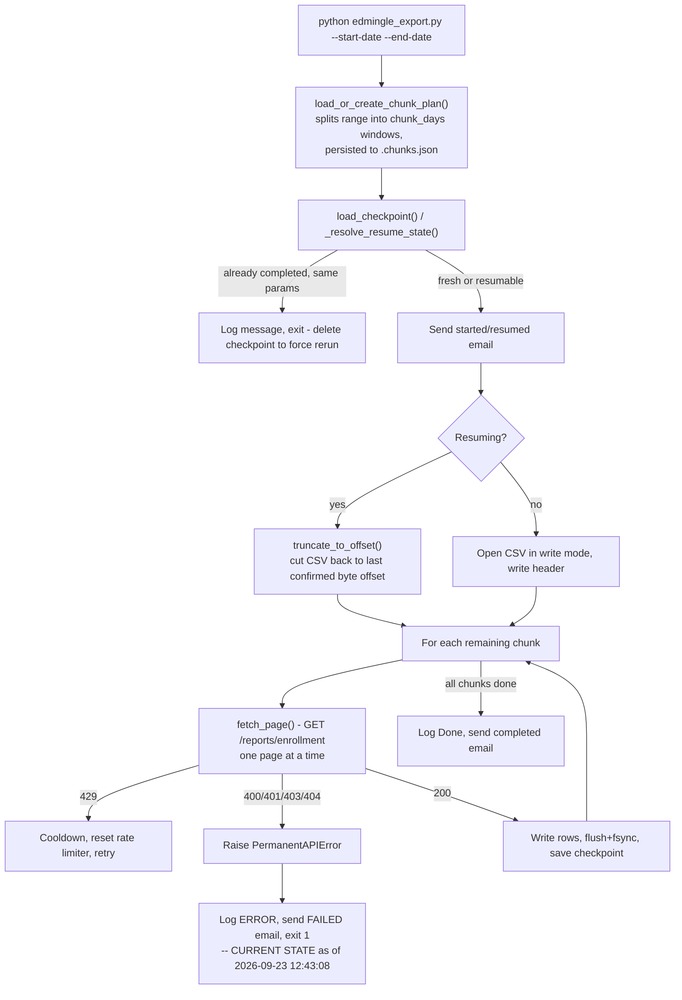

# Enrollments Reports — Historical Enrollment Export

## 1. Overview & Purpose

Pulls row-level enrollment records from Edmingle's `/reports/enrollment` endpoint over an
arbitrary historical date range into one CSV. Because Edmingle rejects large single-shot ranges,
the request is split into fixed-size day "chunks," fetched page by page, with every page
checkpointed so an interrupted run resumes exactly where it left off.

**As of this audit (2026-09-24), this pipeline is in a blocked/failed state** — see Section 9.

**Purpose:** a single historical enrollment-level CSV covering an operator-specified date range,
resumable across crashes/restarts without re-fetching or duplicating rows.

## 2. High-Level Data Flow



**Lineage:** enrollment API → `fetch_page()` per (chunk, page) → `edmingle_enrollment_report.csv`
(append-only within a run, overwritten on a fresh/differently-scoped run). No downstream script
within this repo consumes it.

## 3. Repository Structure

| Path | Purpose |
|---|---|
| `scripts/edmingle_export.py` | Orchestrator — config, checkpoint, logging, the `EdmingleExportRun` class. |
| `scripts/edmingle_api.py` | `fetch_page()` — one (chunk, page) GET with error classification and 429 backoff. |
| `scripts/edmingle_chunker.py` | Splits a date range into `chunk_days` windows, persisted to `.chunks.json`. |
| `scripts/edmingle_constants.py` | `BASE_URL`, date format, output column order, HTTP status sets. |
| `scripts/edmingle_io_utils.py` | `truncate_to_offset()` plus re-exported `common.py` helpers. |
| `output/edmingle_enrollment_report.csv` | Fixed-name output (8,573 lines incl. header, last written 2026-09-08). |
| `output/*.checkpoint.json` / `*.chunks.json` / `.log` | Resume state, chunk plan, run log — all derived from the CSV's own path. |
| `output/edmingle_enrollment_01012010_25082026.csv` | A 115MB/450,797-line file with **no** matching checkpoint/chunks/log companion — see Section 9. |
| `../../credentials.yaml`, `../../common.py` | Shared credentials + `RollingRateLimiter`, atomic writes, `send_mail`. |
| `../notifications.yaml` | SMTP/recipient config (this pipeline's own folder). |

**Documentation/reality mismatch:** the pipeline's own prior documentation lists
`edmingle_rate_limiter.py` as a file in `scripts/`; it doesn't exist — rate limiting is entirely
`common.RollingRateLimiter` now, a stale line from the 2026-09-23 consolidation.

## 4. Source System

| Source | Endpoint | Method | Auth | Parameters | Pagination | Rate Limit |
|---|---|---|---|---|---|---|
| Enrollment report | `.../reports/enrollment` | GET | `apikey`/`orgid` headers | `start_date`/`end_date` (one chunk window), `time_step=1`, `report_details_type=3`, `page`, `per_page` (200), sort params | Page per chunk; `page_context.has_more_page` signals continuation | `RollingRateLimiter` at 30/min; `429` → `rate_limit_block_seconds` (300) or `Retry-After`, whichever is longer |

## 5. Extraction Process

Loads credentials (exits if missing) and merges the inline `DEFAULTS` dict. `run()` builds/loads
the chunk plan, then compares the existing checkpoint's `start_date`/`end_date`/`chunk_days`/
`per_page` against the current invocation: identical + incomplete → resume; identical + complete
→ refuse (delete the checkpoint to force a rerun); different → start fresh, overwriting the
output. A start/resume email is sent. On resume, the CSV is truncated to the last confirmed byte
offset first. Each chunk's pages are fetched and written immediately, flushed/`fsync`'d, with the
checkpoint saved after every page. `None` API values become empty strings, never the text
`"None"`. On completion, a summary email is sent. A permanent error (400/401/403/404) or any
other unhandled exception stops the run immediately with a failure email — no retry-forever loop
for this class of error.

## 6. Function Reference

### `fetch_page(...)`
One page for one chunk window. Retries forever (exponential backoff) on network/JSON/shape
errors; `429` sleeps `max(rate_limit_block_seconds, Retry-After)` and resets the limiter;
`400/401/403/404` raise `PermanentAPIError` immediately.

### `build_chunks(start_date, end_date, chunk_days) -> list[tuple]`
Splits the range into fixed windows; exits via `sys.exit` if `start_date > end_date`.

### `load_or_create_chunk_plan(...)`
Reuses the persisted plan if its own start/end/chunk_days match the current request; regenerates
and persists otherwise.

### `truncate_to_offset(path, offset)`
Truncates a file to a known-good byte offset in `r+b` mode, then flushes/`fsync`s.

### `EdmingleExportRun._resolve_resume_state(checkpoint, num_chunks)`
Classifies the run as fresh, resumable, or already-complete by comparing checkpoint parameters to
the current invocation; returns `None` for the already-complete case.

## 7. Configuration & Parameters

- **CLI:** `--start-date`/`--end-date` (required, `DD-MM-YYYY`), `--output` (optional), `--api-key`/`--org-id` (override credentials per-run).
- **`../../credentials.yaml`:** `api_key`, `organization_id` — required.
- **`notifications.yaml`:** email config; Slack/Teams present but unused.
- **`DEFAULTS`** (inlined, no config file): `chunk_days=30`, `per_page=200`, `max_calls_per_minute=30`, `request_timeout_seconds=30`, `initial_retry_delay_seconds=2`, `maximum_retry_delay_seconds=60`, `rate_limit_block_seconds=300`. The former `edmingle_config.json` was removed 2026-09-23 (it was always an empty `{}` — every run already used these same defaults).

## 8. Data Transformation, Output & Schema

**Transformations:** null→empty-string (never the literal `"None"`) · fixed column order (unknown
API fields dropped, missing fields blank, neither crashes) · chunked fetch appended into one flat
file in fetch order, no cross-chunk sort/dedup.

**Output:** `edmingle_enrollment_report.csv` — a fixed filename every run appends to (resume) or
overwrites (fresh/rescoped run); changed from a per-date-range naming convention specifically to
bound disk usage. Companion files always sit alongside it via `Path.with_suffix(...)`.

**Database integration:** not applicable — CSV/JSON only.

**Schema** (verified against the live file header): `enrollment_id`, `enrollment_day`, `user_id`,
`name`, `email`, `contact_number`(+`_country_id`), `state`, `registration_number`,
`learner_type`, `enrollment_mode`, `enrollment_status`, `bundle_id`, `bundle_name`, `batch_ids`,
`batches`, `product_type`(+`_label`), `platform_type`, `enrollment_expiration_date`,
`shipping_details_json`, `preferred_categories` — all native API fields.

## 9. Data Quality & Known Limitations

**Implemented checks:** response-shape validation before trusting a page, `start_date ≤ end_date`
enforcement, chunk-plan and checkpoint parameter matching before reuse/resume, byte-offset
truncation before resuming, null→empty-string handling.

**Confirmed limitations:**
- **Currently blocked.** The live log ends with `2026-09-23 12:43:08 [ERROR] Edmingle export stopped: permanent API error` — a 400/401/403/404 from Edmingle, no retry. Last successful run: **2026-09-08 06:02:23**, 8,572 rows for August 2026 (checkpoint confirms `completed: true`).
- **A latent code defect will block the next run regardless of the API-key issue:** `EdmingleExportRun.run()` (edited 2026-09-23, after the log's last run) calls the module-level `send_mail(subject, body, logger)` as `send_mail(self.config, subject=..., body=..., logger=...)` at two points (start/resume and completion notifications) — an extra positional argument that will raise `TypeError: send_mail() got multiple values for argument 'subject'` the next time either is reached. The failure/crash-handler `send_mail(...)` calls in `main()` do **not** have this defect. No log evidence of the `TypeError` yet, since the last logged run predates this edit.
- **An unexplained 115MB file** (`edmingle_enrollment_01012010_25082026.csv`, 450,797 lines) has no checkpoint/chunks/log companion, matches an older pre-2026-09-23 naming pattern, and its size is inconsistent with this pipeline's own rate limit (30 calls/min would take far longer than the file's own ~22-second creation-to-modify window). Origin unconfirmed.
- No de-duplication across chunk boundaries or repeated overlapping-range runs.
- Prior documentation references a `edmingle_rate_limiter.py` file that no longer exists.

**Requires confirmation:** the root HTTP status/cause behind the 2026-09-23 permanent error (not captured in the summary log line alone); the origin of the unexplained 115MB file.

## 10. Error Handling & Logging

`logging.basicConfig`, format `%(asctime)s [%(levelname)s] %(message)s`, to both the log file and
stdout. Real line from the current log: `2026-09-23 12:43:08 [ERROR] Edmingle export stopped:
permanent API error`. `PermanentAPIError` is caught in `main()`, logged, emailed, exit 1 — no
retry (matches the documented policy that permanent errors need a human fix). All other
exceptions are caught generically with a full traceback, emailed with resume instructions, exit
1. `KeyboardInterrupt` exits 130, resuming automatically next run. **Note the `send_mail` defect
above** — the started/completion emails will now fail with a `TypeError` until fixed.

## 11. Dependencies

| Dependency | Purpose |
|---|---|
| `requests` | HTTP calls |
| `PyYAML` (via `common.py`) | Reading both YAML files |
| `common` (repo root) | `RollingRateLimiter`, atomic writes, `send_mail`, credentials/notifications |
| stdlib (`argparse`, `csv`, `json`, `logging`, `pathlib`) | Core logic, CLI |

No `requirements.txt` exists in this folder — dependencies are documented in prose only.

## 12. Setup & How to Run

**Step by step:**
1. **Fix the `send_mail(self.config, ...)` defect (Section 9) before the next run** — as written,
   it will crash with a `TypeError` at the first "started" email.
2. `tmux new -s enrollments` — recommended for a long historical range, so the process survives
   an SSH disconnect. There's no watchdog/auto-restart; a crash requires manually re-running the
   same command (it resumes from checkpoint).
3. Inside the session: `source /home/projectdev/ela_datasets/.venv/bin/activate` — your prompt
   shows `(.venv)` when active; a plain `python3` after this already has `requests`, `pyyaml`
   installed, so no `pip install` step is needed.
4. Populate `../../credentials.yaml` — shared by every pipeline, likely already done.
5. Populate `../notifications.yaml` if email alerts are wanted (missing/disabled just logs a warning).
6. `cd /home/projectdev/ela_datasets/enrollments_reports/scripts` and run the command below.
   **Dates are `DD-MM-YYYY`** — the one pipeline in this repo that differs from every other
   pipeline's `YYYY-MM-DD`, because it's what Edmingle's own API for this endpoint expects.

```bash
tmux new -s enrollments
source /home/projectdev/ela_datasets/.venv/bin/activate
cd /home/projectdev/ela_datasets/enrollments_reports/scripts
python3 edmingle_export.py --start-date 01-01-2010 --end-date 06-08-2026
```
`--output` overrides the fixed default filename and its companions.

## 13. Automation / Scheduling

None currently. A prior `edmingle_watchdog.sh` wrapper (auto-restart, email after 30 failed
restarts) was **removed 2026-09-23** — failure/crash emails now come directly from `main()`'s own
exception handling instead.

## 14. Important Business / Technical Rules

- Chunking exists because Edmingle rejects large single-shot ranges — always split into `chunk_days` (default 30) windows, persisted so boundaries never shift between runs.
- Resume logic is parameter-aware: checkpoint params vs. current invocation decide resume / refuse / fresh-start-and-overwrite.
- Fixed output filename (changed 2026-09-23, was per-date-range before) specifically bounds disk usage.
- Permanent (400/401/403/404) vs. transient (408/429/5xx, network, JSON) errors are classified differently — permanent stops immediately, transient retries forever with capped backoff (no retry-count ceiling).
- No external watchdog (removed 2026-09-23) — the script emails on failure from its own exception handling, same pattern as `ela_mis_datasets`.

## 15. Troubleshooting

| Scenario | Likely cause | Check |
|---|---|---|
| "Edmingle export stopped: permanent API error" | 400/401/403/404 from Edmingle | `api_key`/`organization_id`; rotate via `edmingle_api_key_generator` if expired, re-run |
| `TypeError: send_mail() got multiple values for argument 'subject'` | The known code defect | Fix the two `send_mail(self.config, ...)` call sites in `EdmingleExportRun.run()` |
| "this exact run already completed" | Re-running identical start/end dates | Delete `.checkpoint.json`, or use a different range |
| Run appears to hang on one chunk | Active 429 cooldown | Check the log for "rate limited (429)" — expected pacing, not a hang |
| Output row count looks short after a crash | Expected — resume truncates to last confirmed offset | Compare `total_written` against `wc -l` after the next successful resume |

## 16. Maintenance Guide

- **Fix the `send_mail` defect** → remove the leading `self.config` argument from both call sites in `EdmingleExportRun.run()`.
- **Chunk size/rate limits/retry behavior** → the `DEFAULTS` dict in `edmingle_export.py` (no config file or CLI flag).
- **Output columns** → `FIELDS` in `edmingle_constants.py`.
- **Permanent vs. transient classification** → the status sets in `edmingle_constants.py`.
- **Investigate the unexplained large CSV** → check server access logs around 2026-09-24 00:24–00:25 UTC for any manual command that could have placed it there.

## 17. Upstream & Downstream Dependencies

**Upstream:** Edmingle's `/reports/enrollment` endpoint; shared `credentials.yaml` (rotated by
`edmingle_api_key_generator`). **Downstream:** none found within this repo — terminal output.

## 18. Security Considerations

The API key is sent only in headers, never logged/printed.
`../notifications.yaml` is `chmod 600`.
Output CSVs contain student PII (name, email, phone, shipping details) — access to `output/`
should be restricted; no access control exists in the script itself.

## 19. Raw API Payload (Captured Structure)

**Captured live from the API on 2026-09-25** (one read-only call, tiny page size). Structure only: field names and types, no values, so no student/teacher PII is recorded here. `<int>`/`<str>`/`<null>` are the types observed in the sample; a field seen as `<null>` may hold a value for other records.

**Endpoint:** `GET .../reports/enrollment?report_details_type=3&time_step=1&...`, headers `apikey` + `orgid`.
Rows are under **`result.studentlist`**; pagination under `page_context`.

```json
{
  "code": "\"200\" (string, not int)",
  "message": "<str>",
  "result": {
    "studentlist": [
      {
        "enrollment_id": "<int>",
        "bundle_id": "<int>",
        "user_id": "<int>",
        "name": "<str>",
        "email": "<str>",
        "contact_number": "<str>",
        "state": "<str>",
        "contact_number_country_id": "<int>",
        "enrollment_day": "<str>",
        "registration_number": "<str>",
        "enrollment_mode": "<str>",
        "enrollment_status": "<str>",
        "learner_type": "<str>",
        "bundle_name": "<str>",
        "batch_ids": "<str>",
        "batches": "<str>",
        "shipping_details_json": "<str>",
        "preferred_categories": "<null>",
        "enrollment_expiration_date": "<str>",
        "platform_type": "<int>",
        "product_type_label": "<str>",
        "product_type": "<int>"
      }
    ]
  },
  "page_context": {
    "page": "<int>",
    "per_page": "<int>",
    "has_more_page": "<bool>",
    "total_rows": "<int>",
    "sort_by": "<str>",
    "sort_order": "<str>"
  }
}
```

## 20. Future Improvements

1. **Email the output on completion** — send a completion email that includes the run status *and* attaches the generated dataset file(s), not just a status notification.
2. **Scheduled automation** — run automatically on a defined schedule instead of a manual trigger.
3. **Data cleaning layer** — a dedicated cleaning step/script (nulls, duplicates, standardization) inside the pipeline, instead of leaving it to downstream consumers.

---
*Initial documentation: 2026-09-24, including the currently blocked pipeline state and the
`send_mail` defect. Project/technical owner: requires confirmation.*
