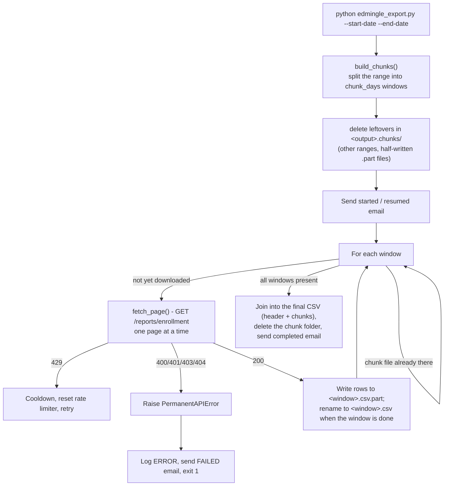

# Enrollments Reports

## 1. Overview & Purpose

Pulls row-level enrollment records from Edmingle's `/reports/enrollment` endpoint over a historical date range into one CSV. Edmingle rejects large single-shot ranges, so the range is split into fixed-size day "chunks", fetched page by page. Each chunk is downloaded to its own file and renamed when complete, so an interrupted run resumes by skipping the finished chunks (at most one chunk is re-downloaded).

**Status:** the last logged run (2026-09-23) stopped on a permanent API error, and the `send_mail` defect found in the 2026-09-24 audit was fixed on 2026-09-25 — see Section 9.

**Purpose:** one historical enrollment-level CSV for an operator-specified range, resumable across crashes without re-fetching finished chunks or duplicating rows.

## 2. High-Level Data Flow



**Lineage:** enrollment API → `fetch_page()` per (chunk, page) → `edmingle_enrollment_report.csv`
(built from the chunk files when every chunk is done; it replaces the previous file atomically). No
downstream script within this repo consumes it.

## 3. Repository Structure

| Path | Purpose |
|---|---|
| `scripts/edmingle_export.py` | Orchestrator — chunk windows, per-chunk download, joining, logging, the `EdmingleExportRun` class. |
| `scripts/edmingle_api.py` | `fetch_page()` — one (chunk, page) GET through `common.get_json` (error classification, 429 backoff). |
| `scripts/edmingle_constants.py` | `ENROLLMENT_PATH` (appended to `credentials.yaml`'s `base_url`), date format, output column order. |
| `output/edmingle_enrollment_report.csv` | Fixed-name output (8,573 lines incl. header, last written 2026-09-08). |
| `output/edmingle_enrollment_report.chunks/` | One `<start>_<end>.csv` per finished chunk (plus a `.part` file while one is downloading); exists only while a run is unfinished, then deleted. |
| `output/edmingle_enrollment_report.log` | Run log. `*.checkpoint.json` / `*.chunks.json` files from the old design (before 2026-09-25) are no longer used and can be deleted. |
| `output/edmingle_enrollment_01012010_25082026.csv` | A 115MB/450,797-line file with **no** matching log companion — see Section 9. |
| `../../credentials.yaml`, `../../common.py` | Shared credentials + `RollingRateLimiter`, atomic writes, `send_mail`. |
| `../notifications.yaml` | SMTP/recipient config (this pipeline's own folder). |

## 4. Source System

| Source | Endpoint | Method | Auth | Parameters | Pagination | Rate Limit |
|---|---|---|---|---|---|---|
| Enrollment report | `.../reports/enrollment` | GET | `apikey`/`orgid` headers | `start_date`/`end_date` (one chunk window), `time_step=1`, `report_details_type=3`, `page`, `per_page` (200), sort params | Page per chunk; `page_context.has_more_page` signals continuation | `RollingRateLimiter` at 30/min; `429` → `rate_limit_block_seconds` (300) or `Retry-After`, whichever is longer |

## 5. Extraction Process

1. Load credentials (exit if missing) and merge the inline `DEFAULTS`.
2. `run()` builds the chunk windows and deletes anything in `<output>.chunks/` that is not one of this range's chunk files (another range's chunks, or a half-written `.part` file).
3. Send a started email (or "resumed" if some chunk files already exist).
4. For each window without a chunk file: fetch its pages, write them to `<window>.csv.part`, then rename to `<window>.csv`; `None` becomes an empty string, never `"None"`. Finished windows are skipped.
5. When every window is present, write the header plus all chunk files to `<output>.tmp`, atomically replace the final CSV, delete the chunk folder, and send a completed email. A permanent error (400/401/403/404) or any unhandled exception stops the run with a failure email — no retry loop for those.

## 6. Function Reference

- **`fetch_page(...)`** — one page for one chunk, via `common.get_json`. Network/JSON/shape errors retry forever with exponential backoff; `429` sleeps `max(rate_limit_block_seconds, Retry-After)` and resets the limiter; `400/401/403/404` raise `PermanentAPIError`.
- **`build_chunks(start, end, chunk_days)`** — fixed windows; `sys.exit` if `start > end`.
- **`EdmingleExportRun._download_chunk(...)`** — fetches every page of one window into a `.part` file, then renames it; returns the row count.
- **`EdmingleExportRun.run()`** — the whole flow above.

## 7. Configuration & Parameters

- **CLI:** `--start-date`/`--end-date` (required, `DD-MM-YYYY`), `--output` (optional), `--api-key`/`--org-id` (override credentials per-run).
- **`../../credentials.yaml`:** `api_key`, `organization_id` — required.
- **`notifications.yaml`:** email config; Slack/Teams present but unused.
- **`DEFAULTS`** (inlined, no config file): `chunk_days=30`, `per_page=200`, `max_calls_per_minute=30`, `request_timeout_seconds=30`, `initial_retry_delay_seconds=2`, `maximum_retry_delay_seconds=60`, `rate_limit_block_seconds=300`. The former `edmingle_config.json` was removed 2026-09-23 (it was always an empty `{}` — every run already used these same defaults).

## 8. Data Transformation, Output & Schema

**Transformations:** null→empty-string (never the literal `"None"`) · fixed column order (unknown
API fields dropped, missing fields blank, neither crashes) · chunk files joined into one flat
file in chunk order, no cross-chunk sort/dedup.

**Output:** `edmingle_enrollment_report.csv` — a fixed filename, replaced atomically only when a run finishes (the previous file stays intact until then; the file does not exist partway through a first run); the fixed name bounds disk usage. The chunk folder sits beside it and is deleted on success. Re-running a finished range downloads it again.

**Database integration:** not applicable — CSV/JSON only.

**Schema** (verified against the live file header): `enrollment_id`, `enrollment_day`, `user_id`,
`name`, `email`, `contact_number`(+`_country_id`), `state`, `registration_number`,
`learner_type`, `enrollment_mode`, `enrollment_status`, `bundle_id`, `bundle_name`, `batch_ids`,
`batches`, `product_type`(+`_label`), `platform_type`, `enrollment_expiration_date`,
`shipping_details_json`, `preferred_categories` — all native API fields.

## 9. Data Quality & Known Limitations

**Implemented checks:** response-shape validation before trusting a page, `start_date ≤ end_date`
enforcement, atomic per-chunk files (a half-written chunk is never reused), atomic replacement of the final file, null→empty-string handling.

**Confirmed limitations:**
- **Blocked at the last run.** The live log ends with `2026-09-23 12:43:08 [ERROR] Edmingle export stopped: permanent API error` (a 400/401/403/404, no retry). Last successful run: **2026-09-08 06:02:23**, 8,572 rows for August 2026 (`completed: true`). API access with the current key worked when tested on 2026-09-25, so the cause was probably the earlier key.
- **`send_mail` defect — fixed 2026-09-25.** `EdmingleExportRun.run()` passed an extra `self.config` argument to the start/resume and completion emails, which raised `TypeError: send_mail() got multiple values for argument 'subject'`. The two call sites now match the wrapper's `(subject, body, logger)` signature. Verified by running `run()` end to end with a stubbed API and email: both emails are sent (the old code raised the `TypeError` on the same test). No real Edmingle call or email was made in that test.
- **An unexplained 115 MB file** (`edmingle_enrollment_01012010_25082026.csv`, 450,797 lines) has no checkpoint/chunks/log, follows the old naming pattern, and is inconsistent with the 30 calls/min limit (its creation-to-modify window is ~22 s). Origin unconfirmed.
- No de-duplication across chunk boundaries or repeated overlapping-range runs.

**Requires confirmation:** the root HTTP status/cause behind the 2026-09-23 permanent error (not captured in the summary log line alone); the origin of the unexplained 115MB file.

## 10. Error Handling & Logging

`logging.basicConfig` (`%(asctime)s [%(levelname)s] %(message)s`) to the log file and stdout. Last real line: `2026-09-23 12:43:08 [ERROR] Edmingle export stopped: permanent API error`. `PermanentAPIError` is caught in `main()`, logged, emailed, exit 1 (a human must fix it). Other exceptions are logged with a traceback, emailed with resume instructions, exit 1. `KeyboardInterrupt` exits 130 and resumes automatically next run.

## 11. Dependencies

| Dependency | Purpose |
|---|---|
| `requests` | HTTP calls |
| `PyYAML` (via `common.py`) | Reading both YAML files |
| `common` (repo root) | `RollingRateLimiter`, atomic writes, `send_mail`, credentials/notifications |
| stdlib (`argparse`, `csv`, `json`, `logging`, `pathlib`) | Core logic, CLI |

No `requirements.txt` exists in this folder — dependencies are documented in prose only.

## 12. Setup & How to Run

Step-by-step guide: [RUN_GUIDE.md](RUN_GUIDE.md). Before running:
1. Fill in `../../credentials.yaml`; fill in `../notifications.yaml` if email alerts are wanted (missing/disabled just logs a warning).
2. **Dates are `DD-MM-YYYY`** — unlike every other pipeline (`YYYY-MM-DD`), because that is what Edmingle's endpoint expects.
3. No watchdog: a crash means running the same command again (it skips the finished chunks). `--output` overrides the fixed default filename; the chunk folder and log are named after it.

**Run it in tmux** (session name = folder name; long ranges take hours):

```
step 1: tmux new -s enrollments_reports          start the session (name = folder name)
step 2: activate the venv, open the directory, run the script
        source /home/projectdev/ela_datasets/.venv/bin/activate
        cd /home/projectdev/ela_datasets/enrollments_reports/scripts
        python3 edmingle_export.py --start-date 01-09-2026 --end-date 30-09-2026
Ctrl+B then D                detach (the script keeps running)
tmux ls                      list active sessions
tmux attach -t enrollments_reports      return to the session
```

## 13. Automation / Scheduling

None. The former `edmingle_watchdog.sh` (auto-restart) was **removed 2026-09-23**; failure/crash emails now come from `main()`'s own exception handling.

## 14. Important Business / Technical Rules

- Chunking exists because Edmingle rejects large single-shot ranges — always split into `chunk_days` (default 30) windows; a chunk file is named after its window, so a resume can only reuse chunks of the same range.
- Resume is per chunk: a crash costs at most one chunk of re-downloading (a recent 30-day chunk is about 9,000 rows, i.e. ~45 pages of 200, or ~1.5 minutes); there is no page-level checkpoint.
- A different range after a finished run simply runs (before 2026-09-25 the old checkpoint made the script silently do nothing in that case).
- Fixed output filename (changed 2026-09-23, was per-date-range before) specifically bounds disk usage.
- Permanent (400/401/403/404) vs. transient (408/429/5xx, network, JSON) errors are classified differently — permanent stops immediately, transient retries forever with capped backoff (no retry-count ceiling).
- No external watchdog (removed 2026-09-23) — the script emails on failure from its own exception handling, same pattern as `ela_mis_datasets`.

## 15. Troubleshooting

| Scenario | Likely cause | Check |
|---|---|---|
| "Edmingle export stopped: permanent API error" | 400/401/403/404 from Edmingle | `api_key`/`organization_id`; rotate via `edmingle_api_key_generator` if expired, re-run |
| `TypeError: send_mail() got multiple values for argument 'subject'` | The old defect (fixed 2026-09-25) — means an old copy of the script is running | Update `edmingle_export.py` from the repo |
| Run appears to hang on one chunk | Active 429 cooldown | Check the log for "rate limited (429)" — expected pacing, not a hang |
| No `edmingle_enrollment_report.csv` yet, but chunk files exist | The first run has not finished | Re-run the same command; check `output/edmingle_enrollment_report.chunks/` |

## 16. Maintenance Guide

- **Chunk size/rate limits/retry behavior** → the `DEFAULTS` dict in `edmingle_export.py` (no config file or CLI flag).
- **Output columns** → `FIELDS` in `edmingle_constants.py`.
- **Permanent vs. transient classification** → `common.get_json`'s `permanent` default.
- **Investigate the unexplained large CSV** → check server access logs around 2026-09-24 00:24–00:25 UTC for any manual command that could have placed it there.

## 17. Upstream & Downstream Dependencies

**Upstream:** Edmingle's `/reports/enrollment` endpoint; the shared `credentials.yaml` (rotated by `edmingle_api_key_generator`). **Downstream:** none in this repo.

## 18. Security Considerations

The API key is sent only in headers, never logged or printed. `../notifications.yaml` is `chmod 600`. Output CSVs contain student PII (name, email, phone, shipping details), so restrict access to `output/`; the script has no access control.

## 19. Raw API Payload (Captured Structure)

**Captured live from the API on 2026-09-25** (one read-only call, tiny page size). Structure only: field names and types, no values, so no student/teacher PII is recorded here. `<int>`/`<str>`/`<null>` are the types observed in the sample; a field seen as `<null>` may hold a value for other records.

**Endpoint:** `GET .../reports/enrollment?report_details_type=3&time_step=1&...`, headers `apikey` + `orgid`.
Rows are under **`result.studentlist`**; pagination under `page_context`.

```json
{
  "code": "<int> (200)",
  "message": "<str>",
  "result": {
    "studentlist": [
      {
        "enrollment_id": "<int>",
        "bundle_id": "<int>",
        "user_id": "<int>",
        "name": "<str>",
        "email": "<str>",
        "contact_number": "<str>",
        "state": "<str>",
        "contact_number_country_id": "<int>",
        "enrollment_day": "<str>",
        "registration_number": "<str>",
        "enrollment_mode": "<str>",
        "enrollment_status": "<str>",
        "learner_type": "<str>",
        "bundle_name": "<str>",
        "batch_ids": "<str>",
        "batches": "<str>",
        "shipping_details_json": "<str>",
        "preferred_categories": "<null>",
        "enrollment_expiration_date": "<str>",
        "platform_type": "<int>",
        "product_type_label": "<str>",
        "product_type": "<int>"
      }
    ]
  },
  "page_context": {
    "page": "<int>",
    "per_page": "<int>",
    "has_more_page": "<bool>",
    "total_rows": "<int>",
    "sort_by": "<str>",
    "sort_order": "<str>"
  }
}
```

## 20. Future Improvements

1. **Email the output on completion** — send a completion email that includes the run status *and* attaches the generated dataset file(s), not just a status notification.
2. **Scheduled automation** — run automatically on a defined schedule instead of a manual trigger.
3. **Data cleaning layer** — a dedicated cleaning step/script (nulls, duplicates, standardization) inside the pipeline, instead of leaving it to downstream consumers.

---
*Initial documentation: 2026-09-24. `send_mail` defect fixed 2026-09-25. Project/technical owner: requires confirmation.*
