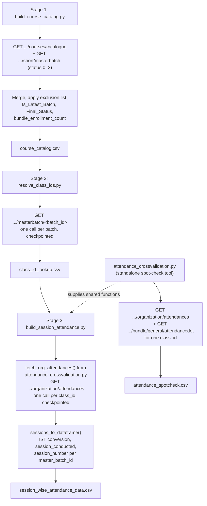

# Session-Wise Attendance Pipeline

## 1. Overview & Purpose

A 3-stage funnel pulling course/batch/attendance data from Edmingle into one session-level
attendance dataset. The stages exist because of a hard Edmingle constraint: **attendance cannot
be queried by `batch_id`** — only by `class_id`, a hidden subject/stream identifier with no
documented way to derive it from a `batch_id`. A fourth script, `attendance_crossvalidation.py`,
is both a standalone spot-check tool and a shared code dependency of Stage 3.

**Purpose:** answer "how many students has Vyoma served, and how well did they attend?" by
building, in order: a course/batch catalog (Stage 1), a batch→class_id resolution table (Stage
2), and a session-level attendance dataset keyed by `class_id` (Stage 3).

## 2. High-Level Data Flow



**Lineage:** catalogue + batch listing APIs → `course_catalog.csv` → `/masterbatch/<batch_id>` →
`class_id_lookup.csv` → `/organization/attendances` → `session_wise_attendance_data.csv`.
Planned-but-unbuilt Stages 4/5 (join back to catalog; cohort retention) are the only documented
intended consumers, and don't exist yet.

## 3. Repository Structure

| Path | Purpose |
|---|---|
| `scripts/pipeline_common.py` | Shared helpers — config/credentials, 429 backoff parsing, output-folder resolution, a flat-delay `RateLimiter`, `PipelineRunLogger`, `send_run_report()`. |
| `scripts/build_course_catalog.py` | **Stage 1** — `course_catalog.csv`. |
| `scripts/resolve_class_ids.py` | **Stage 2** — `class_id_lookup.csv`. |
| `scripts/build_session_attendance.py` | **Stage 3** — `session_wise_attendance_data.csv`. |
| `scripts/attendance_crossvalidation.py` | Dual role: standalone spot-check CLI, *and* supplies `fetch_org_attendances()`/`sessions_to_dataframe()`/`SESSION_BASE_COLUMNS` that Stage 3 imports directly (so the two can't drift on session-shaping logic). |
| `output/course_catalog.csv`, `class_id_lookup.csv`, `session_wise_attendance_data.csv`, `attendance_spotcheck.csv` | Stage 1/2/3/spot-check outputs (3,024 / 1,385 / 11,985 / 26 lines incl. header). |
| `output/logs/<stage>/<stage>_<timestamp>.log` | Per-run logs. |
| `output/master_attendance.csv`, `resolve_class_ids_run*.log`, `build_master_attendance_run.log`, `logs/build_course_catalog_alt/` | Legacy artifacts from an earlier pipeline version — no current script produces or reads them. See Section 9. |
| `../../credentials.yaml`, `../../common.py` | Shared credentials + `load_credentials`/`load_notifications`/`send_mail` (used via `pipeline_common.py`). |
| `../../notifications/session_wise_attendance.yaml` | SMTP/recipient config (repo-wide `notifications/` folder, not this pipeline's own `scripts/`). |

## 4. Source System

| Source | Endpoint | Method | Auth | Parameters | Pagination | Rate Limit |
|---|---|---|---|---|---|---|
| Course catalogue | `.../courses/catalogue?institution_id=...` | GET | `apikey`/`ORGID` headers | `institution_id` | Single response | `pipeline_common.RateLimiter` (~24/min); 429 waits Edmingle's own reported cooldown |
| Batch listing | `.../short/masterbatch?status={0\|3}` | GET | Same | `status` (0/3; Archived never fetched), `page`, `per_page=1000` | Page number, stops when a page returns fewer than `per_page` | Same |
| Batch → class_id | `.../masterbatch/{batch_id}` | GET | Headers + params (both `orgid`/`org_id` sent — Edmingle's docs disagree on which is read) | `batch_id` | One call per batch, checkpointed | Same |
| Session attendance | `.../organization/attendances` | GET | Same dual header+param pattern | `start`/`end` (unix), `class_id` (optional) | One call per class_id, checkpointed | Same |
| Attendance detail (spot-check only) | `.../bundle/general/attendancedet` | GET | `apikey` header | `start_date`/`end_date`, `top=1`, `class_id` | N/A | Same |

## 5. Extraction Process

**Stage 1:** fetches the full catalogue plus Active+Completed batches (Archived never
requested); flattens nested `batch` arrays; drops a hardcoded 20-value exclusion set; rolls up
`bundle_enrollment_count`; marks the newest batch per bundle; derives `Final_Status`; adds
catalogue-only rows for batch-less bundles; writes once, atomically (no row-level resume — the
aggregates need the complete dataset).

**Stage 2:** reads Stage 1's output, dedupes by `batch_id`, skips already-resolved batches
(resume), calls `/masterbatch/<batch_id>` per remaining batch. The real class records live under
`class.courses_array[]` — the response's top-level `class_id` field is actually the **batch id**,
a confirmed documentation gotcha. An unresolvable batch still emits one blank-`class_id` row so
it's never silently dropped.

**Stage 3:** reads Stage 2's output, drops unresolved rows, dedupes and resume-skips by
`class_id`, calls `fetch_org_attendances()` (from `attendance_crossvalidation.py`) per remaining
`class_id` for the given window, converts via `sessions_to_dataframe()` (IST conversion,
`session_conducted`, per-`master_batch_id` `session_number`), tags with bundle info, appends
immediately.

**Standalone tool:** fetches one `class_id`'s attendance plus a cross-check against
`/bundle/general/attendancedet` for a planned-vs-conducted sanity check — run independently, not
part of the ordered Stage 1→2→3 flow.

## 6. Function Reference

### `mark_latest_batch(df)` / `apply_business_logic(df)` / `compute_bundle_enrollment(df)` (Stage 1)
Sort by `(bundle_id, start_date desc, batch_id desc)`, flag the first row per bundle as latest.
`Final_Status` defaults to `"Completed"`, overridden by the catalogue status only for the latest
batch (if Completed/Ongoing/Upcoming). `bundle_enrollment_count` is a `groupby().sum()` broadcast
back onto every row.

### `fetch_classes_for_batch(...)` (Stage 2)
One `/masterbatch/<batch_id>` call; 429 waits Edmingle's reported duration, other errors retry up
to `max_retries` with a flat 5s delay; logs the full raw response on the run's first call to help
diagnose silent empty results.

### `fetch_org_attendances(...)` / `sessions_to_dataframe(...)` (in `attendance_crossvalidation.py`, imported by Stage 3)
Fetches raw session dicts (both header and query-param auth, since the two endpoints disagree on
which they read); converts UTC unix timestamps to IST via a manual `+5:30` offset (raw UTC never
written), derives `session_conducted` (`status not in {2,3}`), assigns `session_number` as a
per-`master_batch_id` chronological running count.

### `resolve_output_folder(...)` / `PipelineRunLogger` (in `pipeline_common.py`)
Anchors output to `<script's folder>/../output` regardless of invocation cwd. `PipelineRunLogger`
mirrors every `print()` into a timestamped log file as well as the console, marking
`[RUN START]`/`[RUN END]`/`[RUN FAILED]`.

## 7. Configuration & Parameters

- **Stage 1 CLI:** `--apikey`, `--out` (default `course_catalog.csv`), `--calls_per_minute` (24).
- **Stage 2 CLI:** `--in`, `--out`, `--limit`, `--calls_per_minute`, `--restart`, `--apikey`.
- **Stage 3 CLI:** `--in`, `--start`/`--end` (required), `--out`, `--limit`, `--calls_per_minute`, `--restart`, `--apikey`.
- **Spot-check CLI:** `--class_id` (optional), `--start`/`--end` (required), `--apikey`, `--out`.
- **`../../credentials.yaml`:** `api_key`, `organization_id`, `institute_id`, optional `base_url`.
- **`notifications.yaml`:** merged onto `config["smtp"]` only if `channels.email.enabled`.
- **Hardcoded:** `BATCH_IDS_TO_EXCLUDE` (20 values), `NOT_CONDUCTED_STATUSES={2,3}`, fallback org/institute ids.
- `config.yaml` was removed 2026-09-23 — its tunables were either unread by any script or already had a safe inline default.

## 8. Data Transformation, Output & Schema

**Transformations:** batch flattening and exclusion filtering (Stage 1) · unix→date conversion ·
latest-batch/Final_Status derivation · bundle enrollment rollup · response-shape correction for
Stage 2's misleading top-level `class_id` field · IST conversion and `session_conducted`/
`session_number` derivation (Stage 3) · deliberate column pruning (`signin_by_name`,
`class_status_code`, etc. fetched but not written).

**Outputs** (all `utf-8-sig`, in `output/`): `course_catalog.csv` (Stage 1, written once
atomically — no row-level resume). `class_id_lookup.csv` / `session_wise_attendance_data.csv`
(Stages 2/3, append-only, fully checkpointed/resumable). `attendance_spotcheck.csv` (standalone,
overwritten each run).

**Database integration:** not applicable — CSV output only.

**Schema — `course_catalog.csv`:** `bundle_id`/`name`, `batch_id`/`name`/`status`,
`start_date`/`end_date`, `tutor_name`/`id`, `batch_enrollment_count`, 23 catalogue metadata
columns (Subject, Level, Status, etc.), plus derived `Catalogue_Match`, `bundle_enrollment_count`,
`Is_Latest_Batch`, `Has_Batch`, `Catalogue_Status`, `Final_Status`.

**Schema — `class_id_lookup.csv`:** bundle/batch identity (passed through), `class_id` (nullable),
`tutor_name`/`id`, `total_classes`/`completed_classes`/`cancelled_classes`, `num_users`
(enrollment count — **not** attendance, see Section 14), `associated_masterbatches` (derived).

**Schema — `session_wise_attendance_data.csv`:** `session_id`, `class_id`/`name`,
`master_batch_id`/`name`, bundle identity (passed through), `class_date` (IST, derived),
`total_enrolled_at_session`, `present`, `not_marked`, `attendance_pct` (derived), `taken_by_name`,
`individual_batch_attendance`, `session_start_ist`/`session_end_ist` (derived),
`session_duration_min` (derived), `session_conducted` (derived), `session_number` (derived).

**Legacy files:** `attendance_spotcheck.csv` matches `SESSION_BASE_COLUMNS` minus bundle fields.
`master_attendance.csv` has columns (`signin_by_name`, `class_status_code`, etc.) that current
code explicitly does **not** produce — no script in `scripts/` writes this file; documenting it as
current output would misrepresent the live code.

## 9. Data Quality & Known Limitations

**Implemented checks:** Archived batches excluded at the request level, explicit exclusion list,
catalogue-only bundles preserved, unresolvable batches still emit a row, duplicate
batch_id/class_id skipped before re-fetching, unresolved class_ids dropped before Stage 3,
response-shape validation on every call.

**Confirmed limitations:**
- Stage 1 has no row-level resume — a crash requires a full restart (explicit design, since `Is_Latest_Batch`/`bundle_enrollment_count` need the complete dataset).
- `output/master_attendance.csv` has a schema the current code deliberately excludes — no current script produces it; appears to be a leftover from an earlier version.
- Three root-level `.log` files and a `build_course_catalog_alt/` log directory reference scripts/inputs that don't exist in the current `scripts/` folder — legacy artifacts.
- `notifications.yaml` has placeholder sender/recipient addresses while `enabled: true` — run-report emails believe they're sending but don't reach a real inbox.
- No automated reconciliation between `num_users` (enrollment) and `present` (attendance) — a manual-awareness item per the project's own documentation, not a code-enforced check.
- The unit test suite covering this pipeline's business logic was removed 2026-09-23 along with `config.yaml` — no automated regression safety net currently exists for the Section 14 business rules.

**Requires confirmation:** the origin/relevance of `master_attendance.csv` and the three legacy log files; whether the planned Stages 4/5 are still on the roadmap; the exact runtime environment (the VPS's bare system Python lacks `pandas` — these scripts likely run in a Docker container or equivalent).

## 10. Error Handling & Logging

Entirely `print()`-based (no `logging` module); `PipelineRunLogger` mirrors output into
`output/logs/<stage>/<stage>_<timestamp>.log`. Real example from an actual Stage 3 run:
```
[RESULT] Run complete. 11623 new session rows written to session_wise_attendance_data.csv
[TOTAL] 11984 session rows across 427 class_ids -- Conducted: 10848  Not conducted: 1136
[WARN] Email report failed for build_session_attendance: (535, b'5.7.8 Username and Password not accepted...')
```
429s wait Edmingle's own reported cooldown rather than blind retry. Non-429 failures retry a
small fixed count (2–3) with short flat delays, then log `[WARN]`/`[ERROR]` — no infinite-retry
loop, unlike `ela_mis_datasets`/`enrollments_reports`. `send_run_report()` is best-effort: a
missing SMTP config or auth failure (as seen above) only logs a warning, never crashes the run.

## 11. Dependencies

| Dependency | Purpose |
|---|---|
| `pandas` | DataFrame ops across all 4 scripts |
| `requests` | HTTP calls |
| `PyYAML` (via `common.py`) | Reading both YAML files |
| `common` (repo root) | Credentials/notifications, `send_mail` (via `pipeline_common.py`) |

No `requirements.txt` exists in this folder; the repo-root `docker/requirements.txt` +
`Dockerfile` appear to supply the runtime `pandas` environment (the VPS's bare system Python
lacks it) — exact invocation environment requires confirmation.

## 12. Setup & How to Run

**Step by step:**
1. `source /home/projectdev/ela_datasets/.venv/bin/activate` — one time per shell session. Your
   prompt shows `(.venv)` when it's active; a plain `python3` after this already has `pandas`,
   `requests`, `PyYAML` installed, so no separate install step is needed.
2. Populate `../../credentials.yaml` (`api_key`, `organization_id`, `institute_id`) — shared by
   every pipeline, likely already done.
3. Populate `../notifications/session_wise_attendance.yaml` if run-report emails are wanted (note
   the placeholder-address issue above).
4. `cd /home/projectdev/ela_datasets/session_wise_attendance/scripts` and run all three stages in
   order whenever upstream data changes — each stage needs the previous one's output.

```bash
source /home/projectdev/ela_datasets/.venv/bin/activate
cd /home/projectdev/ela_datasets/session_wise_attendance/scripts
python3 build_course_catalog.py
python3 resolve_class_ids.py
python3 build_session_attendance.py --start YYYY-MM-DD --end YYYY-MM-DD

# Standalone spot-check (not part of the ordered run)
python3 attendance_crossvalidation.py --class_id <id> --start YYYY-MM-DD --end YYYY-MM-DD
```
Resume after a crash/429/Ctrl+C: re-run the same command — Stages 2/3 auto-skip already-processed
rows. `--restart` wipes prior progress. Stage 1 has no row-level resume; a crash means starting over.

## 13. Automation / Scheduling

None — no cron/systemd/scheduler; all three stages plus the spot-check tool are triggered
manually, in order, whenever upstream data needs refreshing.

## 14. Important Business / Technical Rules

- The 3-stage funnel exists because of an Edmingle API constraint, not a design choice.
- `class.courses_array[]` gotcha: the masterbatch response's top-level `class_id` is actually the batch id — trusting Edmingle's own docs here produces wrong joins.
- One `class_id` can span multiple `batch_id`s — `session_number` is assigned per `master_batch_id`, so a broadcast session is numbered independently within each batch.
- Only status codes 2 (Postponed) and 3 (Cancelled) mean `session_conducted=False` — every other code, including NotSignedIn/MissedSignIn/Absent, still counts as conducted since the class occurred.
- `num_users` (Stage 2, enrollment) must not be confused with `present` (Stage 3, attendance).
- Pre-recorded/self-paced content can legitimately show `present=0` across the board — not a fetch bug.
- Latest-batch tie-breaking: newest `start_date` wins, ties broken by highest `batch_id`; every non-latest batch is forced to `Final_Status="Completed"` regardless of its own status.

## 15. Troubleshooting

| Scenario | Likely cause | Check |
|---|---|---|
| Stage 2/3 reports "0 remaining" immediately | Already fully resumed/complete | Expected — use `--restart` for a full re-pull, `--limit` for a partial test |
| "429 received. Waiting X min" repeatedly | Edmingle's per-minute cap exceeded | Expected pacing — lower `--calls_per_minute` if frequent |
| Stage 2 emits many blank-`class_id` rows | Genuinely unresolvable batches (self-paced/archived content) | Confirmed expected, not a fetch bug |
| Stage 3 shows many `present=0` sessions | Pre-recorded content, live attendance never tracked | Cross-check with the spot-check tool against the classroom UI |
| Run-report email never arrives | Placeholder SMTP addresses, or auth failure | Check the log for `[WARN] Email report failed`; fix `notifications.yaml` |
| Stage 1 crashes partway | No row-level resume for this stage | Just re-run from scratch — output is written once, atomically, at the end |

## 16. Maintenance Guide

- **Batch exclusion list** → `BATCH_IDS_TO_EXCLUDE` in `build_course_catalog.py`.
- **Latest-batch/Final_Status rule** → `mark_latest_batch()`/`apply_business_logic()`.
- **session_conducted mapping** → `NOT_CONDUCTED_STATUSES` in `attendance_crossvalidation.py` (propagates to Stage 3 automatically via the shared import).
- **Rate limiting** → `--calls_per_minute`, or each script's `DEFAULT_CALLS_PER_MINUTE`.
- **New Stage 3 output columns** → keep `SESSION_BASE_COLUMNS` (in `attendance_crossvalidation.py`) and `MASTER_OUTPUT_COLUMNS` (in `build_session_attendance.py`) in sync.
- **Legacy artifact cleanup** → confirm with the project owner before deleting `master_attendance.csv` or the root-level `.log` files.

## 17. Upstream & Downstream Dependencies

**Upstream:** Edmingle's catalogue, masterbatch, and attendance endpoints; shared
`credentials.yaml` (rotated by `edmingle_api_key_generator`). **Downstream:** none found within
this repo — the planned Stages 4/5 are the only documented intended consumers and don't exist yet.

## 18. Security Considerations

The API key is sent via headers/params only, never logged.
`../notifications/session_wise_attendance.yaml` is `chmod 600` (the `notifications/` folder itself is `chmod 700`).
None of the three output CSVs contain individual student PII (course/batch/session-level, not
student-level). The placeholder SMTP addresses mean no real email currently leaves this pipeline
— an availability concern, not a data-exposure risk.

## 19. Raw API Payload (Skeleton)

**Not a captured live response** — built from the field names already confirmed in Section 8's
schema list. Five endpoints across the 3 stages plus the standalone spot-check tool:

**Course catalogue** (Stage 1, `.../courses/catalogue?institution_id=...`):
```json
{
  "data": [
    {"bundle_id": "<TO CONFIRM>", "name": "<TO CONFIRM>", "batch_id": "<TO CONFIRM>",
     "status": "<TO CONFIRM>", "start_date": "<TO CONFIRM: epoch>", "end_date": "<TO CONFIRM: epoch>",
     "tutor_name": "<TO CONFIRM>", "tutor_id": "<TO CONFIRM>", "batch_enrollment_count": "<TO CONFIRM>"}
  ]
}
```

**Batch listing** (Stage 2a, `.../short/masterbatch?status={0|3}`):
```json
{
  "data": [
    {"bundle_id": "<TO CONFIRM>", "batch_id": "<TO CONFIRM>", "status": "<TO CONFIRM>"}
  ]
}
```

**Batch → class_id** (Stage 2b, `.../masterbatch/{batch_id}`):
```json
{
  "_comment": "TO CONFIRM: the top-level class_id field is misleading per Section 8's 'response-shape correction' note -- the real class_id may live elsewhere in this response",
  "class_id": "<TO CONFIRM: unreliable, see comment above>",
  "tutor_name": "<TO CONFIRM>", "tutor_id": "<TO CONFIRM>",
  "total_classes": "<TO CONFIRM>", "completed_classes": "<TO CONFIRM>", "cancelled_classes": "<TO CONFIRM>",
  "num_users": "<TO CONFIRM: enrollment count, NOT attendance -- see Section 14>"
}
```

**Session attendance** (Stage 3, `.../organization/attendances`):
```json
{
  "data": [
    {"session_id": "<TO CONFIRM>", "class_id": "<TO CONFIRM>",
     "start": "<TO CONFIRM: unix>", "end": "<TO CONFIRM: unix>",
     "present": "<TO CONFIRM>", "not_marked": "<TO CONFIRM>",
     "taken_by_name": "<TO CONFIRM>", "individual_batch_attendance": "<TO CONFIRM>",
     "signin_by_name": "<TO CONFIRM: fetched but deliberately not written to output>",
     "class_status_code": "<TO CONFIRM: fetched but deliberately not written to output>"}
  ]
}
```

**Attendance detail** (standalone spot-check, `.../bundle/general/attendancedet`):
```json
{
  "data": [
    {"class_id": "<TO CONFIRM>", "class_date": "<TO CONFIRM>", "present": "<TO CONFIRM>"}
  ]
}
```

## 20. Future Improvements

1. **Email the output on completion** — send a completion email that includes the run status *and* attaches the generated dataset file(s), not just a status notification.
2. **Scheduled automation** — run automatically on a defined schedule instead of a manual trigger.
3. **Data cleaning layer** — a dedicated cleaning step/script (nulls, duplicates, standardization) inside the pipeline, instead of leaving it to downstream consumers.

---
*Initial documentation: 2026-09-24, including identification of legacy/orphaned output
artifacts. Project/technical owner: requires confirmation.*
