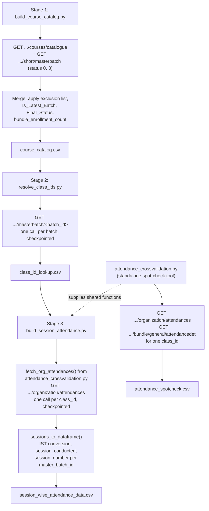

# Session-Wise Attendance Pipeline

## 1. Overview

`session_wise_attendance` is a 3-stage funnel that pulls course/batch/attendance data out of Edmingle and stitches it into one session-level attendance dataset. The three stages exist because of a hard Edmingle API constraint: **attendance cannot be queried by `batch_id`** — it is only queryable per `class_id`, a hidden subject/stream identifier with no documented, accurate way to derive it from a `batch_id`. A fourth script, `attendance_crossvalidation.py`, is both a standalone spot-check CLI tool and a shared code dependency of Stage 3.

## 2. Purpose

To answer "how many students has Vyoma served, and how well did they attend?" by building, in order: a course/batch catalog (Stage 1), a batch-to-class_id resolution table (Stage 2), and a session-level attendance dataset keyed by `class_id` (Stage 3).

## 3. High-Level Data Flow



## 4. Project / Repository Structure

| File / Folder | Purpose |
|---|---|
| `scripts/pipeline_common.py` | Shared helpers for all 4 entry-point scripts: config/credentials/notifications loading, 429 backoff parsing, output-folder resolution, a flat-delay `RateLimiter`, per-run file logging (`PipelineRunLogger`), and `send_run_report()` email. |
| `scripts/build_course_catalog.py` | **Stage 1.** Builds `course_catalog.csv` from the catalogue + batch-listing endpoints. |
| `scripts/resolve_class_ids.py` | **Stage 2.** Builds `class_id_lookup.csv` by resolving each batch's `class_id`(s). |
| `scripts/build_session_attendance.py` | **Stage 3.** Builds `session_wise_attendance_data.csv` by pulling session attendance per `class_id`. |
| `scripts/attendance_crossvalidation.py` | Dual role: (a) a standalone CLI spot-check tool comparing `/organization/attendances` against a second endpoint for one `class_id`; (b) supplies `fetch_org_attendances()`, `sessions_to_dataframe()`, and `SESSION_BASE_COLUMNS` that Stage 3 imports directly, so the two scripts cannot drift on session-shaping logic. |
| `scripts/notifications.yaml` | SMTP/recipient settings (`chmod 600`). |
| `output/course_catalog.csv` | Stage 1 output (3,024 lines incl. header). |
| `output/class_id_lookup.csv` | Stage 2 output (1,385 lines incl. header). |
| `output/session_wise_attendance_data.csv` | Stage 3 output — the pipeline's main dataset (11,985 lines incl. header). |
| `output/attendance_spotcheck.csv` | Output of the standalone `attendance_crossvalidation.py` tool (26 lines incl. header). |
| `output/logs/<stage_name>/<stage_name>_<timestamp>.log` | Per-run logs written by `PipelineRunLogger`, one subfolder per stage. |
| `output/master_attendance.csv` | Present in `output/` (362 lines) with a column set (`signin_by_name`, `signout_by_name`, `class_status_code`, `class_status_label`, `catalog_batch_name`) that the current `build_session_attendance.py`/`attendance_crossvalidation.py` explicitly does **not** produce (its own README states these columns are "deliberately dropped before writing"). No script in the current `scripts/` folder was found (via this audit) to write this file — see Section 21. |
| `output/build_master_attendance_run.log`, `output/resolve_class_ids_run.log`, `output/resolve_class_ids_run2.log` | Legacy log files at the root of `output/` (not under `output/logs/<stage>/`, the current `PipelineRunLogger` convention). `resolve_class_ids_run.log` references an input file `course_batch_merge.csv` that is not used by the current `resolve_class_ids.py` (whose default input is `course_catalog.csv`) — these appear to be artifacts of an earlier pipeline version. See Section 21. |
| `README.md` | Full workflow/config/business-rules documentation for this pipeline. |
| `../../credentials.yaml` (shared) | `api_key`, `organization_id`, `institute_id`. |
| `../../common.py` (shared) | `load_credentials`, `load_notifications`, `send_mail` (used by `pipeline_common.py`). |

## 5. Source System

| Source | Type | Endpoint | HTTP Method | Authentication | Parameters | Pagination | Rate Limit |
|---|---|---|---|---|---|---|---|
| Course catalogue | REST API | `{base_url}/institute/{institute_id}/courses/catalogue?institution_id={institute_id}` | GET | Headers `apikey`, `ORGID` | `institution_id` | None (single response) | Client-side `pipeline_common.RateLimiter` (~24 calls/min default); 429 waits Edmingle's own reported "Try after X minutes" duration |
| Batch listing | REST API | `{base_url}/short/masterbatch?status={0\|3}&page={n}&per_page=1000&organization_id={org_id}` | GET | Headers `apikey`, `ORGID` | `status` (0=Active, 3=Completed; Archived never fetched), `page`, `per_page=1000`, `organization_id` | Page number; stops when fewer than `per_page` rows returned | Same as above |
| Batch → class_id resolution | REST API | `{base_url}/masterbatch/{batch_id}` | GET | Headers + params `apikey`, `orgid`/`org_id` (sent both ways) | `batch_id` (path) | One call per batch (row-level checkpointed) | Same as above |
| Session attendance | REST API | `{base_url}/organization/attendances?org_id={org_id}&start={unix}&end={unix}&class_id={class_id}` | GET | Headers + params `apikey`, `orgid`/`org_id` (sent both ways, "since Edmingle's docs disagree with themselves about which it reads") | `start`, `end` (unix timestamps), `class_id` (optional — omitted for an org-wide pull) | One call per class_id (row-level checkpointed) | Same as above |
| Attendance detail summary (spot-check only) | REST API | `{base_url}/bundle/general/attendancedet` | GET | Header `apikey` | `start_date`/`end_date` (ISO 8601), `top=1`, `class_id` | Not applicable | Same as above |

## 6. Extraction Process

1. **Stage 1** (`build_course_catalog.py`): fetches the full catalogue, then all Active (status 0) and Completed (status 3) batches (Archived is never requested); flattens each course's nested `batch` array into one row per batch; drops rows whose `batch_id` is in a hardcoded 20-value exclusion set; computes `bundle_enrollment_count` (sum of `batch_enrollment_count` per bundle); marks the newest batch per bundle as `Is_Latest_Batch`; derives `Final_Status`; adds catalogue-only rows for bundles with no batch at all (`Has_Batch=0`); writes the merged result once, atomically, as `course_catalog.csv`.
2. **Stage 2** (`resolve_class_ids.py`): reads `course_catalog.csv`, deduplicates by `batch_id`, skips any `batch_id` already present in an existing `class_id_lookup.csv` (resume), and calls `GET /masterbatch/<batch_id>` per remaining batch; the real subject-level class records are nested under `class.courses_array[]` in the response (the top-level `class_id` field in that response is actually the batch id — a confirmed documentation gotcha); a batch resolving to zero classes still emits one row with `class_id` blank so it is never silently dropped; every batch's row(s) are appended to the CSV immediately after each call.
3. **Stage 3** (`build_session_attendance.py`): reads `class_id_lookup.csv`, drops rows with no resolved `class_id`, deduplicates by `class_id`, skips any `class_id` already present in an existing `session_wise_attendance_data.csv` (resume), and for each remaining `class_id` calls `fetch_org_attendances()` (imported from `attendance_crossvalidation.py`) for the given `--start`/`--end` window; converts the result via `sessions_to_dataframe()` (IST conversion, `session_conducted` derivation, `session_number` per `master_batch_id`); tags each row with `bundle_id`/`bundle_name` from the lookup row; appends immediately to the output CSV.
4. **Standalone tool** (`attendance_crossvalidation.py`, run independently, not part of the ordered Stage 1→2→3 run): fetches `/organization/attendances` for a single `--class_id` and date range, converts to a dataframe, writes `attendance_spotcheck.csv`, and — if `--class_id` was given — also fetches `/bundle/general/attendancedet` to cross-check "planned vs. conducted" session counts as a sanity check.

## 7. Detailed Function Documentation

### `mark_latest_batch(df)` (Stage 1)
- **Purpose:** Flag the newest batch per bundle.
- **Inputs:** the merged batch/catalogue DataFrame.
- **Output:** the same DataFrame with an `Is_Latest_Batch` column (0/1).
- **Processing:** Sorts by `bundle_id`, then `start_date` (unix timestamp, descending), then `batch_id` (descending, tiebreaker); the first row seen per `bundle_id` in that sort order is marked `1`.

### `apply_business_logic(df)` (Stage 1)
- **Purpose:** Derive `Catalogue_Status` and `Final_Status`.
- **Inputs:** the batch/catalogue DataFrame (post `mark_latest_batch`).
- **Output:** the DataFrame with `Catalogue_Status`/`Final_Status` columns added.
- **Processing:** `Catalogue_Status` mirrors the raw `Status` column; every row defaults to `Final_Status = "Completed"`; the latest batch per bundle instead takes `Final_Status` from its own catalogue `Status` if it is one of `Completed`/`Ongoing`/`Upcoming`, else leaves it blank.

### `compute_bundle_enrollment(df)` (Stage 1)
- **Purpose:** Roll up per-batch enrollment counts to the bundle level.
- **Inputs:** the batch DataFrame with `batch_enrollment_count`.
- **Output:** the DataFrame with `bundle_enrollment_count` merged onto every row of that bundle.
- **Processing:** `groupby("bundle_id")["batch_enrollment_count"].sum()`, then a left merge back onto every row.

### `fetch_classes_for_batch(apikey, org_id, batch_id, ...)` (Stage 2)
- **Purpose:** Resolve the real class_id(s) for one batch.
- **Inputs:** credentials, `batch_id`, retry count, debug flag.
- **Output:** the raw `courses_array` list from the response (empty list on failure).
- **Processing:** Calls `GET /masterbatch/<batch_id>`; on 429, waits Edmingle's own reported duration (`parse_retry_after_seconds`); on other errors, retries up to `max_retries` with a flat 5s delay; logs the full raw response body on the run's very first call (`debug=(i==1)` from the caller) to help diagnose silent empty results.

### `fetch_org_attendances(apikey, org_id, start_ts, end_ts, class_id, ...)` (in `attendance_crossvalidation.py`, imported by Stage 3)
- **Purpose:** Fetch raw session-level attendance data for one class_id (or org-wide if `class_id` is omitted).
- **Inputs:** credentials, unix start/end timestamps, optional class_id.
- **Output:** the raw `classes` list from the response (empty list on failure or non-200 API code).
- **Processing:** Sends `apikey`/`orgid`/`ORGID` as both headers and query params (the two endpoints' docs disagree on which is read); on 429, waits Edmingle's reported duration; retries transient failures up to `max_retries` times.

### `sessions_to_dataframe(classes)` (in `attendance_crossvalidation.py`, imported by Stage 3)
- **Purpose:** Convert raw session dicts into the pipeline's standard session-row shape.
- **Inputs:** list of raw session dicts from `fetch_org_attendances()`.
- **Output:** a `pandas.DataFrame` with columns `SESSION_BASE_COLUMNS`.
- **Processing:** Converts `class_date`/`gmt_start_time`/`gmt_end_time` (raw UTC unix timestamps) to IST via a manual `+5:30` offset (`unix_to_ist`) — the raw UTC fields are never written out; derives `session_conducted` (`status not in {2, 3}`, i.e. not Postponed/Cancelled); sorts by `session_start_ist`; assigns `session_number` as a per-`master_batch_id` running count in chronological order (`groupby("master_batch_id").cumcount() + 1`).

### `resolve_output_folder(config, script_path)` (in `pipeline_common.py`)
- **Purpose:** Ensure output always lands in this pipeline's `output/` folder regardless of invocation cwd.
- **Inputs:** merged config dict, the calling script's own `Path(__file__)`.
- **Output:** an absolute, created `Path` to the output folder.
- **Processing:** Resolves a relative `output_folder` config value (default `"."`) against `<script's folder>/../output`, not the process's current working directory; creates the folder if it doesn't exist.

### `PipelineRunLogger` (in `pipeline_common.py`)
- **Purpose:** Mirror every `print()` during a run into a durable, timestamped log file in addition to the console.
- **Inputs:** stage name, the script's own path, a summary of CLI args.
- **Output:** a context manager; writes `logs/<stage_name>/<stage_name>_<timestamp>.log`.
- **Processing:** Temporarily replaces `sys.stdout`/`sys.stderr` with a `_Tee` that writes to both the original stream and the log file; logs `[RUN START]`/`[RUN END]` markers with duration; treats a clean `SystemExit(0)` (e.g. `--help`) as success, anything else non-zero/exceptional as `[RUN FAILED]`.

## 8. Input Parameters & Configuration

- **Stage 1 CLI:** `--apikey`, `--out` (default `course_catalog.csv`), `--calls_per_minute` (default 24).
- **Stage 2 CLI:** `--in` (default `course_catalog.csv`), `--out` (default `class_id_lookup.csv`), `--limit`, `--calls_per_minute` (default 24), `--restart`, `--apikey`.
- **Stage 3 CLI:** `--in` (default `class_id_lookup.csv`), `--start`/`--end` (required, `YYYY-MM-DD`), `--out` (default `session_wise_attendance_data.csv`), `--limit`, `--calls_per_minute` (default 24), `--restart`, `--apikey`.
- **`attendance_crossvalidation.py` CLI:** `--class_id` (optional — omit for org-wide), `--start`/`--end` (required), `--apikey`, `--out` (default `attendance_spotcheck.csv`).
- **`../../credentials.yaml`:** `api_key`, `organization_id` (merged into both `org_id` and `orgid` config keys), `institute_id`, and (if present) `base_url` — all merged via `pipeline_common.load_config()` → `_merge_credentials()`.
- **`notifications.yaml`:** `channels.email.{enabled,smtp.*,to_addresses}`; only merged onto `config["smtp"]` if `channels.email.enabled` is true.
- **Hardcoded values:** `BASE_URL` per script; `BATCH_IDS_TO_EXCLUDE` (20-value set) in `build_course_catalog.py`; `NOT_CONDUCTED_STATUSES = {2, 3}` in `attendance_crossvalidation.py`; default org_id `683` / institute_id `483` fallbacks if not present in `credentials.yaml`.
- **`config.yaml` was removed 2026-09-23** — its former tunables (`base_url`, `output_folder`, `roster_gap_filler_enabled`, `exclude_archived_students`, `timezone`, a `crossvalidation:` block) were, per the project's own README, either never actually read by any script or already had a safe inline default at their one call site.
- No secret values are reproduced anywhere in this document.

## 9. Data Transformation

| Transformation | Description |
|---|---|
| Batch flattening (Stage 1) | Each catalogue course's nested `batch` array is flattened into one row per batch. |
| Exclusion filtering (Stage 1) | Rows whose `batch_id` is in the hardcoded `BATCH_IDS_TO_EXCLUDE` set (20 values, matched by exact ID only) are dropped. |
| Unix timestamp → date (Stage 1) | `start_date`/`end_date` are converted from unix timestamps to `YYYY-MM-DD` dates via `pd.to_datetime(..., unit="s").dt.date`. |
| Latest-batch / Final_Status derivation (Stage 1) | See Section 7. |
| Bundle enrollment rollup (Stage 1) | Sum of `batch_enrollment_count` per `bundle_id`, broadcast to every row of that bundle. |
| Response-shape correction (Stage 2) | The true class-level records are read from `class.courses_array[]`, not the response's misleading top-level `class_id` field (which is actually the batch id). |
| IST conversion (Stage 3) | `class_date`, `gmt_start_time`, `gmt_end_time` (raw UTC unix timestamps) are converted to IST (`+5:30` manual offset) before being written; raw UTC fields never reach the CSV. |
| session_conducted derivation (Stage 3) | `status not in {2, 3}` (Postponed, Cancelled) → conducted; the raw status code/label are not written out, only this boolean. |
| session_number assignment (Stage 3) | Per-`master_batch_id` sequential count in chronological order of `session_start_ist` — a broadcast `class_id` spanning multiple batches is numbered independently within each batch. |
| Column pruning (Stage 3) | `signin_by_name`, `signout_by_name`, `class_status_code`, `class_status_label`, `catalog_batch_name` are fetched from the API-adjacent logic but deliberately not written to the final CSV (per the project's own README). |

## 10. Output Dataset

- **`course_catalog.csv`** (Stage 1) — one row per batch, plus catalogue-only rows for bundles with no batch. Written once, atomically (`pandas.DataFrame.to_csv`), after all business rules are applied — no row-level resume, since `Is_Latest_Batch`/`bundle_enrollment_count` are global aggregates requiring the complete dataset.
- **`class_id_lookup.csv`** (Stage 2) — one row per resolved `class_id` (or one blank-`class_id` row per unresolved batch). Append-only, one batch's row(s) at a time, fully row-level checkpointed/resumable.
- **`session_wise_attendance_data.csv`** (Stage 3) — the pipeline's main output; session-level attendance across all batches. Append-only, one class_id's rows at a time, fully row-level checkpointed/resumable.
- **`attendance_spotcheck.csv`** (standalone tool) — one class_id's sessions per invocation, overwritten each run (not appended).

All are written with `encoding="utf-8-sig"` and land in `output/`, anchored to `<script's folder>/../output` regardless of invocation cwd.

## 11. Output Schema

### `course_catalog.csv` (Stage 1) — verified against the live file's header

| Column | Data Type | Description | Source/Derived |
|---|---|---|---|
| bundle_id | string | Course bundle identifier | Native (batch listing) |
| bundle_name | string | Course bundle name | Native (batch listing) |
| batch_id | string | Batch identifier | Native (batch listing) |
| batch_name | string | Batch display name | Native (batch listing) |
| batch_status | string | "Active" / "Completed" (label assigned by which status-code request returned it) | Derived from request status code |
| start_date | date | Batch start date | Native, unix ts → date |
| end_date | date | Batch end date | Native, unix ts → date |
| tutor_name | string | Instructor name | Native (batch listing) |
| tutor_id | string | Instructor ID | Native (batch listing) |
| batch_enrollment_count | int | Per-batch admitted student count | Native `admitted_students` field |
| Course Name … Division (23 columns) | mixed | Catalogue metadata (Subject, Level, Language, Examination, Type, Course Division, Certificate, Course Sponsor, Course Title Sanskrit, Status, Number of Lectures, Duration, Personas, Computer Based Assessment, Product ID, SSS Category, Viniyoga, Adhyayanam Category, Term of Course, Position in Funnel, Division, Tutors, Tutord Ids, Course Ids) | Native (catalogue API, column names as returned) |
| Catalogue_Match | int (0/1) | Whether this batch's bundle matched a catalogue row | Derived — `Bundle id`.notna() |
| bundle_enrollment_count | int | Sum of batch_enrollment_count per bundle | Derived |
| Is_Latest_Batch | int (0/1) | Newest batch per bundle | Derived |
| Has_Batch | int (0/1) | 0 only for catalogue-only (no-batch) rows | Derived |
| Catalogue_Status | string | Mirrors catalogue `Status` | Derived |
| Final_Status | string | See Section 7 business logic | Derived |

### `class_id_lookup.csv` (Stage 2) — verified against the live file's header

| Column | Data Type | Description | Source/Derived |
|---|---|---|---|
| bundle_id | string | Course bundle identifier | Passed through from `course_catalog.csv` |
| bundle_name | string | Course bundle name | Passed through from `course_catalog.csv` |
| batch_id | string | Batch identifier | Passed through from `course_catalog.csv` |
| batch_name | string | Batch display name | Passed through from `course_catalog.csv` |
| class_id | string (nullable) | Resolved subject/stream class_id; blank if unresolved | Native, from `class.courses_array[]` |
| tutor_name | string | Instructor for this class | Native |
| tutor_id | string | Instructor ID | Native |
| total_classes | int | Total sessions for this class | Native |
| completed_classes | int | Completed session count | Native (`completed` field) |
| cancelled_classes | int | Cancelled session count | Native (`cancelled` field) |
| num_users | int | Enrollment count (not attendance — see Section 20) | Native |
| associated_masterbatches | string | Comma-joined list of other batch IDs this class_id also spans | Derived — joined from a list field |

### `session_wise_attendance_data.csv` (Stage 3) — verified against the live file's header

| Column | Data Type | Description | Source/Derived |
|---|---|---|---|
| session_id | Int64 | Session identifier | Native (`id` field) |
| class_id | Int64 | Subject/stream id | Native |
| class_name | string | Subject/stream display name | Native |
| master_batch_id | Int64 | Actual batch id (join key to `course_catalog.csv`) | Native |
| master_batch_name | string | Batch display name | Native (leading-space-trimmed) |
| bundle_id | string | Course bundle identifier | Passed through from `class_id_lookup.csv` |
| bundle_name | string | Course bundle name | Passed through from `class_id_lookup.csv` |
| class_date | string (date) | IST calendar date | Derived — unix ts + 5:30 offset |
| total_enrolled_at_session | int | Enrollment count at that specific session | Native (`total` field) |
| present | int | Present count | Native |
| not_marked | int | Total minus present minus absent (roughly) | Native |
| attendance_pct | float | `100 * present / total_enrolled_at_session` | Derived |
| taken_by_name | string | Tutor who conducted the session | Native |
| individual_batch_attendance | int (0/1) | Whether attendance is tracked per-individual-batch vs. shared/broadcast | Native |
| session_start_ist | string (datetime) | IST session start | Derived — unix ts + 5:30 offset |
| session_end_ist | string (datetime) | IST session end | Derived — unix ts + 5:30 offset |
| session_duration_min | float | `(gmt_end - gmt_start) / 60` | Derived |
| session_conducted | bool | `status not in {2, 3}` | Derived |
| session_number | int | Per-`master_batch_id` chronological sequence | Derived |

### `master_attendance.csv` and `attendance_spotcheck.csv`

`attendance_spotcheck.csv`'s header matches `SESSION_BASE_COLUMNS` (the same shape as `session_wise_attendance_data.csv` minus `bundle_id`/`bundle_name`, which only Stage 3 adds). `master_attendance.csv`'s header includes columns (`signin_by_name`, `signout_by_name`, `class_status_code`, `class_status_label`, `catalog_batch_name`) that the current codebase's own documentation says are deliberately dropped — its schema is **not** produced by any script found in the current `scripts/` folder. Documenting its columns as current-pipeline output would misrepresent the live code; see Section 21.

## 12. Data Quality & Validation

| Check | Implemented? |
|---|---|
| Archived batches excluded at the request level (Stage 1) | Yes — only status 0/3 are ever requested |
| Explicit batch_id exclusion list (Stage 1) | Yes — `BATCH_IDS_TO_EXCLUDE` |
| Catalogue-only bundles preserved even with no batch (Stage 1) | Yes — `add_courses_without_batches()` |
| Unresolvable batch still emits a row (Stage 2) | Yes — `class_records = [{}]` fallback |
| Duplicate batch_id/class_id skipped before re-fetching (Stage 2/3) | Yes — `drop_duplicates()` + resume-skip logic |
| Unresolved class_id rows skipped before Stage 3 pull | Yes — `dropna(subset=["class_id"])` |
| Response shape validated before trusting a page (all stages) | Yes — via `_request_with_retry`/`fetch_org_attendances` status/JSON checks |

### Quality limitations not handled
- No validation that `num_users` (Stage 2, an enrollment count) is not confused with `present` (Stage 3, an attendance count) at the data level — the project's own README calls this out as a manual-awareness item, not a code-enforced check.
- No automated reconciliation between Stage 1's `bundle_enrollment_count`/`batch_enrollment_count` and Stage 3's `total_enrolled_at_session` (these can legitimately differ — cumulative bundle enrollment vs. enrollment at a specific session date — and `attendance_crossvalidation.py`'s own docstring says not to assume either is "right" without manual investigation).
- No automated check that `output/master_attendance.csv` (legacy schema) and `session_wise_attendance_data.csv` (current schema) are consistent or that one supersedes the other.
- Stage 1 has no row-level resume — a crash mid-fetch requires a full restart (explicitly documented in the project's own README as an accepted limitation, since `Is_Latest_Batch`/`bundle_enrollment_count` require the complete fetched dataset).

## 13. Error Handling & Logging

- Logging is entirely `print()`-based (no `logging` module usage anywhere in these four scripts); `PipelineRunLogger` mirrors every `print()` into `output/logs/<stage_name>/<stage_name>_<timestamp>.log` as well as the console.
- Real log line example (from an actual historical run of Stage 3, `build_session_attendance_20260825_182308.log`):
  ```
  [RESULT] Run complete. 11623 new session rows written to ...\session_wise_attendance_data.csv
  [SUMMARY] class_ids processed this run: 1370, no sessions returned: 948, errors: 0
  [TOTAL] 11984 session rows across 427 class_ids in session_wise_attendance_data.csv
    Conducted: 10848  Not conducted: 1136
  [WARN] Email report failed for build_session_attendance: (535, b'5.7.8 Username and Password not accepted...')
  ```
  This confirms the current `session_wise_attendance_data.csv` (11,984 data rows) is the direct product of that run, and that the run's own completion email failed on a Gmail authentication error — logged as a warning, not a run failure (see below).
- 429 responses are handled by parsing Edmingle's own "Try after X minutes" message (`parse_retry_after_seconds`) and sleeping that long, rather than quick blind retries.
- Non-429 request failures (`RequestException`) are retried up to a small fixed count (2–3 depending on the function) with short flat delays, then give up and log a `[WARN]`/`[ERROR]` — there is no infinite-retry-with-backoff loop in this pipeline (unlike `ela_mis_datasets`/`enrollments_reports`).
- `send_run_report()` (email) is explicitly best-effort: a missing/incomplete SMTP config, or an SMTP authentication failure (as seen in the real log line above), only logs a `[WARN]` and never crashes the run.
- Per the repo-root `NOTIFICATIONS.md`, this pipeline's own `notifications.yaml` still has **placeholder** recipient/sender addresses (`your_email@gmail.com`, `manager_email@example.com`) despite being marked `enabled: true` — meaning any run report it "sends" today does not reach a real inbox (this is stated as a known, unresolved action item in that shared index file, not a live secret).

## 14. Dependencies

| Dependency | Purpose | Required |
|---|---|---|
| `pandas` | DataFrame operations across all 4 scripts (catalogue merging, business-rule columns, CSV I/O) | Yes |
| `requests` | HTTP calls to every Edmingle endpoint used | Yes |
| `PyYAML` (via `common.py`) | Reading `credentials.yaml` / `notifications.yaml` | Yes |
| Python standard library (`argparse`, `re`, `sys`, `time`, `os`, `datetime`, `pathlib`) | CLI parsing, retry timing, path handling | Yes (built-in) |
| `../../common.py` (shared module) | `load_credentials`, `load_notifications`, `send_mail` (used indirectly via `pipeline_common.py`) | Yes |

No `requirements.txt` exists in this pipeline's own folder. The repo-root `docker/requirements.txt` (`pandas`, `requests`, `PyYAML`) and accompanying `Dockerfile` (Python 3.12-slim base) appear to be the shared dependency environment for the whole `ela_datasets/` repo, including this pipeline — the VPS's own system Python (`/usr/bin/python3`, confirmed via this audit) does not have `pandas` installed, so these scripts likely run inside that Docker container or an equivalent environment with `pandas` installed, not directly against the bare system interpreter. **Requires confirmation from the project owner** as to the exact runtime environment used for scheduled/manual invocations.

## 15. Setup

1. Ensure `../../credentials.yaml` has a populated `api_key`, `organization_id`, and `institute_id`.
2. Ensure this folder's `notifications.yaml` exists if run-report emails are wanted; note the placeholder-address issue in Section 13/21 if relying on it for real alerts.
3. Install `pandas`, `requests`, `PyYAML` (e.g., via the repo-root `docker/requirements.txt`, or an equivalent local environment — the bare system Python on the VPS lacks `pandas`).
4. Run the three stages in order any time upstream data changes (each stage's output is the next stage's input).

## 16. How to Run

```bash
cd scripts

# Stage 1: catalog
python build_course_catalog.py

# Stage 2: resolve class_ids (needs course_catalog.csv from Stage 1)
python resolve_class_ids.py

# Stage 3: pull attendance (needs class_id_lookup.csv from Stage 2)
python build_session_attendance.py --start YYYY-MM-DD --end YYYY-MM-DD
```

Resume after a crash/429/Ctrl+C: re-run the exact same command — Stages 2 and 3 auto-skip any `batch_id`/`class_id` already present in their output CSV. Pass `--restart` to wipe prior progress. Stage 1 has no row-level resume — a crash means rerunning it from scratch.

Standalone spot-check tool (not part of the ordered run):
```bash
python attendance_crossvalidation.py --class_id <id> --start YYYY-MM-DD --end YYYY-MM-DD
```

## 17. Automation / Scheduling

**None.** No cron job, systemd timer, or external scheduler was found anywhere in this pipeline's files — all three stages plus the spot-check tool are triggered manually, in the documented order, whenever upstream data needs refreshing.

## 18. Database / Warehouse Integration

Not applicable — this pipeline writes to CSV files only.

## 19. Data Lineage

```
Edmingle catalogue + masterbatch listing APIs
        |
        v
Stage 1: build_course_catalog.py  -->  course_catalog.csv
        |
        v
Stage 2: resolve_class_ids.py (GET /masterbatch/<batch_id>)  -->  class_id_lookup.csv
        |
        v
Stage 3: build_session_attendance.py (GET /organization/attendances,
         via attendance_crossvalidation.py's fetch_org_attendances)  -->  session_wise_attendance_data.csv

attendance_crossvalidation.py (standalone) --> attendance_spotcheck.csv  (side-branch, not fed into Stage 3's output)
```
Per the project's own README, Stages 4 (join `session_wise_attendance_data.csv` back onto `course_catalog.csv`) and 5 (join against a lifetime enrollment dataset for cohort retention) are **planned but not built** — no code for either exists in this folder.

## 20. Important Business / Technical Rules

- **The 3-stage funnel exists because of an Edmingle API constraint**, not a design choice: attendance cannot be queried by `batch_id`; only by `class_id`, whose derivation from `batch_id` required reverse-engineering the real (undocumented) response shape.
- **`class.courses_array[]` gotcha (Stage 2):** the masterbatch response's top-level `class_id` field is actually the **batch id**, not a class id — trusting Edmingle's own documentation here would produce wrong joins; the real subject-level records are nested under `class.courses_array[]`.
- **One `class_id` can span multiple `batch_id`s** (`associated_masterbatches`) — a broadcast/shared session; `session_number` is deliberately assigned per `master_batch_id`, not per `class_id`, so a broadcast session is numbered independently within each batch it belongs to.
- **Session status → `session_conducted` mapping:** every row Edmingle returns is a *planned* slot; only status codes `2` (Postponed) and `3` (Cancelled) mean the slot did not happen — every other code (including `0` NotSignedIn, `5` MissedSignIn, `7` Absent) still counts as conducted, since the class occurred even if attendance was marked poorly.
- **`num_users` (Stage 2) is an enrollment count, not attendance** — must not be confused with `present` (Stage 3), which comes only from the `/organization/attendances` call.
- **Pre-recorded/self-paced content can legitimately show `present = 0` across the board** (`NotSignedIn` everywhere) — this reflects content where live attendance was never tracked, not a fetch bug.
- **`Is_Latest_Batch`/`Final_Status` tie-breaking (Stage 1):** newest `start_date` wins per bundle; ties broken by highest `batch_id`; every non-latest batch is forced to `Final_Status = "Completed"` regardless of its own catalogue status.

## 21. Known Limitations

### Confirmed limitations
- **Stage 1 has no row-level resume** — a crash mid-fetch requires a full restart, since `Is_Latest_Batch` and `bundle_enrollment_count` are global aggregates needing the complete fetched dataset before any row can be written (this is by explicit design, not an oversight, per the project's own README).
- **`output/master_attendance.csv`** is present in the output folder with a schema (including `signin_by_name`, `signout_by_name`, `class_status_code`, `class_status_label`, `catalog_batch_name`) that the current codebase's own documentation states is deliberately excluded from Stage 3's output. No script in the current `scripts/` folder was found (via this audit) to produce this file — it appears to be a leftover artifact from an earlier version of the pipeline. **Requires confirmation from the project owner** as to whether it is still needed or safe to remove.
- **`output/resolve_class_ids_run.log`, `output/resolve_class_ids_run2.log`, `output/build_master_attendance_run.log`** sit at the root of `output/` (not under `output/logs/<stage>/`, the current `PipelineRunLogger` convention) and reference file/path patterns (`course_batch_merge.csv` as an input; a `build_master_attendance` stage name) that do not match any script currently in `scripts/`. These appear to be legacy artifacts from a prior pipeline iteration or from the separate `course_batch_merge/` pipeline elsewhere in the repo. **Requires confirmation from the project owner** before deletion.
- An orphaned log directory, `output/logs/build_course_catalog_alt/`, exists with no corresponding `build_course_catalog_alt.py` script anywhere in `scripts/` — another apparent leftover from an earlier pipeline variant.
- Per the repo-root `NOTIFICATIONS.md`, this pipeline's `notifications.yaml` has placeholder (non-real) sender/recipient addresses while `enabled: true` — run-report emails believe they are sending but do not reach a real inbox.
- The unit test suite previously covering this pipeline's pure business logic (exclusion matching, latest-batch selection, IST conversion, 429 parsing, resume behavior) was removed 2026-09-23 along with `config.yaml`, per the project's own README — there is currently no automated regression safety net for any of the Section 20 business rules.

### Requires confirmation
- The true origin and continued relevance of `master_attendance.csv` and the three legacy `.log` files described above.
- Whether Stages 4/5 (planned, not built) are still on the roadmap.

## 22. Troubleshooting

| Scenario | Likely cause | What to check |
|---|---|---|
| Stage 2/3 run reports "0 remaining" immediately | All batches/class_ids already present in the existing output CSV | Expected resume behavior; use `--restart` to force a full re-pull, or `--limit` for a partial test run. |
| `[RATE LIMIT] ... 429 received. Waiting X min` appears repeatedly | Edmingle's per-minute cap was exceeded | Expected pacing behavior; lower `--calls_per_minute` if it recurs often. |
| Stage 2 emits many blank-`class_id` rows | Genuinely unresolvable batches (self-paced/archived content with no attendance-trackable subject) | Confirmed expected behavior per the project's own README — not a fetch bug. |
| Stage 3 shows many `present = 0` sessions for one class_id | Likely pre-recorded/self-paced content where live attendance was never tracked | Cross-check with `attendance_crossvalidation.py --class_id <id> ...` against the classroom UI. |
| Run-report email never arrives | Placeholder SMTP recipient/sender addresses in `notifications.yaml`, or an SMTP auth failure (see the real Gmail `535` error in Section 13) | Check `output/logs/<stage>/...log` for a `[WARN] Email report failed` line; fix `notifications.yaml`'s real credentials/addresses. |
| Stage 1 crashes partway through | No row-level resume exists for this stage | Simply re-run `build_course_catalog.py` from scratch — the output CSV is only written once, atomically, at the very end, so a crash never leaves a corrupt file to clean up. |

## 23. Maintenance Guide

- **Changing the batch exclusion list:** edit `BATCH_IDS_TO_EXCLUDE` in `build_course_catalog.py`.
- **Changing the latest-batch tie-break or Final_Status rule:** edit `mark_latest_batch()`/`apply_business_logic()` in `build_course_catalog.py`.
- **Changing the session_conducted status mapping:** edit `NOT_CONDUCTED_STATUSES` in `attendance_crossvalidation.py` — this automatically propagates to Stage 3 since it imports `sessions_to_dataframe()` from that module.
- **Changing rate limiting:** pass `--calls_per_minute` per invocation, or edit each script's own `DEFAULT_CALLS_PER_MINUTE` constant.
- **Adding output columns to Stage 3:** edit `SESSION_BASE_COLUMNS` in `attendance_crossvalidation.py` and `MASTER_OUTPUT_COLUMNS` in `build_session_attendance.py` together, since they must stay in sync.
- **Cleaning up legacy artifacts:** confirm with the project owner before deleting `master_attendance.csv`, the three root-level `.log` files, or the `build_course_catalog_alt/` log directory (see Section 21).

## 24. Upstream & Downstream Dependencies

- **Upstream:** Edmingle's catalogue, masterbatch, masterbatch-detail, and organization/attendances REST endpoints; the shared `credentials.yaml` (whose `api_key` is rotated by `edmingle_api_key_generator`).
- **Downstream:** No downstream script within `ela_datasets/` was found (via this audit) to programmatically consume `session_wise_attendance_data.csv`, `course_catalog.csv`, or `class_id_lookup.csv` — the planned but unbuilt Stages 4/5 (Section 19) are the only documented intended consumers, and they do not exist yet.

## 25. Security Considerations

- The API key is read from the shared `credentials.yaml` and sent via headers/params only; it is never logged or printed by these scripts.
- `notifications.yaml` is set to `chmod 600` (per directory listing and the project's own README), restricting SMTP credential access to the file owner.
- Output CSVs (`course_catalog.csv`, `class_id_lookup.csv`, `session_wise_attendance_data.csv`) do not contain individual student PII by column design (they are course/batch/session-level, not student-level) — no student names, emails, or phone numbers appear in any of the three current-pipeline output schemas documented in Section 11.
- The placeholder SMTP addresses noted in Section 21 mean no real email currently leaves this pipeline — a minor availability concern for alerting, not a data-exposure risk.

## 26. Change Log

| Date | Version | Change | Author |
|---|---|---|---|
| 2026-09-24 | 1.0 (initial documentation) | Initial technical documentation created from a full audit of the current codebase and output files on the VPS, including identification of legacy/orphaned output artifacts. | — |

## 27. Ownership

- **Project Owner:** Requires confirmation from the project owner.
- **Technical Owner:** Requires confirmation from the project owner.
