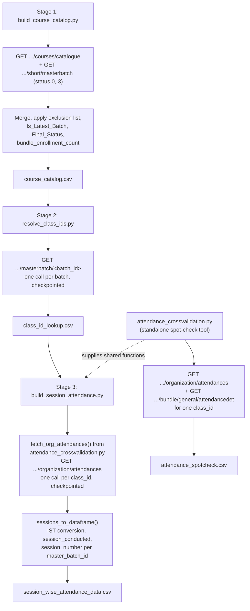

# Session-Wise Attendance Pipeline

## 1. Overview & Purpose

A 3-stage funnel pulling course/batch/attendance data from Edmingle into one session-level attendance dataset. The stages exist because of a hard Edmingle constraint: **attendance cannot be queried by `batch_id`** — only by `class_id`, a hidden subject/stream identifier with no documented way to derive it from a `batch_id`. A fourth script, `attendance_crossvalidation.py`, is both a standalone spot-check tool and a shared code dependency of Stage 3.

**Purpose:** answer "how many students has Vyoma served, and how well did they attend?" via a course/batch catalog (Stage 1), a batch→class_id table (Stage 2) and a session-level attendance dataset keyed by `class_id` (Stage 3).

## 2. High-Level Data Flow



**Lineage:** catalogue + batch listing APIs → `course_catalog.csv` → `/masterbatch/<batch_id>` →
`class_id_lookup.csv` → `/organization/attendances` → `session_wise_attendance_data.csv`.
Planned-but-unbuilt Stages 4/5 (join back to catalog; cohort retention) are the only documented
intended consumers, and don't exist yet.

## 3. Repository Structure

| Path | Purpose |
|---|---|
| `scripts/pipeline_common.py` | Shared helpers — config/credentials, 429 backoff parsing, output-folder resolution, a flat-delay `RateLimiter`, `PipelineRunLogger`, `send_run_report()`. |
| `scripts/build_course_catalog.py` | **Stage 1** — `course_catalog.csv`. |
| `scripts/resolve_class_ids.py` | **Stage 2** — `class_id_lookup.csv`. |
| `scripts/build_session_attendance.py` | **Stage 3** — `session_wise_attendance_data.csv`. |
| `scripts/attendance_crossvalidation.py` | Dual role: standalone spot-check CLI, *and* supplies `fetch_org_attendances()`/`sessions_to_dataframe()`/`SESSION_BASE_COLUMNS` that Stage 3 imports directly (so the two can't drift on session-shaping logic). |
| `output/course_catalog.csv`, `class_id_lookup.csv`, `session_wise_attendance_data.csv`, `attendance_spotcheck.csv` | Stage 1/2/3/spot-check outputs (3,024 / 1,385 / 11,985 / 26 lines incl. header). |
| `output/logs/<stage>/<stage>_<timestamp>.log` | Per-run logs. |
| `output/master_attendance.csv`, `resolve_class_ids_run*.log`, `build_master_attendance_run.log`, `logs/build_course_catalog_alt/` | Legacy artifacts from an earlier pipeline version — no current script produces or reads them. See Section 9. |
| `../../credentials.yaml`, `../../common.py` | Shared credentials + `load_credentials`/`load_notifications`/`send_mail` (used via `pipeline_common.py`). |
| `../notifications.yaml` | SMTP/recipient config (this pipeline's own folder). |

## 4. Source System

| Source | Endpoint | Method | Auth | Parameters | Pagination | Rate Limit |
|---|---|---|---|---|---|---|
| Course catalogue | `.../courses/catalogue?institution_id=...` | GET | `apikey`/`ORGID` headers | `institution_id` | Single response | `pipeline_common.RateLimiter` (~24/min); 429 waits Edmingle's own reported cooldown |
| Batch listing | `.../short/masterbatch?status={0\|3}` | GET | Same | `status` (0/3; Archived never fetched), `page`, `per_page=1000` | Page number, stops when a page returns fewer than `per_page` | Same |
| Batch → class_id | `.../masterbatch/{batch_id}` | GET | Headers + params (both `orgid`/`org_id` sent — Edmingle's docs disagree on which is read) | `batch_id` | One call per batch, checkpointed | Same |
| Session attendance | `.../organization/attendances` | GET | Same dual header+param pattern | `start`/`end` (unix), `class_id` (optional) | One call per class_id, checkpointed | Same |
| Attendance detail (spot-check only) | `.../bundle/general/attendancedet` | GET | `apikey` header | `start_date`/`end_date`, `top=1`, `class_id` | N/A | Same |

## 5. Extraction Process

**Stage 1:** fetches the full catalogue plus Active+Completed batches (Archived never requested); flattens nested `batch` arrays; drops a hardcoded 20-value exclusion set; rolls up `bundle_enrollment_count`; marks the newest batch per bundle; derives `Final_Status`; adds catalogue-only rows for batch-less bundles; writes once, atomically (no row-level resume — the aggregates need the whole dataset).

**Stage 2:** reads Stage 1's output, dedupes by `batch_id`, skips already-resolved batches, calls `/masterbatch/<batch_id>` per remaining batch. The real class records live under `class.courses_array[]` — the response's top-level `class_id` is actually the **batch id** (a confirmed documentation gotcha). An unresolvable batch still emits one blank-`class_id` row so it is never silently dropped.

**Stage 3:** reads Stage 2's output, drops unresolved rows, dedupes and resume-skips by `class_id`, calls `fetch_org_attendances()` per remaining `class_id` for the window, converts via `sessions_to_dataframe()` (IST, `session_conducted`, per-`master_batch_id` `session_number`), tags bundle info, appends immediately.

**Standalone tool:** fetches one `class_id`'s attendance plus a cross-check against `/bundle/general/attendancedet`; not part of the ordered flow.

## 6. Function Reference

- **`mark_latest_batch` / `apply_business_logic` / `compute_bundle_enrollment` (Stage 1)** — sort by `(bundle_id, start_date desc, batch_id desc)` and flag the first row per bundle as latest; `Final_Status` defaults to `"Completed"`, overridden by the catalogue status only for the latest batch (if Completed/Ongoing/Upcoming); `bundle_enrollment_count` is a `groupby().sum()` broadcast onto every row.
- **`fetch_classes_for_batch(...)` (Stage 2)** — one `/masterbatch/<batch_id>` call; 429 waits Edmingle's reported duration, other errors retry up to `max_retries` with a flat 5 s delay; logs the full raw response on the first call to help diagnose silent empty results.
- **`fetch_org_attendances(...)` / `sessions_to_dataframe(...)`** (in `attendance_crossvalidation.py`, imported by Stage 3) — fetch raw session dicts (header *and* query-param auth); convert UTC unix timestamps to IST with a manual `+5:30` offset (raw UTC is never written); derive `session_conducted` (`status not in {2,3}`); number sessions chronologically per `master_batch_id`.
- **`resolve_output_folder(...)` / `PipelineRunLogger`** (in `pipeline_common.py`) — output is anchored to `<script folder>/../output`; the logger mirrors every `print()` into a timestamped log, marking `[RUN START]`/`[RUN END]`/`[RUN FAILED]`.

## 7. Configuration & Parameters

- **Stage 1 CLI:** `--apikey`, `--out` (default `course_catalog.csv`), `--calls_per_minute` (24).
- **Stage 2 CLI:** `--in`, `--out`, `--limit`, `--calls_per_minute`, `--restart`, `--apikey`.
- **Stage 3 CLI:** `--in`, `--start`/`--end` (required), `--out`, `--limit`, `--calls_per_minute`, `--restart`, `--apikey`.
- **Spot-check CLI:** `--class_id` (optional), `--start`/`--end` (required), `--apikey`, `--out`.
- **`../../credentials.yaml`:** `api_key`, `organization_id`, `institute_id`, optional `base_url`.
- **`notifications.yaml`:** merged onto `config["smtp"]` only if `channels.email.enabled`.
- **Hardcoded:** `BATCH_IDS_TO_EXCLUDE` (20 values), `NOT_CONDUCTED_STATUSES={2,3}`, fallback org/institute ids.
- `config.yaml` was removed 2026-09-23 — its tunables were either unread by any script or already had a safe inline default.

## 8. Data Transformation, Output & Schema

**Transformations:** batch flattening and exclusion filtering (Stage 1) · unix→date conversion ·
latest-batch/Final_Status derivation · bundle enrollment rollup · response-shape correction for
Stage 2's misleading top-level `class_id` field · IST conversion and `session_conducted`/
`session_number` derivation (Stage 3) · deliberate column pruning (`signin_by_name`,
`class_status_code`, etc. fetched but not written).

**Outputs** (all `utf-8-sig`, in `output/`): `course_catalog.csv` (Stage 1, written once
atomically — no row-level resume). `class_id_lookup.csv` / `session_wise_attendance_data.csv`
(Stages 2/3, append-only, fully checkpointed/resumable). `attendance_spotcheck.csv` (standalone,
overwritten each run).

**Database integration:** not applicable — CSV output only.

**Schema — `course_catalog.csv`:** `bundle_id`/`name`, `batch_id`/`name`/`status`,
`start_date`/`end_date`, `tutor_name`/`id`, `batch_enrollment_count`, 23 catalogue metadata
columns (Subject, Level, Status, etc.), plus derived `Catalogue_Match`, `bundle_enrollment_count`,
`Is_Latest_Batch`, `Has_Batch`, `Catalogue_Status`, `Final_Status`.

**Schema — `class_id_lookup.csv`:** bundle/batch identity (passed through), `class_id` (nullable),
`tutor_name`/`id`, `total_classes`/`completed_classes`/`cancelled_classes`, `num_users`
(enrollment count — **not** attendance, see Section 14), `associated_masterbatches` (derived).

**Schema — `session_wise_attendance_data.csv`:** `session_id`, `class_id`/`name`,
`master_batch_id`/`name`, bundle identity (passed through), `class_date` (IST, derived),
`total_enrolled_at_session`, `present`, `not_marked`, `attendance_pct` (derived), `taken_by_name`,
`individual_batch_attendance`, `session_start_ist`/`session_end_ist` (derived),
`session_duration_min` (derived), `session_conducted` (derived), `session_number` (derived).

**Legacy files:** `attendance_spotcheck.csv` matches `SESSION_BASE_COLUMNS` minus bundle fields.
`master_attendance.csv` has columns (`signin_by_name`, `class_status_code`, etc.) that current
code explicitly does **not** produce — no script in `scripts/` writes this file; documenting it as
current output would misrepresent the live code.

## 9. Data Quality & Known Limitations

**Implemented checks:** Archived batches excluded at the request level, explicit exclusion list,
catalogue-only bundles preserved, unresolvable batches still emit a row, duplicate
batch_id/class_id skipped before re-fetching, unresolved class_ids dropped before Stage 3,
response-shape validation on every call.

**Confirmed limitations:**
- Stage 1 has no row-level resume — a crash requires a full restart (explicit design, since `Is_Latest_Batch`/`bundle_enrollment_count` need the complete dataset).
- `output/master_attendance.csv` has a schema the current code deliberately excludes — no current script produces it; appears to be a leftover from an earlier version.
- Three root-level `.log` files and a `build_course_catalog_alt/` log directory are legacy artifacts of scripts that no longer exist.
- `notifications.yaml` has placeholder sender/recipient addresses while `enabled: true` — run-report emails believe they're sending but don't reach a real inbox.
- No automated reconciliation between `num_users` (enrollment) and `present` (attendance) — a manual-awareness item per the project's own documentation, not a code-enforced check.
- The unit test suite covering this pipeline's business logic was removed 2026-09-23 along with `config.yaml` — no automated regression safety net currently exists for the Section 14 business rules.

**Requires confirmation:** the origin/relevance of `master_attendance.csv` and the legacy log files; whether the planned Stages 4/5 are still on the roadmap.

## 10. Error Handling & Logging

Entirely `print()`-based; `PipelineRunLogger` mirrors output into `output/logs/<stage>/<stage>_<timestamp>.log`. Real lines from a Stage 3 run:
```
[RESULT] Run complete. 11623 new session rows written to session_wise_attendance_data.csv
[TOTAL] 11984 session rows across 427 class_ids -- Conducted: 10848  Not conducted: 1136
[WARN] Email report failed for build_session_attendance: (535, b'5.7.8 Username and Password not accepted...')
```
429s wait Edmingle's own cooldown; other failures retry 2–3 times with short flat delays, then log `[WARN]`/`[ERROR]` (no infinite retry, unlike `ela_mis_datasets`/`enrollments_reports`). `send_run_report()` is best-effort: a missing SMTP config or auth failure only logs a warning.

## 11. Dependencies

`pandas`, `requests`, `PyYAML` (via `common.py`), and `common` (credentials/notifications, `send_mail`). There is no `requirements.txt` here; the shared `.venv` (or the repo-root Docker image) provides them.

## 12. Setup & How to Run

Step-by-step guide: [RUN_GUIDE.md](RUN_GUIDE.md). Before running: `../../credentials.yaml` filled in (`api_key`, `organization_id`, `institute_id`); `../notifications.yaml` populated if run-report emails are wanted (it still has placeholder addresses). Run the three stages **in order** — each needs the previous one's output.

```bash
source /home/projectdev/ela_datasets/.venv/bin/activate
cd /home/projectdev/ela_datasets/session_wise_attendance/scripts
python3 build_course_catalog.py
python3 resolve_class_ids.py
python3 build_session_attendance.py --start YYYY-MM-DD --end YYYY-MM-DD

# Standalone spot-check (not part of the ordered run; see the defect in Section 19)
python3 attendance_crossvalidation.py --class_id <id> --start YYYY-MM-DD --end YYYY-MM-DD
```
Resume after a crash/429/Ctrl+C: re-run the same command — Stages 2/3 skip processed rows; `--restart` wipes progress; Stage 1 has no row-level resume.

**Run it in tmux** (session name = folder name):

```
step 1: tmux new -s session_wise_attendance          start the session (name = folder name)
step 2: activate the venv, open the directory, run the script
        source /home/projectdev/ela_datasets/.venv/bin/activate
        cd /home/projectdev/ela_datasets/session_wise_attendance/scripts
        python3 build_course_catalog.py
        python3 resolve_class_ids.py
        python3 build_session_attendance.py --start 2026-01-01 --end 2026-08-31
Ctrl+B then D                detach (the script keeps running)
tmux ls                      list active sessions
tmux attach -t session_wise_attendance      return to the session
```

## 13. Automation / Scheduling

None — all stages and the spot-check tool are run manually, in order, whenever upstream data needs refreshing.

## 14. Important Business / Technical Rules

- The 3-stage funnel exists because of an Edmingle API constraint, not a design choice.
- `class.courses_array[]` gotcha: the masterbatch response's top-level `class_id` is actually the batch id — trusting Edmingle's own docs here produces wrong joins.
- One `class_id` can span multiple `batch_id`s — `session_number` is assigned per `master_batch_id`, so a broadcast session is numbered independently within each batch.
- Only status codes 2 (Postponed) and 3 (Cancelled) mean `session_conducted=False` — every other code, including NotSignedIn/MissedSignIn/Absent, still counts as conducted since the class occurred.
- `num_users` (Stage 2, enrollment) must not be confused with `present` (Stage 3, attendance).
- Pre-recorded/self-paced content can legitimately show `present=0` across the board — not a fetch bug.
- Latest-batch tie-breaking: newest `start_date` wins, ties broken by highest `batch_id`; every non-latest batch is forced to `Final_Status="Completed"` regardless of its own status.

## 15. Troubleshooting

| Scenario | Likely cause | Check |
|---|---|---|
| Stage 2/3 reports "0 remaining" immediately | Already fully resumed/complete | Expected — use `--restart` for a full re-pull, `--limit` for a partial test |
| "429 received. Waiting X min" repeatedly | Edmingle's per-minute cap exceeded | Expected pacing — lower `--calls_per_minute` if frequent |
| Stage 2 emits many blank-`class_id` rows | Genuinely unresolvable batches (self-paced/archived content) | Confirmed expected, not a fetch bug |
| Stage 3 shows many `present=0` sessions | Pre-recorded content, live attendance never tracked | Cross-check with the spot-check tool against the classroom UI |
| Run-report email never arrives | Placeholder SMTP addresses, or auth failure | Check the log for `[WARN] Email report failed`; fix `notifications.yaml` |
| Stage 1 crashes partway | No row-level resume for this stage | Just re-run from scratch — output is written once, atomically, at the end |

## 16. Maintenance Guide

- **Batch exclusion list** → `BATCH_IDS_TO_EXCLUDE` in `build_course_catalog.py`.
- **Latest-batch/Final_Status rule** → `mark_latest_batch()`/`apply_business_logic()`.
- **session_conducted mapping** → `NOT_CONDUCTED_STATUSES` in `attendance_crossvalidation.py` (propagates to Stage 3 automatically via the shared import).
- **Rate limiting** → `--calls_per_minute`, or each script's `DEFAULT_CALLS_PER_MINUTE`.
- **New Stage 3 output columns** → keep `SESSION_BASE_COLUMNS` (in `attendance_crossvalidation.py`) and `MASTER_OUTPUT_COLUMNS` (in `build_session_attendance.py`) in sync.
- **Legacy artifact cleanup** → confirm with the project owner before deleting `master_attendance.csv` or the root-level `.log` files.

## 17. Upstream & Downstream Dependencies

**Upstream:** Edmingle's catalogue, masterbatch and attendance endpoints; the shared `credentials.yaml` (rotated by `edmingle_api_key_generator`). **Downstream:** none in this repo — the planned Stages 4/5 are the only intended consumers and don't exist yet.

## 18. Security Considerations

The API key is sent via headers/params only, never logged. `../notifications.yaml` is `chmod 600`. None of the three output CSVs contain individual student PII (course/batch/session level). The placeholder SMTP addresses mean no run-report email leaves this pipeline — an availability concern, not a data exposure.

## 19. Raw API Payload (Captured Structure)

**Captured live from the API on 2026-09-25** (one read-only call, tiny page size). Structure only: field names and types, no values, so no student/teacher PII is recorded here. `<int>`/`<str>`/`<null>` are the types observed in the sample; a field seen as `<null>` may hold a value for other records.

**Stage 1 catalogue** (`GET .../institute/483/courses/catalogue`) — same shape as `COURSE_CATALOGUE_DATA.md`
(Title-Case fields under `response`). **Stage 1 batches** (`GET .../short/masterbatch?status=...`) — same nested
shape as `COURSE_BATCH_MERGE.md` (`courses[].batch[]`, plus `page_context`); not repeated here.

**Stage 2 — batch to class_ids** (`GET .../masterbatch/<batch_id>`, params `apikey` + `org_id`). Confirms the
existing code's correction: the top-level `class.class_id` is the **batch** id; the real subject-level
class_ids are in `class.courses_array[].class_id`.

```json
{
  "code": "\"200\" (string, not int)",
  "message": "<str>",
  "class": {
    "courses_array": [
      {
        "class_id": "<int>",
        "tutor_id": "<int>",
        "tutor_name": "<str>",
        "course_id": "<int>",
        "batch_name": "<str>",
        "is_live": "<int>",
        "zoom_room_waiting": "<int>",
        "batch_class_count": "<int>",
        "completed": "<int>",
        "total_classes": "<int>",
        "cancelled": "<int>",
        "display_index": "<int>",
        "num_users": "<int>",
        "associated_masterbatches": [
          "<int>"
        ],
        "common_class": "<int>",
        "virtual_class_type": "<int>",
        "external_class_link": "<str>",
        "is_time_restricted": "<int>"
      }
    ],
    "class_id": "<int>",
    "class_name": "<str>",
    "tutor_id": "<int>",
    "tutor_name": "<str>",
    "bundle_id": "<int>",
    "start_date": "<str>",
    "end_date": "<str>",
    "individual_batch_attendance": "<int>",
    "organization_id": "<int>",
    "completed": "<int>",
    "total_classes": "<int>",
    "cancelled": "<int>",
    "bundle_name": "<str>",
    "external_class_link": "<str>",
    "num_registrations": "<int>",
    "admitted_students": "<int>",
    "archived": "<int>"
  },
  "tags": [],
  "community": [
    {
      "community_image_url": "<null>"
    }
  ]
}
```

**Stage 3 — session attendance** (`GET .../organization/attendances`, params `org_id`, `apikey`, `start`,
`end` as unix seconds, optional `class_id`). Returns `"classes": []` (not an error) when the class has no
sessions inside the window. The `message` field is spelled `"Sucess"` by Edmingle.

```json
{
  "code": "\"200\" (string, not int)",
  "message": "<str>",
  "classes": [
    {
      "id": "<int>",
      "taken_by": "<int>",
      "class_date": "<int>",
      "start_time": "<int>",
      "end_time": "<int>",
      "status": "<int>",
      "taken_at": "<int>",
      "signin_by": "<int>",
      "class_type": "<int>",
      "topics_taught": "<str>",
      "pages_taught": "<str>",
      "homework": "<str>",
      "topics_taught_ids": "<str>",
      "signout_at": "<int>",
      "signout_by": "<int>",
      "teacher_class_date": "<int>",
      "teacher_start_time": "<int>",
      "teacher_end_time": "<int>",
      "signout_status": "<int>",
      "is_live": "<int>",
      "zoom_room_waiting": "<int>",
      "virtual_class_type": "<int>",
      "external_class_link": "<null>",
      "gmt_start_time": "<int>",
      "gmt_end_time": "<int>",
      "gmt_teacher_start_time": "<int>",
      "gmt_teacher_end_time": "<int>",
      "pay": "<int>",
      "class_name": "<str>",
      "schedule_id": "<null>",
      "class_id": "<int>",
      "can_change_date": "<int>",
      "can_change_time": "<int>",
      "taken_by_name": "<str>",
      "signin_by_name": "<str>",
      "signout_by_name": "<str>",
      "master_batch_id": "<int>",
      "master_batch_name": "<str>",
      "individual_batch_attendance": "<int>",
      "is_sharable_link_enabled": "<str>",
      "can_join_without_login": "<str>",
      "join_token": "<null>",
      "total_attendances": "<int>",
      "total_present": "<int>",
      "total_absent": "<int>",
      "total_late": "<int>",
      "total_excused": "<int>",
      "total_missing": "<int>",
      "total_leave": "<int>",
      "organization_id": "<int>",
      "is_zoom_poll_taken": "<int>",
      "feedback_form_id": "<str>",
      "is_nonmandatory_session": "<int>",
      "total": "<int>",
      "present": "<int>",
      "not_marked": "<int>",
      "not_applicable": "<int>",
      "master_batches": [],
      "attendance_rank": "<int>",
      "siblings_count": "<int>"
    }
  ]
}
```

**Spot-check tool — attendance detail** (`GET .../bundle/general/attendancedet`, ISO-8601 dates):

```json
{
  "code": "\"200\" (string, not int)",
  "message": "<str>",
  "avg_attendance_data": {
    "sessions_scheduled": "<int>",
    "sessions_cancelled": "<int>",
    "in_time_signins": "<int>",
    "not_signed_ins": "<int>",
    "total_signed_ins": "<int>",
    "total_nonmandatory_sessions": "<int>",
    "avg_attendance": "<int>"
  }
}
```

**Possible defect in `attendance_crossvalidation.py` (not changed):** `fetch_attendance_summary()` sends only an
`apikey` header. When tested with that alone this endpoint returned **HTTP 404 `"You are not a part of this
org"`**; adding the `orgid`/`ORGID` headers made it return the payload above. The spot-check's
attendancedet comparison is therefore likely failing today.

## 20. Future Improvements

1. **Email the output on completion** — send a completion email that includes the run status *and* attaches the generated dataset file(s), not just a status notification.
2. **Scheduled automation** — run automatically on a defined schedule instead of a manual trigger.
3. **Data cleaning layer** — a dedicated cleaning step/script (nulls, duplicates, standardization) inside the pipeline, instead of leaving it to downstream consumers.

---
*Initial documentation: 2026-09-24, including identification of legacy/orphaned output
artifacts. Project/technical owner: requires confirmation.*
